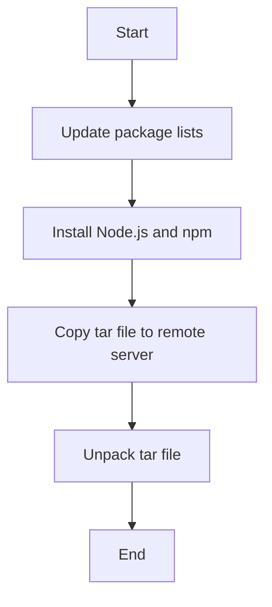

## Introduction to Ansible Playbooks for Node.js Deployment

In this section, we will delve into the process of automating the deployment of a Node.js application using Ansible on DigitalOcean. This involves several steps, including installing necessary packages, copying application files, and ensuring the application runs smoothly on the target server. We'll cover the concepts in depth, provide real-world examples, and discuss potential security risks and mitigation strategies.

### Understanding Ansible Playbooks

Ansible is an open-source automation tool used for configuration management, application deployment, and task automation. A playbook is a collection of tasks that Ansible executes to achieve a specific goal. Each playbook consists of one or more plays, where each play defines a set of tasks to be executed on a group of hosts.

#### Structure of a Playbook

A typical Ansible playbook has the following structure:

```yaml
---
- name: Play 1
  hosts: all
  tasks:
    - name: Task 1
      module_name: module_args
    - name: Task 2
      module_name: module_args

- name: Play 2
  hosts: all
  tasks:
    - name: Task 1
      module_name: module_args
```

Each play contains a `hosts` attribute specifying the target hosts, a `name` attribute providing a descriptive name for the play, and a list of `tasks`. Each task uses a specific module to perform an action.

### Installing Packages with Ansible

One of the primary tasks in setting up a Node.js environment is installing the required packages. In this case, we need to install Node.js and npm (Node Package Manager).

#### Using the `apt` Module

The `apt` module in Ansible is used to manage packages on Debian-based systems. To install multiple packages, we can use the `package` module with a list of packages.

```yaml
---
- name: Install Node.js and npm
  hosts: all
  become: yes
  tasks:
    - name: Update package lists
      apt:
        update_cache: yes

    - name: Install Node.js and npm
      apt:
        name:
          - nodejs
          - npm
        state: present
```

#### Explanation of the Code

- **`become: yes`**: This directive ensures that the tasks are run with elevated privileges, typically as the root user.
- **`apt: update_cache: yes`**: This task updates the package lists to ensure that the latest versions of packages are available.
- **`apt: name: [nodejs, npm] state: present`**: This task installs the specified packages (`nodejs` and `npm`). The `state: present` ensures that the packages are installed.

### Copying Application Files

Once the environment is set up, the next step is to copy the Node.js application files to the remote server. This can be achieved using the `copy` module in Ansible.

#### Using the `copy` Module

The `copy` module is used to copy files from the local machine to the remote server.

```yaml
---
- name: Deploy Node.js app
  hosts: all
  become: yes
  tasks:
    - name: Copy tar file to remote server
      copy:
        src: /path/to/app.tar
        dest: /path/to/remote/app.tar
```

#### Explanation of the Code

- **`src: /path/to/app.tar`**: This specifies the source path of the tar file on the local machine.
- **`dest: /path/to/remote/app.tar`**: This specifies the destination path on the remote server where the tar file will be copied.

### Unpacking the Tar File

After copying the tar file to the remote server, the next step is to unpack it. This can be done using the `unarchive` module in Ansible.

#### Using the `unarchive` Module

The `unarchive` module is used to extract archives such as tar files.

```yaml
---
- name: Unpack tar file on remote server
  hosts: all
  become: yes
  tasks:
    - name: Unpack tar file
      unarchive:
        src: /path/to/remote/app.tar
        dest: /path/to/remote/unpacked/
        remote_src: yes
```

#### Explanation of the Code

- **`src: /path/to/remote/app.tar`**: This specifies the source path of the tar file on the remote server.
- **`dest: /path/to/remote/unpacked/`**: This specifies the destination directory where the tar file will be extracted.
- **`remote_src: yes`**: This indicates that the source file is located on the remote server.

### Combining Multiple Plays

To keep the playbook clean and understandable, we can divide the tasks into multiple plays. Each play can focus on a specific aspect of the deployment process.

#### Example Playbook

Here is a complete example of a playbook that combines the installation of packages, copying of application files, and unpacking of the tar file.

```yaml
---
- name: Install Node.js and npm
  hosts: all
  become: yes
  tasks:
    - name: Update package lists
      apt:
        update_cache: yes

    - name: Install Node.js and npm
      apt:
        name:
          - nodejs
          - npm
        state: present

- name: Deploy Node.js app
  hosts: all
  become: yes
  tasks:
    - name: Copy tar file to remote server
      copy:
        src: /path/to/app.tar
        dest: /path/to/remote/app.tar

    - name: Unpack tar file
      unarchive:
        src: /path/to/remote/app.tar
        dest: /path/to/remote/unpacked/
        remote_src: yes
```

### Diagramming the Deployment Process

To visualize the deployment process, we can use a mermaid diagram.



### Potential Pitfalls and Security Risks

While automating the deployment process with Ansible, there are several potential pitfalls and security risks to consider.

#### Incorrect Permissions

If the tasks are not run with elevated privileges, certain operations may fail due to insufficient permissions.

**Secure Fix:**

Ensure that the `become: yes` directive is included in the playbook.

```yaml
---
- name: Install Node.js and npm
  hosts: all
  become: yes
  tasks:
    - name: Update package lists
      apt:
        update_cache: yes

    - name: Install Node.js and npm
      apt:
        name:
          - nodejs
          - npm
        state: present
```

#### Insecure File Transfers

Copying files over the network without proper encryption can expose sensitive data.

**Secure Fix:**

Use SSH for secure file transfers.

```yaml
---
- name: Deploy Node.js app
  hosts: all
  become: yes
  tasks:
    - name: Copy tar file to remote server
      copy:
        src: /path/to/app.tar
        dest: /path/to/remote/app.tar
        remote_src: yes
```

### Real-World Examples and Recent CVEs

#### Example: CVE-2021-21315

CVE-2021-21315 is a vulnerability in Node.js that allows attackers to execute arbitrary code through crafted input. This highlights the importance of keeping Node.js and npm up to date.

**Secure Fix:**

Regularly update Node.js and npm to the latest versions.

```yaml
---
- name: Install Node.js and npm
  hosts: all
  become: yes
  tasks:
    - name: Update package lists
      apt:
        update_cache: yes

    - name: Install Node.js and npm
      apt:
        name:
          - nodejs
          - npm
        state: latest
```

### How to Prevent / Defend

#### Detection

Regularly monitor the system for unauthorized changes and vulnerabilities.

#### Prevention

- Keep all software up to date.
- Use secure protocols for file transfers.
- Ensure tasks are run with appropriate permissions.

#### Secure Coding Fixes

Compare the vulnerable and secure versions of the playbook.

**Vulnerable Version:**

```yaml
---
- name: Install Node.js and npm
  hosts: all
  tasks:
    - name: Install Node.js and npm
      apt:
        name:
          - nodejs
          - npm
        state: present
```

**Secure Version:**

```yaml
---
- name: Install Node.js and npm
  hosts: all
  become: yes
  tasks:
    - name: Update package lists
      apt:
        update_cache: yes

    - name: Install Node.js and npm
      apt:
        name:
          - nodejs
          - npm
        state: latest
```

### Hands-On Labs

For practical experience, you can use the following labs:

- **PortSwigger Web Security Academy**: Focuses on web application security.
- **OWASP Juice Shop**: A deliberately insecure web application for security training.
- **DVWA (Damn Vulnerable Web Application)**: Another web application for security training.
- **WebGoat**: An interactive web application security training tool.

These labs provide a controlled environment to practice and reinforce the concepts learned in this chapter.

### Conclusion

Automating the deployment of a Node.js application using Ansible on DigitalOcean involves several steps, including installing necessary packages, copying application files, and unpacking the tar file. By following best practices and securing the deployment process, you can ensure a smooth and secure deployment.

---
<!-- nav -->
[[DevOps/DevOps Bootcamp/07-Configuration Management (Ansible)/13-Automating Node.js Deployment with Ansible on DigitalOcean/00-Overview|Overview]] | [[02-Introduction to Automating Node.js Deployment with Ansible on DigitalOcean|Introduction to Automating Node.js Deployment with Ansible on DigitalOcean]]
