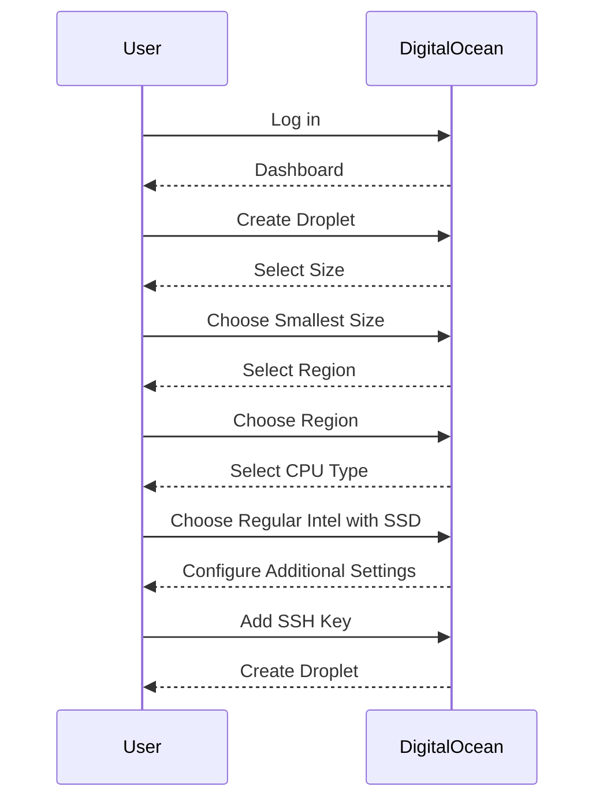
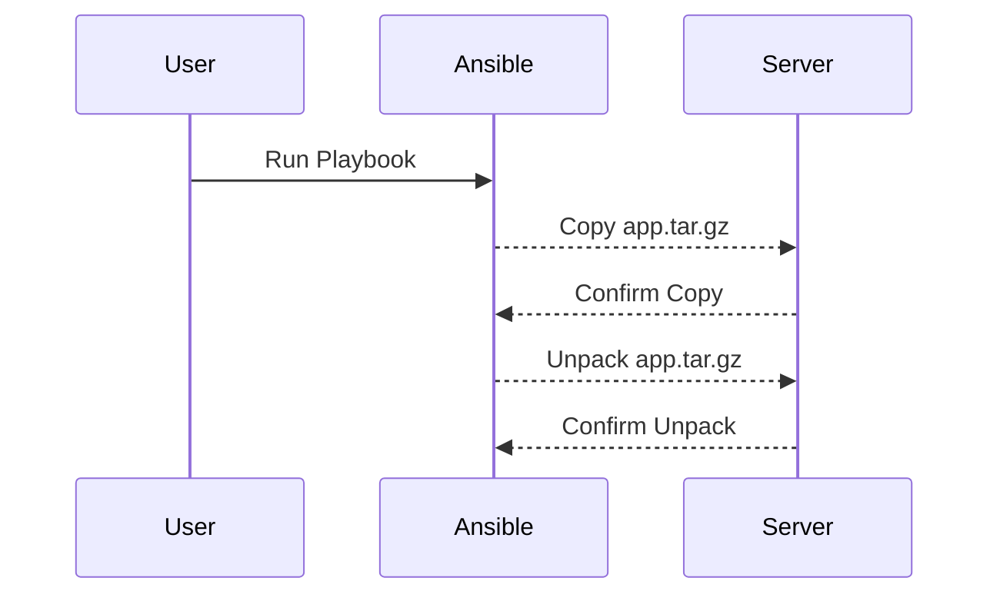

## Introduction to Automating Node.js Deployment with Ansible on DigitalOcean

In this section, we will delve into automating the deployment of a Node.js application on a DigitalOcean server using Ansible. This process involves several key steps, including creating a droplet, writing an Ansible playbook, copying and unpacking a Node.js application, starting the application, and verifying its successful operation. Each step will be thoroughly explained, along with the underlying concepts, recent real-world examples, and best practices for securing your deployment.

### Creating a Droplet on DigitalOcean

The first step in our automation process is to create a droplet on DigitalOcean. A droplet is essentially a virtual machine that provides a lightweight, isolated environment for running applications. DigitalOcean offers various sizes and configurations to suit different needs.

#### Steps to Create a Droplet

1. **Log in to DigitalOcean**: Access your DigitalOcean account.
2. **Create a New Droplet**: Click on the "Create" button and select "Droplets."
3. **Choose Droplet Size**: Select the smallest droplet size suitable for your application. For simplicity, we'll choose the smallest one available.
4. **Select Region**: Choose a region close to your target audience for optimal performance.
5. **Choose CPU Type**: Select "Regular Intel with SSD" for reliable performance.
6. **Configure Additional Settings**: Set up SSH keys, hostname, and other settings as needed.
7. **Create Droplet**: Review your selections and click "Create Droplet."

#### Example Droplet Creation



### Writing an Ansible Playbook

Ansible is an open-source IT automation tool that simplifies the deployment and management of infrastructure. It uses playbooks written in YAML to define tasks and their execution order.

#### Steps to Write an Ansible Playbook

1. **Install Ansible**: Ensure Ansible is installed on your local machine.
2. **Create Inventory File**: Define the hosts and their associated variables.
3. **Write Playbook**: Define tasks to install Node.js, copy the application, and start it.

#### Example Inventory File

```yaml
# inventory.yml
[droplets]
192.168.1.1 ansible_user=root ansible_ssh_private_key_file=/path/to/private/key
```

#### Example Playbook

```yaml
# install_node.yml
---
- name: Install Node.js and deploy application
  hosts: droplets
  become: yes
  tasks:
    - name: Update package list
      apt:
        update_cache: yes

    - name: Install Node.js and npm
      apt:
        name: "{{ item }}"
        state: present
      loop:
        - nodejs
        - npm

    - name: Copy Node.js application tar file
      copy:
        src: /path/to/app.tar.gz
        dest: /tmp/app.tar.gz

    - name: Unpack Node.js application
      unarchive:
        src: /tmp/app.tar.gz
        dest: /opt/app
        remote_src: yes

    - name: Start Node.js application
      shell: cd /opt/app && npm start
      async: 0
      poll: 0
```

### Copying and Unpacking the Node.js Application

Once the droplet is set up and the playbook is written, the next step is to copy the Node.js application to the server and unpack it.

#### Steps to Copy and Unpack the Application

1. **Copy the Tar File**: Use the `copy` module to transfer the tar file to the server.
2. **Unpack the Tar File**: Use the `unarchive` module to extract the contents of the tar file.

#### Example Commands



### Starting the Node.js Application

After unpacking the application, the final step is to start the Node.js application using the `npm start` command.

#### Steps to Start the Application

1. **Change Directory**: Navigate to the directory containing the application.
2. **Run npm start**: Execute the `npm start` command to start the application.

#### Example Shell Command

```shell
cd /opt/app && npm start
```

### Verifying the Application

To ensure the application is running correctly, you can check the status of the application and verify its output.

#### Steps to Verify the Application

1. **Check Application Status**: Use tools like `ps`, `netstat`, or `curl` to verify the application is running.
2. **Verify Output**: Check the application's output to ensure it is functioning as expected.

#### Example Verification Commands

```shell
ps aux | grep node
netstat -tuln | grep 3000
curl http://localhost:3000
```

### Security Considerations

Automating deployments introduces several security considerations that must be addressed to ensure the integrity and confidentiality of your application.

#### Common Pitfalls

1. **SSH Key Management**: Ensure SSH keys are securely stored and rotated regularly.
2. **Node.js Vulnerabilities**: Keep Node.js and npm up to date to mitigate known vulnerabilities.
3. **Application Configuration**: Securely configure the application to prevent unauthorized access.

#### Real-World Examples

- **CVE-2021-21315**: A vulnerability in Node.js that could allow remote code execution.
- **CVE-2021-21316**: Another critical vulnerability in Node.js that affects versions prior to 14.17.0.

#### How to Prevent / Defend

1. **Secure SSH Keys**:
   - Store SSH keys securely.
   - Rotate SSH keys regularly.
   - Use strong passphrases for SSH keys.

   ```yaml
   # inventory.yml
   [droplets]
   192.168.1.1 ansible_user=root ansible_ssh_private_key_file=/path/to/private/key
   ```

2. **Keep Node.js Updated**:
   - Regularly update Node.js and npm to the latest versions.
   - Monitor security advisories and apply patches promptly.

   ```shell
   sudo apt update
   sudo apt upgrade
   ```

3. **Secure Application Configuration**:
   - Use environment variables to manage sensitive data.
   - Limit permissions and access to the application directory.

   ```yaml
   # install_node.yml
   ---
   - name: Secure application directory
     file:
       path: /opt/app
       owner: nodeuser
       group: nodegroup
       mode: '0755'
   ```

### Conclusion

By following the steps outlined above, you can automate the deployment of a Node.js application on a DigitalOcean server using Ansible. This process ensures consistency, reliability, and security in your deployment pipeline. Remember to regularly review and update your security measures to protect against emerging threats.

### Hands-On Labs

For practical experience, consider the following labs:

- **PortSwigger Web Security Academy**: Offers comprehensive labs on web application security.
- **OWASP Juice Shop**: A deliberately insecure web application for practicing security skills.
- **DVWA (Damn Vulnerable Web Application)**: A PHP/MySQL web application that contains numerous security vulnerabilities.

These labs provide real-world scenarios to practice and reinforce the concepts learned in this chapter.

---
<!-- nav -->
[[01-Introduction to Ansible Playbooks for Node.js Deployment|Introduction to Ansible Playbooks for Node.js Deployment]] | [[DevOps/DevOps Bootcamp/07-Configuration Management (Ansible)/13-Automating Node.js Deployment with Ansible on DigitalOcean/00-Overview|Overview]] | [[DevOps/DevOps Bootcamp/07-Configuration Management (Ansible)/13-Automating Node.js Deployment with Ansible on DigitalOcean/03-Introduction to Node.js Application Deployment|Introduction to Node.js Application Deployment]]
