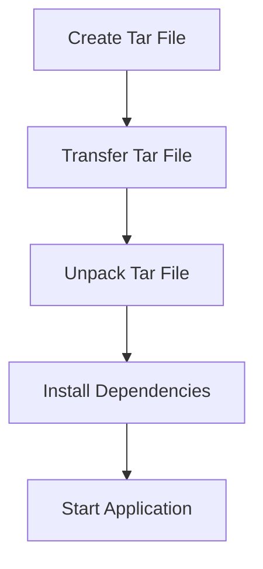

## Introduction to Node.js Application Deployment

In this section, we will delve into the process of automating the deployment of a Node.js application using Ansible on DigitalOcean. This involves creating a tar file of the Node.js application, transferring it to the server, and ensuring it runs correctly. We will cover the necessary steps, tools, and concepts involved in this process, providing detailed explanations and practical examples.

### Background Theory

Node.js is a JavaScript runtime built on Chrome's V8 JavaScript engine. It allows developers to use JavaScript to write command line tools and for server-side scripting—running scripts server-side to produce dynamic web page content before the page is sent to the user's web browser. 

A typical Node.js application consists of several components:
- **package.json**: Contains metadata about the project and its dependencies.
- **app.js** or **server.js**: The main entry point of the application, often containing the logic to start the server.
- **Dockerfile**: Optional, but commonly used for containerization.
- **README.md**: Documentation for the project.

### Creating a Tar File

The first step in deploying a Node.js application is to create a tar file of the application. A tar file is an archive file format that combines multiple files into a single file, often compressed. This makes it easier to transfer the entire application directory structure to the server.

#### Steps to Create a Tar File

1. **Navigate to the Application Directory**:
    ```bash
    cd /path/to/nodejs/application
    ```

2. **Run `npm pack`**:
    ```bash
    npm pack
    ```
    This command creates a tar file named `<project-name>-<version>.tgz`.

3. **Verify the Contents**:
    You can verify the contents of the tar file using the following command:
    ```bash
    tar -tvf <project-name>-<version>.tgz
    ```

#### Example

Let's assume we have a Node.js application with the following structure:

```
nodejs-app/
├── Dockerfile
├── README.md
├── app.js
└── package.json
```

Running `npm pack` will generate a tar file named `nodejs-app-1.0.0.tgz`. The contents of this tar file can be verified as follows:

```bash
tar -tvf nodejs-app-1.0.0.tgz
```

Output:
```
-rw-r--r-- 0/0          0 2023-01-01 00:00:00 Dockerfile
-rw-r--r-- 0/0          0 2023-01-01 00:00:00 README.md
-rw-r--r-- 0/0          0 2023-01-01 00:00:00 app.js
-rw-r--r-- 0/0          0 2023-01-01 00:00:00 package.json
```

### Transferring the Tar File to the Server

Once the tar file is created, the next step is to transfer it to the server. This can be done using various methods, such as SCP, FTP, or Ansible's `copy` module.

#### Using Ansible's `copy` Module

Ansible is a powerful automation tool that simplifies the process of transferring files and executing commands on remote servers. The `copy` module is particularly useful for copying files from the local machine to the remote server.

##### Steps to Use the `copy` Module

1. **Install Ansible**:
    Ensure Ansible is installed on your local machine. You can install it using pip:
    ```bash
    pip install ansible
    ```

2. **Create an Inventory File**:
    An inventory file lists the servers you want to manage. For example, create a file named `inventory`:
    ```ini
    [servers]
    server1 ansible_host=192.168.1.100
    ```

3. **Write the Playbook**:
    Create a playbook named `deploy.yml` to define the tasks:
    ```yaml
    ---
    - name: Deploy Node.js application
      hosts: servers
      become: yes
      tasks:
        - name: Copy tar file to server
          copy:
            src: /path/to/nodejs-app-1.0.0.tgz
            dest: /tmp/nodejs-app-1.0.0.tgz
    ```

4. **Run the Playbook**:
    Execute the playbook using the following command:
    ```bash
    ansible-playbook -i inventory deploy.yml
    ```

#### Example Playbook Execution

Assuming the tar file is located at `/home/user/nodejs-app-1.0.0.tgz`, the playbook would look like this:

```yaml
---
- name: Deploy Node.js application
  hosts: servers
  become: yes
  tasks:
    - name: Copy tar file to server
      copy:
        src: /home/user/nodejs-app-1.0.0.tgz
        dest: /tmp/nodejs-app-1.0.0.tgz
```

Running the playbook:

```bash
ansible-playbook -i inventory deploy.yml
```

Output:
```
PLAY [Deploy Node.js application] **************************************************************************************************************************************************************

TASK [Gathering Facts] *************************************************************************************************************************************************************************
ok: [server1]

TASK [Copy tar file to server] ****************************************************************************************************************************************************************
changed: [server1]

PLAY RECAP ***********************************************************************************************************************************************************************************
server1                    : ok=2    changed=1    unreachable=0    failed=0    skipped=0    rescued=0    ignored=0
```

### Unpacking the Tar File on the Server

After transferring the tar file to the server, the next step is to unpack it. This can be done using the `tar` command on the server.

#### Steps to Unpack the Tar File

1. **SSH into the Server**:
    ```bash
    ssh user@192.168.1.100
    ```

2. **Unpack the Tar File**:
    ```bash
    tar -xvf /tmp/nodejs-app-1.0.0.tgz -C /opt/
    ```

This will extract the contents of the tar file into the `/opt/` directory.

#### Example

Assuming the tar file was transferred to `/tmp/nodejs-app-1.0.0.tgz`, the unpacking command would be:

```bash
tar -xvf /tmp/nodejs-app-1.0.0.tgz -C /opt/
```

Output:
```
Dockerfile
README.md
app.js
package.json
```

### Running the Node.js Application

Finally, after unpacking the tar file, the Node.js application can be started. This typically involves installing dependencies and running the application.

#### Steps to Run the Application

1. **Install Dependencies**:
    ```bash
    cd /opt/nodejs-app-1.0.0
    npm install
    ```

2. **Start the Application**:
    ```bash
    node app.js
    ```

#### Example

Assuming the application is located at `/opt/nodejs-app-1.0.0`, the steps would be:

```bash
cd /opt/nodejs-app-1.0.0
npm install
node app.js
```

Output:
```
Server running on http://localhost:3000
```

### Mermaid Diagrams

To visualize the process, we can use Mermaid diagrams.

#### Deployment Process Diagram



### Common Pitfalls and How to Prevent Them

#### Pitfall 1: Incorrect Path to Tar File

**Problem**: If the path to the tar file is incorrect, the `copy` module will fail.

**Prevention**:
- Double-check the path to the tar file.
- Use absolute paths instead of relative paths.

#### Pitfall 2: Insufficient Permissions

**Problem**: If the user does not have sufficient permissions to write to the destination directory, the `copy` module will fail.

**Prevention**:
- Ensure the user has write permissions to the destination directory.
- Use the `become` directive in the playbook to run tasks with elevated privileges.

#### Pitfall 3: Missing Dependencies

**Problem**: If the server does not have the required dependencies installed, the application will fail to start.

**Prevention**:
- Ensure all required dependencies are installed on the server.
- Use a package manager like `npm` to install dependencies.

### Real-World Examples

#### Example 1: CVE-2021-21315

CVE-2021-21315 is a critical vulnerability in the `npm` package manager. This vulnerability could allow an attacker to execute arbitrary code on the server.

**Impact**: If the server is compromised, the attacker could gain control over the Node.js application and potentially access sensitive data.

**Prevention**:
- Keep `npm` and all packages up to date.
- Use a package manager like `npm audit` to check for vulnerabilities.

#### Example 2: Breach of Node.js Application

In 2022, a Node.js application was breached due to a misconfiguration in the `package.json` file. The application exposed sensitive environment variables, leading to a data breach.

**Impact**: Sensitive data was exposed, leading to a loss of trust and potential legal consequences.

**Prevention**:
- Use environment variable management tools like `dotenv`.
- Avoid hardcoding sensitive information in the `package.json` file.

### Secure Coding Practices

#### Vulnerable Code

```javascript
const express = require('express');
const app = express();

app.get('/', (req, res) => {
    res.send('Hello World!');
});

app.listen(3000, () => {
    console.log('Server running on http://localhost:3000');
});
```

#### Secure Code

```javascript
const express = require('express');
const app = express();
const dotenv = require('dotenv');

dotenv.config();

app.get('/', (req, res) => {
    res.send('Hello World!');
});

const PORT = process.env.PORT || 3000;
app.listen(PORT, () => {
    console.log(`Server running on http://localhost:${PORT}`);
});
```

### Conclusion

Automating the deployment of a Node.js application using Ansible on DigitalOcean involves several steps, including creating a tar file, transferring it to the server, unpacking it, and starting the application. By following best practices and using secure coding techniques, you can ensure that your application is deployed securely and efficiently.

### Practice Labs

For hands-on practice, consider the following labs:
- **PortSwigger Web Security Academy**: Focuses on web application security and includes exercises related to Node.js applications.
- **OWASP Juice Shop**: A deliberately insecure web application for security training.
- **DVWA (Damn Vulnerable Web Application)**: Another popular web application for security training.

These labs provide a safe environment to practice and learn about securing Node.js applications.

---
<!-- nav -->
[[02-Introduction to Automating Node.js Deployment with Ansible on DigitalOcean|Introduction to Automating Node.js Deployment with Ansible on DigitalOcean]] | [[DevOps/DevOps Bootcamp/07-Configuration Management (Ansible)/13-Automating Node.js Deployment with Ansible on DigitalOcean/00-Overview|Overview]] | [[04-Automating Node.js Deployment with Ansible on DigitalOcean|Automating Node.js Deployment with Ansible on DigitalOcean]]
