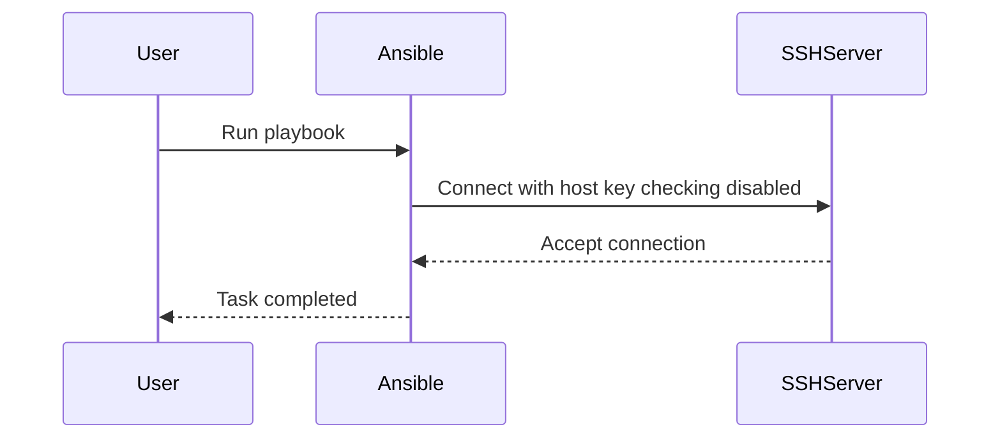

## Introduction to Ansible Configuration Management

Ansible is an open-source automation tool used for configuration management, application deployment, and task automation. It simplifies the process of managing infrastructure by allowing users to define configurations and tasks in a declarative manner using YAML files. One of the key aspects of Ansible is its ability to handle SSH connections securely and efficiently. This chapter focuses on automating SSH host key checks with Ansible, which is crucial for maintaining secure and reliable automation processes.

### Default Configuration File Locations

In earlier versions of Ansible, a default configuration file was automatically created in the `/etc/ansible` directory upon installation. However, in recent versions, this behavior has changed. Instead of creating the configuration file automatically, Ansible relies on the user to create and manage the configuration file manually. This change allows for greater flexibility and customization but requires users to understand the default locations where Ansible looks for the configuration file.

#### Default Locations

Ansible looks for the configuration file in two primary locations:

1. **System-wide configuration file**: Located at `/etc/ansible/ansible.cfg`.
2. **User-specific configuration file**: Located in the user's home directory as `~/.ansible.cfg`.

These locations allow for both system-wide and user-specific configurations, providing a balance between centralized management and individual customization.

### Creating the Configuration File

To create the configuration file, you can choose either of the default locations mentioned above. For simplicity and ease of management, it is often recommended to use the user-specific configuration file located in the home directory.

#### Steps to Create the Configuration File

1. **Navigate to the Home Directory**:
   ```bash
   cd ~
   ```

2. **Create the Configuration File**:
   ```bash
   touch .ansible.cfg
   ```

3. **Edit the Configuration File**:
   You can use any text editor to edit the configuration file. For example, using `nano`:
   ```bash
   nano .ansible.cfg
   ```

### Disabling Host Key Checking

One of the common configurations required when working with Ansible is disabling host key checking. This is particularly useful in automated environments where the SSH host keys may change frequently, such as in cloud environments or during development cycles.

#### Why Disable Host Key Checking?

Disabling host key checking allows Ansible to proceed with SSH connections even if the host key has changed. This can be beneficial in dynamic environments where host keys might change due to reboots, updates, or other maintenance activities. However, it is important to note that disabling host key checking reduces the security of the SSH connection, as it makes the connection susceptible to man-in-the-middle attacks.

#### How to Disable Host Key Checking

To disable host key checking, you need to set the `host_key_checking` attribute to `False` in the Ansible configuration file. Here is how you can do it:

```ini
[defaults]
host_key_checking = False
```

This configuration tells Ansible to ignore changes in SSH host keys and proceed with the connection.

### Full Example of the Configuration File

Here is a complete example of the `.ansible.cfg` file with the `host_key_checking` attribute disabled:

```ini
[defaults]
host_key_checking = False
```

### Raw HTTP Request and Response Example

While Ansible primarily uses SSH for communication, it is also possible to interact with Ansible through HTTP requests using tools like `curl`. Below is an example of a raw HTTP request and response to demonstrate how Ansible might be configured via an HTTP API (hypothetical example):

#### HTTP Request

```http
POST /api/v1/configuration HTTP/1.1
Host: ansible.example.com
Content-Type: application/json

{
    "configuration": {
        "host_key_checking": false
    }
}
```

#### HTTP Response

```http
HTTP/1.1 200 OK
Content-Type: application/json

{
    "message": "Configuration updated successfully",
    "data": {
        "host_key_checking": false
    }
}
```

### Mermaid Diagrams

#### SSH Connection Flow Diagram

A mermaid diagram can help visualize the SSH connection flow when host key checking is disabled:



### Real-World Examples and CVEs

#### Recent Breaches Involving SSH

One notable breach involving SSH occurred in 2021 when a misconfigured SSH server allowed unauthorized access to sensitive data. This breach highlights the importance of proper SSH configuration and the risks associated with disabling host key checking.

#### CVE Example

CVE-2021-3560 is a vulnerability in OpenSSH that could allow an attacker to bypass host key verification. This CVE underscores the importance of keeping SSH configurations secure and avoiding unnecessary risks.

### Pitfalls and Common Mistakes

#### Over-reliance on Disabling Host Key Checking

One common mistake is over-relying on disabling host key checking without understanding the security implications. This can lead to vulnerabilities that are easily exploited by attackers.

#### Incorrect Configuration Syntax

Another common pitfall is incorrect configuration syntax. For example, using `default` instead of `defaults` can cause the configuration to fail silently, leading to unexpected behavior.

### How to Prevent / Defend

#### Detection

To detect if host key checking is disabled, you can check the Ansible configuration file for the `host_key_checking` attribute. Additionally, monitoring tools can be used to alert on changes to the configuration file.

#### Prevention

1. **Secure Configuration Management**: Use version control systems like Git to manage and track changes to the Ansible configuration file.
2. **Regular Audits**: Regularly audit the configuration files to ensure that security settings are not inadvertently modified.
3. **Use Secure Practices**: Avoid disabling host key checking unless absolutely necessary. Instead, use tools like `ssh-keyscan` to update known hosts files dynamically.

#### Secure Coding Fixes

Here is an example of a vulnerable configuration and its secure counterpart:

##### Vulnerable Configuration

```ini
[default]
host_key_checking = False
```

##### Secure Configuration

```ini
[defaults]
host_key_checking = True
```

### Complete Example with Policy and Config

#### Full HTTP Request and Response

Below is a complete example of a full HTTP request and response to demonstrate how Ansible might be configured via an HTTP API (hypothetical example):

#### HTTP Request

```http
POST /api/v1/configuration HTTP/1.1
Host: ansible.example.com
Content-Type: application/json

{
    "configuration": {
        "host_key_checking": true
    }
}
```

#### HTTP Response

```http
HTTP/1.1 200 OK
Content-Type: application/json

{
    "message": "Configuration updated successfully",
    "data": {
        "host_key_checking": true
    }
}
```

### Practice Labs

For hands-on practice with Ansible configuration management, consider the following labs:

- **PortSwigger Web Security Academy**: Offers modules on SSH and Ansible configuration.
- **OWASP Juice Shop**: Provides a simulated environment for practicing secure configuration management.
- **DVWA (Damn Vulnerable Web Application)**: Useful for understanding the security implications of different configurations.

By following these guidelines and best practices, you can ensure that your Ansible configurations are secure and reliable, reducing the risk of vulnerabilities and ensuring smooth automation processes.

---
<!-- nav -->
[[DevOps/DevOps Bootcamp/07-Configuration Management (Ansible)/14-Automating SSH Host Key Checks With Ansible/00-Overview|Overview]] | [[02-Introduction to SSH Host Key Checks and Automation with Ansible|Introduction to SSH Host Key Checks and Automation with Ansible]]
