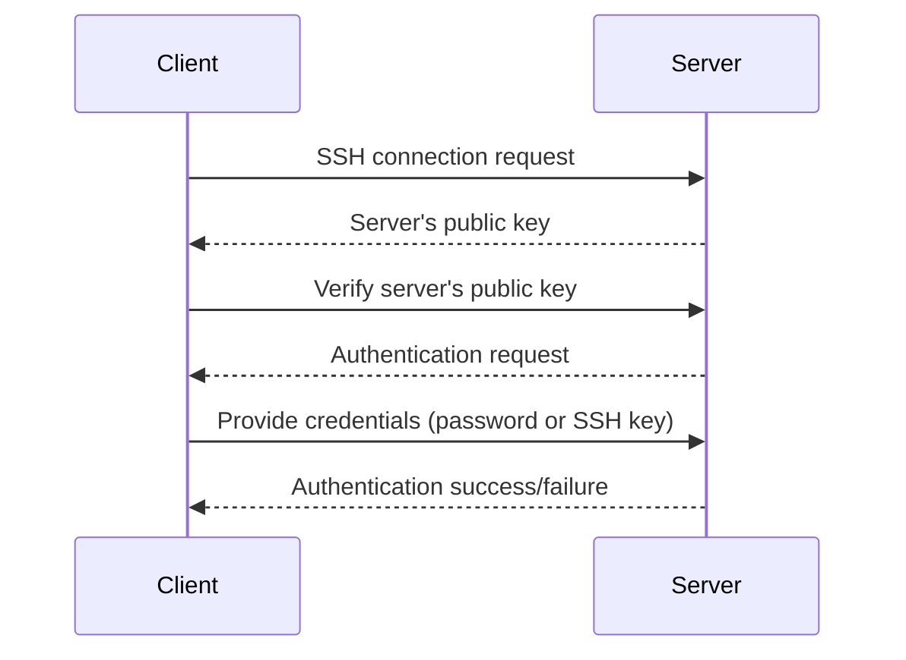
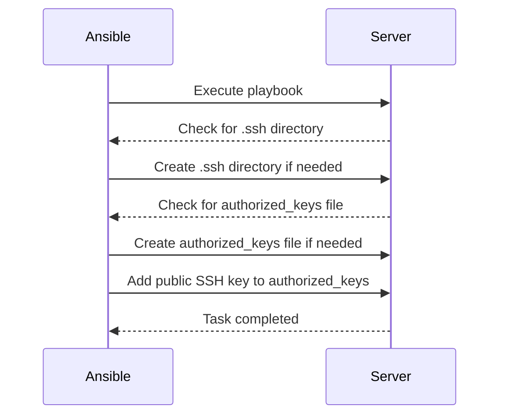

## Introduction to SSH Host Key Checks and Automation with Ansible

### Background Theory

Secure Shell (SSH) is a cryptographic network protocol used for secure data communication, remote command-line login, remote command execution, and other secure network services between two networked computers. It provides strong authentication and secure communications over unsecured channels. SSH uses public-key cryptography to authenticate the remote computer and allow the remote computer to authenticate the user, if necessary.

One critical aspect of SSH is the host key check. When an SSH client connects to a server for the first time, it receives the server's public key and stores it in the `~/.ssh/known_hosts` file. Subsequent connections verify that the server's public key matches the stored key. If the keys do not match, the client warns the user about a potential man-in-the-middle attack.

### Public SSH Key Storage

For the SSH connection to work seamlessly, the target server must have the public SSH key of the connecting machine. This key is typically stored in the `~/.ssh/authorized_keys` file on the server. The `authorized_keys` file contains the public keys of users who are allowed to log in via SSH.

#### Example of Public SSH Key Storage

Consider a scenario where a user named `alice` wants to log in to a server named `server.example.com`. Alice's public SSH key must be present in the `~/.ssh/authorized_keys` file on `server.example.com`.

```bash
# Content of ~/.ssh/authorized_keys on server.example.com
ssh-rsa AAAAB3NzaC1yc2EAAAADAQABAAABAQC7... alice@example.com
```

### Automatic SSH Key Addition with DigitalOcean

In the context of cloud providers like DigitalOcean, when creating a new droplet (virtual machine), you can specify an SSH key during the creation process. DigitalOcean automatically adds this public SSH key to the `~/.ssh/authorized_keys` file of the root user on the droplet.

#### Example of Droplet Creation with SSH Key

Here’s how you can create a droplet with an SSH key using the DigitalOcean API:

```bash
curl -X POST -H "Content-Type: application/json" \
     -H "Authorization: Bearer $DO_API_TOKEN" \
     -d '{
           "name": "my-droplet",
           "region": "fra1",
           "size": "s-1vcpu-1gb",
           "image": "ubuntu-20-04-x64",
           "ssh_keys": ["$SSH_KEY_ID"],
           "backups": false,
           "ipv6": true,
           "user_data": null,
           "tags": []
         }' \
     "https://api.digitalocean.com/v2/droplets"
```

### Verifying SSH Key Presence

To verify that the SSH key was correctly added, you can SSH into the droplet and check the `~/.ssh/authorized_keys` file.

```bash
ssh root@droplet_ip
cat ~/.ssh/authorized_keys
```

### Creating a Droplet Without SSH Key

If you create a droplet without specifying an SSH key, you will need to provide a root password. In this case, the `~/.ssh/authorized_keys` file will be empty, and you will not be able to log in using SSH keys.

#### Example of Droplet Creation Without SSH Key

```bash
curl -X POST -H "Content-Type: application/json" \
     -H "Authorization: Bearer $DO_API_TOKEN" \
     -d '{
           "name": "my-droplet-no-key",
           "region": "fra1",
           "size": "s-1vcpu-1gb",
           "image": "ubuntu-20-04-x64",
           "ssh_keys": [],
           "backups": false,
           "ipv6": true,
           "user_data": null,
           "tags": []
         }' \
     "https://api.digitalocean.com/v2/droplets"
```

### Adding SSH Key to Existing Droplet

To add an SSH key to an existing droplet, you can manually copy the public SSH key to the `~/.ssh/authorized_keys` file.

#### Example of Adding SSH Key Manually

```bash
ssh-copy-id root@droplet_ip
```

This command copies the public SSH key from your local machine to the `~/.ssh/authorized_keys` file on the remote server.

### Automating SSH Key Checks with Ansible

Ansible is a powerful automation tool that can manage and automate tasks across multiple servers. One of the tasks Ansible can handle is automating SSH host key checks and ensuring that the `~/.ssh/authorized_keys` file is correctly configured.

#### Example Playbook for SSH Key Management

Here’s an example Ansible playbook that ensures the `~/.ssh/authorized_keys` file contains the correct public SSH key:

```yaml
---
- name: Ensure SSH keys are properly configured
  hosts: all
  become: yes
  vars:
    ssh_public_key: "ssh-rsa AAAAB3NzaC1yc2EAAAADAQABAAABAQC7... alice@example.com"

  tasks:
    - name: Create .ssh directory if it does not exist
      file:
        path: "/root/.ssh"
        state: directory
        mode: 0700

    - name: Ensure authorized_keys file exists
      file:
        path: "/root/.ssh/authorized_keys"
        state: touch
        mode: 0600

    - name: Add public SSH key to authorized_keys
      lineinfile:
        path: "/root/.ssh/authorized_keys"
        line: "{{ ssh_public_key }}"
        create: yes
        mode: 0600
```

### Explanation of the Playbook

1. **Create `.ssh` Directory**: Ensures the `.ssh` directory exists with the correct permissions.
2. **Ensure `authorized_keys` File Exists**: Creates the `authorized_keys` file if it does not exist.
3. **Add Public SSH Key**: Adds the specified public SSH key to the `authorized_keys` file.

### Running the Playbook

To run the playbook, save it to a file (e.g., `ssh_key_management.yml`) and execute it using the `ansible-playbook` command:

```bash
ansible-playbook -i inventory_file ssh_key_management.yml
```

### Mermaid Diagrams

#### SSH Connection Flow



#### Ansible Playbook Execution Flow



### Recent Real-World Examples

#### CVE-2021-21315: SSH Key Management Vulnerability

In 2021, a vulnerability (CVE-2021-21315) was discovered in OpenSSH, which could allow an attacker to bypass SSH key checks. This vulnerability highlights the importance of proper SSH key management and the need for regular updates and patches.

#### Example of Exploit

An attacker could potentially exploit this vulnerability by manipulating the `~/.ssh/authorized_keys` file to gain unauthorized access to the server.

#### Secure Coding Practices

To prevent such vulnerabilities, ensure that:

1. **Regular Updates**: Keep your SSH software up to date with the latest security patches.
2. **Access Control**: Limit access to the `~/.ssh` directory and files.
3. **Monitoring**: Regularly monitor the `~/.ssh/authorized_keys` file for unauthorized changes.

### How to Prevent / Defend

#### Detection

Use tools like `auditd` to monitor changes to the `~/.ssh` directory and files.

```bash
auditctl -w /root/.ssh -p wa -k ssh_changes
```

#### Prevention

1. **Limit Permissions**: Set strict permissions on the `~/.ssh` directory and files.
   
   ```bash
   chmod 700 /root/.ssh
   chmod 600 /root/.ssh/authorized_keys
   ```

2. **Use SSH Agent**: Use an SSH agent to manage SSH keys securely.

3. **Regular Audits**: Perform regular audits of the `~/.ssh` directory and files.

#### Secure Code Fix

**Vulnerable Code**

```bash
echo "ssh-rsa AAAAB3NzaC1yc2EAAAADAQABAAABAQC7... alice@example.com" >> /root/.ssh/authorized_keys
```

**Fixed Code**

```bash
mkdir -p /root/.ssh
chmod 700 /root/.ssh
echo "ssh-rsa AAAAB3NzaC1yc2EAAAADAQABAAABAQC7... alice@example.com" > /root/.ssh/authorized_keys
chmod 600 /root/.ssh/authorized_keys
```

### Conclusion

Automating SSH host key checks and managing SSH keys with Ansible can significantly enhance the security and efficiency of your infrastructure. By following best practices and using tools like Ansible, you can ensure that your SSH configurations are secure and up to date.

### Practice Labs

For hands-on practice with SSH key management and Ansible, consider the following labs:

- **PortSwigger Web Security Academy**: Offers exercises on SSH and other security topics.
- **OWASP Juice Shop**: Provides a web application with various security challenges, including SSH-related scenarios.
- **DVWA (Damn Vulnerable Web Application)**: A deliberately insecure web application for practicing security techniques.

These labs will help you gain practical experience in managing SSH keys and automating tasks with Ansible.

---
<!-- nav -->
[[DevOps/DevOps Bootcamp/07-Configuration Management (Ansible)/14-Automating SSH Host Key Checks With Ansible/01-Introduction to Ansible Configuration Management|Introduction to Ansible Configuration Management]] | [[DevOps/DevOps Bootcamp/07-Configuration Management (Ansible)/14-Automating SSH Host Key Checks With Ansible/00-Overview|Overview]] | [[DevOps/DevOps Bootcamp/07-Configuration Management (Ansible)/14-Automating SSH Host Key Checks With Ansible/03-Introduction to SSH Key Authentication|Introduction to SSH Key Authentication]]
