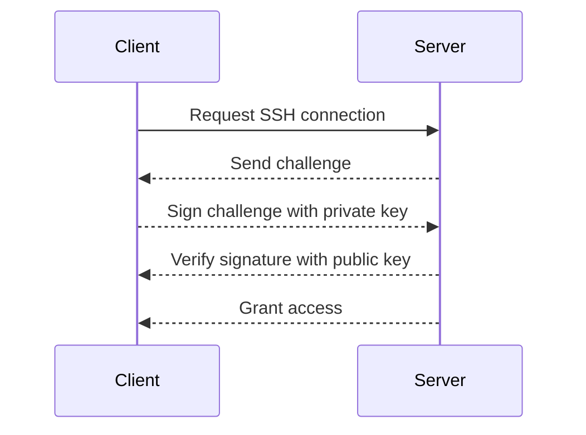

## Introduction to SSH Key Authentication

Secure Shell (SSH) is a cryptographic network protocol used for secure data communication, remote command-line login, remote command execution, and other secure network services between two networked computers. One of the most powerful features of SSH is its ability to authenticate users using public-key cryptography, which provides a more secure alternative to traditional password-based authentication.

### What is SSH Key Authentication?

SSH key authentication uses a pair of cryptographic keys: a private key and a public key. The public key is placed on the server, while the private key remains securely stored on the client machine. When a user attempts to log in, the server uses the public key to verify the identity of the client by checking the signature generated by the private key.

#### Why Use SSH Key Authentication?

1. **Security**: Passwords can be guessed, stolen, or brute-forced. Public-key authentication is much harder to compromise.
2. **Convenience**: Once set up, you can log in without entering a password, streamlining automation and repetitive tasks.
3. **Automation**: SSH key authentication is essential for automating tasks across multiple servers, especially in DevOps environments.

### How SSH Key Authentication Works

The process of SSH key authentication involves several steps:

1. **Key Generation**: Generate a pair of cryptographic keys (public and private).
2. **Public Key Distribution**: Copy the public key to the server.
3. **Authentication**: Use the private key to sign a challenge sent by the server.

#### Key Generation

To generate an SSH key pair, you can use the `ssh-keygen` command. Here’s an example:

```sh
ssh-keygen -t rsa -b 4096 -C "your_email@example.com"
```

This command generates a 4096-bit RSA key pair with a comment indicating your email address. The private key is stored in `~/.ssh/id_rsa`, and the public key is stored in `~/.ssh/id_rsa.pub`.

#### Public Key Distribution

Once the keys are generated, you need to distribute the public key to the server. This can be done manually or using tools like `ssh-copy-id`.

```sh
ssh-copy-id -i ~/.ssh/id_rsa.pub user@server
```

This command copies the public key to the `~/.ssh/authorized_keys` file on the server.

#### Authentication

When you attempt to log in to the server, the following steps occur:

1. The server sends a challenge to the client.
2. The client signs the challenge using the private key.
3. The server verifies the signature using the public key.

If the signature is valid, the client is authenticated.

### Automating SSH Key Checks with Ansible

Ansible is an open-source automation tool that can manage and configure IT infrastructure. One of its key features is the ability to automate SSH key checks and distribution across multiple servers.

#### Setting Up SSH Keys with Ansible

To automate the setup of SSH keys with Ansible, you can use the `ssh_keyscan` module to gather the SSH host keys and the `copy` module to distribute the public key.

Here’s a step-by-step guide:

1. **Gather SSH Host Keys**:
   Use the `ssh_keyscan` module to gather the SSH host keys from the target servers.

   ```yaml
   - name: Gather SSH host keys
     ssh_keyscan:
       host: "{{ item }}"
       path: "/etc/ssh/ssh_known_hosts"
     loop: "{{ groups['all'] }}"
   ```

2. **Distribute Public Key**:
   Use the `copy` module to distribute the public key to the target servers.

   ```yaml
   - name: Distribute public key
     copy:
       src: ~/.ssh/id_rsa.pub
       dest: /root/.ssh/authorized_keys
       owner: root
       group: root
       mode: 0600
     when: ansible_user == 'root'
   ```

3. **Verify SSH Connectivity**:
   Use the `wait_for_connection` module to ensure that the SSH connectivity is established.

   ```yaml
   - name: Verify SSH connectivity
     wait_for_connection:
       delay: 10
       timeout: 60
   ```

### Example Playbook

Here’s a complete playbook that sets up SSH keys and verifies connectivity:

```yaml
---
- name: Setup SSH keys and verify connectivity
  hosts: all
  become: yes
  tasks:
    - name: Gather SSH host keys
      ssh_keyscan:
        host: "{{ item }}"
        path: "/etc/ssh/ssh_known_hosts"
      loop: "{{ groups['all'] }}"

    - name: Distribute public key
      copy:
        src: ~/.ssh/id_rsa.pub
        dest: /root/.ssh/authorized_keys
        owner: root
        group: root
        mode: 0600
      when: ansible_user == 'root'

    - name: Verify SSH connectivity
      wait_for_connection:
        delay: 10
        timeout: 60
```

### Mermaid Diagrams

Let’s visualize the process using a mermaid diagram:



### Real-World Examples

#### CVE-2021-44228 (Log4Shell)

While not directly related to SSH key authentication, the Log4Shell vulnerability (CVE-2021-44228) highlights the importance of securing SSH connections. An attacker could potentially exploit a vulnerable application to gain unauthorized access to a server, including SSH credentials.

#### Secure Coding Practices

To prevent such vulnerabilities, follow these secure coding practices:

1. **Use Strong Encryption**: Ensure that SSH uses strong encryption algorithms.
2. **Limit Access**: Restrict SSH access to trusted IP addresses.
3. **Regular Audits**: Regularly audit SSH configurations and logs for suspicious activity.

### How to Prevent / Defend

#### Detection

Monitor SSH logs for unauthorized access attempts. Use tools like `fail2ban` to automatically block IP addresses that exhibit suspicious behavior.

```yaml
---
- name: Install and configure fail2ban
  hosts: all
  become: yes
  tasks:
    - name: Install fail2ban
      apt:
        name: fail2ban
        state: present

    - name: Configure fail2ban
      template:
        src: fail2ban.j2
        dest: /etc/fail2ban/jail.local
```

#### Prevention

1. **Use Strong Keys**: Generate strong SSH keys with sufficient entropy.
2. **Limit Permissions**: Ensure that the `authorized_keys` file has restricted permissions (`0600`).

#### Secure-Coding Fixes

Compare the vulnerable and secure versions of the `authorized_keys` file:

**Vulnerable Version:**

```plaintext
chmod 644 ~/.ssh/authorized_keys
```

**Secure Version:**

```plaintext
chmod 600 ~/.ssh/authorized_keys
```

### Conclusion

Automating SSH key checks with Ansible provides a robust and secure method for managing SSH connections across multiple servers. By following best practices and using tools like `ssh_keyscan` and `copy`, you can ensure that your SSH connections are both convenient and secure.

### Practice Labs

For hands-on practice with SSH key authentication and Ansible, consider the following labs:

- **PortSwigger Web Security Academy**: Offers exercises on SSH key management and automation.
- **OWASP Juice Shop**: Provides a web application environment where you can practice SSH key management in a real-world context.
- **DVWA (Damn Vulnerable Web Application)**: Useful for practicing SSH key management in a controlled environment.

By mastering SSH key authentication and automation with Ansible, you can significantly enhance the security and efficiency of your DevOps workflows.

---
<!-- nav -->
[[02-Introduction to SSH Host Key Checks and Automation with Ansible|Introduction to SSH Host Key Checks and Automation with Ansible]] | [[DevOps/DevOps Bootcamp/07-Configuration Management (Ansible)/14-Automating SSH Host Key Checks With Ansible/00-Overview|Overview]] | [[04-Automating SSH Host Key Checks With Ansible|Automating SSH Host Key Checks With Ansible]]
