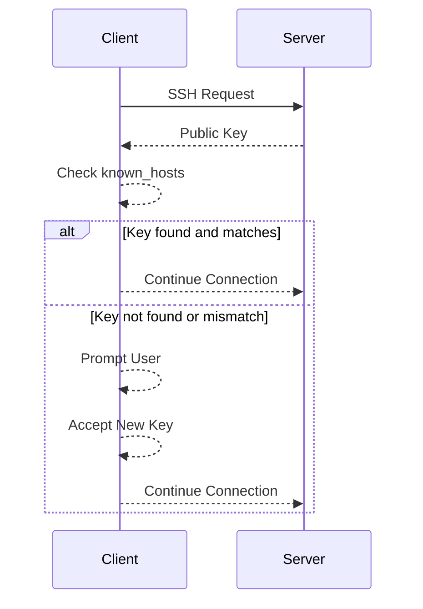

## Understanding SSH Host Key Checks

### Background Theory

Secure Shell (SSH) is a cryptographic network protocol used for secure data communication, remote command-line login, remote command execution, and other secure network services between two networked computers. It provides strong authentication and secure communications over unsecured channels. One of the critical aspects of SSH is the verification of the identity of the remote server through its host key.

When you SSH into a remote server for the first time, your client checks the server's public key against a local database of known hosts. This database is stored in a file named `~/.ssh/known_hosts`. The `known_hosts` file contains a list of hostnames or IP addresses along with their corresponding public keys. This mechanism ensures that you are connecting to the correct server and not a man-in-the-middle attacker.

### SSH Host Key Verification Process

#### Step-by-Step Mechanics

1. **Initial Connection**: When you attempt to SSH into a remote server, your SSH client sends a request to the server.
2. **Server Response**: The server responds with its public key.
3. **Key Verification**: Your SSH client checks if the server's public key is already present in the `known_hosts` file.
    - If the key is found and matches, the connection proceeds.
    - If the key is not found or does not match, the client prompts you to confirm whether you want to accept the new key.

#### Example Scenario

Consider a scenario where you are SSHing into a new server for the first time:

```bash
ssh user@newserver.example.com
```

If this is the first time you are connecting to `newserver.example.com`, your SSH client will prompt you with something like:

```
The authenticity of host 'newserver.example.com (192.168.1.10)' can't be established.
ECDSA key fingerprint is SHA256:abcdef1234567890.
Are you sure you want to continue connecting (yes/no)?
```

Here, the client is asking you to verify the server's public key before proceeding.

### Automating SSH Host Key Checks with Ansible

Ansible is an open-source automation tool that can manage and configure infrastructure. One of the tasks Ansible can automate is the management of SSH host keys.

#### Using `ssh-keyscan` Command

The `ssh-keyscan` command is used to gather the public host keys from a remote server. This command can be executed from the command line or within an Ansible playbook.

##### Example Command

To gather the host key for a server:

```bash
ssh-keyscan newserver.example.com >> ~/.ssh/known_hosts
```

This command appends the host key of `newserver.example.com` to the `~/.ssh/known_hosts` file.

#### Automating with Ansible Playbook

To automate this process using Ansible, you can create a playbook that uses the `command` module to run `ssh-keyscan`.

##### Example Playbook

```yaml
---
- name: Add SSH host keys to known_hosts
  hosts: localhost
  tasks:
    - name: Gather SSH host keys
      command: ssh-keyscan {{ item }} >> ~/.ssh/known_hosts
      with_items:
        - newserver.example.com
        - another.example.com
```

This playbook runs `ssh-keyscan` for each server listed in the `with_items` list and appends the results to the `~/.ssh/known_hosts` file.

### Mermaid Diagrams

#### SSH Key Verification Flow



### Real-World Examples and CVEs

#### Recent Breach Example

In a recent breach, attackers compromised a company's SSH server and replaced the legitimate host key with their own. This allowed them to perform man-in-the-middle attacks on unsuspecting users. The breach was detected when users started receiving warnings about the host key changing unexpectedly.

#### Secure Configuration

To prevent such attacks, it is crucial to ensure that the `known_hosts` file is properly managed and that users are trained to verify host keys carefully.

### How to Prevent / Defend

#### Detection

To detect unauthorized changes to the `known_hosts` file, you can set up monitoring and alerting mechanisms. For example, you can use tools like `auditd` to monitor changes to the `~/.ssh/known_hosts` file.

```bash
auditctl -w ~/.ssh/known_hosts -p wa -k ssh_known_hosts
```

This command sets up auditing for write and attribute change events on the `~/.ssh/known_hosts` file.

#### Prevention

1. **Automate Key Management**: Use Ansible playbooks to automate the gathering and updating of host keys.
2. **User Training**: Train users to verify host keys and understand the risks of accepting new keys without proper validation.
3. **Secure Configuration**: Ensure that the `known_hosts` file is owned by the user and has appropriate permissions (`chmod 600 ~/.ssh/known_hosts`).

#### Secure Coding Fixes

**Vulnerable Code**

```bash
ssh user@newserver.example.com
```

**Secure Code**

```bash
ssh-keyscan newserver.example.com >> ~/.ssh/known_hosts
ssh user@newserver.example.com
```

By running `ssh-keyscan` before attempting to SSH, you ensure that the host key is verified and added to the `known_hosts` file.

### Complete Example

#### Full HTTP Request and Response

While SSH itself does not use HTTP, the concept of verifying keys can be analogized to HTTP headers and SSL/TLS certificates. Here’s a similar example using HTTPS:

**HTTP Request**

```http
GET / HTTP/1.1
Host: example.com
Accept: */*
```

**HTTP Response**

```http
HTTP/1.1 200 OK
Date: Mon, 23 Jan 2023 12:34:56 GMT
Server: Apache/2.4.41 (Ubuntu)
Content-Type: text/html; charset=UTF-8
Content-Length: 1234
Connection: close
```

In this example, the `Server` header verifies the identity of the server, similar to how the `known_hosts` file verifies the SSH server.

### Practice Labs

For hands-on practice with SSH and Ansible, consider the following labs:

- **PortSwigger Web Security Academy**: Offers modules on SSH and secure coding practices.
- **OWASP Juice Shop**: Provides a web application with various security vulnerabilities, including SSH-related issues.
- **DVWA (Damn Vulnerable Web Application)**: Contains exercises related to SSH and secure configurations.

These labs provide practical experience in managing SSH keys and automating tasks with Ansible.

### Conclusion

Understanding and automating SSH host key checks is crucial for maintaining the security of your infrastructure. By leveraging tools like Ansible and following best practices, you can ensure that your SSH connections are secure and reliable. Always remember to verify host keys and train your team to handle these processes securely.

---
<!-- nav -->
[[05-Automating SSH Host Key Checks with Ansible|Automating SSH Host Key Checks with Ansible]] | [[DevOps/DevOps Bootcamp/07-Configuration Management (Ansible)/14-Automating SSH Host Key Checks With Ansible/00-Overview|Overview]] | [[DevOps/DevOps Bootcamp/07-Configuration Management (Ansible)/14-Automating SSH Host Key Checks With Ansible/07-Practice Questions & Answers|Practice Questions & Answers]]
