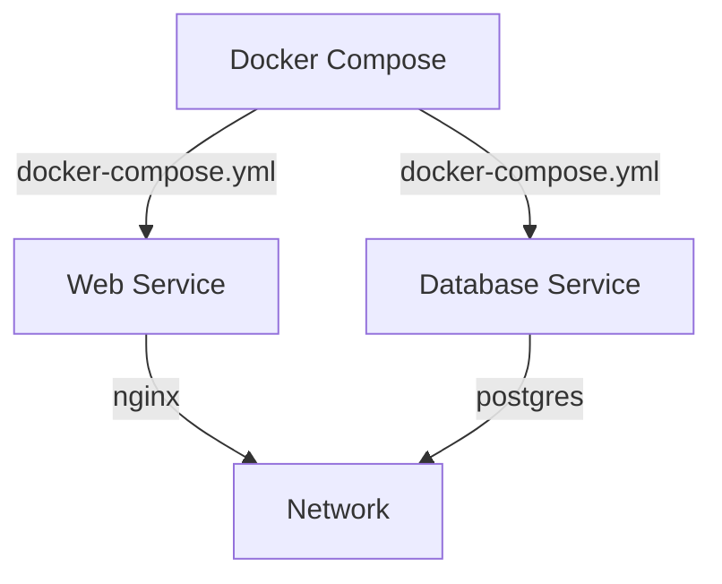

## Introduction to Docker Compose

Docker Compose is a tool for defining and running multi-container Docker applications. With Compose, you use a YAML file to configure your application’s services. Then, using a single command, you create and start all the services from your configuration. This makes it easier to manage complex applications that consist of multiple interconnected services.

### What is Docker Compose?

Docker Compose is a tool that allows you to define and run multi-container Docker applications. It uses a `docker-compose.yml` file to define the services, networks, and volumes that make up your application. By using a single command, you can create and start all the services defined in the `docker-compose.yml` file.

#### Why Use Docker Compose?

Using Docker Compose simplifies the process of managing multi-container applications. Instead of manually starting each container and configuring the necessary networking and volumes, Docker Compose automates these tasks. This makes it easier to develop, test, and deploy applications that consist of multiple services.

### How Docker Compose Works

Docker Compose works by reading a `docker-compose.yml` file, which defines the services, networks, and volumes that make up your application. When you run `docker-compose up`, Docker Compose starts all the services defined in the `docker-compose.yml` file.

#### Example `docker-compose.yml` File

Here is an example `docker-compose.yml` file:

```yaml
version: '3'
services:
  web:
    image: nginx:latest
    ports:
      - "80:80"
  db:
    image: postgres:latest
    environment:
      POSTGRES_PASSWORD: example
```

This file defines two services: `web` and `db`. The `web` service uses the `nginx:latest` image and maps port 80 on the host to port 80 in the container. The `db` service uses the `postgres:latest` image and sets the `POSTGRES_PASSWORD` environment variable to `example`.

#### Running Docker Compose

To run the services defined in the `docker-compose.yml` file, you use the following command:

```sh
docker-compose up
```

This command starts all the services defined in the `docker-compose.yml` file. You can also specify additional options, such as `-d` to run the services in detached mode.

### Using Docker Compose in Ansible Playbooks

Ansible is a powerful automation tool that can be used to manage Docker containers. One way to use Docker Compose in Ansible playbooks is through the `docker_compose` module.

#### The `docker_compose` Module

The `docker_compose` module in Ansible allows you to manage Docker Compose files. You can use this module to start, stop, and manage the services defined in a `docker-compose.yml` file.

##### Minimum Setup

For the minimum setup, you only need to provide the location of the `docker-compose.yml` file. Here is an example Ansible task that uses the `docker_compose` module:

```yaml
- name: Start containers from Docker Compose file
  docker_compose:
    project_src: /path/to/docker-compose.yml
```

In this example, the `project_src` parameter specifies the location of the `docker-compose.yml` file. By default, the `state` parameter is set to `present`, which means that the services defined in the `docker-compose.yml` file will be started.

##### Specifying the State

You can also specify the `state` parameter to control whether the services should be started or stopped. Here are some examples:

```yaml
- name: Start containers from Docker Compose file
  docker_compose:
    project_src: /path/to/docker-compose.yml
    state: present

- name: Stop containers from Docker Compose file
  docker_compose:
    project_src: /path/to/docker-compose.yml
    state: absent
```

In the first example, the `state` parameter is set to `present`, which means that the services defined in the `docker-compose.yml` file will be started. In the second example, the `state` parameter is set to `absent`, which means that the services defined in the `docker-compose.yml` file will be stopped.

### Common Pitfalls and How to Prevent Them

One common pitfall when using Docker Compose in Ansible playbooks is ensuring that the necessary dependencies are installed on the target machine. For example, if you are using the `docker_compose` module, you need to ensure that the `docker-compose` Python package is installed on the target machine.

#### Ensuring Dependencies Are Installed

To ensure that the necessary dependencies are installed, you can use the `pip` module in Ansible to install the required packages. Here is an example Ansible task that installs the `docker-compose` Python package:

```yaml
- name: Install Docker Compose Python package
  pip:
    name: docker-compose
```

By including this task in your playbook, you can ensure that the `docker-compose` Python package is installed on the target machine before you attempt to use the `docker_compose` module.

### Real-World Examples and Recent CVEs

While Docker Compose itself does not have many vulnerabilities, it is important to ensure that the images and services you are using are secure. For example, if you are using the `nginx` image, you should ensure that it is up to date and does not contain any known vulnerabilities.

#### Example Vulnerability

One recent vulnerability in the `nginx` image was CVE-2021-23221, which allowed attackers to bypass authentication and gain unauthorized access to the server. To mitigate this vulnerability, you should ensure that you are using the latest version of the `nginx` image and that you have applied any necessary security patches.

### Conclusion

Docker Compose is a powerful tool for managing multi-container Docker applications. By using a `docker-compose.yml` file, you can define the services, networks, and volumes that make up your application. You can then use the `docker_compose` module in Ansible to manage these services. By ensuring that the necessary dependencies are installed and that the images and services you are using are secure, you can avoid common pitfalls and ensure that your application is robust and reliable.

### Practice Labs

To practice using Docker Compose in Ansible playbooks, you can use the following labs:

- **PortSwigger Web Security Academy**: This lab provides a series of challenges that cover various aspects of web security, including Docker and containerization.
- **OWASP Juice Shop**: This lab provides a vulnerable web application that you can use to practice penetration testing and security analysis.
- **DVWA (Damn Vulnerable Web Application)**: This lab provides a vulnerable web application that you can use to practice penetration testing and security analysis.

By completing these labs, you can gain hands-on experience with Docker Compose and Ansible and improve your skills in managing multi-container Docker applications.

### Diagrams

Here is a mermaid diagram that illustrates the architecture of a multi-container Docker application managed by Docker Compose:



In this diagram, the `Web Service` and `Database Service` are defined in the `docker-compose.yml` file and are managed by Docker Compose. The `Web Service` uses the `nginx` image, and the `Database Service` uses the `postgres` image. Both services are connected to the same network.

### Full Example

Here is a complete example of an Ansible playbook that uses the `docker_compose` module to start and stop services defined in a `docker-compose.yml` file:

```yaml
---
- name: Manage Docker Compose services
  hosts: all
  become: yes
  tasks:
    - name: Ensure Docker Compose Python package is installed
      pip:
        name: docker-compose

    - name: Start containers from Docker Compose file
      docker_compose:
        project_src: /path/to/docker-compose.yml
        state: present

    - name: Stop containers from Docker Compose file
      docker_compose:
        project_src:  /path/to/docker-compose.yml
        state: absent
```

In this example, the playbook first ensures that the `docker-compose` Python package is installed on the target machine. It then starts the services defined in the `docker-compose.yml` file and stops them.

### Detection and Prevention

To detect and prevent issues with Docker Compose in Ansible playbooks, you can use the following strategies:

- **Ensure Dependencies Are Installed**: Use the `pip` module to ensure that the necessary dependencies are installed on the target machine.
- **Use Secure Images**: Ensure that the images and services you are using are up to date and do not contain any known vulnerabilities.
- **Monitor Logs**: Monitor the logs of your Docker containers to detect any issues or anomalies.

By following these strategies, you can ensure that your Docker Compose-based applications are secure and reliable.

### Conclusion

Docker Compose is a powerful tool for managing multi-container Docker applications. By using a `docker-compose.yml` file, you can define the services, networks, and volumes that make up your application. You can then use the `docker_compose` module in Ansible to manage these services. By ensuring that the necessary dependencies are installed and that the images and services you are using are secure, you can avoid common pitfalls and ensure that your application is robust and reliable.

---
<!-- nav -->
[[01-Introduction to Ansible and Docker Modules|Introduction to Ansible and Docker Modules]] | [[DevOps/DevOps Bootcamp/07-Configuration Management (Ansible)/16-Docker Modules in Ansible for State Management/00-Overview|Overview]] | [[03-Introduction to Docker Modules in Ansible for State Management|Introduction to Docker Modules in Ansible for State Management]]
