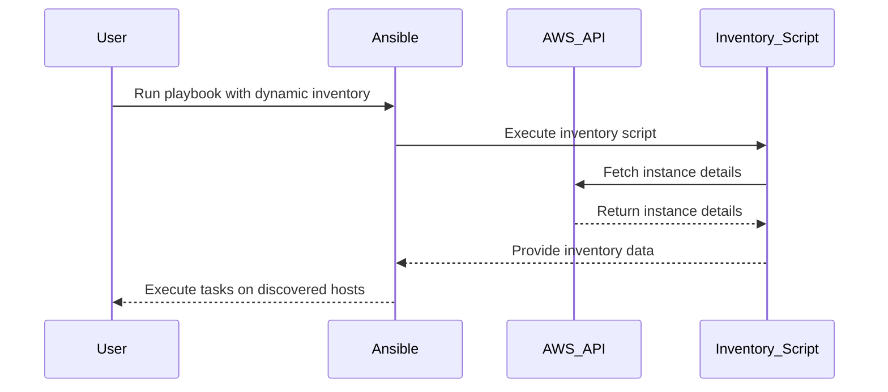

## Introduction to Dynamic Inventories in Ansible for Auto-Scaling Infrastructure

In the realm of DevOps, managing infrastructure dynamically is crucial, especially when dealing with auto-scaling environments. This chapter delves into the concept of dynamic inventories in Ansible, which allows you to manage and configure servers in an AWS environment efficiently. We'll cover the theoretical background, practical implementation, and security considerations involved in setting up dynamic inventories.

### Background Theory

#### What is Ansible?

Ansible is an open-source automation tool used for configuration management, application deployment, and task automation. It uses simple YAML-based playbooks to define tasks and orchestrate them across multiple systems. Ansible operates agentless, meaning it doesn't require any additional software to be installed on managed nodes; it relies on SSH for communication.

#### What is a Dynamic Inventory?

A dynamic inventory is a mechanism that allows Ansible to discover and manage hosts at runtime rather than statically defining them in a file. This is particularly useful in cloud environments where the number of instances can change frequently due to auto-scaling policies.

### Why Use Dynamic Inventories?

Dynamic inventories are essential in modern DevOps practices because:

1. **Scalability**: They adapt to changes in the number of instances automatically.
2. **Flexibility**: They can be used with various cloud providers and on-premises environments.
3. **Efficiency**: They reduce the overhead of manually updating static inventory files.

### How Does a Dynamic Inventory Work?

A dynamic inventory script is executed by Ansible at runtime to gather information about the hosts. This script typically interacts with cloud APIs to retrieve details such as IP addresses, hostnames, and other metadata.

### Setting Up Dynamic Inventories in Ansible

To set up a dynamic inventory in Ansible, you need to create a Python script that interacts with your cloud provider's API. In this example, we'll focus on AWS.

#### Prerequisites

Before proceeding, ensure you have the following:

1. **AWS CLI Installed**: Install the AWS Command Line Interface (CLI) and configure it with your AWS credentials.
2. **Python Environment**: Ensure Python is installed on your system.
3. **Boto3 Library**: Boto3 is the Amazon Web Services (AWS) Software Development Kit (SDK) for Python. It allows Python developers to write software that makes use of services like Amazon S3 and Amazon EC2.

```bash
pip install boto3
```

### Creating the Dynamic Inventory Script

Let's create a Python script named `aws_inventory.py` that fetches information about EC2 instances in a specific region.

```python
import boto3
import json

def get_instances(region):
    ec2 = boto3.resource('ec2', region_name=region)
    instances = ec2.instances.filter(
        Filters=[{'Name': 'instance-state-name', 'Values': ['running']}]
    )
    return instances

def main():
    region = 'eu-west-3'
    instances = get_instances(region)

    inventory = {
        '_meta': {
            'hostvars': {}
        },
        'all': {
            'hosts': []
        }
    }

    for instance in instances:
        hostvars = {
            'ansible_host': instance.public_dns_name,
            'instance_type': instance.instance_type,
            'public_ip': instance.public_ip_address
        }
        inventory['_meta']['hostvars'][instance.id] = hostvars
        inventory['all']['hosts'].append(instance.id)

    print(json.dumps(inventory))

if __name__ == '__main__':
    main()
```

### Explanation of the Script

1. **Import Libraries**: Import `boto3` and `json`.
2. **Get Instances**: Define a function `get_instances` that retrieves running instances in a specified region.
3. **Main Function**: Define the `main` function that initializes the inventory structure, populates it with instance data, and prints the inventory in JSON format.

### Running the Dynamic Inventory Script

To run the script and generate the inventory, execute the following command:

```bash
python aws_inventory.py
```

This will output a JSON object containing the inventory information.

### Integrating with Ansible

To use this dynamic inventory script with Ansible, specify it in your playbook or command line.

#### Example Playbook

Create a playbook named `configure_hosts.yml`:

```yaml
---
- name: Configure hosts
  hosts: all
  gather_facts: false
  tasks:
    - name: Print host information
      debug:
        msg: "Host {{ ansible_host }} with type {{ instance_type }}"
```

Run the playbook with the dynamic inventory script:

```bash
ansible-playbook -i ./aws_inventory.py configure_hosts.yml
```

### Mermaid Diagram: Dynamic Inventory Flow



### Common Pitfalls and Best Practices

#### Common Pitfalls

1. **Incorrect Region**: Ensure the correct region is specified in the inventory script.
2. **Insufficient Permissions**: Make sure the AWS credentials have the necessary permissions to access the required resources.
3. **Network Issues**: Ensure the network connectivity between the Ansible control node and the AWS API.

#### Best Practices

1. **Use IAM Roles**: Instead of hardcoding credentials, use IAM roles for better security.
2. **Secure Credentials**: Store AWS credentials securely using environment variables or a secrets manager.
3. **Regular Updates**: Keep the inventory script updated to handle any changes in the AWS API.

### Security Considerations

#### Vulnerabilities

1. **Unauthorized Access**: If the inventory script is compromised, it could expose sensitive information about your infrastructure.
2. **API Abuse**: Malicious actors could abuse the API to perform unauthorized actions.

#### How to Prevent / Defend

1. **IAM Policies**: Restrict the permissions of the IAM role used by the inventory script to the minimum required.
2. **Monitoring**: Enable CloudTrail to monitor API calls and detect any suspicious activity.
3. **Secure Code**: Follow secure coding practices to prevent injection attacks and ensure proper validation of inputs.

### Real-World Examples

#### Recent Breaches

1. **CVE-2021-26614**: A vulnerability in AWS SDK allowed unauthorized access to S3 buckets. Ensure your SDK versions are up-to-date.
2. **AWS RDS Data Exfiltration**: In 2022, a misconfigured RDS instance led to data exfiltration. Use IAM policies to restrict access.

### Complete Example: Full HTTP Request and Response

#### HTTP Request

```http
GET /api/v1/instances HTTP/1.1
Host: api.example.com
Authorization: Bearer <access_token>
Content-Type: application/json
```

#### HTTP Response

```http
HTTP/1.1 200 OK
Content-Type: application/json

{
  "instances": [
    {
      "id": "i-0123456789abcdef0",
      "public_dns_name": "ec2-1-2-3-4.compute-1.amazonaws.com",
      "public_ip_address": "1.2.3.4",
      "instance_type": "t2.micro"
    },
    {
      "id": "i-0123456789abcdef1",
      "public_dns_name": "ec2-5-6-7-8.compute-1.amazonaws.com",
      "public_ip_address": "5.6.7.8",
      "instance_type": "t2.small"
    }
  ]
}
```

### Hands-On Labs

For practical experience, consider the following labs:

- **PortSwigger Web Security Academy**: Focus on the section related to cloud security and dynamic inventories.
- **OWASP Juice Shop**: Explore the cloud infrastructure setup and dynamic inventory management.
- **CloudGoat**: Practice setting up and securing dynamic inventories in an AWS environment.

By following these steps and best practices, you can effectively manage and configure your auto-scaling infrastructure using dynamic inventories in Ansible.

---
<!-- nav -->
[[DevOps/DevOps Bootcamp/07-Configuration Management (Ansible)/17-Dynamic Inventories in Ansible for Auto-Scaling Infrastructure/00-Overview|Overview]] | [[02-Introduction to Dynamic Inventories in Ansible for Auto-scaling Infrastructure|Introduction to Dynamic Inventories in Ansible for Auto-scaling Infrastructure]]
