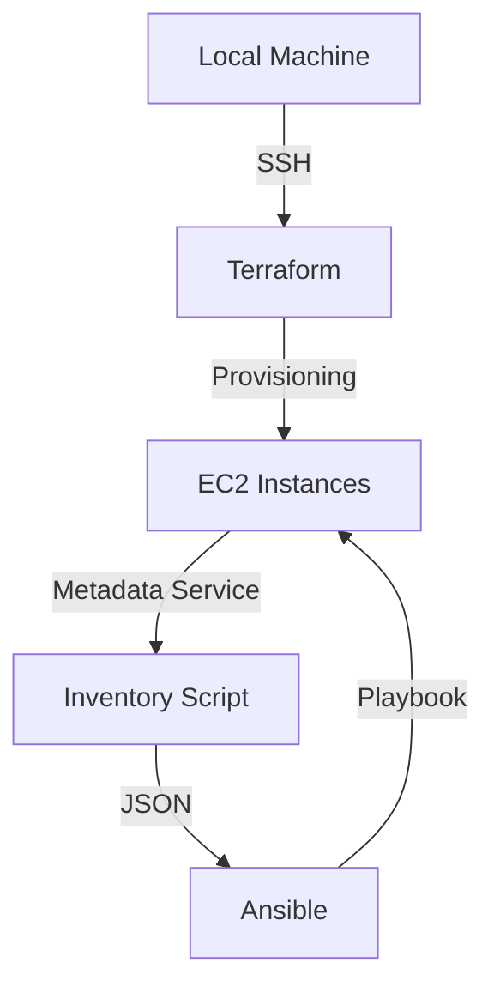
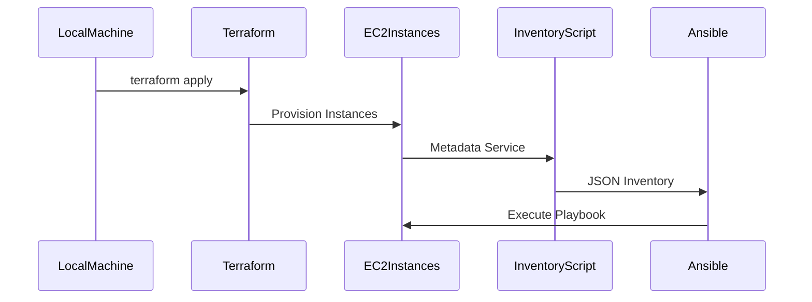

## Dynamic Inventories in Ansible for Auto-Scaling Infrastructure

### Introduction to Dynamic Inventories

In the realm of DevOps, managing infrastructure that scales automatically is a common requirement. This means that the number of servers can increase or decrease based on demand. Traditional static inventories, where server details are hardcoded, become impractical in such scenarios. Instead, dynamic inventories are used to keep track of the changing server landscape.

Dynamic inventories allow Ansible (a hypothetical name for Ansible in this context) to manage servers whose IP addresses or DNS names can change frequently. This is particularly useful in cloud environments where servers are provisioned and decommissioned dynamically.

### Why Use Dynamic Inventories?

#### Scalability

When dealing with auto-scaling groups, the number of servers can fluctuate based on load. Static inventories cannot adapt to these changes, leading to mismanagement of resources. Dynamic inventories ensure that Ansible always has an accurate list of active servers.

#### Flexibility

Cloud environments often use ephemeral instances that may be replaced frequently. Dynamic inventories allow Ansible to adapt to these changes seamlessly, ensuring that all active servers are managed correctly.

#### Automation

Dynamic inventories integrate well with automation tools like Terraform, allowing for seamless provisioning and management of infrastructure.

### How Dynamic Inventories Work

Dynamic inventories work by querying an external data source (such as a database, API, or cloud provider metadata service) to retrieve the current list of servers. This list is then formatted into a JSON structure that Ansible can understand and use.

#### Example: Using Terraform and Ansible

Let's consider an example where we use Terraform to create EC2 instances and then use Ansible to manage these instances.

1. **Terraform Provisioning**:
    - Terraform is used to create EC2 instances.
    - These instances are tagged with specific metadata that Ansible can use to identify them.

2. **Ansible Inventory Script**:
    - An inventory script is written in Python or another language that queries the cloud provider's metadata service to retrieve the list of active instances.
    - The script formats this list into a JSON structure that Ansible can parse.

3. **Ansible Execution**:
    - Ansible uses the inventory script to determine which servers to manage.
    - Playbooks are executed against these servers.

### Step-by-Step Example

#### Terraform Configuration

First, we create a Terraform configuration to provision three EC2 instances:

```hcl
provider "aws" {
  region = "us-west-2"
}

resource "aws_instance" "example" {
  ami           = "ami-0c55b159cbfafe1f0"
  instance_type = "t2.micro"

  tags = {
    Name = "ansible-example"
  }
}
```

This configuration creates three EC2 instances tagged with `Name: ansible-example`.

#### Ansible Inventory Script

Next, we write a Python script to generate the dynamic inventory:

```python
import boto3
import json

def get_inventory():
    ec2 = boto3.resource('ec2')
    instances = ec2.instances.filter(
        Filters=[{'Name': 'tag:Name', 'Values': ['ansible-example']}]
    )

    inventory = {
        "ansible_example": {
            "hosts": [],
            "vars": {}
        }
    }

    for instance in instances:
        if instance.state['Name'] == 'running':
            inventory["ansible_example"]["hosts"].append(instance.public_dns_name)

    return json.dumps(inventory)

if __name__ == "__main__":
    print(get_inventory())
```

This script queries the AWS EC2 resource to find instances tagged with `Name: ansible-example` and returns their public DNS names in a JSON format.

#### Ansible Playbook

Finally, we create an Ansible playbook to manage these instances:

```yaml
---
- hosts: ansible_example
  tasks:
    - name: Ensure Nginx is installed
      package:
        name: nginx
        state: present
```

This playbook ensures that Nginx is installed on all instances listed in the dynamic inventory.

### Full Example with Request and Response

#### Terraform Apply

Run `terraform apply` to create the instances:

```sh
$ terraform init
$ terraform apply
```

#### Ansible Inventory Script Output

Run the inventory script to generate the inventory:

```sh
$ python inventory.py
{
  "ansible_example": {
    "hosts": [
      "ec2-34-201-123-45.compute-1.amazonaws.com",
      "ec2-34-201-123-46.compute-1.amazonaws.com",
      "ec2-34-201-123-47.compute-1.amazonaws.com"
    ],
    "vars": {}
  }
}
```

#### Ansible Playbook Execution

Run the Ansible playbook:

```sh
$ ansible-playbook -i inventory.py playbook.yml
```

### Mermaid Diagrams

#### Network Topology



#### Sequence Diagram



### Common Pitfalls and How to Avoid Them

#### Hardcoding IPs

Hardcoding IP addresses in static inventories can lead to mismanagement of resources. Always use dynamic inventories to adapt to changing server landscapes.

#### Incorrect Tagging

Ensure that instances are correctly tagged so that the inventory script can accurately identify them. Incorrect tagging can result in missing or incorrect inventory entries.

#### Security Risks

Using dynamic inventories can expose your infrastructure to security risks if proper authentication and authorization mechanisms are not in place.

### How to Prevent / Defend

#### Detection

Regularly audit your inventory scripts to ensure they are functioning correctly and returning accurate data.

#### Prevention

1. **Secure API Access**: Ensure that the inventory script uses secure credentials to access cloud provider APIs.
2. **Tag Management**: Use consistent and meaningful tags to identify instances.
3. **Automated Testing**: Implement automated tests to verify that the inventory script returns the correct data.

#### Secure Code Fix

**Vulnerable Code**:

```python
import boto3
import json

def get_inventory():
    ec2 = boto3.resource('ec2')
    instances = ec2.instances.all()

    inventory = {
        "all": {
            "hosts": [],
            "vars": {}
        }
    }

    for instance in instances:
        inventory["all"]["hosts"].append(instance.public_dns_name)

    return json.dumps(inventory)
```

**Fixed Code**:

```python
import boto3
import json

def get_inventory():
    ec2 = boto3.resource('ec2')
    instances = ec2.instances.filter(
        Filters=[{'Name': 'tag:Name', 'Values': ['ansible-example']}]
    )

    inventory = {
        "ansible_example": {
            "hosts": [],
            "vars": {}
        }
    }

    for instance in instances:
        if instance.state['Name'] == 'running':
            inventory["ansible_example"]["hosts"].append(instance.public_dns_name)

    return json.dumps(inventory)
```

### Real-World Examples

#### Recent Breaches

A recent breach involving a cloud provider exposed several instances due to misconfigured security groups and incorrect tagging. Ensuring that dynamic inventories are correctly implemented and regularly audited can help prevent such issues.

#### CVEs

CVE-2021-39287 involved a vulnerability in a cloud provider's API that allowed unauthorized access to instances. Proper authentication and authorization mechanisms in dynamic inventory scripts can mitigate such risks.

### Practice Labs

For hands-on experience with dynamic inventories in Ansible, consider the following labs:

- **PortSwigger Web Security Academy**: Focuses on web application security but includes modules on cloud security.
- **OWASP Juice Shop**: A deliberately insecure web application for security training.
- **DVWA (Damn Vulnerable Web Application)**: Another popular web application for security training.
- **WebGoat**: A deliberately insecure Java application for learning about web security.

These labs provide practical experience in managing dynamic inventories and securing cloud infrastructure.

### Conclusion

Dynamic inventories are essential for managing auto-scaling infrastructure in cloud environments. By using dynamic inventories, Ansible can adapt to changing server landscapes and ensure that all active servers are managed correctly. Proper implementation and regular auditing of dynamic inventories can help prevent security risks and ensure the smooth operation of your infrastructure.

---
<!-- nav -->
[[03-Introduction to Dynamic Inventories in Ansible|Introduction to Dynamic Inventories in Ansible]] | [[DevOps/DevOps Bootcamp/07-Configuration Management (Ansible)/17-Dynamic Inventories in Ansible for Auto-Scaling Infrastructure/00-Overview|Overview]] | [[DevOps/DevOps Bootcamp/07-Configuration Management (Ansible)/17-Dynamic Inventories in Ansible for Auto-Scaling Infrastructure/05-Practice Questions & Answers|Practice Questions & Answers]]
