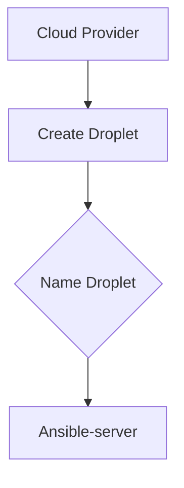

## Introduction to Ansible Control Node Integration in Jenkins Pipeline

In this section, we will delve into the integration of Ansible (a hypothetical automation tool similar to Ansible) within a Jenkins pipeline. This process involves setting up an Ansible control node, which acts as the central server responsible for managing and configuring other remote servers. We will cover the necessary steps to set up the control node, including installing Ansible and required Python modules, and integrating it into a Jenkins pipeline.

### Setting Up the Ansible Control Node

The first step is to create a droplet (virtual machine) that will serve as the Ansible control node. This server will manage and configure other remote servers through automated scripts and playbooks.

#### Creating the Droplet

To create the droplet, follow these steps:

1. **Create the Droplet**: Use your preferred cloud provider (e.g., DigitalOcean, AWS, Azure) to create a new virtual machine. Ensure that the droplet has sufficient resources (CPU, memory, storage) to handle the Ansible operations.

2. **Name the Droplet**: Name the droplet appropriately, such as `Ansible-server`. This name will help identify the role of the server in your infrastructure.



#### SSH into the Droplet

Once the droplet is created, SSH into it to begin the setup process.

```bash
ssh root@<droplet-ip>
```

### Installing Ansible

After SSHing into the droplet, the next step is to install Ansible. Ansible is a powerful automation tool that simplifies the management of remote servers.

#### Updating the System

Before installing Ansible, ensure that the system is up-to-date.

```bash
sudo apt update && sudo apt upgrade -y
```

#### Installing Ansible

Use the package manager to install Ansible. For this example, we assume the package name is `ansible`.

```bash
sudo apt install ansible -y
```

Verify the installation by checking the version of Ansible.

```bash
ansible --version
```

### Installing Required Python Modules

Ansible is built on Python, and certain tasks require additional Python modules. Specifically, we need to install the `boto3` and `botocore` modules to interact with AWS services.

#### Checking Python and PIP Installation

First, ensure that Python 3 and `pip3` are installed.

```bash
python3 --version
pip3 --version
```

If `pip3` is not installed, install it using the package manager.

```bash
sudo apt install python3-pip -y
```

#### Installing boto3 and botocore

Now, install the required Python modules using `pip3`.

```bash
pip3 install boto3 botocore
```

Verify the installation by checking the versions of the installed modules.

```bash
pip3 show boto3
pip3 show botocore
```

### Integrating Ansible into Jenkins Pipeline

With the Ansible control node set up, the next step is to integrate it into a Jenkins pipeline. This allows for automated deployment and configuration of remote servers.

#### Configuring Jenkins Pipeline

Jenkins pipelines are defined using a `Jenkinsfile`, which is a script written in Groovy. Below is an example of a `Jenkinsfile` that integrates Ansible.

```groovy
pipeline {
    agent any

    stages {
        stage('Checkout') {
            steps {
                git 'https://github.com/example/repo.git'
            }
        }

        stage('Install Dependencies') {
            steps {
                sh 'sudo apt update && sudo apt upgrade -y'
                sh 'sudo apt install ansible -y'
                sh 'pip3 install boto3 botocore'
            }
        }

        stage('Run Ansible Playbook') {
            steps {
                sh 'ansible-playbook /path/to/playbook.yml'
            }
        }
    }
}
```

### Example Ansible Playbook

An Ansible playbook is a YAML file that defines the tasks to be executed on remote servers. Below is an example of a simple Ansible playbook.

```yaml
---
- hosts: all
  become: yes
  tasks:
    - name: Install Nginx
      apt:
        name: nginx
        state: present

    - name: Start Nginx service
      service:
        name: nginx
        state: started
        enabled: yes
```

### Real-World Examples and Recent Breaches

Recent breaches and vulnerabilities often involve misconfigurations and lack of proper automation. For instance, the Capital One breach in 2019 was partly due to misconfigured AWS S3 buckets. Proper automation tools like Ansible can help prevent such issues by ensuring consistent and secure configurations across all servers.

### Common Pitfalls and How to Prevent Them

#### Misconfiguration of Remote Servers

**Pitfall**: Manual configuration of remote servers can lead to inconsistencies and security vulnerabilities.

**Prevention**: Use automation tools like Ansible to ensure consistent and secure configurations across all servers. Regularly review and update playbooks to reflect the latest security best practices.

#### Lack of Version Control

**Pitfall**: Not using version control for playbooks can lead to loss of changes and difficulty in tracking modifications.

**Prevention**: Store playbooks in a version-controlled repository (e.g., Git) and regularly commit changes. This ensures that all modifications are tracked and can be rolled back if needed.

#### Insufficient Testing

**Pitfall**: Deploying untested playbooks can lead to unexpected issues and downtime.

**Prevention**: Test playbooks in a staging environment before deploying them to production. Use tools like `ansible-lint` to validate playbooks and catch potential errors.

### Secure Coding Practices

#### Vulnerable Code Example

```yaml
---
- hosts: all
  become: yes
  tasks:
    - name: Install Nginx
      apt:
        name: nginx
        state: present

    - name: Start Nginx service
      service:
        name: nginx
        state: started
        enabled: yes
```

#### Secure Code Example

```yaml
---
- hosts: all
  become: yes
  tasks:
    - name: Install Nginx
      apt:
        name: nginx
        state: present
        update_cache: yes

    - name: Start Nginx service
      service:
        name: nginx
        state: started
        enabled: yes
```

### Detection and Prevention

#### Detection

Regularly monitor the status of remote servers and playbooks using tools like `ansible-status` and `ansible-check`. Set up alerts for any failures or anomalies.

#### Prevention

1. **Automate Configuration Management**: Use Ansible to automate the configuration management of remote servers.
2. **Regular Audits**: Conduct regular audits of playbooks and server configurations to ensure compliance with security policies.
3. **Version Control**: Use version control systems to track changes and maintain a history of modifications.
4. **Testing**: Test playbooks in a staging environment before deploying them to production.

### Hands-On Labs

For practical experience, consider the following labs:

- **PortSwigger Web Security Academy**: Focuses on web application security but can provide insights into securing backend services.
- **OWASP Juice Shop**: A deliberately insecure web application for practicing security testing.
- **DVWA (Damn Vulnerable Web Application)**: Another intentionally vulnerable web application for learning security concepts.

These labs can help reinforce the concepts learned in this chapter and provide hands-on experience with Ansible and Jenkins integration.

### Conclusion

Integrating Ansible into a Jenkins pipeline provides a robust solution for automating the configuration and management of remote servers. By following the steps outlined in this chapter, you can ensure consistent and secure configurations across your infrastructure. Regular testing, monitoring, and auditing are essential to maintaining the integrity and security of your systems.

---
<!-- nav -->
[[DevOps/DevOps Bootcamp/07-Configuration Management (Ansible)/18-Integrating Ansible in Jenkins Pipeline/00-Overview|Overview]] | [[02-Introduction to Jenkins and Ansible Integration|Introduction to Jenkins and Ansible Integration]]
