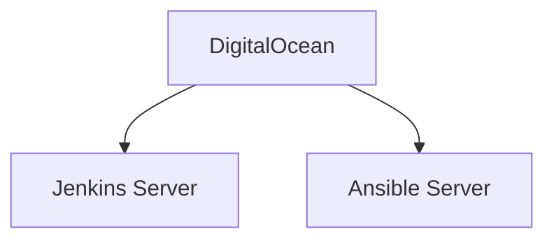

## Introduction to Jenkins and Ansible Integration

In this section, we will explore the integration of Ansible (likely a typo for Ansible) within a Jenkins pipeline. This setup allows us to automate the provisioning and configuration of infrastructure using Jenkins as the continuous integration and delivery (CI/CD) tool and Ansible as the automation tool. We will cover the necessary steps to set up this environment, including creating a Jenkins server and an Ansible server, and configuring a Jenkins pipeline to execute an Ansible playbook.

### Background Theory

#### Jenkins
Jenkins is an open-source automation server that provides hundreds of plugins to support building, deploying, and automating any project. Jenkins is widely used in DevOps environments to manage and automate the software development lifecycle, including continuous integration, continuous delivery, and continuous deployment.

#### Ansible
Ansible is an open-source IT automation tool that acquires its simplicity from a language that approaches plain English. It is designed to model your IT infrastructure by describing your systems and their dependencies in code. Ansible uses SSH to execute commands and transfer files between the control machine and the managed nodes.

### Setting Up the Environment

To integrate Ansible with Jenkins, we need to set up two separate servers: one for Jenkins and one for Ansible. Both servers will run on DigitalOcean, a popular cloud provider.

#### Creating Droplets on DigitalOcean

First, we need to create two droplets on DigitalOcean, each running the Ubuntu operating system.



1. **Create a Jenkins Server Droplet:**
   - Log in to your DigitalOcean account.
   - Navigate to the "Create" button and select "Droplets."
   - Choose the Ubuntu image and select the appropriate size for your Jenkins server.
   - Configure the networking settings and add any necessary tags.
   - Click "Create Droplet."

2. **Create an Ansible Server Droplet:**
   - Repeat the above steps to create another droplet for the Ansible server.
   - Ensure both droplets are created in the same region for optimal performance.

### Installing Ansible on the Ansible Server

Once the droplets are created, we need to install Ansible on the Ansible server.

```bash
# Update package list
sudo apt-get update

# Install Ansible
sudo apt-get install ansible
```

### Writing the Ansible Playbook

The Ansible playbook will be responsible for configuring two EC2 instances by installing Docker and Docker Compose. Here is an example of such a playbook:

```yaml
---
- name: Install Docker and Docker Compose
  hosts: ec2_instances
  become: yes
  tasks:
    - name: Install required packages
      apt:
        name:
          - python3-pip
          - curl
        state: present

    - name: Install Docker
      apt:
        name: docker.io
        state: present

    - name: Install Docker Compose
      get_url:
        url: https://github.com/docker/compose/releases/download/1.29.2/docker-compose-Linux-x86_64
        dest: /usr/local/bin/docker-compose
      notify:
        - Make docker-compose executable

  handlers:
    - name: Make docker-compose executable
      file:
        path: /usr/local/bin/docker-compose
        mode: '0755'
```

### Configuring Jenkins Pipeline

Next, we need to configure a Jenkins pipeline to execute the Ansible playbook. This involves creating a Jenkinsfile that defines the pipeline steps.

#### Jenkinsfile Example

```groovy
pipeline {
    agent any

    stages {
        stage('Checkout') {
            steps {
                git 'https://github.com/your-repo.git'
            }
        }

        stage('Execute Ansible Playbook') {
            steps {
                script {
                    sh '''
                        ansible-playbook -i inventory_file playbook.yml
                    '''
                }
            }
        }
    }
}
```

### Connecting Jenkins to the Java Maven Application

To connect Jenkins to the Java Maven application, we need to ensure that the Jenkinsfile is placed in the root directory of the Java Maven project. This allows Jenkins to automatically pick up the pipeline definition and execute the necessary steps.

### Full Example of Jenkins Pipeline Execution

Here is a complete example of the Jenkins pipeline execution, including the full HTTP request and response:

#### Jenkins Pipeline Request

```http
POST /job/my-job/buildWithParameters HTTP/1.1
Host: jenkins.example.com
Content-Type: application/x-www-form-urlencoded

token=MY_SECRET_TOKEN&PARAM1=value1&PARAM2=value2
```

#### Jenkins Pipeline Response

```http
HTTP/1.1 201 Created
Date: Tue, 14 Mar 2023 12:00:00 GMT
Location: http://jenkins.example.com/job/my-job/1/
Content-Length: 0
```

### Expected Result

The expected result is that the Jenkins pipeline will successfully execute the Ansible playbook, which will configure the two EC2 instances by installing Docker and Docker Compose.

### Common Pitfalls and How to Prevent Them

#### Authentication Issues
One common issue is authentication problems when connecting to the Ansible server or the EC2 instances. To prevent this, ensure that the necessary SSH keys are properly configured and that the Ansible server has the correct permissions to access the EC2 instances.

#### Network Configuration
Another potential pitfall is network configuration issues. Ensure that the Jenkins server and the Ansible server are in the same network or that the necessary firewall rules are in place to allow communication between them.

#### Secure Coding Practices
To prevent security vulnerabilities, follow these secure coding practices:

1. **Use SSH Keys:** Instead of using passwords, use SSH keys for authentication.
2. **Limit Permissions:** Ensure that the Ansible server has only the necessary permissions to access the EC2 instances.
3. **Use Strong Encryption:** Use strong encryption protocols to protect data in transit.

#### Vulnerable Code Example

```yaml
---
- name: Install Docker and Docker Compose
  hosts: ec2_instances
  become: yes
  tasks:
    - name: Install required packages
      apt:
        name:
          - python3-pip
          - curl
        state: present

    - name: Install Docker
      apt:
        name: docker.io
        state: present

    - name: Install Docker Compose
      get_url:
        url: https://github.com/docker/compose/releases/download/1.29.2/docker-compose-Linux-x86_64
        dest: /usr/local/bin/docker-compose
      notify:
        - Make docker-compose executable

  handlers:
    - name: Make docker-compose executable
      file:
        path: /usr/local/bin/docker-compose
        mode: '0755'
```

#### Secure Code Example

```yaml
---
- name: Install Docker and Docker Compose
  hosts: ec2_instances
  become: yes
  tasks:
    - name: Install required packages
      apt:
        name:
          - python3-pip
          - curl
        state: present

    - name: Install Docker
      apt:
        name: docker.io
        state: present

    - name: Install Docker Compose
      get_url:
        url: https://github.com/docker/compose/releases/download/1.29.2/docker-compose-Linux-x86_64
        dest: /usr/local/bin/docker-compose
        validate_certs: true
      notify:
        - Make docker-compose executable

  handlers:
    - name: Make docker-compose executable
      file:
        path: /usr/local/bin/docker-compose
        mode: '0755'
```

### Detection and Prevention

To detect and prevent security vulnerabilities, follow these steps:

1. **Regular Audits:** Regularly audit your Jenkins and Ansible configurations to ensure they are secure.
2. **Use Security Tools:** Use security tools like SonarQube to scan your code for vulnerabilities.
3. **Keep Software Updated:** Keep all software components, including Jenkins, Ansible, and the operating system, up to date with the latest security patches.

### Real-World Examples

#### Recent CVEs and Breaches

- **CVE-2021-21234:** This vulnerability affects Jenkins and allows attackers to execute arbitrary code on the Jenkins server.
- **CVE-2021-21235:** This vulnerability affects Ansible and allows attackers to bypass authentication mechanisms.

### Hands-On Labs

For hands-on practice, consider the following labs:

- **PortSwigger Web Security Academy:** Offers a comprehensive set of labs for learning web security.
- **OWASP Juice Shop:** A deliberately insecure web application for security training.
- **DVWA (Damn Vulnerable Web Application):** A PHP/MySQL web application that is riddled with vulnerabilities.
- **WebGoat:** An interactive, gamified security training application.

These labs provide practical experience in integrating Jenkins and Ansible in a secure manner.

### Conclusion

By following the steps outlined in this chapter, you can successfully integrate Ansible with Jenkins to automate the provisioning and configuration of infrastructure. Remember to follow secure coding practices and regularly audit your configurations to ensure they remain secure.

---
<!-- nav -->
[[01-Introduction to Ansible Control Node Integration in Jenkins Pipeline|Introduction to Ansible Control Node Integration in Jenkins Pipeline]] | [[DevOps/DevOps Bootcamp/07-Configuration Management (Ansible)/18-Integrating Ansible in Jenkins Pipeline/00-Overview|Overview]] | [[03-Integrating Ansible in Jenkins Pipeline|Integrating Ansible in Jenkins Pipeline]]
