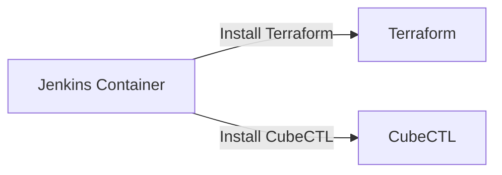

## Integrating Ansible in Jenkins Pipeline

### Background Theory

Before diving into the integration of Ansible in a Jenkins pipeline, let's first understand what Ansible is and why it is important in the context of DevOps.

**Ansible** is a configuration management tool similar to Ansible, which allows you to automate the provisioning and management of infrastructure. It uses playbooks written in YAML to define the desired state of your systems. These playbooks can be executed from a central control node to manage multiple remote nodes.

**Jenkins**, on the other hand, is an open-source automation server that provides continuous integration and continuous delivery (CI/CD) services. It is widely used to build, test, and deploy applications.

Integrating Ansible with Jenkins allows you to leverage the power of both tools. You can use Jenkins pipelines to orchestrate the execution of Ansible playbooks, ensuring that your infrastructure is consistently configured and managed throughout the development lifecycle.

### Setup and Implementation Steps

#### Step 1: Jenkins Server Setup

For this example, we assume that the Jenkins server is running on a DigitalOcean droplet. This setup is typical for many DevOps environments, where a cloud-based server is used to host the Jenkins instance.


#### Step 2: Installing Tools in Jenkins Container

Previously, we have seen that for each tool we want to use in a Jenkins pipeline, such as Terraform or CubeCTL, we install these tools directly within the Jenkins container. This ensures that the necessary commands are available for the Jenkins jobs to execute.



However, for Ansible, we will take a slightly different approach.

#### Step 3: Dedicated Server for Ansible

Instead of installing Ansible directly in the Jenkins container, we will set up a dedicated server specifically for Ansible. This is a common practice in DevOps environments for several reasons:

1. **Isolation**: Keeping Ansible separate from the Jenkins environment helps isolate the configuration management tasks from the CI/CD processes.
2. **Scalability**: A dedicated server can be scaled independently based on the load of Ansible operations.
3. **Security**: Separating sensitive configuration management tasks from the main CI/CD pipeline can enhance security.


### Detailed Integration Process

#### Step 4: Setting Up the Dedicated Ansible Server

To set up the dedicated Ansible server, follow these steps:

1. **Provision the Server**: Create a new server instance on your preferred cloud provider (e.g., DigitalOcean, AWS, GCP).
2. **Install Ansible**: SSH into the server and install Ansible using the appropriate package manager for your operating system.

```bash
# Example for Ubuntu
sudo apt update
sudo apt install ansible
```

3. **Configure SSH Access**: Ensure that the Jenkins server can SSH into the Ansible server. This typically involves setting up SSH keys and configuring the SSH daemon.

```bash
# On Jenkins Server
ssh-keygen -t rsa -b 4096 -C "jenkins@yourdomain.com"
ssh-copy-id user@ansible-server-ip
```

#### Step 5: Configuring Jenkins Pipeline

Now that the Ansible server is set up, we need to configure the Jenkins pipeline to execute Ansible playbooks.

1. **Create a Jenkinsfile**: Define a Jenkins pipeline script that includes steps to execute Ansible playbooks.

```groovy
pipeline {
    agent any
    stages {
        stage('Execute Ansible Playbook') {
            steps {
                sh '''
                    ssh user@ansible-server-ip 'ansible-playbook /path/to/playbook.yml'
                '''
            }
        }
    }
}
```

2. **Run the Pipeline**: Trigger the Jenkins pipeline to execute the Ansible playbook.

### Real-World Examples and Recent CVEs

#### Example: Infrastructure Configuration Management

Consider a scenario where you need to ensure that all servers in a production environment are configured with the latest security patches. Using Ansible, you can create a playbook that automates this process.

```yaml
---
- name: Apply security patches
  hosts: all
  become: yes
  tasks:
    - name: Update package lists
      apt:
        update_cache: yes
    - name: Upgrade all packages
      apt:
        upgrade: dist
```

This playbook can be executed from the Jenkins pipeline to ensure that all servers are up-to-date.

#### Recent CVEs

One recent CVE that highlights the importance of proper configuration management is **CVE-2021-44228**, also known as Log4Shell. This vulnerability affected the Apache Log4j library and allowed attackers to execute arbitrary code on affected systems.

By using Ansible to manage configurations, you can ensure that all systems are patched and configured securely. For example, you can create a playbook that checks for the presence of the Log4j library and applies the necessary patches.

```yaml
---
- name: Check for Log4j vulnerability
  hosts: all
  become: yes
  tasks:
    - name: Check for Log4j version
      shell: dpkg -l | grep log4j
      register: log4j_check
    - name: Apply patch if vulnerable
      apt:
        name: log4j
        state: latest
      when: log4j_check.stdout != ''
```

### Pitfalls and Best Practices

#### Common Mistakes

1. **Hardcoding Credentials**: Avoid hardcoding credentials in your Ansible playbooks or Jenkins pipelines. Use environment variables or secrets management tools instead.
2. **Inconsistent Configurations**: Ensure that your Ansible playbooks are idempotent, meaning they can be run multiple times without causing unintended changes.
3. **Insufficient Testing**: Always test your Ansible playbooks in a staging environment before deploying them to production.

#### How to Prevent / Defend

1. **Secure SSH Access**: Use SSH keys and restrict access to the Ansible server. Consider using a bastion host to further secure SSH access.
2. **Use Secrets Management**: Utilize tools like HashiCorp Vault or AWS Secrets Manager to manage sensitive information securely.
3. **Regular Audits**: Regularly audit your Ansible playbooks and Jenkins pipelines to ensure they are secure and up-to-date.

### Complete Example

#### Full HTTP Request and Response

Here is a complete example of a Jenkins pipeline that executes an Ansible playbook:

```groovy
pipeline {
    agent any
    stages {
        stage('Execute Ansible Playbook') {
            steps {
                sh '''
                    ssh user@ansible-server-ip 'ansible-playbook /path/to/playbook.yml'
                '''
            }
        }
    }
}
```

The corresponding HTTP request and response might look like this:

```http
POST /job/my-job/buildWithParameters HTTP/1.1
Host: jenkins.example.com
Content-Type: application/x-www-form-urlencoded

token=MY_TOKEN&param1=value1
```

```http
HTTP/1.1 201 Created
Date: Tue, 20 Mar 2023 12:00:00 GMT
Location: http://jenkins.example.com/job/my-job/1/
```

### Practice Labs

For hands-on experience with integrating Ansible in a Jenkins pipeline, consider the following labs:

- **PortSwigger Web Security Academy**: Offers a variety of labs related to DevOps and CI/CD pipelines.
- **OWASP Juice Shop**: Provides a vulnerable web application that can be used to practice securing CI/CD pipelines.
- **DVWA (Damn Vulnerable Web Application)**: Useful for practicing various aspects of web application security, including CI/CD pipelines.

These labs provide practical scenarios where you can apply the concepts learned in this chapter.

### Conclusion

Integrating Ansible in a Jenkins pipeline is a powerful way to automate the management of your infrastructure. By setting up a dedicated server for Ansible and configuring your Jenkins pipeline accordingly, you can ensure that your systems are consistently configured and managed. Remember to follow best practices and regularly audit your configurations to maintain security and reliability.

---
<!-- nav -->
[[02-Introduction to Jenkins and Ansible Integration|Introduction to Jenkins and Ansible Integration]] | [[DevOps/DevOps Bootcamp/07-Configuration Management (Ansible)/18-Integrating Ansible in Jenkins Pipeline/00-Overview|Overview]] | [[DevOps/DevOps Bootcamp/07-Configuration Management (Ansible)/18-Integrating Ansible in Jenkins Pipeline/04-Practice Questions & Answers|Practice Questions & Answers]]
