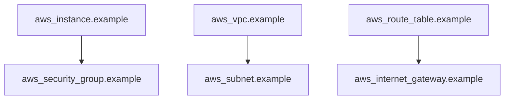

## Terraform Basics

### What is Terraform?

Terraform is an open-source infrastructure as code tool created by HashiCorp. It allows you to define and provision your infrastructure using declarative configuration files written in the HashiCorp Configuration Language (HCL). Terraform supports a wide range of cloud providers, including AWS, Azure, Google Cloud, and many others.

### Why Use Terraform?

Terraform is particularly strong in the following areas:

1. **Multi-cloud Support**: Terraform supports multiple cloud providers, making it easy to manage hybrid cloud environments.
2. **State Management**: Terraform maintains a state file that tracks the current state of your infrastructure, ensuring consistency and reproducibility.
3. **Resource Graph**: Terraform uses a resource graph to understand dependencies between resources, ensuring that resources are created and destroyed in the correct order.
4. **Provider Ecosystem**: Terraform has a rich ecosystem of providers, making it easy to integrate with various cloud services and third-party tools.

### How Does Terraform Work?

Terraform works by defining your infrastructure in HCL files. These files describe the desired state of your infrastructure, including the resources you want to create, their properties, and their relationships. Terraform then uses these definitions to create, update, or destroy resources in your cloud environment.

#### Example Terraform Configuration

Here is a simple example of a Terraform configuration file (`main.tf`):

```hcl
provider "aws" {
  region = "us-west-2"
}

resource "aws_instance" "example" {
  ami           = "ami-0c55b159cbfafe1f0"
  instance_type = "t2.micro"

  tags = {
    Name = "example-instance"
  }
}
```

This configuration defines an AWS provider and an EC2 instance. When you run `terraform apply`, Terraform will create the specified EC2 instance in the `us-west-2` region.

### Terraform Commands

Terraform provides several commands to manage your infrastructure:

- `terraform init`: Initializes the working directory, downloading any required plugins and setting up the state.
- `terraform plan`: Generates an execution plan, showing what changes Terraform will make to your infrastructure.
- `terraform apply`: Applies the changes defined in your configuration files.
- `terraform destroy`: Destroys the resources defined in your configuration files.

### Terraform State Management

Terraform maintains a state file (`terraform.tfstate`) that tracks the current state of your infrastructure. This file is crucial for Terraform to understand the current state and make the necessary changes to achieve the desired state.

#### Example Terraform State File

```json
{
  "version": 4,
  "terraform_version": "1.0.0",
  "serial": 1,
  "lineage": "some-unique-id",
  "outputs": {},
  "resources": [
    {
      "mode": "managed",
      "type": "aws_instance",
      "name": "example",
      "provider": "provider.aws",
      "instances": [
        {
          "schema_version": 1,
          "attributes": {
            "ami": "ami-0c55b159cbfafe1f0",
            "instance_state": "running",
            "public_ip": "123.456.789.012",
            "tags.Name": "example-instance"
          },
          "private": {}
        }
      ]
    }
  ]
}
```

### Terraform Resource Graph

Terraform uses a resource graph to understand dependencies between resources. This graph helps Terraform determine the order in which resources should be created or destroyed.

#### Example Resource Graph



In this example, the `aws_instance` depends on the `aws_security_group`, and the `aws_vpc` depends on the `aws_subnet`. Terraform will ensure that these dependencies are respected during the creation and destruction of resources.

### Terraform Modules

Terraform modules allow you to encapsulate and reuse infrastructure definitions. Modules can be nested within each other, making it easy to build complex infrastructure configurations.

#### Example Module

Here is an example of a Terraform module (`module/main.tf`):

```hcl
variable "region" {
  type = string
}

provider "aws" {
  region = var.region
}

resource "aws_instance" "example" {
  ami           = "ami-0c55b159cbfafe1f0"
  instance_type = "t2.micro"

  tags = {
    Name = "example-instance"
  }
}
```

You can use this module in your main configuration file (`main.tf`):

```hcl
module "example" {
  source = "./module"
  region = "us-west-2"
}
```

### Terraform Workspaces

Terraform workspaces allow you to manage multiple environments (e.g., development, staging, production) using the same set of configuration files. Each workspace has its own state file, allowing you to manage different environments independently.

#### Example Workspace Usage

```sh
terraform workspace new dev
terraform workspace select dev
terraform apply
```

### Terraform Best Practices

To get the most out of Terraform, follow these best practices:

1. **Use Version Control**: Store your Terraform configuration files in a version control system like Git.
2. **Keep State Secure**: Ensure that your state file is stored securely, especially if it contains sensitive information.
3. **Use Modules**: Encapsulate and reuse infrastructure definitions using modules.
4. **Use Workspaces**: Manage multiple environments using workspaces.
5. **Document Your Configuration**: Add comments and documentation to your configuration files to make them easier to understand.

### Real-World Examples

#### Example: AWS EC2 Instance with Security Group

Here is a more complex example of a Terraform configuration that provisions an EC2 instance with a security group:

```hcl
provider "aws" {
  region = "us-west-2"
}

resource "aws_security_group" "example" {
  name        = "example-sg"
  description = "Example security group"

  ingress {
    from_port   = 22
    to_port     = 22
    protocol    = "tcp"
    cidr_blocks = ["0.0.0.0/0"]
  }

  egress {
    from_port   = 0
    to_port     = 0
    protocol    = "-1"
    cidr_blocks = ["0.0.0.0/0"]
  }
}

resource "aws_instance" "example" {
  ami           = "ami-0c55b159cbfafe1f0"
  instance_type = "t2.micro"

  vpc_security_group_ids = [aws_security_group.example.id]

  tags = {
    Name = "example-instance"
  }
}
```

### Common Pitfalls and How to Avoid Them

#### Pitfall: Inconsistent State

**Problem**: If the state file becomes inconsistent with the actual state of your infrastructure, Terraform may make incorrect changes.

**Solution**: Regularly run `terraform refresh` to ensure that the state file is up-to-date with the actual state of your infrastructure.

#### Pitfall: Missing Dependencies

**Problem**: If you forget to define dependencies between resources, Terraform may create or destroy resources in the wrong order.

**Solution**: Use the `depends_on` attribute to explicitly define dependencies between resources.

#### Pitfall: Hardcoding Values

**Problem**: Hardcoding values in your configuration files makes it difficult to reuse and modify your infrastructure.

**Solution**: Use variables and modules to abstract away hardcoded values.

### How to Prevent / Defend

#### Detection

- **Regular Audits**: Perform regular audits of your Terraform configuration files to ensure they are up-to-date and consistent.
- **Automated Testing**: Use automated testing tools to validate your Terraform configuration files.

#### Prevention

- **Use Version Control**: Store your Terraform configuration files in a version control system like Git.
- **Use Modules**: Encapsulate and reuse infrastructure definitions using modules.
- **Use Workspaces**: Manage multiple environments using workspaces.

#### Secure Coding Fixes

**Vulnerable Code**:

```hcl
resource "aws_instance" "example" {
  ami           = "ami-0c55b159cbfafe1f0"
  instance_type = "t2.micro"

  tags = {
    Name = "example-instance"
  }
}
```

**Secure Code**:

```hcl
variable "region" {
  type = string
}

variable "ami_id" {
  type = string
}

variable "instance_type" {
  type = string
}

variable "instance_name" {
  type = string
}

provider "aws" {
  region = var.region
}

resource "aws_instance" "example" {
  ami           = var.ami_id
  instance_type = var.instance_type

  tags = {
    Name = var.instance_name
  }
}
```

### Conclusion

Terraform is a powerful tool for managing infrastructure as code. By understanding its core concepts and best practices, you can effectively use Terraform to provision and manage your infrastructure.

---
<!-- nav -->
[[05-Terraform Basics for Infrastructure Provisioning|Terraform Basics for Infrastructure Provisioning]] | [[DevOps/DevOps Bootcamp/08-Infrastructure as Code (Terraform)/01-Terraform Basics for Infrastructure Provisioning/00-Overview|Overview]] | [[07-What is Terraform|What is Terraform]]
