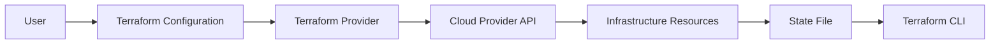

## Introduction to Infrastructure as Code (IaC)

Infrastructure as Code (IaC) is a practice in DevOps that involves managing and provisioning infrastructure through machine-readable definition files, rather than physical hardware configuration or interactive configuration tools. This approach allows for automation, consistency, and version control in the deployment and management of infrastructure. Terraform is one of the most popular tools used for IaC, but it is primarily designed for provisioning infrastructure, such as virtual machines, networks, and storage. Once the infrastructure is provisioned, additional steps are required to deploy applications and configure servers, which is where other tools come into play.

### What is Terraform?

Terraform is an open-source IaC tool developed by HashiCorp. It allows users to define and manage infrastructure resources using declarative configuration files written in the HashiCorp Configuration Language (HCL). Terraform supports a wide range of cloud providers, including AWS, Azure, Google Cloud Platform, and many others. By defining infrastructure as code, Terraform enables teams to manage infrastructure changes in a consistent and repeatable manner.

#### Why Use Terraform?

1. **Consistency**: Terraform ensures that infrastructure is consistently deployed across different environments (development, testing, production).
2. **Version Control**: Infrastructure definitions can be stored in version control systems, allowing teams to track changes and collaborate effectively.
3. **Automation**: Terraform automates the provisioning and management of infrastructure, reducing manual errors and improving efficiency.
4. **Multi-Cloud Support**: Terraform supports multiple cloud providers, making it easier to manage hybrid cloud environments.

#### How Does Terraform Work?

Terraform operates based on a declarative model, where users specify the desired state of the infrastructure. Terraform then calculates the necessary steps to achieve that state and applies them. The process involves several key components:

1. **Providers**: Terraform uses providers to interact with different cloud platforms. Providers define the resources and actions available for a specific cloud provider.
2. **Resources**: Resources represent the individual components of the infrastructure, such as virtual machines, networks, and storage volumes.
3. **State**: Terraform maintains a state file that tracks the current state of the infrastructure. This file is crucial for Terraform to understand the differences between the desired state and the actual state.
4. **Modules**: Modules allow users to encapsulate and reuse common infrastructure configurations, promoting modularity and reusability.



### Limitations of Terraform

While Terraform is powerful for provisioning infrastructure, it has limitations when it comes to deploying applications and configuring servers. Terraform does not provide mechanisms for:

1. **Application Deployment**: Terraform is not designed to handle the deployment of applications, including installing dependencies, configuring services, and managing application versions.
2. **Server Configuration**: Terraform does not support detailed server configuration tasks, such as installing packages, setting up environment variables, and configuring system services.

To address these limitations, other tools are often used in conjunction with Terraform.

### Alternatives to Shell Scripting

Once the infrastructure is provisioned using Terraform, the next step is to deploy applications and configure servers. Instead of relying on shell scripting, which can be error-prone and difficult to maintain, configuration management tools are preferred. These tools provide a more structured and automated approach to server configuration and application deployment.

#### Configuration Management Tools

Configuration management tools are designed to automate the deployment and management of applications and server configurations. Some popular configuration management tools include:

1. **Ansible**
2. **Puppet**
3. **Chef**

These tools offer features such as idempotent configuration, role-based access control, and centralized management, making them ideal for complex environments.

### Ansible

Ansible is an open-source configuration management tool that simplifies the process of automating IT infrastructure. It uses a simple YAML-based language called Ansible Playbooks to define the desired state of the infrastructure.

#### Key Features of Ansible

1. **Agentless Architecture**: Ansible does not require agents to be installed on managed nodes, making it easy to deploy and manage.
2. **Idempotent Configuration**: Ansible ensures that the desired state is achieved without causing unnecessary changes.
3. **Role-Based Access Control**: Ansible supports role-based access control, allowing teams to manage permissions and access to infrastructure resources.
4. **Centralized Management**: Ansible provides a centralized management interface for deploying and managing infrastructure.

#### How to Use Ansible

To use Ansible, you need to create Ansible Playbooks that define the desired state of the infrastructure. Playbooks are written in YAML and consist of tasks that are executed on managed nodes.

```yaml
---
- name: Install and configure Apache
  hosts: webservers
  become: yes
  tasks:
    - name: Ensure Apache is installed
      apt:
        name: apache2
        state: present

    - name: Ensure Apache is started
      service:
        name: apache2
        state: started
        enabled: yes
```

In this example, the playbook installs the `apache2` package and ensures that the Apache service is started and enabled.

#### Real-World Example: CVE-2021-44228 (Log4Shell)

The Log4Shell vulnerability (CVE-2021-44228) affected many Java applications, including those deployed on servers managed by Ansible. To mitigate this vulnerability, Ansible can be used to update the `log4j` library on all affected servers.

```yaml
---
- name: Update log4j library
  hosts: all
  become: yes
  tasks:
    - name: Ensure log4j is updated
      yum:
        name: log4j
        state: latest
```

This playbook ensures that the `log4j` library is updated to the latest version, mitigating the Log4Shell vulnerability.

### Puppet

Puppet is another popular configuration management tool that automates the deployment and management of infrastructure. Puppet uses a declarative language called Puppet DSL to define the desired state of the infrastructure.

#### Key Features of Puppet

1. **Declarative Language**: Puppet uses a declarative language to define the desired state of the infrastructure, making it easy to manage complex configurations.
2. **Centralized Management**: Puppet provides a centralized management interface for deploying and managing infrastructure.
3. **Idempotent Configuration**: Puppet ensures that the desired state is achieved without causing unnecessary changes.
4. **Role-Based Access Control**: Puppet supports role-based access control, allowing teams to manage permissions and access to infrastructure resources.

#### How to Use Puppet

To use Puppet, you need to create Puppet manifests that define the desired state of the infrastructure. Manifests are written in Puppet DSL and consist of resources that are applied to managed nodes.

```puppet
class apache {
  package { 'apache2':
    ensure => installed,
  }

  service { 'apache2':
    ensure => running,
    enable => true,
  }
}

node 'webservers' {
  include apache
}
```

In this example, the Puppet manifest installs the `apache2` package and ensures that the Apache service is running and enabled.

#### Real-World Example: CVE-2021-3427 (Apache Struts)

The Apache Struts vulnerability (CVE-2021-3427) affected many Java applications, including those deployed on servers managed by Puppet. To mitigate this vulnerability, Puppet can be used to update the `struts` library on all affected servers.

```puppet
class struts_update {
  package { 'struts':
    ensure => latest,
  }
}

node 'all' {
  include struts_update
}
```

This Puppet manifest ensures that the `struts` library is updated to the latest version, mitigating the Apache Struts vulnerability.

### Chef

Chef is a configuration management tool that automates the deployment and management of infrastructure. Chef uses a declarative language called Chef Recipes to define the desired state of the infrastructure.

#### Key Features of Chef

1. **Declarative Language**: Chef uses a declarative language to define the desired state of the infrastructure, making it easy to manage complex configurations.
2. **Centralized Management**: Chef provides a centralized management interface for deploying and managing infrastructure.
3. **Idempotent Configuration**: Chef ensures that the desired state is achieved without causing unnecessary changes.
4. **Role-Based Access Control**: Chef supports role-based access control, allowing teams to manage permissions and access to infrastructure resources.

#### How to Use Chef

To use Chef, you need to create Chef recipes that define the desired state of the infrastructure. Recipes are written in Ruby and consist of resources that are applied to managed nodes.

```ruby
package 'apache2' do
  action :install
end

service 'apache2' do
  action [:enable, :start]
end
```

In this example, the Chef recipe installs the `apache2` package and ensures that the Apache service is enabled and started.

#### Real-World Example: CVE-2021-4034 (Apache Tomcat)

The Apache Tomcat vulnerability (CVE-2021-4034) affected many Java applications, including those deployed on servers managed by Chef. To mitigate this vulnerability, Chef can be used to update the `tomcat` library on all affected servers.

```ruby
package 'tomcat' do
  action :upgrade
end
```

This Chef recipe ensures that the `tomcat` library is upgraded to the latest version, mitigating the Apache Tomcat vulnerability.

### Integration with Terraform

To integrate configuration management tools with Terraform, you can use user data scripts or cloud-init configurations. These scripts are executed during the provisioning process to configure the server and deploy applications.

#### Using User Data Scripts

User data scripts are executed during the provisioning process to configure the server and deploy applications. These scripts can be used to install and configure Ansible, Puppet, or Chef on the server.

```yaml
---
resources:
  aws_instance.example:
    type: aws_instance
    properties:
      ami: ami-0c94855ba95b79819
      instance_type: t2.micro
      user_data: |
        #!/bin/bash
        sudo apt-get update
        sudo apt-get install -y ansible
        ansible-pull -U https://github.com/example/ansible-repo.git
```

In this example, the user data script installs Ansible and pulls the configuration from a Git repository.

#### Using Cloud-Init Configurations

Cloud-init configurations are used to configure the server during the provisioning process. These configurations can be used to install and configure Ansible, Puppet, or Chef on the server.

```yaml
---
resources:
  aws_instance.example:
    type: aws_instance
    properties:
      ami: ami-0c94855ba95b79819
      instance_type: t2.micro
      user_data: |
        #cloud-config
        packages:
          - ansible
        runcmd:
          - ansible-pull -U https://github.com/example/ansible-repo.git
```

In this example, the cloud-init configuration installs Ansible and pulls the configuration from a Git repository.

### How to Prevent / Defend

To prevent and defend against vulnerabilities in the deployment and configuration of infrastructure, it is essential to follow best practices and implement security measures.

#### Secure Coding Practices

1. **Use Version Control**: Store infrastructure definitions in version control systems to track changes and collaborate effectively.
2. **Automate Testing**: Implement automated testing to ensure that infrastructure changes do not introduce vulnerabilities.
3. **Use Secure Configurations**: Use secure configurations for applications and services to minimize the attack surface.

#### Detection and Prevention

1. **Regular Audits**: Regularly audit infrastructure configurations to identify and remediate vulnerabilities.
2. **Security Scanning**: Use security scanning tools to identify vulnerabilities in the infrastructure.
3. **Patch Management**: Implement patch management processes to ensure that all software is up-to-date and free from known vulnerabilities.

#### Secure-Coding Fixes

To demonstrate secure coding practices, let's compare a vulnerable configuration with a secure configuration.

**Vulnerable Configuration (Ansible)**

```yaml
---
- name: Install and configure Apache
  hosts: webservers
  become: yes
  tasks:
    - name: Ensure Apache is installed
      apt:
        name: apache2
        state: present

    - name: Ensure Apache is started
      service:
        name: apache2
        state: started
        enabled: yes
```

**Secure Configuration (Ansible)**

```yaml
---
- name: Install and configure Apache securely
  hosts: webservers
  become: yes
  tasks:
    - name: Ensure Apache is installed
      apt:
        name: apache2
        state: present
        update_cache: yes

    - name: Ensure Apache is started
      service:
        name: apache2
        state: started
        enabled: yes

    - name: Ensure security modules are enabled
      lineinfile:
        path: /etc/apache2/apache2.conf
        regexp: '^IncludeOptional'
        line: 'IncludeOptional sites-enabled/*.conf'
        state: present
```

In the secure configuration, the `update_cache` option is used to ensure that the package cache is updated before installing the package. Additionally, security modules are enabled to enhance the security of the Apache server.

### Conclusion

In conclusion, while Terraform is a powerful tool for provisioning infrastructure, it is not designed for deploying applications and configuring servers. Configuration management tools such as Ansible, Puppet, and Chef are better suited for these tasks. By integrating these tools with Terraform, you can automate the deployment and management of infrastructure in a consistent and secure manner.

### Practice Labs

For hands-on experience with Terraform and configuration management tools, consider the following labs:

- **PortSwigger Web Security Academy**: Focuses on web application security.
- **OWASP Juice Shop**: A deliberately insecure web application for practicing security skills.
- **DVWA (Damn Vulnerable Web Application)**: A PHP/MySQL web application that is vulnerable by design.
- **WebGoat**: An interactive web application security training program.
- **CloudGoat**: A collection of vulnerable AWS CloudFormation templates for learning cloud security.
- **flaws.cloud**: A platform for learning cloud security by exploiting vulnerabilities.
- **flaws2.cloud**: Another platform for learning cloud security by exploiting vulnerabilities.
- **AWS Official Workshops**: Provides hands-on labs for learning AWS services.
- **Well-Architected Labs**: Provides hands-on labs for learning AWS best practices.
- **Pacu**: A Python framework for AWS security assessments.
- **Kubernetes Goat**: A deliberately insecure Kubernetes cluster for practicing security skills.
- **OWASP WrongSecrets**: A collection of challenges for learning secure coding practices.
- **kube-hunter**: A tool for identifying security issues in Kubernetes clusters.

By completing these labs, you can gain practical experience with Terraform and configuration management tools, and learn how to deploy and manage infrastructure securely.

---
<!-- nav -->
[[01-Introduction to Automating Server Setup with Terraform User Data|Introduction to Automating Server Setup with Terraform User Data]] | [[DevOps/DevOps Bootcamp/08-Infrastructure as Code (Terraform)/02-Automating Server Setup with Terraform User Data/00-Overview|Overview]] | [[03-Introduction to Terraform and Infrastructure as Code (IaC)|Introduction to Terraform and Infrastructure as Code (IaC)]]
