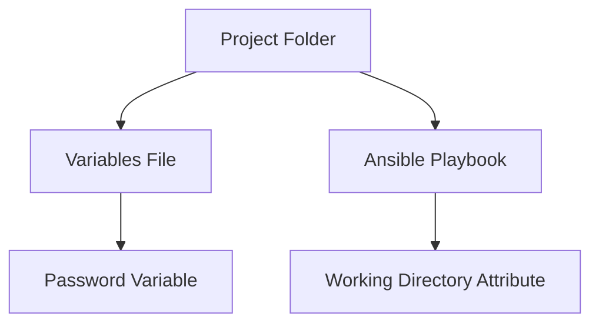

## Introduction to Automating Server Setup with Terraform and Ansible

In the realm of DevOps, automating server setup is crucial for maintaining consistency, reducing human error, and ensuring that infrastructure can be rapidly deployed and scaled. Two powerful tools that are often used together for this purpose are Terraform and Ansible. Terraform is a tool for building, changing, and combining infrastructure safely and efficiently, while Ansible is an open-source automation tool that can configure systems, deploy software, and orchestrate more advanced IT tasks such as continuous delivery or zero downtime rolling updates.

### Understanding Terraform and Ansible

#### Terraform

Terraform is an infrastructure as code (IaC) tool that allows you to define your infrastructure in declarative configuration files. These configurations describe the desired state of your infrastructure, and Terraform ensures that the actual state matches the desired state. Terraform supports a wide range of cloud providers and services, including AWS, Azure, Google Cloud Platform, and many others.

#### Ansible

Ansible is a configuration management tool that uses simple YAML playbooks to automate tasks. It does not require agents to be installed on managed nodes, making it agentless and easy to deploy. Ansible playbooks are written in a human-readable language and can be used to manage servers, deploy applications, and perform other administrative tasks.

### Combining Terraform and Ansible

When used together, Terraform and Ansible provide a powerful combination for automating server setup. Terraform can be used to create and manage the infrastructure, while Ansible can be used to configure and manage the servers once they are up and running.

### Enabling Dynamic Configuration with Variables

One of the key challenges when using Terraform and Ansible together is ensuring that the configuration remains dynamic and adaptable. This is particularly important when dealing with variables that may change, such as IP addresses or passwords.

#### Project Structure and Variable Management

In the context of the given transcript, the Ansible (likely meant to be Ansible) configuration file is part of a larger project structure. This project structure includes variables that are referenced within the configuration files. To ensure that these variables are correctly applied when the playbook is executed, it is essential to manage the working directory properly.



### Working Directory Attribute

The `Working Directory` attribute is a crucial feature that allows you to specify the directory from which the Ansible playbook should be executed. This ensures that all relative paths and references to files within the project folder are correctly resolved.

```yaml
# Example Terraform configuration with local-exec provisioner
resource "null_resource" "setup_ansible" {
  provisioner "local-exec" {
    command = "ansible-playbook -i inventory.ini playbook.yml"
    working_dir = "${path.module}/ansible"
  }
}
```

In this example, the `working_dir` attribute is set to `${path.module}/ansible`, which specifies the directory containing the Ansible playbook and related files. This ensures that the playbook is executed from the correct directory, and all variables and files are correctly referenced.

### Handling Dynamic IP Addresses

Another challenge when using Terraform and Ansible together is handling dynamic IP addresses. When a new server is created using Terraform, it will have a new IP address that may differ from the one specified in the Ansible playbook.

#### Problem Scenario

Consider the following scenario:

1. A new server is created using Terraform.
2. The server is assigned a new IP address.
3. The Ansible playbook is executed, but it attempts to connect to the old IP address specified in the playbook.

This results in a failure because the playbook cannot connect to the correct server.

#### Solution: Dynamic IP Address Resolution

To resolve this issue, you can use Terraform output values to dynamically pass the IP address to the Ansible playbook. This ensures that the playbook always connects to the correct server.

```terraform
# Example Terraform configuration with output value
output "server_ip" {
  value = aws_instance.example.private_ip
}

resource "null_resource" "setup_ansible" {
  provisioner "local-exec" {
    command = "ansible-playbook -i ${path.module}/inventory.ini playbook.yml"
    working_dir = "${path.module}/ansible"
  }
}
```

In this example, the `server_ip` output value is used to dynamically pass the IP address to the Ansible playbook. The playbook can then use this value to connect to the correct server.

### Ansible Inventory Management

To ensure that the Ansible playbook can dynamically connect to the correct server, you need to manage the inventory file (`inventory.ini`) appropriately.

```ini
# Example inventory file
[webservers]
${server_ip} ansible_user=ubuntu
```

In this example, the `${server_ip}` variable is dynamically populated with the IP address of the server created by Terraform. This ensures that the playbook always connects to the correct server.

### Complete Example

Here is a complete example that demonstrates how to use Terraform and Ansible together to automate server setup:

#### Terraform Configuration

```hcl
provider "aws" {
  region = "us-west-2"
}

resource "aws_instance" "example" {
  ami           = "ami-0c55b159cbfafe1f0"
  instance_type = "t2.micro"

  tags = {
    Name = "example-instance"
  }
}

output "server_ip" {
  value = aws_instance.example.private_ip
}

resource "null_resource" "setup_ansible" {
  provisioner "local-exec" {
    command = "ansible-playbook -i ${path.module}/inventory.ini playbook.yml"
    working_dir = "${path.module}/ansible"
  }
}
```

#### Ansible Playbook

```yaml
---
- name: Configure web server
  hosts: webservers
  become: yes
  tasks:
    - name: Install Apache
      apt:
        name: apache2
        state: present

    - name: Ensure Apache is running
      service:
        name: apache2
        state: started
        enabled: yes
```

#### Ansible Inventory File

```ini
# Example inventory file
[webservers]
${server_ip} ansible_user=ubuntu
```

### Pitfalls and Common Mistakes

#### Incorrect Working Directory

One common mistake is not setting the `working_dir` attribute correctly. This can result in the playbook being executed from the wrong directory, leading to incorrect file references and variable resolution issues.

#### Hardcoded IP Addresses

Hardcoding IP addresses in the Ansible playbook can lead to failures when the server is recreated with a new IP address. Always use dynamic IP address resolution to ensure that the playbook connects to the correct server.

### How to Prevent / Defend

#### Detection

To detect issues with dynamic IP address resolution, you can use logging and monitoring tools to track the execution of the Ansible playbook. This can help identify cases where the playbook fails to connect to the correct server.

#### Prevention

To prevent issues with dynamic IP address resolution, always use Terraform output values to dynamically pass the IP address to the Ansible playbook. This ensures that the playbook always connects to the correct server.

#### Secure Coding Fixes

Here is an example of a vulnerable Ansible playbook and the corresponding secure version:

**Vulnerable Version**

```yaml
---
- name: Configure web server
  hosts: webservers
  become: yes
  tasks:
    - name: Install Apache
      apt:
        name: apache2
        state: present

    - name: Ensure Apache is running
      service:
        name: apache2
        state: started
        enabled: yes
```

**Secure Version**

```yaml
---
- name: Configure web server
  hosts: webservers
  become: yes
  vars_files:
    - vars/variables.yml
  tasks:
    - name: Install Apache
      apt:
        name: apache2
        state: present

    - name: Ensure Apache is running
      service:
        name: apache2
        state: started
        enabled: yes
```

In the secure version, the `vars_files` attribute is used to dynamically load variables from a separate file. This ensures that the playbook can be executed from the correct directory and that all variables are correctly resolved.

### Real-World Examples

#### Recent Breaches and CVEs

One recent example of a breach involving misconfigured infrastructure is the Capital One data breach in 2019. In this case, a misconfigured firewall rule allowed unauthorized access to sensitive customer data. This highlights the importance of proper configuration management and the use of tools like Terraform and Ansible to ensure that infrastructure is consistently and securely configured.

### Conclusion

Automating server setup with Terraform and Ansible provides a powerful combination for managing infrastructure and ensuring consistency. By understanding the concepts of working directories, dynamic IP address resolution, and secure coding practices, you can effectively use these tools to automate server setup and maintain a secure and consistent infrastructure.

### Practice Labs

For hands-on practice with Terraform and Ansible, consider the following labs:

- **PortSwigger Web Security Academy**: Offers a variety of labs focused on web application security, including some that involve using Terraform and Ansible to automate server setup.
- **OWASP Juice Shop**: A deliberately insecure web application that can be used to practice various security techniques, including infrastructure automation with Terraform and Ansible.
- **DVWA (Damn Vulnerable Web Application)**: Another popular web application for practicing security techniques, including infrastructure automation.
- **Kubernetes Goat**: A hands-on lab for practicing Kubernetes security, which can include using Terraform and Ansible to automate cluster setup and configuration.

By completing these labs, you can gain practical experience with Terraform and Ansible and improve your skills in automating server setup and maintaining a secure infrastructure.

---
<!-- nav -->
[[DevOps/DevOps Bootcamp/08-Infrastructure as Code (Terraform)/03-Automating Server Setup with Terraform and Ansible/00-Overview|Overview]] | [[02-Introduction to Local Exec Provisioner in Terraform|Introduction to Local Exec Provisioner in Terraform]]
