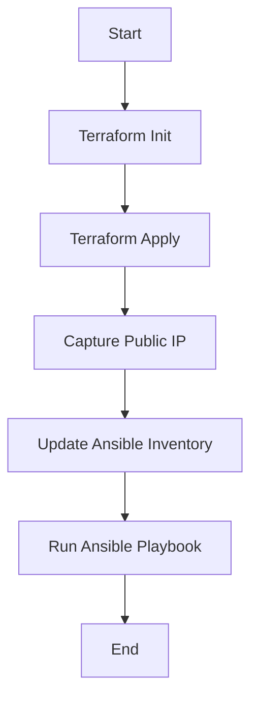

## Automating Server Setup with Terraform and Ansible

In this section, we will delve into automating the setup of a server using two powerful tools: Terraform and Ansible. These tools help streamline the process of creating and configuring servers, reducing manual intervention and minimizing human error. Let's break down the steps involved and explore how these tools can be integrated seamlessly.

### Background Theory

#### Terraform

Terraform is an open-source infrastructure as code (IaC) tool developed by HashiCorp. It allows you to define and provision your infrastructure using declarative configuration files written in the HashiCorp Configuration Language (HCL). Terraform supports a wide range of cloud providers, including AWS, Azure, Google Cloud, and more.

**Why Terraform?**
- **Consistency**: Terraform ensures that your infrastructure is consistent across different environments.
- **Version Control**: You can manage your infrastructure configurations using version control systems like Git.
- **Idempotency**: Terraform can apply changes incrementally, ensuring that your infrastructure remains in the desired state.

#### Ansible

Ansible is an open-source automation tool that simplifies the process of configuring and managing servers. It uses playbooks written in YAML to describe the desired state of your infrastructure. Ansible operates agentless, meaning it does not require any additional software to be installed on the managed nodes.

**Why Ansible?**
- **Ease of Use**: Ansible's simple syntax makes it easy to learn and use.
- **Agentless Operation**: No need to install agents on remote servers.
- **Rollback Mechanism**: Ansible can roll back changes if something goes wrong during the execution of a playbook.

### Integrating Terraform and Ansible

The goal is to automate the entire process of setting up a new EC2 instance, from provisioning to configuration. This involves using Terraform to create the EC2 instance and then using Ansible to configure it. However, there is a manual step in between: updating the Ansible inventory file with the newly created EC2 instance's IP address.

Let's walk through the process step-by-step:

#### Step 1: Provisioning the EC2 Instance with Terraform

First, we need to create a Terraform configuration file (`main.tf`) to define the EC2 instance.

```hcl
provider "aws" {
  region = "us-west-2"
}

resource "aws_instance" "example" {
  ami           = "ami-0c55b159cbfafe1f0"
  instance_type = "t2.micro"

  tags = {
    Name = "example-instance"
  }
}
```

This configuration sets up an AWS provider and defines an EC2 instance resource. The `ami` and `instance_type` specify the Amazon Machine Image and the type of instance, respectively.

To apply this configuration, run the following commands:

```sh
terraform init
terraform apply
```

After running `terraform apply`, Terraform will output the public IP address of the newly created EC2 instance.

#### Step 2: Configuring the EC2 Instance with Ansible

Next, we need to configure the EC2 instance using Ansible. First, create an Ansible playbook (`playbook.yml`):

```yaml
---
- name: Configure EC2 instance
  hosts: all
  tasks:
    - name: Ensure Apache is installed
      yum:
        name: httpd
        state: present

    - name: Start Apache service
      service:
        name: httpd
        state: started
        enabled: yes
```

This playbook installs the Apache web server and starts the service.

To run the playbook, you need to update the Ansible inventory file (`hosts`) with the IP address of the EC2 instance:

```ini
[webservers]
192.168.1.100
```

Then, execute the playbook:

```sh
ansible-playbook -i hosts playbook.yml
```

### Automating the Handover Process

The current process requires manual intervention to update the Ansible inventory file with the EC2 instance's IP address. To automate this, we can integrate Terraform and Ansible more tightly.

#### Step 3: Automating the Handover

We can modify the Terraform configuration to pass the EC2 instance's IP address to Ansible. This can be done using Terraform outputs and environment variables.

Update the `main.tf` file to include an output for the EC2 instance's public IP address:

```hcl
output "public_ip" {
  value = aws_instance.example.public_ip
}
```

Now, after running `terraform apply`, Terraform will output the public IP address. We can capture this output and pass it to Ansible.

Here’s a script (`deploy.sh`) that automates the entire process:

```sh
#!/bin/bash

# Initialize and apply Terraform configuration
terraform init
terraform apply -auto-approve

# Capture the public IP address of the EC2 instance
PUBLIC_IP=$(terraform output public_ip)

# Update the Ansible inventory file
echo "[webservers]" > hosts
echo "$PUBLIC_IP" >> hosts

# Run the Ansible playbook
ansible-playbook -i hosts playbook.yml
```

Make the script executable and run it:

```sh
chmod +x deploy.sh
./deploy.sh
```

### Mermaid Diagrams

Let's visualize the process using a mermaid diagram:



### Real-World Examples

#### Recent CVEs/Breaches

One notable breach involving misconfigured servers is the Capital One data breach in 2019. The breach was caused by a misconfigured firewall rule, which allowed unauthorized access to sensitive customer data. Proper automation and configuration management could have prevented such a breach.

### Pitfalls and How to Prevent/Defend

#### Common Mistakes

1. **Manual Intervention**: Relying on manual updates to the Ansible inventory file can lead to errors and inconsistencies.
2. **Security Vulnerabilities**: Improperly configured servers can be exploited, leading to data breaches.

#### Detection and Prevention

1. **Automate Everything**: Use scripts and tools to automate the entire process, reducing the chance of human error.
2. **Secure Configuration Management**: Implement strict security policies and regularly audit configurations to ensure compliance.

#### Secure Code Fix

Here’s an example of a vulnerable configuration and its secure counterpart:

**Vulnerable Configuration:**

```hcl
resource "aws_instance" "example" {
  ami           = "ami-0c55b159cbfafe1f0"
  instance_type = "t2.micro"

  # Missing security group
}
```

**Secure Configuration:**

```hcl
resource "aws_instance" "example" {
  ami           = "ami-0c55b159cbfafe1f0"
  instance_type = "t2.micro"

  vpc_security_group_ids = [aws_security_group.example.id]
}

resource "aws_security_group" "example" {
  name        = "example-sg"
  description = "Allow SSH and HTTP traffic"

  ingress {
    from_port   = 22
    to_port     = 22
    protocol    = "tcp"
    cidr_blocks = ["0.0.0.0/0"]
  }

  ingress {
    from_port   = 80
    to_port     = 80
    protocol    = "tcp"
    cidr_blocks = ["0.0.0.0/0"]
  }
}
```

### Complete Example

#### Full Terraform Configuration

```hcl
provider "aws" {
  region = "us-west-2"
}

resource "aws_instance" "example" {
  ami           = "ami-0c55b159cbfafe1f0"
  instance_type = "t2.micro"

  vpc_security_group_ids = [aws_security_group.example.id]

  tags = {
    Name = "example-instance"
  }
}

resource "aws_security_group" "example" {
  name        = "example-sg"
  description = "Allow SSH and HTTP traffic"

  ingress {
    from_port   = 22
    to_port     = 22
    protocol    = "tcp"
    cidr_blocks = ["0.0.0.0/0"]
  }

  ingress {
    from_port   = 80
    to_port     = 80
    protocol    = "tcp"
    cidr_blocks = ["0.0.0.0/0"]
  }
}

output "public_ip" {
  value = aws_instance.example.public_ip
}
```

#### Full Ansible Playbook

```yaml
---
- name: Configure EC2 instance
  hosts: all
  tasks:
    - name: Ensure Apache is installed
      yum:
        name: httpd
        state: present

    - name: Start Apache service
      service:
        name: httpd
        state: started
        enabled: yes
```

#### Full Ansible Inventory File

```ini
[webservers]
192.168.1.100
```

#### Full Deployment Script

```sh
#!/bin/bash

# Initialize and apply Terraform configuration
terraform init
terraform apply -auto-approve

# Capture the public IP address of the EC2 instance
PUBLIC_IP=$(terraform output public_ip)

# Update the Ansible inventory file
echo "[webservers]" > hosts
echo "$PUBLIC_IP" >> hosts

# Run the Ansible playbook
ansible-playbook -i hosts playbook.yml
```

### Hands-On Labs

For practical experience, consider the following labs:

- **PortSwigger Web Security Academy**: Focuses on web application security but also covers infrastructure setup.
- **OWASP Juice Shop**: A deliberately insecure web application for practicing web security skills.
- **DVWA (Damn Vulnerable Web Application)**: Another web application for learning web security.
- **WebGoat**: An interactive training application for learning about web application security.

These labs provide a comprehensive environment to practice and understand the concepts covered in this chapter.

By integrating Terraform and Ansible effectively, you can automate the entire process of setting up and configuring servers, ensuring consistency and reducing the risk of human error.

---
<!-- nav -->
[[02-Introduction to Local Exec Provisioner in Terraform|Introduction to Local Exec Provisioner in Terraform]] | [[DevOps/DevOps Bootcamp/08-Infrastructure as Code (Terraform)/03-Automating Server Setup with Terraform and Ansible/00-Overview|Overview]] | [[04-Finalizing the Automation Pipeline with Terraform and Ansible|Finalizing the Automation Pipeline with Terraform and Ansible]]
