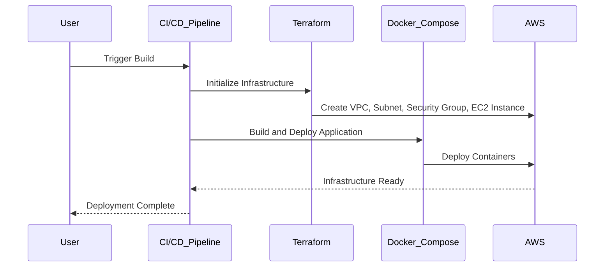

## Introduction to CI/CD Pipelines for EC2 Instance Deployment Using Terraform and Docker Compose

In this section, we will delve into the intricacies of setting up a Continuous Integration and Continuous Deployment (CI/CD) pipeline for deploying an application on an Amazon EC2 instance using Terraform and Docker Compose. We will cover the entire process, from initializing the infrastructure to tearing it down and redeploying it, ensuring that you understand the underlying mechanisms and potential pitfalls.

### What is CI/CD?

Continuous Integration (CI) and Continuous Deployment (CD) are practices that enable developers to integrate their code changes frequently into a shared repository, followed by automated testing and deployment. This ensures that the codebase remains stable and that new features can be rolled out quickly and reliably.

### Why Use Terraform and Docker Compose?

Terraform is an open-source infrastructure as code (IaC) tool that allows you to define and provision your infrastructure using declarative configuration files. Docker Compose is a tool for defining and running multi-container Docker applications. Together, these tools provide a powerful combination for managing and deploying complex applications.

### Setting Up the Infrastructure

To set up the infrastructure, we will use Terraform to define and manage the EC2 instance, security groups, VPC, and subnets. Here is an example of a Terraform configuration file (`main.tf`):

```hcl
provider "aws" {
  region = "us-west-2"
}

resource "aws_vpc" "example" {
  cidr_block = "10.0.0.0/16"
}

resource "aws_subnet" "example" {
  vpc_id     = aws_vpc.example.id
  cidr_block = "10.0.1.0/24"
}

resource "aws_security_group" "example" {
  name        = "example"
  description = "Allow HTTP traffic"
  vpc_id      = aws_vpc.example.id

  ingress {
    from_port   = 80
    to_port     = 80
    protocol    = "tcp"
    cidr_blocks = ["0.0.0.0/0"]
  }

  egress {
    from_port   = 0
    to_port     = 0
    protocol    = "-1"
    cidr_blocks = ["0.0.0.0/0"]
  }
}

resource "aws_instance" "example" {
  ami           = "ami-0c55b159cbfafe1f0"
  instance_type = "t2.micro"

  vpc_security_group_ids = [aws_security_group.example.id]
  subnet_id              = aws_subnet.example.id

  tags = {
    Name = "example-instance"
  }
}
```

### Deploying the Application with Docker Compose

Once the infrastructure is set up, we can use Docker Compose to deploy the application. Here is an example `docker-compose.yml` file:

```yaml
version: '3'
services:
  web:
    image: myapp:latest
    ports:
      - "80:80"
  db:
    image: postgres:latest
    environment:
      POSTGRES_PASSWORD: password
```

### Initializing the Infrastructure

To initialize the infrastructure, run the following commands:

```sh
terraform init
terraform apply
```

This will create the VPC, subnet, security group, and EC2 instance as defined in the Terraform configuration file.

### Building and Deploying the Application

Next, we need to build the Docker images and deploy the application. This can be done using Docker Compose:

```sh
docker-compose build
docker-compose up -d
```

### Tearing Down the Infrastructure

When we want to tear down the infrastructure, we can use the `terraform destroy` command. However, we need to ensure that there is at least one line in the script to avoid complaints. Here is an example of a script that performs the destruction:

```sh
#!/bin/bash
terraform destroy -auto-approve
echo "Infrastructure destroyed."
```

### Running the Script

To run the script, execute the following command:

```sh
./destroy_infrastructure.sh
```

### Checking the Logs

After running the script, we can check the logs to verify that the infrastructure has been destroyed. The logs should indicate that the Terraform destroy operation was successful and that all components, including the server, security group, VPC, and subnet, were removed.

### Rebuilding the Infrastructure

Now that the infrastructure has been torn down, we can rebuild it by running the initialization and deployment steps again:

```sh
terraform init
terraform apply
docker-compose build
docker-compose up -d
```

### Verifying the Deployment

To verify that the deployment was successful, we can check the AWS console to ensure that the server is running and that the security group, VPC, and subnet have been recreated. Additionally, we can SSH into the server and run `docker ps` to confirm that the containers are running.

### Example of a Full HTTP Request and Response

Here is an example of a full HTTP request and response when accessing the deployed application:

#### HTTP Request

```http
GET / HTTP/1.1
Host: <public-ip-address>
User-Agent: curl/7.64.1
Accept: */*
```

#### HTTP Response

```http
HTTP/1.1 200 OK
Date: Mon, 01 Jan 2024 00:00:00 GMT
Server: Apache/2.4.41 (Ubuntu)
Content-Type: text/html; charset=UTF-8
Content-Length: 1234
Connection: close

<!DOCTYPE html>
<html>
<head>
<title>Welcome</title>
</head>
<body>
<h1>Welcome to My App</h1>
</body>
</html>
```

### Mermaid Diagrams

#### Infrastructure Topology

```mermaid
graph TD
  A[EC2 Instance] --> B[VPC]
  A --> C[Subnet]
  A --> D[Security Group]
  E[Docker Container (Web)] --> A
  F[Docker Container (DB)] --> A
```

#### CI/CD Pipeline Flow



### Pitfalls and Best Practices

#### Common Mistakes

1. **Forgetting to Initialize Terraform**: Always run `terraform init` before applying changes.
2. **Incorrect Configuration Files**: Ensure that the Terraform and Docker Compose configuration files are correct and up-to-date.
3. **Security Group Rules**: Be cautious with security group rules to avoid exposing unnecessary ports.

#### How to Prevent / Defend

1. **Secure Key Management**: Use AWS Key Management Service (KMS) to securely manage keys.
2. **IAM Role Policies**: Define strict IAM role policies to limit access to resources.
3. **Regular Audits**: Perform regular audits of your infrastructure to identify and mitigate vulnerabilities.

### Real-World Examples

#### Recent CVEs and Breaches

- **CVE-2021-39296**: A vulnerability in Docker Compose that allowed unauthorized access to containers.
- **AWS RDS Data Exposure**: A breach where sensitive data was exposed due to misconfigured security groups.

### Secure Coding Fixes

#### Vulnerable Code

```yaml
version: '3'
services:
  web:
    image: myapp:latest
    ports:
      - "80:80"
  db:
    image: postgres:latest
    environment:
      POSTGRES_PASSWORD: password
```

#### Secure Code

```yaml
version: '3'
services:
  web:
    image: myapp:latest
    ports:
      - "80:80"
  db:
    image: postgres:latest
    environment:
      POSTGRES_PASSWORD: ${POSTGRES_PASSWORD}
```

### Configuration Hardening

#### AWS Security Group Configuration

```json
{
  "Version": "2012-10-17",
  "Statement": [
    {
      "Sid": "AllowHTTPAccess",
      "Effect": "Allow",
      "Action": "ec2:AuthorizeSecurityGroupIngress",
      "Resource": "arn:aws:ec2:*:*:security-group/*",
      "Condition": {
        "StringEquals": {
          "ec2:Protocol": "tcp",
          "ec2:FromPort": "80",
          "ec2:ToPort": "80"
        }
      }
    }
  ]
}
```

### Detection and Prevention

#### Detection

- **CloudTrail**: Use AWS CloudTrail to monitor API calls and detect unauthorized access.
- **VPC Flow Logs**: Enable VPC flow logs to track network traffic.

#### Prevention

- **Network ACLs**: Use Network ACLs to control traffic at the subnet level.
- **IAM Policies**: Implement strict IAM policies to limit access to resources.

### Practice Labs

For hands-on practice, consider the following labs:

- **PortSwigger Web Security Academy**
- **OWASP Juice Shop**
- **DVWA (Damn Vulnerable Web Application)**
- **WebGoat**

These labs provide a comprehensive environment to practice and reinforce the concepts covered in this chapter.

### Conclusion

By following the steps outlined in this chapter, you can effectively set up and manage a CI/CD pipeline for deploying an application on an Amazon EC2 instance using Terraform and Docker Compose. Understanding the underlying mechanisms and potential pitfalls will help you maintain a secure and reliable infrastructure.

---
<!-- nav -->
[[01-Introduction to CICD Pipeline for EC2 Instance Deployment Using Terraform and Docker-compose|Introduction to CICD Pipeline for EC2 Instance Deployment Using Terraform and Docker-compose]] | [[DevOps/DevOps Bootcamp/08-Infrastructure as Code (Terraform)/04-CICD Pipeline for EC2 Instance Deployment Using Terraform And Docker-compose/00-Overview|Overview]] | [[03-Introduction to CICD Pipelines for EC2 Instance Deployment Using Terraform and Docker-Compose|Introduction to CICD Pipelines for EC2 Instance Deployment Using Terraform and Docker-Compose]]
