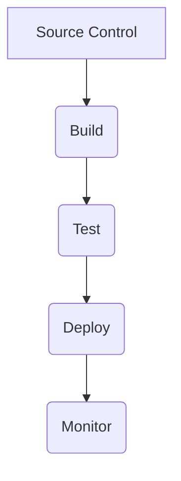
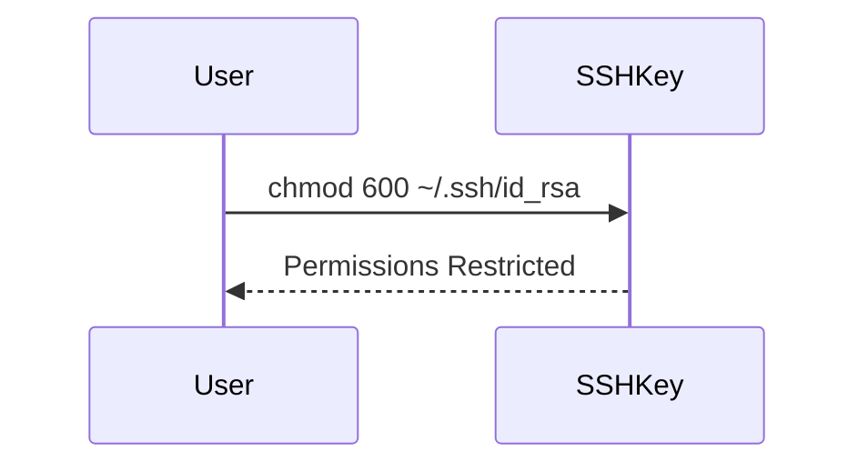

## Introduction to CI/CD Pipelines for EC2 Instance Deployment Using Terraform and Docker-Compose

In this section, we will delve deep into the process of setting up a Continuous Integration and Continuous Deployment (CI/CD) pipeline for deploying an application on an Amazon EC2 instance using Terraform and Docker-Compose. We will cover the entire workflow, including the deployment stages, SSH execution commands, Docker login issues, and security considerations. By the end of this chapter, you should have a comprehensive understanding of how to set up and troubleshoot such a pipeline.

### Background Theory

#### What is CI/CD?

Continuous Integration (CI) and Continuous Deployment (CD) are practices that enable developers to deliver code changes more frequently and reliably. CI involves automatically building and testing code changes as they are committed, while CD extends this by automatically deploying those changes to production.

#### Why Use CI/CD?

CI/CD helps teams deliver high-quality software faster by automating the build, test, and deployment processes. This reduces the chances of human error and ensures that the codebase remains stable and functional at all times.

#### How Does CI/CD Work?

A typical CI/CD pipeline consists of several stages:

1. **Source Control**: Code is stored in a version control system like Git.
2. **Build**: The code is compiled and built into executable artifacts.
3. **Test**: Automated tests are run to ensure the code works as expected.
4. **Deploy**: The artifacts are deployed to a staging or production environment.
5. **Monitor**: The deployed application is monitored for performance and errors.

### Setting Up the Pipeline

#### Tools Used

- **Jenkins**: A popular open-source automation server used for continuous integration and delivery.
- **Terraform**: An infrastructure as code (IAC) tool used to define and provision infrastructure.
- **Docker-Compose**: A tool for defining and running multi-container Docker applications.

#### Step-by-Step Setup

1. **Define Infrastructure with Terraform**:
   - Write Terraform configuration files to define the EC2 instances and other resources.
   - Example Terraform configuration:
     ```hcl
     provider "aws" {
       region = "us-west-2"
     }

     resource "aws_instance" "example" {
       ami           = "ami-0c55b159cbfafe1f0"
       instance_type = "t2.micro"

       tags = {
         Name = "example-instance"
       }
     }
     ```

2. **Configure Jenkins Pipeline**:
   - Define a Jenkinsfile to specify the pipeline stages.
   - Example Jenkinsfile:
     ```groovy
     pipeline {
       agent any
       stages {
         stage('Build') {
           steps {
             sh 'echo Building...'
           }
         }
         stage('Deploy') {
           steps {
             sh 'echo Deploying...'
             sshagent(credentials: ['ssh-key']) {
               sh 'scp docker-compose.yml server.sh ec2-user@<EC2_IP>:/home/ec2-user/'
               sh 'ssh ec2-user@<EC2_IP> "chmod +x server.sh && ./server.sh"'
             }
           }
         }
       }
     }
     ```

3. **SSH Execution Commands**:
   - Copy necessary files (e.g., `docker-compose.yml`, `server.sh`) to the EC2 instance.
   - Execute the `server.sh` script to start the Docker containers.

### Troubleshooting the Pipeline

#### SSH Key Permissions

When connecting to an EC2 instance via SSH, it is crucial to manage the permissions of the SSH key file (`id_rsa` or similar).

- **Why Restrict Permissions?**
  - Restricting permissions ensures that the SSH key cannot be accessed by unauthorized users, reducing the risk of unauthorized access to the EC2 instance.

- **How to Restrict Permissions?**
  - Change the file permissions using the `chmod` command:
    ```sh
    chmod 600 ~/.ssh/id_rsa
    ```
  - This sets the permissions to read/write for the owner only.

#### Docker Login Issue

When pulling images from a private Docker registry, you must authenticate using `docker login`.

- **Why Authenticate?**
  - Private registries require authentication to ensure that only authorized users can pull images. This prevents unauthorized access and potential security risks.

- **How to Authenticate?**
  - Run the `docker login` command with the appropriate credentials:
    ```sh
    docker login <registry-url>
    ```
  - Example:
    ```sh
    docker login my-private-registry.com
    ```

### Full Example

Let's walk through a complete example of setting up and troubleshooting the pipeline.

#### Terraform Configuration

```hcl
provider "aws" {
  region = "us-west-2"
}

resource "aws_instance" "example" {
  ami           = "ami-0c55b159cbfafe1f0"
  instance_type = "t2.micro"

  tags = {
    Name = "example-instance"
  }
}
```

#### Jenkinsfile

```groovy
pipeline {
  agent any
  stages {
    stage('Build') {
      steps {
        sh 'echo Building...'
      }
    }
    stage('Deploy') {
      steps {
        sh 'echo Deploying...'
        sshagent(credentials: ['ssh-key']) {
          sh 'scp docker-compose.yml server.sh ec2-user@<EC2_IP>:/home/ec2-user/'
          sh 'ssh ec2-user@<EC2_IP> "chmod +x server.sh && ./server.sh"'
        }
      }
    }
  }
}
```

#### SSH Key Management

```sh
chmod 600 ~/.ssh/id_rsa
```

#### Docker Login

```sh
docker login my-private-registry.com
```

### Common Pitfalls and Solutions

#### Pitfall: Incorrect SSH Key Permissions

- **Symptom**: SSH connection fails due to incorrect key permissions.
- **Solution**: Ensure the SSH key has the correct permissions using `chmod 600`.

#### Pitfall: Unauthorized Access to Private Registry

- **Symptom**: Unable to pull images from a private registry.
- **Solution**: Ensure you have authenticated using `docker login`.

### How to Prevent / Defend

#### Detection

- **Log Monitoring**: Monitor Jenkins logs and EC2 instance logs for any errors or unauthorized access attempts.
- **Security Audits**: Regularly audit the pipeline configurations and infrastructure for vulnerabilities.

#### Prevention

- **Secure SSH Keys**: Always restrict SSH key permissions and store them securely.
- **Use Secure Credentials**: Store sensitive information like Docker registry credentials securely using Jenkins credentials management.

#### Secure Coding Fixes

##### Vulnerable Code

```groovy
pipeline {
  agent any
  stages {
    stage('Deploy') {
      steps {
        sh 'scp docker-compose.yml server.sh ec2-user@<EC2_IP>:/home/ec2-user/'
        sh 'ssh ec2-user@<EC2_IP> "chmod +x server.sh && ./server.sh"'
      }
    }
  }
}
```

##### Fixed Code

```groovy
pipeline {
  agent any
  stages {
    stage('Deploy') {
      steps {
        sshagent(credentials: ['ssh-key']) {
          sh 'scp docker-compose.yml server.sh ec2-user@<EC2_IP>:/home/ec2-user/'
          sh 'ssh ec2-user@<EC2_IP> "chmod +x server.sh && ./server.sh"'
        }
      }
    }
  }
}
```

### Real-World Examples

#### Recent Breaches

- **Example**: In 2021, a major breach occurred due to misconfigured Jenkins pipelines that allowed unauthorized access to private repositories. This highlights the importance of securing SSH keys and Docker registry credentials.

### Diagrams

#### Mermaid Diagram: CI/CD Pipeline Flow



#### Mermaid Diagram: SSH Key Management



### Conclusion

By following the detailed steps and understanding the underlying concepts, you can effectively set up and troubleshoot a CI/CD pipeline for deploying applications on EC2 instances using Terraform and Docker-Compose. Remember to always prioritize security by managing SSH keys and Docker registry credentials properly.

### Practice Labs

For hands-on practice, consider the following labs:

- **PortSwigger Web Security Academy**: Focuses on web application security but also covers CI/CD pipelines.
- **OWASP Juice Shop**: A deliberately insecure web application for learning about web security.
- **DVWA (Damn Vulnerable Web Application)**: Another web application for practicing web security techniques.

These labs provide practical experience in setting up and securing CI/CD pipelines.

---
<!-- nav -->
[[02-Introduction to CICD Pipelines for EC2 Instance Deployment Using Terraform and Docker Compose|Introduction to CICD Pipelines for EC2 Instance Deployment Using Terraform and Docker Compose]] | [[DevOps/DevOps Bootcamp/08-Infrastructure as Code (Terraform)/04-CICD Pipeline for EC2 Instance Deployment Using Terraform And Docker-compose/00-Overview|Overview]] | [[04-Continuous Integration and Continuous Deployment (CICD) Pipeline for EC2 Instance Deployment Using Terraform and Docker-Compose|Continuous Integration and Continuous Deployment (CICD) Pipeline for EC2 Instance Deployment Using Terraform and Docker-Compose]]
