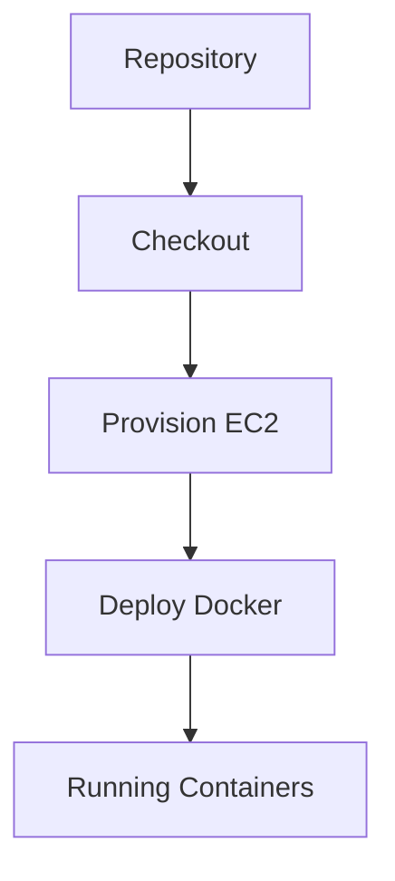
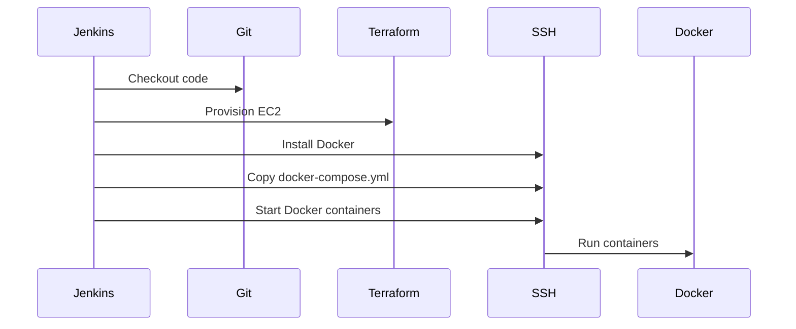

## Continuous Integration and Continuous Deployment (CI/CD) Pipeline for EC2 Instance Deployment Using Terraform and Docker-Compose

### Introduction to CI/CD Pipelines

Continuous Integration and Continuous Deployment (CI/CD) pipelines are automated workflows that help teams deliver code changes more frequently and reliably. These pipelines integrate development and operations by automating the testing and deployment process. In this context, we will focus on setting up a CI/CD pipeline to deploy an EC2 instance using Terraform and Docker-Compose.

### Prerequisites

Before diving into the setup, ensure you have the following tools and services installed and configured:

1. **AWS CLI**: Install and configure the AWS Command Line Interface (CLI) to interact with your AWS account.
2. **Terraform**: Install Terraform, a tool for building, changing, and combining infrastructure safely and efficiently.
3. **Jenkins**: Set up Jenkins, an open-source automation server, to manage the CI/CD pipeline.
4. **Docker**: Ensure Docker is installed on your local machine and the target EC2 instance.
5. **Docker-Compose**: Install Docker-Compose to manage multi-container Docker applications.

### Setting Up the CI/CD Pipeline

#### Step 1: Define the Infrastructure with Terraform

Terraform is used to define and provision the infrastructure. Below is an example of a Terraform configuration file (`main.tf`) that sets up an EC2 instance in the `us-east-1` region.

```hcl
provider "aws" {
  region = "us-east-1"
}

resource "aws_instance" "example" {
  ami           = "ami-0c55b159cbfafe1f0"
  instance_type = "t2.micro"

  tags = {
    Name = "example-instance"
  }
}
```

This configuration defines an AWS provider and creates an EC2 instance with the specified AMI and instance type. The `tags` block adds a name tag to the instance.

#### Step 2: Initialize and Apply Terraform Configuration

To initialize and apply the Terraform configuration, run the following commands:

```sh
terraform init
terraform apply
```

The `terraform init` command initializes the working directory, downloading necessary plugins and modules. The `terraform apply` command applies the configuration, creating the EC2 instance.

#### Step 3: Configure Jenkins Pipeline

Next, we need to set up a Jenkins pipeline to automate the deployment process. Below is an example of a Jenkinsfile that defines the pipeline stages.

```groovy
pipeline {
    agent any

    stages {
        stage('Checkout') {
            steps {
                git branch: 'master', url: 'https://github.com/your-repo.git'
            }
        }

        stage('Provision EC2') {
            steps {
                script {
                    sh 'terraform init'
                    sh 'terraform apply -auto-approve'
                }
            }
        }

        stage('Deploy Docker') {
            steps {
                script {
                    sshagent(credentials: ['ssh-key']) {
                        sh 'ssh -o StrictHostKeyChecking=no ubuntu@<EC2_IP> "sudo apt-get update && sudo apt-get install -y docker.io docker-compose"'
                        sh 'scp docker-compose.yml ubuntu@<EC2_IP>:~/docker-compose.yml'
                        sh 'ssh -o StrictHostKeyChecking=no ubuntu@<EC2_IP> "docker-compose up -d"'
                    }
                }
            }
        }
    }
}
```

This Jenkinsfile defines three stages: `Checkout`, `Provision EC2`, and `Deploy Docker`. The `Checkout` stage checks out the code from the repository. The `Provision EC2` stage initializes and applies the Terraform configuration. The `Deploy Docker` stage uses SSH to install Docker and Docker-Compose on the EC2 instance, copies the `docker-compose.yml` file, and starts the Docker containers.

### Detailed Explanation of Each Stage

#### Checkout Stage

The `Checkout` stage checks out the code from the repository. This ensures that the latest code is available for the subsequent stages.

```groovy
stage('Checkout') {
    steps {
        git branch: 'master', url: 'https://github.com/your-repo.git'
    }
}
```

#### Provision EC2 Stage

The `Provision EC2` stage initializes and applies the Terraform configuration. This stage creates the EC2 instance and sets up the necessary infrastructure.

```groovy
stage('Provision EC2') {
    steps {
        script {
            sh 'terraform init'
            sh 'terraform apply -auto-approve'
        }
    }
}
```

#### Deploy Docker Stage

The `Deploy Docker` stage uses SSH to install Docker and Docker-Compose on the EC2 instance, copies the `docker-compose.yml` file, and starts the Docker containers.

```groovy
stage('Deploy Docker') {
    steps {
        script {
            sshagent(credentials: ['ssh-key']) {
                sh 'ssh -o StrictHostKeyChecking=no ubuntu@<EC2_IP> "sudo apt-get update && sudo apt-get install -y docker.io docker-compose"'
                sh 'scp docker-compose.yml ubuntu@<EC2_IP>:~/docker-compose.yml'
                sh 'ssh -o StrictHostKeyChecking=no ubuntu@<EC2_IP> "docker-compose up -d"'
            }
        }
    }
}
```

### Common Pitfalls and How to Prevent Them

#### SSH Key Management

Ensure that the SSH key used for accessing the EC2 instance is securely managed. Store the key in a secure location and limit access to it.

**Secure Code Fix:**

```groovy
sshagent(credentials: ['ssh-key']) {
    sh 'ssh -o StrictHostKeyChecking=no ubuntu@<EC2_IP> "sudo apt-get update && sudo apt-get install -y docker.io docker-compose"'
    sh 'scp docker-compose.yml ubuntu@<EC2_IP>:~/docker-compose.yml'
    sh 'ssh -o StrictHostKeyChecking=no ubuntu@<EC2_IP> "docker-compose up -d"'
}
```

#### Vulnerable Docker Images

Use trusted and verified Docker images to avoid vulnerabilities. Regularly update the images to patch known vulnerabilities.

**Secure Code Fix:**

```yaml
version: '3'
services:
  web:
    image: 'nginx:latest'
    ports:
      - '80:80'
```

### Real-World Examples and Recent Breaches

#### Example: Docker Hub Breach

In 2021, Docker Hub experienced a breach where unauthorized users gained access to private repositories. This highlights the importance of securing Docker images and using trusted sources.

**Secure Code Fix:**

```yaml
version: '3'
services:
  web:
    image: 'nginx:latest'
    ports:
      - '80:80'
```

### Mermaid Diagrams

#### CI/CD Pipeline Architecture

Below is a mermaid diagram illustrating the architecture of the CI/CD pipeline.



#### Sequence Diagram

Below is a mermaid sequence diagram illustrating the sequence of events in the CI/CD pipeline.



### Hands-On Labs

#### PortSwigger Web Security Academy

PortSwigger Web Security Academy offers a series of labs that cover various aspects of web application security. While not directly related to CI/CD pipelines, these labs provide valuable insights into securing web applications.

#### OWASP Juice Shop

OWASP Juice Shop is an intentionally insecure web application designed for security training. While not directly related to CI/CD pipelines, it provides a practical environment to practice securing web applications.

### Conclusion

Setting up a CI/CD pipeline for deploying an EC2 instance using Terraform and Docker-Compose requires careful planning and execution. By following the steps outlined above and being aware of common pitfalls, you can ensure a secure and reliable deployment process.

---
<!-- nav -->
[[03-Introduction to CICD Pipelines for EC2 Instance Deployment Using Terraform and Docker-Compose|Introduction to CICD Pipelines for EC2 Instance Deployment Using Terraform and Docker-Compose]] | [[DevOps/DevOps Bootcamp/08-Infrastructure as Code (Terraform)/04-CICD Pipeline for EC2 Instance Deployment Using Terraform And Docker-compose/00-Overview|Overview]] | [[05-Credentials Management in Jenkins|Credentials Management in Jenkins]]
