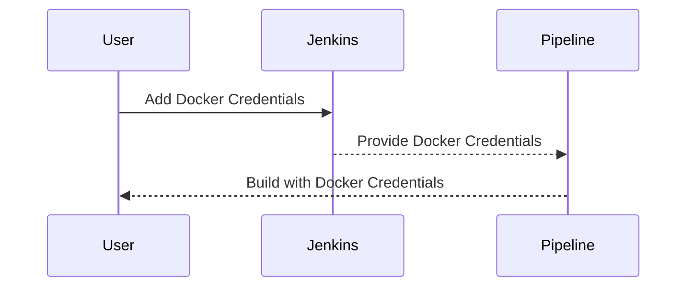

## Credentials Management in Jenkins

Jenkins provides robust mechanisms for managing credentials, ensuring that sensitive information like Docker usernames and passwords are securely stored and accessed.

### Why Manage Credentials in Jenkins?

Credentials management helps in:

1. **Centralized Storage**: Store credentials in a centralized location accessible across multiple jobs.
2. **Secure Storage**: Encrypt credentials to prevent unauthorized access.
3. **Access Control**: Define who can view or use specific credentials.

### How to Manage Credentials in Jenkins

1. **Adding Credentials**:
   - Navigate to `Manage Jenkins` > `Manage Credentials`.
   - Click on `Global credentials (unrestricted)` or `System`.
   - Click `Add Credentials`.
   - Choose the type of credential (e.g., `Username with password` for Docker credentials).
   - Enter the username and password.

2. **Using Credentials in Jenkinsfile**:
   - Use the `withCredentials` step to access credentials within a pipeline.

### Example Jenkinsfile

Here’s an example Jenkinsfile that uses Docker credentials:

```groovy
pipeline {
    agent any

    environment {
        DOCKER_CREDENTIALS = credentials('docker-credentials-id')
    }

    stages {
        stage('Build') {
            steps {
                script {
                    def dockerCreds = env.DOCKER_CREDENTIALS.split(':')
                    def dockerUser = dockerCreds[0]
                    def dockerPassword = dockerCreds[1]

                    sh """
                        echo "Docker User: ${dockerUser}"
                        echo "Docker Password: ${dockerPassword}"
                    """
                }
            }
        }
    }
}
```

### Explanation

- **Environment Block**: The `environment` block sets up environment variables that can be used throughout the pipeline.
- **withCredentials Step**: The `withCredentials` step securely passes credentials to the build process.
- **Splitting Credentials**: The credentials are split into `username` and `password`.

### Real-World Example: CVE-2021-25285

CVE-2021-25285 is a critical vulnerability in Jenkins that allows attackers to bypass authentication and gain unauthorized access to Jenkins credentials. This highlights the importance of keeping Jenkins updated and properly securing credentials.

### How to Prevent / Defend

1. **Update Jenkins**: Regularly update Jenkins to the latest version to patch known vulnerabilities.
2. **Secure Credentials**: Ensure credentials are stored securely and access is restricted.
3. **Audit Logs**: Enable audit logs to monitor access to credentials.

### Secure Code Fix

#### Vulnerable Code

```groovy
pipeline {
    agent any

    environment {
        DOCKER_USER = 'my-docker-user'
        DOCKER_PASSWORD = 'my-docker-password'
    }

    stages {
        stage('Build') {
            steps {
                sh """
                    echo "Docker User: ${env.DOCKER_USER}"
                    echo "Docker Password: ${env.DOCKER_PASSWORD}"
                """
            }
        }
    }
}
```

#### Fixed Code

```groovy
pipeline {
    agent any

    environment {
        DOCKER_CREDENTIALS = credentials('docker-credentials-id')
    }

    stages {
        stage('Build') {
            steps {
                script {
                    def dockerCreds = env.DOCKER_CREDENTIALS.split(':')
                    def dockerUser = dockerCcrets[0]
                    def dockerPassword = dockerCreds[1]

                    sh """
                        echo "Docker User: ${dockerUser}"
                        echo "Docker Password: ${dockerPassword}"
                    """
                }
            }
        }
    }
}
```

### Mermaid Diagram: Jenkins Credentials Flow



### Hands-On Lab Suggestions

For hands-on practice with Jenkins and credentials management, consider the following labs:

- **PortSwigger Web Security Academy**: Offers a variety of labs related to web application security, including some that touch on Jenkins security.
- **OWASP Juice Shop**: A deliberately insecure web application for security training.
- **CloudGoat**: Provides a series of labs focused on AWS security, including Jenkins setup and management.

By thoroughly understanding and implementing these concepts, you can ensure that your CI/CD pipelines are both efficient and secure.

---
<!-- nav -->
[[04-Continuous Integration and Continuous Deployment (CICD) Pipeline for EC2 Instance Deployment Using Terraform and Docker-Compose|Continuous Integration and Continuous Deployment (CICD) Pipeline for EC2 Instance Deployment Using Terraform and Docker-Compose]] | [[DevOps/DevOps Bootcamp/08-Infrastructure as Code (Terraform)/04-CICD Pipeline for EC2 Instance Deployment Using Terraform And Docker-compose/00-Overview|Overview]] | [[06-Extracting Credentials with Username and Password|Extracting Credentials with Username and Password]]
