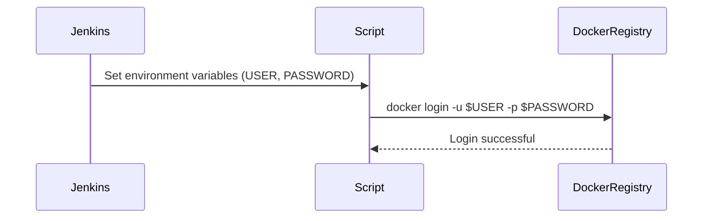
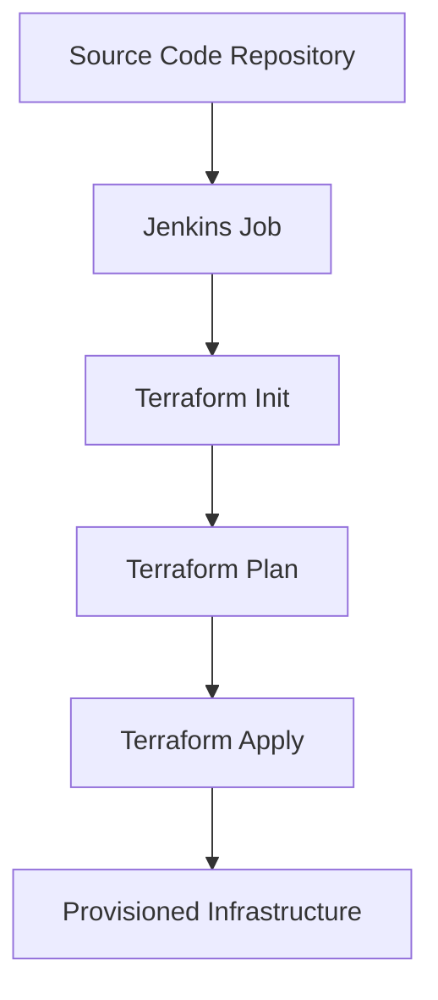

## Extracting Credentials with Username and Password

When working with credentials such as usernames and passwords, it is crucial to handle them securely and efficiently within your CI/CD pipelines. This section will delve into how to manage these credentials effectively using environment variables, specifically focusing on the context of Docker and Jenkins.

### Environment Variables for Credentials

Environment variables are a convenient way to pass sensitive information like usernames and passwords into scripts and applications. In the context of Docker and Jenkins, these environment variables can be used to store and retrieve credentials securely.

#### Setting Up Environment Variables

When you define a credential in Jenkins, it automatically sets up environment variables prefixed with `USER` and `PASSWORD`. For example, if you define a credential named `DOCKER_CREDENTIALS`, Jenkins will create two environment variables:

- `DOCKER_CREDENTIALS_USER`
- `DOCKER_CREDENTIALS_PSW`

These variables can then be used in your scripts to authenticate with Docker registries or other services.

```bash
# Example of setting environment variables in Jenkins
export DOCKER_CREDENTIALS_USER="your_username"
export DOCKER_CREDENTIALS_PSW="your_password"
```

### Using Environment Variables in Scripts

Once the environment variables are set, you can use them in your scripts to perform actions that require authentication. For instance, you might want to log in to a Docker registry using these credentials.

```bash
# Example of using environment variables in a script
docker login -u $DOCKER_CREDENTIALS_USER -p $DOCKER_CREDENTIALS_PSW
```

### Handling Credentials Securely

It is essential to handle credentials securely to prevent unauthorized access. Here are some best practices:

1. **Use Secret Management Tools**: Tools like HashiCorp Vault or AWS Secrets Manager can help manage and rotate secrets securely.
2. **Limit Exposure**: Ensure that credentials are only exposed in the necessary parts of your pipeline and are not logged or stored in plaintext.
3. **Use Strong Authentication Mechanisms**: Always use strong, unique passwords and consider using multi-factor authentication (MFA).

### Real-World Examples

#### Recent Breaches and CVEs

One notable breach involving mismanaged credentials was the Capital One data breach in 2019 (CVE-2019-11253). The attacker exploited a misconfigured web application firewall to gain access to sensitive data. This highlights the importance of securing credentials and ensuring proper access controls.

### Mermaid Diagrams

Let's visualize the process of setting up and using environment variables for credentials in a CI/CD pipeline.



### Common Pitfalls

- **Hardcoding Credentials**: Never hardcode credentials in your scripts or configuration files. This exposes them to unauthorized access.
- **Insecure Storage**: Storing credentials in plaintext or unsecured locations can lead to data breaches.
- **Insufficient Access Controls**: Ensure that credentials are only accessible to authorized users and processes.

### How to Prevent / Defend

#### Detection

- **Audit Logs**: Regularly review audit logs to detect unauthorized access attempts.
- **Security Scanning**: Use tools like TruffleHog to scan for hardcoded credentials in your codebase.

#### Prevention

- **Use Secret Management Tools**: Implement tools like HashiCorp Vault or AWS Secrets Manager to manage and rotate secrets securely.
- **Secure Configuration**: Ensure that your CI/CD pipeline configurations are secure and follow best practices for handling credentials.

#### Secure Coding Fixes

Here is an example of how to securely handle credentials in a script:

**Vulnerable Code:**
```bash
docker login -u my_username -p my_password
```

**Secure Code:**
```bash
export DOCKER_USERNAME="my_username"
export DOCKER_PASSWORD="my_password"
docker login -u $DOCKER_USERNAME -p $DOCKER_PASSWORD
```

### Integrating Terraform into CI/CD Pipelines

Now that we have covered how to handle credentials securely, let's discuss integrating Terraform into your CI/CD pipeline to provision and manage infrastructure.

### Terraform Basics

Terraform is an infrastructure as code (IaC) tool that allows you to define and provision infrastructure using declarative configuration files. These files describe the desired state of your infrastructure, and Terraform ensures that the actual state matches the desired state.

#### Terraform Workflow

The typical workflow for using Terraform includes the following steps:

1. **Define Infrastructure**: Write Terraform configuration files (`.tf`) to define your infrastructure.
2. **Initialize Terraform**: Run `terraform init` to initialize the working directory and download any required plugins.
3. **Plan Changes**: Run `terraform plan` to preview the changes that will be made to your infrastructure.
4. **Apply Changes**: Run `terraform apply` to apply the changes and provision the infrastructure.

### Example Terraform Configuration

Here is an example of a Terraform configuration file to create an EC2 instance:

```hcl
provider "aws" {
  region = "us-west-2"
}

resource "aws_instance" "example" {
  ami           = "ami-0c55b159cbfafe1f0"
  instance_type = "t2.micro"

  tags = {
    Name = "example-instance"
  }
}
```

### Integrating Terraform with Jenkins

To integrate Terraform with Jenkins, you can use Jenkins jobs to automate the Terraform workflow. Here is an example of how to set up a Jenkins job to run Terraform commands:

1. **Install Terraform Plugin**: Install the Terraform plugin in Jenkins to enable Terraform support.
2. **Create Jenkins Job**: Create a new Jenkins job and configure it to run Terraform commands.

#### Jenkins Job Configuration

1. **Source Code Management**: Configure the source code management section to point to your Terraform configuration repository.
2. **Build Steps**: Add build steps to run Terraform commands.

```yaml
pipeline {
    agent any
    stages {
        stage('Initialize Terraform') {
            steps {
                sh 'terraform init'
            }
        }
        stage('Plan Terraform') {
            steps {
                sh 'terraform plan'
            }
        }
        stage('Apply Terraform') {
            steps {
                sh 'terraform apply -auto-approve'
            }
        }
    }
}
```

### Mermaid Diagrams

Let's visualize the integration of Terraform into a CI/CD pipeline.



### Common Pitfalls

- **Manual Intervention**: Avoid manual intervention in the Terraform workflow. Automate as much as possible to ensure consistency and reduce errors.
- **State Management**: Properly manage Terraform state to avoid conflicts and ensure that the actual state matches the desired state.
- **Security**: Ensure that Terraform configurations are secure and follow best practices for handling credentials and sensitive data.

### How to Prevent / Defend

#### Detection

- **Regular Audits**: Regularly audit your Terraform configurations to detect and fix issues.
- **Security Scanning**: Use tools like Checkov to scan Terraform configurations for security vulnerabilities.

#### Prevention

- **Use Version Control**: Store Terraform configurations in version control to track changes and collaborate effectively.
- **Automate Testing**: Automate testing of Terraform configurations to catch issues early.

#### Secure Coding Fixes

Here is an example of how to securely handle credentials in a Terraform configuration:

**Vulnerable Code:**
```hcl
resource "aws_instance" "example" {
  ami           = "ami-0c55b159cbfafe1f0"
  instance_type = "t2.micro"
  key_name      = "my_key_pair"
}
```

**Secure Code:**
```hcl
variable "key_name" {
  description = "Name of the key pair to use for the instance"
}

resource "aws_instance" "example" {
  ami           = "ami-0c55b159cbfafe1f0"
  instance_type = "t2.micro"
  key_name      = var.key_name
}
```

### Hands-On Labs

For hands-on practice with integrating Terraform into CI/CD pipelines, consider the following resources:

- **PortSwigger Web Security Academy**: Offers practical exercises for web application security.
- **OWASP Juice Shop**: A deliberately insecure web application for practicing security skills.
- **DVWA (Damn Vulnerable Web Application)**: Another resource for practicing web application security.
- **Kubernetes Goat**: A platform for learning Kubernetes security.
- **AWS Official Workshops**: Provides guided labs for learning AWS services, including Terraform integration.

By following these guidelines and best practices, you can effectively manage credentials and integrate Terraform into your CI/CD pipelines to provision and manage infrastructure securely and efficiently.

---
<!-- nav -->
[[05-Credentials Management in Jenkins|Credentials Management in Jenkins]] | [[DevOps/DevOps Bootcamp/08-Infrastructure as Code (Terraform)/04-CICD Pipeline for EC2 Instance Deployment Using Terraform And Docker-compose/00-Overview|Overview]] | [[07-Infrastructure as Code (IaC) and Continuous IntegrationContinuous Deployment (CICD)|Infrastructure as Code (IaC) and Continuous IntegrationContinuous Deployment (CICD)]]
