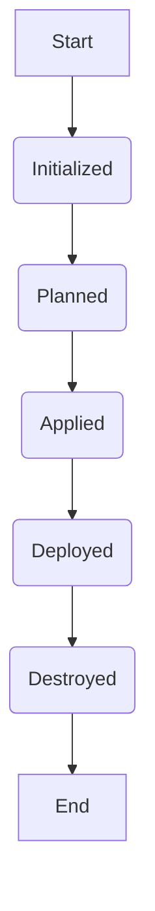
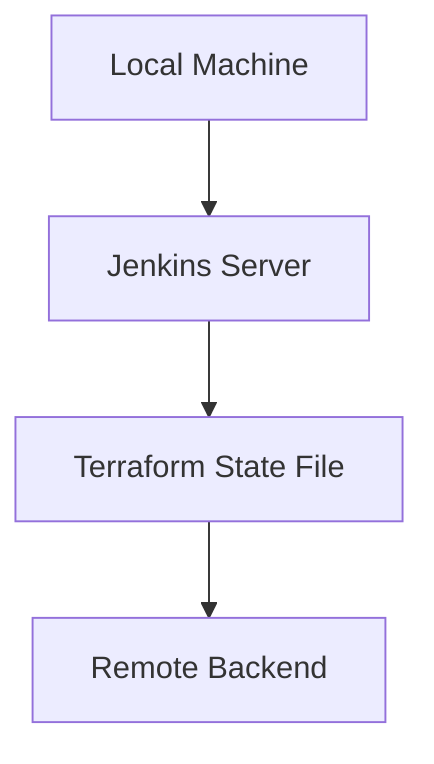

## Infrastructure as Code (IaC) and Continuous Integration/Continuous Deployment (CI/CD)

### Introduction to IaC and CI/CD

Infrastructure as Code (IaC) is a practice where infrastructure is defined using code rather than physical hardware configurations. This allows for automation, consistency, and version control of infrastructure changes. Tools like Terraform and Ansible are commonly used for IaC.

Continuous Integration/Continuous Deployment (CI/CD) is a set of practices for the reliable release of software in short cycles. This ensures that the application is always in a deployable state. In this context, we will focus on deploying an EC2 instance using Terraform and Docker-compose within a CI/CD pipeline.

### Setting Up the Environment

Before diving into the specifics of the pipeline, let's set up the environment:

1. **Terraform**: A tool for building, changing, and combining infrastructure safely and efficiently.
2. **Docker-compose**: A tool for defining and running multi-container Docker applications.
3. **Jenkins**: An open-source automation server that provides pipelines for automating the building, testing, and deployment of software.

#### Installing Terraform

To install Terraform, follow these steps:

1. Download the latest version of Terraform from the official website.
2. Extract the downloaded package.
3. Add the extracted directory to your system's PATH.

```bash
# Example for Linux
wget https://releases.hashicorp.com/terraform/1.0.0/terraform_1.0.0_linux_amd64.zip
unzip terraform_1.0.0_linux_amd64.zip
sudo mv terraform /usr/local/bin/
```

#### Installing Docker-compose

To install Docker-compose, follow these steps:

1. Download the latest version of Docker-compose from the official website.
2. Make the binary executable.
3. Move the binary to a directory in your system's PATH.

```bash
# Example for Linux
sudo curl -L "https://github.com/docker/compose/releases/download/1.29.2/docker-compose-$(uname -s)-$(uname -m)" -o /usr/local/bin/docker-compose
sudo chmod +x /usr/local/bin/docker-compose
```

#### Setting Up Jenkins

To set up Jenkins, follow these steps:

1. Install Jenkins using your package manager.
2. Start the Jenkins service.
3. Access Jenkins through your browser at `http://localhost:8080`.

```bash
# Example for Ubuntu
sudo apt update
sudo apt install jenkins
sudo systemctl start jenkins
sudo systemctl enable jenkins
```

### Creating the Terraform Configuration

Let's create a basic Terraform configuration to provision an EC2 instance along with necessary resources like VPC and Subnet.

#### Directory Structure

```
terraform/
├── main.tf
├── variables.tf
└── outputs.tf
```

#### `main.tf`

This file defines the resources to be created.

```hcl
provider "aws" {
  region = var.region
}

resource "aws_vpc" "example" {
  cidr_block = "10.0.0.0/16"
}

resource "aws_subnet" "example" {
  vpc_id     = aws_vpc.example.id
  cidr_block = "10.0.1.0/24"
}

resource "aws_instance" "example" {
  ami           = "ami-0c55b159cbfafe1f0"
  instance_type = "t2.micro"

  subnet_id = aws_subnet.example.id
}
```

#### `variables.tf`

This file defines the input variables.

```hcl
variable "region" {
  description = "The AWS region to deploy to."
  default     = "us-west-2"
}
```

#### `outputs.tf`

This file defines the output values.

```hcl
output "instance_public_ip" {
  value = aws_instance.example.public_ip
}
```

### Initializing Terraform

To initialize Terraform, run the following command:

```bash
cd terraform
terraform init
```

This command downloads the necessary providers and initializes the state.

### Running Terraform Plan

To see the planned changes, run:

```bash
terraform plan
```

This command shows the resources that will be created or modified.

### Running Terraform Apply

To apply the changes, run:

```bash
terraform apply
```

This command creates the resources defined in the configuration.

### Integrating with Jenkins

Now, let's integrate this Terraform configuration with Jenkins to automate the process.

#### Jenkinsfile

Create a `Jenkinsfile` in the root of your project.

```groovy
pipeline {
    agent any

    stages {
        stage('Initialize') {
            steps {
                script {
                    sh 'cd terraform && terraform init'
                }
            }
        }

        stage('Plan') {
            steps {
                script {
                    sh 'cd terraform && terraform plan'
                }
            }
        }

        stage('Apply') {
            steps {
                script {
                    sh 'cd terraform && terraform apply -auto-approve'
                }
            }
        }

        stage('Deploy') {
            steps {
                script {
                    sh 'docker-compose up -d'
                }
            }
        }
    }
}
```

### Running the Pipeline

To run the pipeline, configure a new job in Jenkins and specify the `Jenkinsfile` location.

### Destroying the Infrastructure

To destroy the infrastructure, run:

```bash
terraform destroy -auto-approve
```

This command deletes all the resources created by Terraform.

### Handling State Management

State management is crucial in Terraform to avoid conflicts and ensure consistency. By default, Terraform stores the state in a local file named `terraform.tfstate`. However, in a CI/CD pipeline, it's better to store the state in a remote backend.

#### Configuring Remote Backend

Add the following to your `main.tf`:

```hcl
terraform {
  backend "s3" {
    bucket = "my-tf-state-bucket"
    key    = "terraform.tfstate"
    region = "us-west-2"
  }
}
```

Run the following commands to initialize the backend:

```bash
terraform init \
  -backend-config="bucket=my-tf-state-bucket" \
  -backend-config="key=terraform.tfstate" \
  -backend-config="region=us-west-2"
```

### Handling Local State Issues

If you encounter issues with local state, you can use Jenkins to manage the state. This ensures that the state is consistent across different environments.

#### Adjusting Jenkins Pipeline

Modify the `Jenkinsfile` to include state management:

```groovy
pipeline {
    agent any

    environment {
        TF_VAR_region = 'us-west-2'
    }

    stages {
        stage('Initialize') {
            steps {
                script {
                    sh 'cd terraform && terraform init -backend-config="bucket=my-tf-state-bucket" -backend-config="key=.terraform.tfstate" -backend-config="region=${TF_VAR_region}"'
                }
            }
        }

        stage('Plan') {
            steps {
                script {
                    sh 'cd terraform && terraform plan'
                }
            }
        }

        stage('Apply') {
            steps {
                script {
                    sh 'cd terraform && terraform apply -auto-approve'
                }
            }
        }

        stage('Deploy') {
            steps {
                script {
                    sh 'docker-compose up -d'
                }
            }
        }

        stage('Destroy') {
            steps {
                script {
                    sh 'cd terraform && terraform destroy -auto-approve'
                }
            }
        }
    }
}
```

### Real-World Examples and Pitfalls

#### Real-World Example: CVE-2021-21277

In 2021, a critical vulnerability was found in Terraform's state management. This vulnerability allowed attackers to manipulate the state file and potentially gain unauthorized access to resources.

**Impact**: Unauthorized access to resources.

**Mitigation**: Ensure that the state file is stored securely and access is restricted.

#### Pitfall: Manual State Management

Manual state management can lead to inconsistencies and conflicts. Always use a remote backend for state management.

### How to Prevent / Defend

#### Detection

Regularly audit the state file to ensure it hasn't been tampered with. Use tools like `terraform state pull` to inspect the state.

#### Prevention

1. **Secure State Storage**: Store the state in a secure remote backend.
2. **Access Control**: Restrict access to the state file and backend.
3. **Automate State Management**: Use CI/CD pipelines to manage the state automatically.

#### Secure Coding Fixes

Compare the vulnerable and secure versions of the `Jenkinsfile`:

**Vulnerable Version**:

```groovy
pipeline {
    agent any

    stages {
        stage('Initialize') {
            steps {
                script {
                    sh 'cd terraform && terraform init'
                }
            }
        }

        stage('Plan') {
            steps {
                script {
                    sh 'cd terraform && terraform plan'
                }
            }
        }

        stage('Apply') {
            steps {
                script {
                    sh 'cd terraform && terraform apply -auto-approve'
                }
            }
        }

        stage('Deploy') {
            steps {
                script {
                    sh 'docker-compose up -d'
                }
            }
        }
    }
}
```

**Secure Version**:

```groovy
pipeline {
    agent any

    environment {
        TF_VAR_region = 'us-west-2'
    }

    stages {
        stage('Initialize') {
            steps {
                script {
                    sh 'cd terraform && terraform init -backend-config="bucket=my-tf-state-bucket" -backend-config="key=.terraform.tfstate" -backend-config="region=${TF_VAR_region}"'
                }
            }
        }

        stage('Plan') {
            steps {
                script {
                    sh 'cd terraform && terraform plan'
                }
            }
        }

        stage('Apply') {
            steps {
                script {
                    sh 'cd terraform && terraform apply -auto-approve'
                }
            }
        }

        stage('Deploy') {
            steps {
                script {
                    sh 'docker-compose up -d'
                }
            }
        }

        stage('Destroy') {
            steps {
                script {
                    sh 'cd terraform && terraform destroy -auto-approve'
                }
            }
        }
    }
}
```

### Diagrams

#### Mermaid Diagram: CI/CD Pipeline



#### Mermaid Diagram: Terraform State Management



### Practice Labs

For hands-on experience, consider the following labs:

- **PortSwigger Web Security Academy**: Focuses on web application security.
- **OWASP Juice Shop**: A deliberately insecure web application for security training.
- **DVWA (Damn Vulnerable Web Application)**: A PHP/MySQL web application that is riddled with vulnerabilities.
- **WebGoat**: An interactive, gamified training application for learning about web application security.

These labs provide practical experience in setting up and managing CI/CD pipelines with Terraform and Docker-compose.

By following these detailed steps and explanations, you can effectively set up and manage a CI/CD pipeline for deploying an EC2 instance using Terraform and Docker-compose.

---
<!-- nav -->
[[06-Extracting Credentials with Username and Password|Extracting Credentials with Username and Password]] | [[DevOps/DevOps Bootcamp/08-Infrastructure as Code (Terraform)/04-CICD Pipeline for EC2 Instance Deployment Using Terraform And Docker-compose/00-Overview|Overview]] | [[08-Parameters in Shell Scripts|Parameters in Shell Scripts]]
