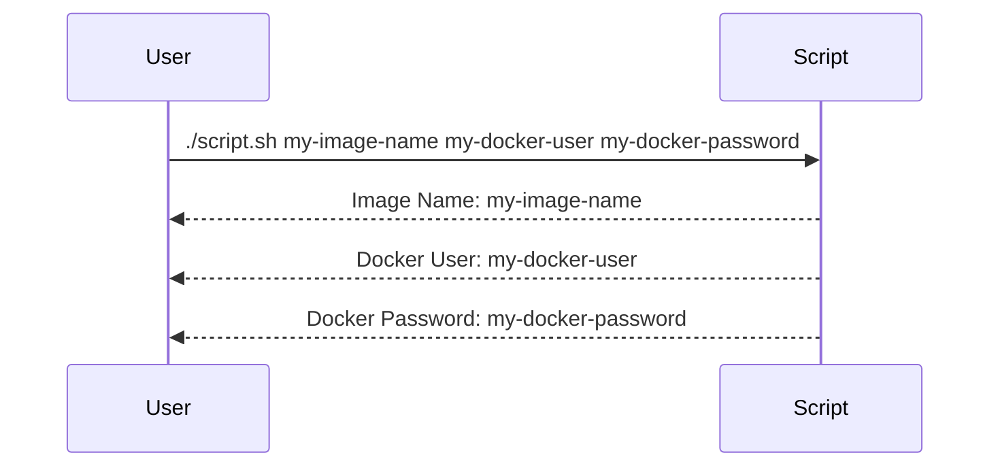

## Parameters in Shell Scripts

In shell scripting, parameters are used to pass data into scripts dynamically. These parameters are often referred to as positional parameters because their position in the argument list determines their value. In the context of the provided transcript, we are dealing with three parameters:

1. **Image Name**: This is the first parameter (`$1`).
2. **Docker Username**: This is the second parameter (`$2`).
3. **Docker Password**: This is the third parameter (`$3`).

### Why Use Parameters?

Parameters allow scripts to be flexible and reusable. Instead of hardcoding values within the script, you can pass different values each time the script runs. This makes the script adaptable to various scenarios and environments.

### How Parameters Work

When a shell script is executed, the arguments passed to it are stored in variables `$1`, `$2`, `$3`, etc., where `$1` is the first argument, `$2` is the second argument, and so on. Here’s an example of how these parameters might be used in a script:

```bash
#!/bin/bash

# Accessing the parameters
IMAGE_NAME=$1
DOCKER_USER=$2
DOCKER_PASSWORD=$3

echo "Image Name: $IMAGE_NAME"
echo "Docker User: $DOCKER_USER"
echo "Docker Password: $DOCKER_PASSWORD"
```

### Example Execution

To run this script, you would pass the required parameters:

```bash
./script.sh my-image-name my-docker-user my-docker-password
```

### Pitfalls and Best Practices

1. **Security Concerns**: Passing sensitive information like passwords as plain text arguments can expose them to unauthorized users. Always ensure that such information is handled securely.
2. **Validation**: Validate the input parameters to ensure they meet the expected format and constraints.
3. **Error Handling**: Implement error handling to manage cases where parameters are missing or incorrect.

### Secure Handling of Parameters

To securely handle sensitive parameters, consider using environment variables or encrypted files. This ensures that sensitive data is not exposed in plain text.

#### Environment Variables

```bash
export DOCKER_USER=my-docker-user
export DOCKER_PASSWORD=my-docker-password

./script.sh my-image-name
```

#### Encrypted Files

Use tools like `ansible-vault` or `gpg` to encrypt sensitive data and decrypt it at runtime.

### Mermaid Diagram: Parameter Flow



---
<!-- nav -->
[[07-Infrastructure as Code (IaC) and Continuous IntegrationContinuous Deployment (CICD)|Infrastructure as Code (IaC) and Continuous IntegrationContinuous Deployment (CICD)]] | [[DevOps/DevOps Bootcamp/08-Infrastructure as Code (Terraform)/04-CICD Pipeline for EC2 Instance Deployment Using Terraform And Docker-compose/00-Overview|Overview]] | [[DevOps/DevOps Bootcamp/08-Infrastructure as Code (Terraform)/04-CICD Pipeline for EC2 Instance Deployment Using Terraform And Docker-compose/09-Practice Questions & Answers|Practice Questions & Answers]]
