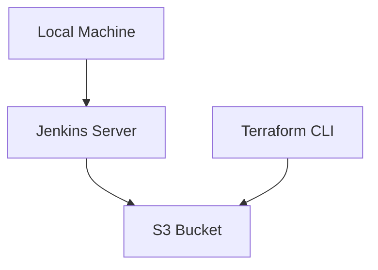
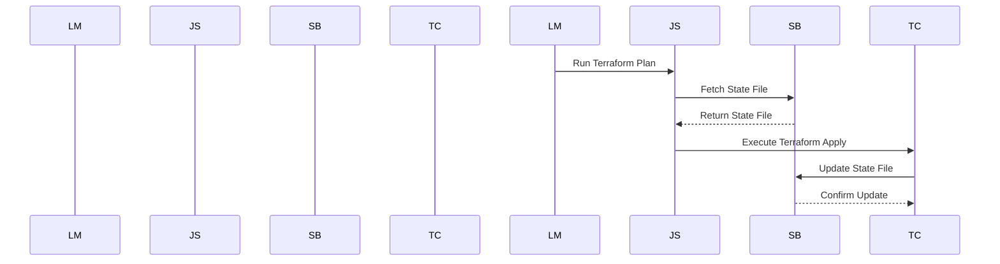

## Introduction to Terraform State Management

When working with Terraform in a team environment, managing the state of your infrastructure becomes crucial. The Terraform state file is a JSON file that contains the current state of your infrastructure, including the resources that have been created, their attributes, and their dependencies. This file is essential for Terraform to understand the current state of your infrastructure and to make informed decisions during `terraform apply` operations.

### Why Manage Terraform State Remotely?

In a team setting, multiple developers might run Terraform commands locally, leading to multiple state files being created. Additionally, integrating Terraform into a CI/CD pipeline can result in state files being generated in different environments, such as Jenkins servers. This fragmentation can lead to several issues:

1. **State Inconsistency**: Different team members might have different versions of the state file, leading to inconsistencies and potential conflicts.
2. **Limited Access**: If the state file is only available in one environment (e.g., a Jenkins server), other team members cannot access it, making it difficult to perform operations like `terraform plan` or `terraform apply`.
3. **Data Loss Risk**: If the server where the state file is stored fails, the state file could be lost, leading to significant data loss and potential downtime.

To address these issues, it is recommended to configure a remote Terraform state storage. This ensures that the state file is accessible to all team members and provides a centralized location for state management.

### Benefits of Remote Terraform State Storage

1. **Centralized Access**: All team members can access the same state file, ensuring consistency across the team.
2. **Backup and Recovery**: Storing the state file remotely allows for easy backup and recovery in case of server failures.
3. **Collaboration**: Multiple team members can work on the same infrastructure without conflicting state files.

### Configuring Remote Terraform State Storage

To configure remote Terraform state storage, you need to specify a backend in your `main.tf` file. Terraform supports various backends, including AWS S3, Azure Blob Storage, Google Cloud Storage, and more. For this example, we will use AWS S3 as the backend.

#### Step-by-Step Configuration

1. **Create an S3 Bucket**:
   - Ensure that the S3 bucket is created and configured properly.
   - The bucket should have appropriate permissions to allow Terraform to read and write to it.

2. **Configure the Backend in `main.tf`**:
   - Add a `terraform` block to your `main.tf` file to specify the backend configuration.

```hcl
terraform {
  backend "s3" {
    bucket = "your-bucket-name"
    key    = "path/to/statefile"
    region = "us-west-2"
  }
}
```

- **bucket**: The name of the S3 bucket where the state file will be stored.
- **key**: The path within the bucket where the state file will be stored.
- **region**: The AWS region where the S3 bucket is located.

3. **Initialize Terraform with the Backend**:
   - Run `terraform init` to initialize Terraform with the specified backend.

```sh
terraform init
```

This command will configure Terraform to use the specified S3 bucket as the backend for state storage.

### Example: Full Configuration and Execution

Let's walk through a complete example of configuring and using a remote Terraform state storage.

#### Step 1: Create an S3 Bucket

First, create an S3 bucket named `terraform-state-storage`.

```sh
aws s3api create-bucket --bucket terraform-state-storage --region us-west-2 --create-bucket-configuration LocationConstraint=us-west-2
```

#### Step 2: Configure the Backend in `main.tf`

Add the following configuration to your `main.tf` file:

```hcl
provider "aws" {
  region = "us-west-2"
}

resource "aws_instance" "example" {
  ami           = "ami-0c55b159cbfafe1f0"
  instance_type = "t2.micro"
}

terraform {
  backend "s3" {
    bucket = "terraform-state-storage"
    key    = "state/terraform.tfstate"
    region = "us-west-2"
  }
}
```

#### Step 3: Initialize Terraform with the Backend

Run the following command to initialize Terraform with the specified backend:

```sh
terraform init
```

This command will configure Terraform to use the `terraform-state-storage` S3 bucket as the backend for state storage.

### Real-World Examples and Recent Breaches

Recent breaches and vulnerabilities related to Terraform state management highlight the importance of proper configuration and security practices.

#### Example: AWS S3 Bucket Misconfiguration

A common issue is misconfigured S3 buckets, which can lead to unauthorized access to sensitive data, including Terraform state files. For example, a misconfigured S3 bucket might allow public read access, exposing the state file to anyone on the internet.

#### Secure Configuration Practices

To prevent such issues, ensure that the S3 bucket is properly configured with the following security measures:

1. **Bucket Policy**: Restrict access to the S3 bucket using bucket policies.
2. **IAM Roles**: Use IAM roles to grant specific permissions to Terraform.
3. **Encryption**: Enable server-side encryption for the S3 bucket.

### How to Prevent / Defend

#### Detection

Regularly audit your S3 bucket configurations to ensure they are properly secured. Use tools like AWS Trusted Advisor or third-party security scanners to identify misconfigurations.

#### Prevention

1. **Bucket Policy**:
   - Restrict access to the S3 bucket using bucket policies.
   - Ensure that only authorized users or services can access the bucket.

```json
{
  "Version": "2012-10-17",
  "Statement": [
    {
      "Sid": "AllowAccessToTerraformState",
      "Effect": "Allow",
      "Principal": {
        "AWS": "arn:aws:iam::123456789012:role/TerraformRole"
      },
      "Action": "s3:*",
      "Resource": [
        "arn:aws:s3:::terraform-state-storage",
        "arn:aws:s3:::terraform-state-storage/*"
      ]
    }
  ]
}
```

2. **IAM Roles**:
   - Use IAM roles to grant specific permissions to Terraform.
   - Ensure that the role has the minimum necessary permissions to interact with the S3 bucket.

```json
{
  "Version": "2012-10-17",
  "Statement": [
    {
      "Effect": "Allow",
      "Action": [
        "s3:GetObject",
        "s3:PutObject",
        "s3:DeleteObject"
      ],
      "Resource": [
        "arn:aws:s3:::terraform-state-storage",
        "arn:aws:s3:::terraform-state-storage/*"
      ]
    }
  ]
}
```

3. **Encryption**:
   - Enable server-side encryption for the S3 bucket.

```sh
aws s3api put-bucket-encryption --bucket terraform-state-storage --server-side-encryption-configuration '{"Rules": [{"ApplyServerSideEncryptionByDefault": {"SSEAlgorithm": "AES256"}}]}'
```

### Complete Example: Vulnerable vs. Secure Configuration

#### Vulnerable Configuration

```hcl
terraform {
  backend "s3" {
    bucket = "terraform-state-storage"
    key    = "state/terraform.tfstate"
    region = "us-west-2"
  }
}
```

#### Secure Configuration

```hcl
terraform {
  backend "s3" {
    bucket = "terraform-state-storage"
    key    = "state/terraform.tfstate"
    region = "us-west-2"
  }
}

provider "aws" {
  region = "us-west-2"
  assume_role {
    role_arn = "arn:aws:iam::123456789012:role/TerraformRole"
  }
}
```

### Mermaid Diagrams

#### Network Topology



#### Request/Response Flow



### Practice Labs

For hands-on experience with configuring remote Terraform state storage, consider the following labs:

- **PortSwigger Web Security Academy**: Focuses on web application security but includes modules on infrastructure as code.
- **OWASP Juice Shop**: While primarily focused on web application security, it includes scenarios involving infrastructure management.
- **CloudGoat**: Provides a series of labs specifically designed for learning cloud security, including Terraform state management.

These labs provide practical experience in configuring and securing Terraform state storage in a controlled environment.

### Conclusion

Properly configuring remote Terraform state storage is essential for maintaining consistency and security in a team environment. By following best practices and using secure configurations, you can ensure that your infrastructure state is managed effectively and securely. Regular audits and security measures are crucial to preventing unauthorized access and ensuring the integrity of your state files.

---
<!-- nav -->
[[DevOps/DevOps Bootcamp/08-Infrastructure as Code (Terraform)/05-Configuring Remote Terraform State Storage/00-Overview|Overview]] | [[02-Backend Configuration in Terraform|Backend Configuration in Terraform]]
