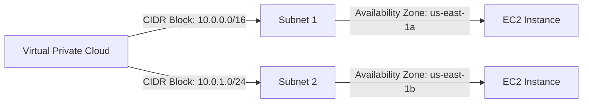

## Introduction to AWS VPC and Subnets with Terraform

In this section, we will delve deep into the creation of AWS resources using the Terraform provider, specifically focusing on Virtual Private Clouds (VPCs) and subnets. We'll cover the theoretical background, practical implementation, potential pitfalls, and security considerations. By the end of this chapter, you should have a comprehensive understanding of how to manage VPCs and subnets using Terraform.

### Background Theory

#### What is a VPC?

A Virtual Private Cloud (VPC) is a logically isolated virtual network within the AWS cloud. It allows you to launch AWS resources in a virtual network that you define. This network is completely separate from other networks in the AWS cloud, providing enhanced security and control over your resources.

#### Why Use a VPC?

Using a VPC provides several benefits:
- **Security**: You can isolate your resources and control access through security groups and network access control lists (NACLs).
- **Control**: You have full control over the IP address ranges, subnets, routing tables, and gateways.
- **Scalability**: You can scale your resources within the VPC as needed.

#### How Does a VPC Work?

A VPC consists of one or more subnets, each residing in a different Availability Zone (AZ). Each subnet is assigned a portion of the VPC's IP address range. Resources within a VPC communicate with each other using private IP addresses, and you can assign public IP addresses to resources that need internet access.

### Creating a VPC with Terraform

To create a VPC using Terraform, we need to define the VPC resource and specify its attributes. Let's walk through the process step-by-step.

#### Step 1: Define the VPC Resource

First, we need to define the VPC resource in our Terraform configuration file. Here’s an example:

```hcl
resource "aws_vpc" "example" {
  cidr_block = "10.0.0.0/16"
  tags = {
    Name = "example-vpc"
  }
}
```

In this example:
- `cidr_block` specifies the IP address range for the VPC. We chose `10.0.0.0/16`, which means the VPC will have a private IP address range of 10.0.0.0 to 10.255.255.255.
- `tags` allow us to add metadata to the VPC, such as a name.

#### Step 2: Understanding the CIDR Block

The CIDR block defines the IP address range for the VPC. In this case, `10.0.0.0/16` means:
- The first two octets (`10.0`) are fixed.
- The third octet can vary from `0` to `255`.
- The fourth octet can vary from `0` to `255`.

This gives us a total of 65,536 possible IP addresses.

#### Step 3: Additional Parameters

You can add additional parameters to the VPC resource, such as enabling DNS support or assigning a DHCP options set. Here’s an extended example:

```hcl
resource "aws_vpc" "example" {
  cidr_block = "11.0.0.0/16"
  enable_dns_hostnames = true
  enable_dns_support = true
  tags = {
    Name = "example-vpc"
  }
}
```

In this example:
- `enable_dns_hostnames` and `enable_dns_support` are set to `true`, which enables DNS support within the VPC.

### Creating a Subnet within a VPC

Once the VPC is created, we can define subnets within it. A subnet is a segment of the VPC's IP address range allocated to a specific Availability Zone.

#### Step 1: Define the Subnet Resource

Here’s an example of defining a subnet within the VPC:

```hcl
resource "aws_subnet" "example" {
  vpc_id     = aws_vpc.example.id
  cidr_block = "10.0.1.0/24"
  availability_zone = "us-east-1a"
  tags = {
    Name = "example-subnet"
  }
}
```

In this example:
- `vpc_id` specifies the VPC to which the subnet belongs. We reference the VPC resource using `aws_vpc.example.id`.
- `cidr_block` defines the IP address range for the subnet. We chose `10.0.1.0/24`, which means the subnet will have a private IP address range of 10.0.1.0 to 10.0.1.255.
- `availability_zone` specifies the AZ in which the subnet resides.
- `tags` allow us to add metadata to the subnet.

#### Step 2: Understanding the CIDR Block for Subnets

The CIDR block for the subnet is `10.0.1.0/24`. This means:
- The first three octets (`10.0.1`) are fixed.
- The fourth octet can vary from `0` to `255`.

This gives us a total of 256 possible IP addresses.

### Diagramming the VPC and Subnet Structure

Let’s visualize the VPC and subnet structure using a Mermaid diagram:



In this diagram:
- `VPC` represents the Virtual Private Cloud.
- `Subnet1` and `Subnet2` represent subnets within the VPC.
- `Instance1` and `Instance2` represent EC2 instances within the respective subnets.

### Potential Pitfalls and Best Practices

#### Pitfall 1: Incorrect CIDR Block Configuration

If you configure the CIDR block incorrectly, you may run out of IP addresses or overlap with other subnets. Always ensure that the CIDR blocks are correctly configured and do not overlap.

#### Best Practice: Validate CIDR Blocks

Before deploying your Terraform configuration, validate the CIDR blocks to ensure they are correct. You can use tools like `ipcalc` to check the validity of CIDR blocks.

#### Pitfall 2: Not Specifying Availability Zones

If you do not specify the availability zones for subnets, Terraform may choose them arbitrarily, leading to inconsistent deployments.

#### Best Practice: Explicitly Specify Availability Zones

Always explicitly specify the availability zones for subnets to ensure consistency across deployments.

### Security Considerations

#### Vulnerability: Misconfigured Security Groups

One common vulnerability is misconfigured security groups, which can expose your resources to unauthorized access.

#### Example: CVE-2021-38645

CVE-2021-38645 was a vulnerability in AWS security groups that allowed unauthorized access to resources. This highlights the importance of properly configuring security groups.

#### How to Prevent / Defend

##### Secure Coding Fix

Here’s an example of a vulnerable security group configuration and its secure counterpart:

**Vulnerable Configuration:**

```hcl
resource "aws_security_group" "example" {
  name        = "example-sg"
  description = "Example security group"
  vpc_id      = aws_vpc.example.id

  ingress {
    from_port   = 22
    to_port     = 22
    protocol    = "tcp"
    cidr_blocks = ["0.0.0.0/0"]
  }
}
```

In this example, SSH access is open to the entire internet (`0.0.0.0/0`).

**Secure Configuration:**

```hcl
resource "aws_security_group" "example" {
  name        = "example-sg"
  description = "Example security group"
  vpc_id      = aws_vpc.example.id

  ingress {
    from_port   = 22
    to_port     = 22
    protocol    = "tcp"
    cidr_blocks = ["10.0.0.0/16"]
  }
}
```

In this example, SSH access is restricted to the VPC’s IP address range (`10.0.0.0/16`).

##### Detection

Use AWS Config to monitor and detect misconfigurations. You can set up rules to alert you if security groups are misconfigured.

##### Prevention

- **Least Privilege Principle**: Only grant the minimum necessary permissions.
- **Regular Audits**: Regularly audit security group configurations to ensure they are correctly set up.

### Complete Example: Full Terraform Configuration

Here’s a complete example of a Terraform configuration that creates a VPC and a subnet:

```hcl
provider "aws" {
  region = "us-east-1"
}

resource "aws_vpc" "example" {
  cidr_block = "10.0.0.0/16"
  enable_dns_hostnames = true
  enable_dns_support = true
  tags = {
    Name = "example-vpc"
  }
}

resource "aws_subnet" "example" {
  vpc_id     = aws_vpc.example.id
  cidr_block = "10.0.1.0/24"
  availability_zone = "us-east-1a"
  tags = {
    Name = "example-subnet"
  }
}
```

### Expected Result

When you apply this Terraform configuration, it will create a VPC with the specified CIDR block and a subnet within that VPC. The VPC and subnet will be tagged with the specified names.

### Hands-On Lab Suggestions

For hands-on practice, consider the following labs:
- **PortSwigger Web Security Academy**: Focuses on web application security but can be used to understand the broader context of securing AWS resources.
- **OWASP Juice Shop**: Another web application security lab that can help understand the importance of securing backend services hosted in AWS.
- **CloudGoat**: A cloud security lab that includes exercises on securing AWS resources, including VPCs and subnets.

By following this comprehensive guide, you should now have a thorough understanding of how to create and manage VPCs and subnets using Terraform.

---
<!-- nav -->
[[04-Introduction to AWS Resource Management with Terraform|Introduction to AWS Resource Management with Terraform]] | [[DevOps/DevOps Bootcamp/08-Infrastructure as Code (Terraform)/06-Creating AWS Resources Using Terraform Provider/00-Overview|Overview]] | [[06-Introduction to Terraform Providers and Resources|Introduction to Terraform Providers and Resources]]
