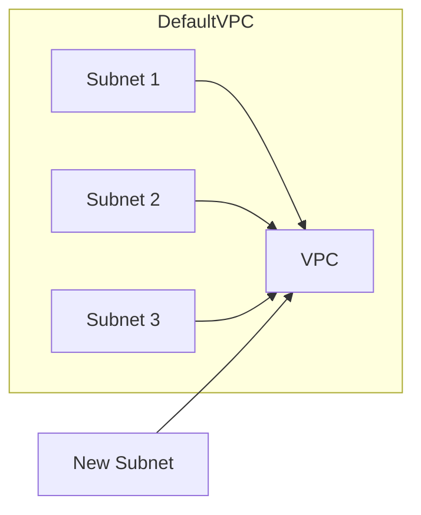

## Introduction to Terraform and AWS Resource Management

### What is Terraform?

Terraform is an open-source infrastructure as code (IaC) tool developed by HashiCorp. It allows you to define and provision your infrastructure using declarative configuration files written in the HashiCorp Configuration Language (HCL). Terraform supports a wide variety of cloud providers, including AWS, Azure, Google Cloud Platform, and many others. By using Terraform, you can manage your infrastructure in a consistent and repeatable manner, ensuring that your environments are reproducible and scalable.

### Why Use Terraform with AWS?

Using Terraform with AWS provides several benefits:

1. **Consistency**: Terraform ensures that your infrastructure is defined consistently across different environments (development, staging, production).
2. **Automation**: You can automate the provisioning and management of your AWS resources, reducing manual errors and improving efficiency.
3. **Version Control**: Since Terraform configurations are text files, they can be stored in version control systems like Git, allowing you to track changes and collaborate with team members.
4. **Reproducibility**: Terraform allows you to create and destroy resources easily, making it ideal for testing and development environments.

### Basic Concepts in Terraform

Before diving into the specifics of creating AWS resources using Terraform, let's cover some basic concepts:

1. **Providers**: Providers are plugins that allow Terraform to interact with different cloud providers. For AWS, you would use the `aws` provider.
2. **Resources**: Resources represent the actual infrastructure components you want to manage, such as EC2 instances, S3 buckets, or VPCs.
3. **Data Sources**: Data sources allow you to retrieve information from your cloud provider without creating new resources. This is useful for referencing existing resources or querying metadata.
4. **State**: Terraform maintains a state file that tracks the current state of your infrastructure. This file is crucial for managing changes and ensuring consistency.

### Setting Up Terraform for AWS

To start using Terraform with AWS, you need to configure the `aws` provider. Here’s an example of how to set up the provider in a Terraform configuration file:

```hcl
provider "aws" {
  region = "us-east-1"
}
```

This configuration specifies that Terraform should use the `aws` provider and operate in the `us-east-1` region. You can also specify other options like access keys, secret keys, and profiles.

### Creating AWS Resources Using Terraform

Now, let's dive into the specific example of creating an AWS subnet using Terraform. We'll cover the steps in detail, including the necessary configuration and the reasoning behind each step.

### Understanding Subnets in AWS

A subnet is a range of IP addresses within a VPC (Virtual Private Cloud). Each subnet is associated with a specific availability zone, which helps distribute resources across multiple zones for high availability and fault tolerance.

### Default VPC

When you create an AWS account, a default VPC is automatically created for you in each region. This default VPC includes subnets in different availability zones. To create additional subnets, you need to ensure that the new subnet does not overlap with the existing ones.

### Example: Creating a New Subnet in a Default VPC

Let's walk through the process of creating a new subnet in a default VPC using Terraform. We'll cover the following steps:

1. **Define the VPC**: Retrieve the default VPC using a data source.
2. **Create the Subnet**: Define the subnet with a unique name and appropriate CIDR block.

#### Step 1: Define the VPC

First, we need to retrieve the default VPC using a data source. This ensures that we are working with the correct VPC.

```hcl
data "aws_vpc" "default" {
  default = true
}
```

This data source retrieves the default VPC in the specified region. The `default` attribute is set to `true`, indicating that we want the default VPC.

#### Step 2: Create the Subnet

Next, we define the subnet. We need to ensure that the subnet name is unique and that the CIDR block does not overlap with existing subnets.

```hcl
resource "aws_subnet" "dev_subnet_2" {
  vpc_id     = data.aws_vpc.default.id
  cidr_block = "10.0.1.0/24"
  availability_zone = "us-east-1a"
}
```

In this configuration:

- `vpc_id`: Specifies the ID of the VPC where the subnet will be created. We use the `id` attribute from the `data.aws_vpc.default` data source.
- `cidr_block`: Specifies the CIDR block for the subnet. We choose `10.0.1.0/24` to avoid overlapping with existing subnets.
- `availability_zone`: Specifies the availability zone where the subnet will be created.

### Full Example Configuration

Here is the complete Terraform configuration for creating a new subnet in a default VPC:

```hcl
provider "aws" {
  region = "us-east-1"
}

data "aws_vpc" "default" {
  default = true
}

resource "aws_subnet" "dev_subnet_2" {
  vpc_id             = data.aws_vpc.default.id
  cidr_block         = "1 0.0.1.0/24"
  availability_zone  = "us-east-1a"
}
```

### Explanation of Key Components

1. **Provider Block**:
   - Defines the AWS provider and sets the region to `us-east-1`.

2. **Data Source Block**:
   - Retrieves the default VPC using the `aws_vpc` data source.
   - The `default` attribute is set to `true` to indicate that we want the default VPC.

3. **Resource Block**:
   - Creates a new subnet in the default VPC.
   - The `vpc_id` attribute references the ID of the default VPC.
   - The `cidr_block` attribute specifies the IP address range for the subnet.
   - The `availability_zone` attribute specifies the availability zone for the subnet.

### Handling Overlapping CIDR Blocks

One of the key challenges when creating subnets is ensuring that the CIDR blocks do not overlap with existing subnets. Let's discuss how to handle this issue.

#### Identifying Existing Subnets

To identify existing subnets in the default VPC, you can use the `aws_subnet` data source. Here’s an example:

```hcl
data "aws_subnets" "existing" {
  filter {
    name   = "vpc-id"
    values = [data.aws_vpc.default.id]
  }
}
```

This data source retrieves all subnets associated with the default VPC. You can then inspect the `cidr_block` attribute of each subnet to determine the existing ranges.

#### Choosing a Non-overlapping CIDR Block

Once you have identified the existing subnets, you can choose a non-overlapping CIDR block for your new subnet. For example, if the existing subnets use `10.0.0.0/24` and `10.0.1.0/24`, you can choose `10.0.2.0/24` for your new subnet.

### Complete Example with Non-overlapping CIDR Block

Here is the complete Terraform configuration with a non-overlapping CIDR block:

```hcl
provider "aws" {
  region = "us-east-1"
}

data "aws_vpc" "default" {
  default = true
}

data "aws_subnets" "existing" {
  filter {
    name   = "vpc-id"
    values = [data.aws_vpc.default.id]
  }
}

resource "aws_subnet" "dev_subnet_2" {
  vpc_id             = data.aws_vpc.default.id
  cidr_block         = "10.0.2.0/24"
  availability_zone  = "us-east-1a"
}
```

### Explanation of Key Components

1. **Provider Block**:
   - Defines the AWS provider and sets the region to `us-east-1`.

2. **Data Source Block for Default VPC**:
   - Retrieves the default VPC using the `aws_vpc` data source.
   - The `default` attribute is set to `true` to indicate that we want the default VPC.

3. **Data Source Block for Existing Subnets**:
   - Retrieves all subnets associated with the default VPC.
   - The `filter` attribute specifies that we want subnets associated with the default VPC.

4. **Resource Block for New Subnet**:
   - Creates a new subnet in the default VPC.
   - The `vpc_id` attribute references the ID of the default VPC.
   - The `cidr_block` attribute specifies the IP address range for the subnet.
   - The `availability_zone` attribute specifies the availability zone for the subnet.

### How to Prevent / Defend

#### Detection

To detect overlapping CIDR blocks, you can use the `aws_subnet` data source to list all subnets in the VPC and compare their CIDR blocks. Here’s an example:

```hcl
data "aws_subnets" "all" {
  filter {
    name   = "vpc-id"
    values = [data.aws_vpc.default.id]
  }
}

output "subnet_cidrs" {
  value = [for s in data.aws_subnets.all.subnets : s.cidr_block]
}
```

This configuration lists all subnets in the default VPC and outputs their CIDR blocks. You can then manually check for overlaps.

#### Prevention

To prevent overlapping CIDR blocks, follow these best practices:

1. **Use a CIDR Calculator**: Tools like CIDR calculators can help you determine non-overlapping ranges.
2. **Document Subnet Ranges**: Maintain a document or spreadsheet that tracks the CIDR blocks used in your VPC.
3. **Automate Checks**: Use scripts or tools to automatically check for overlapping CIDR blocks before applying Terraform configurations.

### Real-World Examples and Breaches

While there are no specific CVEs related to overlapping CIDR blocks, improper management of subnets can lead to security vulnerabilities. For example, if two subnets overlap, it could lead to unexpected network traffic and potential security breaches.

### Conclusion

Creating AWS resources using Terraform is a powerful way to manage your infrastructure in a consistent and automated manner. By understanding the key concepts and following best practices, you can ensure that your subnets are properly configured and do not overlap with existing subnets.

### Practice Labs

For hands-on practice with Terraform and AWS, consider the following labs:

- **PortSwigger Web Security Academy**: Focuses on web application security but also covers infrastructure management.
- **OWASP Juice Shop**: A deliberately insecure web application for practicing web security.
- **DVWA (Damn Vulnerable Web Application)**: Another web application for practicing web security.
- **WebGoat**: An interactive web application security training tool.

These labs provide practical experience with various aspects of DevOps and cloud security.

### Diagrams

Here is a mermaid diagram illustrating the architecture of the default VPC and the new subnet:



This diagram shows the default VPC with three existing subnets and the new subnet being created.

### Summary

By following the steps outlined in this chapter, you can effectively create and manage AWS subnets using Terraform. Understanding the key concepts and best practices will help you avoid common pitfalls and ensure a secure and efficient infrastructure.

---
<!-- nav -->
[[07-Introduction to Terraform and AWS Resource Creation|Introduction to Terraform and AWS Resource Creation]] | [[DevOps/DevOps Bootcamp/08-Infrastructure as Code (Terraform)/06-Creating AWS Resources Using Terraform Provider/00-Overview|Overview]] | [[09-Introduction to Terraform and Idempotency|Introduction to Terraform and Idempotency]]
