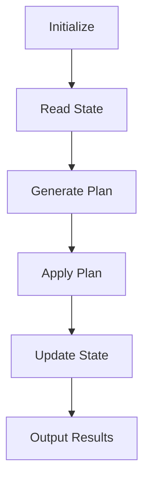

## Introduction to Terraform and Idempotency

Terraform is an open-source infrastructure as code (IaC) tool developed by HashiCorp. It allows users to define and provision infrastructure resources using declarative configuration files written in the HashiCorp Configuration Language (HCL). Terraform supports a wide range of cloud providers, including AWS, Azure, Google Cloud Platform, and many others. One of the key features of Terraform is its ability to manage infrastructure in an idempotent manner, ensuring consistency and reliability in resource provisioning.

### What is Idempotency?

Idempotency is a property of certain operations where applying the operation multiple times has the same effect as applying it once. In the context of Terraform, idempotency ensures that repeated execution of the same configuration will produce the same result, regardless of the number of times it is executed. This is crucial for maintaining consistent and predictable infrastructure states.

#### Why Does Idempotency Matter?

Idempotency is essential for several reasons:

1. **Consistency**: Ensures that the infrastructure remains in a consistent state, even if the configuration is applied multiple times.
2. **Reliability**: Reduces the risk of accidental changes or errors during deployment.
3. **Ease of Use**: Users do not need to keep track of the current state of the infrastructure; they only need to define the desired end state.

### How Terraform Achieves Idempotency

When you run `terraform apply`, Terraform performs the following steps to ensure idempotency:

1. **State Comparison**: Terraform compares the current state of the infrastructure with the desired state defined in the configuration files.
2. **Resource Management**: Based on the comparison, Terraform determines whether to create, update, or delete resources to achieve the desired state.
3. **State Update**: After applying the changes, Terraform updates the state file to reflect the new infrastructure state.

#### Example: Managing Subnets in AWS

Let's consider an example where we are managing subnets within an AWS VPC using Terraform. Here’s a simple configuration to create a subnet:

```hcl
provider "aws" {
  region = "us-west-2"
}

resource "aws_vpc" "example" {
  cidr_block = "10.0.0.0/16"
}

resource "aws_subnet" "example" {
  vpc_id     = aws_vpc.example.id
  cidr_block = "10.0.1.0/24"
}
```

In this configuration, we define a VPC and a subnet within that VPC. When we run `terraform apply`, Terraform will:

1. Check if the VPC with the specified CIDR block already exists.
2. If the VPC does not exist, it will create it.
3. Check if the subnet with the specified CIDR block already exists within the VPC.
4. If the subnet does not exist, it will create it.

If we run `terraform apply` again, Terraform will compare the current state with the desired state and determine that no changes are needed, thus maintaining idempotency.

### Detailed Workflow of `terraform apply`

To understand the workflow of `terraform apply`, let's break down the process step-by-step:

1. **Initialization**:
    - Terraform initializes the working directory and downloads any required plugins or modules.
    - The state file (`terraform.tfstate`) is read to understand the current state of the infrastructure.

2. **Planning**:
    - Terraform generates a plan based on the configuration files and the current state.
    - The plan includes a list of actions to be taken to achieve the desired state.

3. **Execution**:
    - Terraform applies the plan, creating, updating, or deleting resources as necessary.
    - The state file is updated to reflect the new state of the infrastructure.

4. **Output**:
    - Terraform outputs the results of the execution, including any warnings or errors.

### Mermaid Diagram: Terraform Apply Workflow



### Real-World Examples and Recent CVEs

While Terraform itself is generally robust, issues can arise from misconfigurations or incorrect usage. Here are some real-world examples and recent CVEs related to Terraform and AWS:

#### Example: Misconfigured IAM Policies

A common issue is the misconfiguration of IAM policies, leading to excessive permissions. For instance, a recent breach involved an IAM role with overly broad permissions, allowing unauthorized access to sensitive resources.

```json
{
  "Version": "2012-10-17",
  "Statement": [
    {
      "Effect": "Allow",
      "Action": "*",
      "Resource": "*"
    }
  ]
}
```

This policy grants full access to all AWS services, which is highly insecure. A more secure version would limit permissions to only the necessary actions and resources.

```json
{
  "Version": "2012-10-17",
  "Statement": [
    {
      "Effect": "Allow",
      "Action": [
        "s3:GetObject",
        "s3:PutObject"
      ],
      "Resource": "arn:aws:s3:::my-bucket/*"
    }
  ]
}
```

#### Example: Unsecured S3 Buckets

Another common issue is unsecured S3 buckets. A recent CVE involved an S3 bucket configured with public read/write access, leading to data exposure.

```hcl
resource "aws_s3_bucket" "public_bucket" {
  bucket = "my-public-bucket"
  acl    = "public-read-write"
}
```

A more secure configuration would restrict access to specific IP addresses or IAM roles.

```hcl
resource "aws_s3_bucket" "secure_bucket" {
  bucket = "my-secure-bucket"
  acl    = "private"

  policy = <<EOF
{
  "Version": "2012-10-17",
  "Statement": [
    {
      "Sid": "PublicReadGetObject",
      "Effect": "Allow",
      "Principal": "*",
      "Action": "s3:GetObject",
      "Resource": "arn:aws:s3:::my-secure-bucket/*"
    }
  ]
}
EOF
}
```

### Common Pitfalls and Best Practices

#### Pitfall: Overly Broad Permissions

One common pitfall is granting overly broad permissions to IAM roles or users. This can lead to security vulnerabilities if the permissions are exploited.

**How to Prevent / Defend**:
- Use the principle of least privilege (PoLP) to grant only the necessary permissions.
- Regularly review and audit IAM policies to ensure they are up-to-date and secure.

#### Pitfall: Misconfigured Resources

Misconfigured resources, such as S3 buckets or EC2 instances, can lead to security issues.

**How to Prevent / Defend**:
- Use Terraform modules to encapsulate and standardize resource configurations.
- Implement automated testing and validation of configurations using tools like `tfsec`.

### Secure Coding Fixes

Here are some examples of secure coding practices:

#### Example: Securing IAM Policies

**Vulnerable Code**:
```json
{
  "Version": "2012-10-17",
  "Statement": [
    {
      "Effect": "Allow",
      "Action": "*",
      "Resource": "*"
    }
  ]
}
```

**Secure Code**:
```json
{
  "Version": "2012-10-17",
  "Statement": [
    {
      "Effect": "Allow",
      "Action": [
        "s3:GetObject",
        "s3:PutObject"
      ],
      "Resource": "arn:aws:s3:::my-bucket/*"
    }
  ]
}
```

#### Example: Securing S3 Buckets

**Vulnerable Code**:
```hcl
resource "aws_s3_bucket" "public_bucket" {
  bucket = "my-public-bucket"
  acl    = "public-read-write"
}
```

**Secure Code**:
```hcl
resource "aws_s3_bucket" "secure_bucket" {
  bucket = "my-secure-bucket"
  acl    = "private"

  policy = <<EOF
{
  "Version": "2012-10-17",
  "Statement": [
    {
      "Sid": "PublicReadGetObject",
      "Effect": "Allow",
      "Principal": "*",
      "Action": "s3:GetObject",
      "Resource": "arn:aws:s3:::my-secure-bucket/*"
    }
  ]
}
EOF
}
```

### Hands-On Labs

For hands-on practice with Terraform and AWS, consider the following labs:

- **PortSwigger Web Security Academy**: Offers a variety of labs focused on web application security, including some that touch on infrastructure security.
- **OWASP Juice Shop**: A deliberately insecure web application for practicing web security skills.
- **DVWA (Damn Vulnerable Web Application)**: A PHP/MySQL web application that is riddled with vulnerabilities for educational purposes.
- **WebGoat**: An interactive, gamified training application for learning about web application security.

These labs provide practical experience in securing and managing infrastructure using Terraform and other IaC tools.

### Conclusion

Understanding and leveraging the idempotent nature of Terraform is crucial for maintaining consistent and reliable infrastructure. By following best practices and secure coding techniques, you can minimize the risk of misconfigurations and security vulnerabilities. Regularly reviewing and auditing your configurations will help ensure that your infrastructure remains secure and compliant.

---
<!-- nav -->
[[08-Introduction to Terraform and AWS Resource Management|Introduction to Terraform and AWS Resource Management]] | [[DevOps/DevOps Bootcamp/08-Infrastructure as Code (Terraform)/06-Creating AWS Resources Using Terraform Provider/00-Overview|Overview]] | [[10-Introduction to VPC and Subnets in AWS|Introduction to VPC and Subnets in AWS]]
