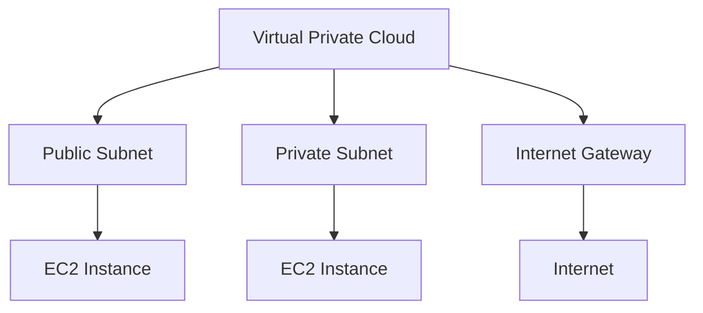

## Creating AWS Resources Using Terraform Provider

Terraform is an open-source infrastructure as code (IaC) tool that allows you to define and provision your infrastructure using declarative configuration files. Terraform uses providers to interact with various cloud platforms, including AWS.

### What is Terraform?

Terraform is a tool for building, changing, and versioning infrastructure safely and efficiently. Terraform can manage infrastructure across multiple cloud providers and even on-premises environments. It uses a declarative configuration language called HCL (HashiCorp Configuration Language) to define the desired state of your infrastructure.

#### Key Features of Terraform

- **Infrastructure as Code (IaC)**: Terraform allows you to define your infrastructure in code, making it easy to version, review, and collaborate on.
- **Provider Support**: Terraform supports a wide range of cloud providers, including AWS, Azure, Google Cloud, and many others.
- **State Management**: Terraform maintains a state file that tracks the current state of your infrastructure, allowing you to plan and apply changes safely.
- **Resource Graph**: Terraform builds a graph of your resources and their dependencies, ensuring that resources are created and destroyed in the correct order.

### What is a Terraform Provider?

A Terraform provider is a plugin that allows Terraform to interact with a specific cloud provider or service. Providers define the resources, data sources, and other constructs that Terraform can manage. For example, the `aws` provider allows Terraform to manage AWS resources such as EC2 instances, S3 buckets, and VPCs.

#### Key Components of a Terraform Provider

- **Resources**: Resources represent the entities that Terraform manages, such. as EC2 instances, S3 buckets, and VPCs.
- **Data Sources**: Data sources allow Terraform to retrieve information from a provider, such as the list of existing EC2 instances.
- **Configuration**: Providers require configuration parameters, such as access keys and regions, to interact with the provider's API.

### Creating a VPC and Subnets Using Terraform

Let's walk through an example of creating a VPC and subnets using Terraform and the AWS provider.

#### Step 1: Initialize Terraform

First, initialize Terraform to download the necessary provider plugins.

```sh
terraform init
```

#### Step 2: Define the VPC and Subnets

Create a `main.tf` file to define the VPC and subnets.

```hcl
provider "aws" {
  region = "us-west-2"
}

resource "aws_vpc" "example" {
  cidr_block = "10.0.0.0/16"
}

resource "aws_subnet" "public" {
  vpc_id     = aws_vpc.example.id
  cidr_block = "10.0.1.0/24"
  availability_zone = "us-west-2a"
}

resource "aws_subnet" "private" {
  vpc_id     = aws_vpc.example.id
  cidr_block = "10.0.2.0/24"
  availability_zone = "us-west-2b"
}
```

#### Step 3: Plan the Changes

Before applying the changes, use the `terraform plan` command to preview the changes that will be made.

```sh
terraform plan
```

#### Step 4: Apply the Changes

Apply the changes using the `terraform apply` command.

```sh
terraform apply
```

#### Step 5: Verify the Changes

Once the changes are applied, verify that the VPC and subnets have been created.

```sh
aws ec2 describe-vpcs --vpc-ids $(terraform output vpc_id)
aws ec2 describe-subnets --filters "Name=vpc-id,Values=$(terraform output vpc_id)"
```

### Mermaid Diagram: VPC and Subnets Architecture



### Pitfalls and Common Mistakes

- **Incorrect CIDR Blocks**: Ensure that the CIDR blocks for your subnets are within the VPC's CIDR block and do not overlap with other subnets.
- **Insufficient Subnets**: Having too few subnets can limit your ability to scale and isolate your network.
- **Improper Route Table Configuration**: Incorrectly configured route tables can lead to network connectivity issues.
- **Security Group Misconfiguration**: Improperly configured security groups can expose your instances to unnecessary risks.

### How to Prevent / Defend

- **Validate IP Address Ranges**: Before creating subnets, validate that the IP address ranges are within the VPC's CIDR block and do not overlap with other subnets.
- **Use Network ACLs**: Configure network ACLs to control inbound and outbound traffic at the subnet level.
- **Secure Security Groups**: Configure security groups to allow only necessary inbound and outbound traffic.
- **Monitor Network Traffic**: Use AWS CloudTrail and VPC Flow Logs to monitor network traffic and detect any unauthorized activity.

### Real-World Examples

- **CVE-2021-20225**: This vulnerability in AWS VPC allowed attackers to bypass network isolation and gain unauthorized access to resources in other subnets. To prevent this, ensure that your network ACLs and security groups are properly configured.
- **AWS Outage in 2021**: An outage in AWS affected multiple regions due to misconfigured route tables. To prevent this, regularly review and test your route tables to ensure they are correctly configured.

### Practice Labs

For hands-on practice with creating AWS resources using Terraform, consider the following labs:

- **PortSwigger Web Security Academy**: Offers a variety of labs focused on web application security, including some that involve setting up and securing AWS resources.
- **OWASP Juice Shop**: A deliberately insecure web application for security training, which can be deployed on AWS using Terraform.
- **DVWA (Damn Vulnerable Web Application)**: Another web application for security training, which can be deployed on AWS using Terraform.
- **WebGoat**: A deliberately insecure Java web application designed to teach web application security lessons.

These labs provide a practical way to apply the concepts learned in this chapter and gain hands-on experience with creating and managing AWS resources using Terraform.

### Conclusion

Creating AWS resources using Terraform is a powerful way to manage your infrastructure as code. By defining your VPC and subnets in Terraform, you can ensure consistency, scalability, and security. Understanding the key components of a VPC and subnets, and how to create them using Terraform, is essential for any DevOps engineer working with AWS.

---
<!-- nav -->
[[10-Introduction to VPC and Subnets in AWS|Introduction to VPC and Subnets in AWS]] | [[DevOps/DevOps Bootcamp/08-Infrastructure as Code (Terraform)/06-Creating AWS Resources Using Terraform Provider/00-Overview|Overview]] | [[DevOps/DevOps Bootcamp/08-Infrastructure as Code (Terraform)/06-Creating AWS Resources Using Terraform Provider/12-Practice Questions & Answers|Practice Questions & Answers]]
