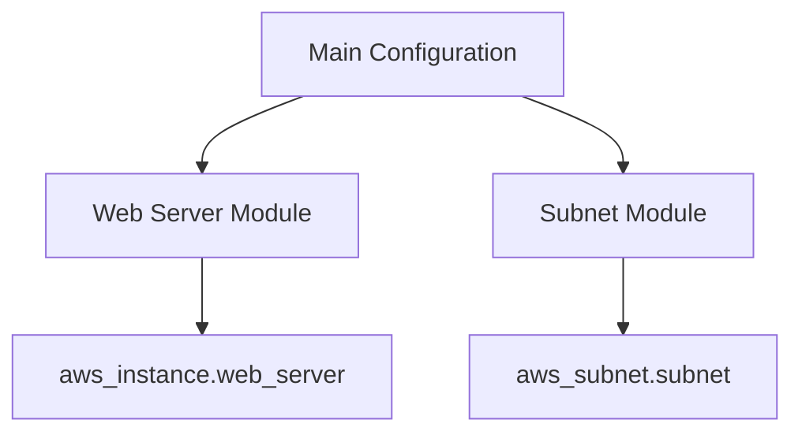

## Introduction to Reusable Modules in Terraform Projects

In the realm of infrastructure as code (IaC), Terraform is one of the most popular tools used to manage and provision infrastructure across various cloud providers and on-premises environments. One of the key features of Terraform is its ability to create reusable modules, which allows developers to encapsulate complex configurations into smaller, manageable, and reusable components. This chapter will delve deep into creating reusable modules in Terraform projects, explaining the concepts, benefits, and practical implementation steps.

### What Are Terraform Modules?

Terraform modules are reusable components that encapsulate a set of resources and their associated configurations. By using modules, you can avoid duplicating code and maintain consistency across your infrastructure. A module can be thought of as a function in programming, where you pass parameters (variables) and get a specific output (resources).

#### Why Use Modules?

1. **Reusability**: Modules allow you to reuse the same configuration across different environments or projects.
2. **Maintainability**: Changes made to a module affect all instances where the module is used, reducing the effort required to maintain consistency.
3. **Encapsulation**: Modules hide the complexity of the underlying resources, making it easier to understand and manage the overall infrastructure.
4. **Version Control**: Modules can be versioned and tracked separately, allowing for better control over changes and updates.

### Standard Naming Conventions

When creating modules, it is essential to follow standard naming conventions to ensure clarity and consistency. The standard naming convention for Terraform modules includes the following files:

- `main.tf`: Contains the main resource definitions.
- `outputs.tf`: Defines the outputs of the module.
- `variables.tf`: Defines the input variables for the module.

These files are placed within a directory structure that represents the module. For example, if you are creating a module for a web server, the directory structure might look like this:

```
modules/
  ├── web_server/
  │   ├── main.tf
  │   ├── outputs.tf
  │   └── variables.tf
  └── subnet/
      ├── main.tf
      ├── outputs.tf
      └── variables.tf
```

### Creating the Module Structure

To create a reusable module structure, you first need to define the directories and files that will contain the module definitions. Let's walk through the process of creating the directory structure and the necessary files.

#### Step-by-Step Process

1. **Create the `modules` Directory**:
   - Navigate to your Terraform project root directory.
   - Create a new directory named `modules`.

```bash
mkdir modules
```

2. **Create Subdirectories for Each Module**:
   - Inside the `modules` directory, create subdirectories for each module you want to define. For example, create `web_server` and `subnet` directories.

```bash
cd modules
mkdir web_server subnet
```

3. **Create the Required Files in Each Module Directory**:
   - Inside each module directory (`web_server` and `subnet`), create the `main.tf`, `outputs.tf`, and `variables.tf` files.

```bash
touch web_server/main.tf web_server/outputs.tf web_server/variables.tf
touch subnet/main.tf subnet/outputs.tf subnet/variables.tf
```

### Example: Web Server Module

Let's take a closer look at the `web_server` module and how it can be structured.

#### `main.tf`

The `main.tf` file contains the main resource definitions for the web server module. Here is an example of what this file might look like:

```hcl
resource "aws_instance" "web_server" {
  ami           = var.web_server_ami
  instance_type = var.web_server_instance_type

  tags = {
    Name = "WebServer"
  }
}
```

#### `outputs.tf`

The `outputs.tf` file defines the outputs of the module. Outputs are useful for passing information from the module to the calling context. Here is an example of what this file might look like:

```hcl
output "web_server_ip" {
  value = aws_instance.web_server.public_ip
}
```

#### `variables.tf`

The `variables.tf` file defines the input variables for the module. Variables allow you to parameterize the module, making it more flexible and reusable. Here is an example of what this file might look like:

```hcl
variable "web_server_ami" {
  description = "The AMI ID for the web server."
  type        = string
}

variable "web_server_instance_type" {
  description = "The instance type for the web server."
  type        = string
}
```

### Example: Subnet Module

Now, let's take a look at the `subnet` module and how it can be structured.

#### `main.tf`

The `main.tf` file contains the main resource definitions for the subnet module. Here is an example of what this file might look like:

```h
resource "aws_subnet" "subnet" {
  vpc_id     = var.vpc_id
  cidr_block = var.cidr_block

  tags = {
    Name = "Subnet"
  }
}
```

#### `outputs.tf`

The `outputs.tf` file defines the outputs of the module. Here is an example of what this file might look like:

```hcl
output "subnet_id" {
  value = aws_subnet.subnet.id
}
```

#### `variables.tf`

The `variables.tf` file defines the input variables for the module. Here is an example of what this file might look like:

```hcl
variable "vpc_id" {
  description = "The VPC ID for the subnet."
  type        = string
}

variable "cidr_block" {
  description = "The CIDR block for the subnet."
  type        = string
}
```

### Using Modules in Your Terraform Project

Once you have defined your modules, you can use them in your Terraform project by referencing them in your main configuration files. Here is an example of how you might use the `web_server` and `subnet` modules in your main Terraform configuration:

```hcl
module "web_server" {
  source = "./modules/web_server"

  web_server_ami           = "ami-0c94855ba95b798c7"
  web_server_instance_type = "t2.micro"
}

module "subnet" {
  source = "./modules/subnet"

  vpc_id     = "vpc-0123456789abcdef0"
  cidr_block = "10.0.1.0/24"
}
```

### Mermaid Diagrams for Module Structure

To visualize the structure of your modules, you can use Mermaid diagrams. Here is an example of a Mermaid diagram that shows the relationship between the `web_server` and `subnet` modules:



### Common Pitfalls and Best Practices

When creating and using Terraform modules, there are several common pitfalls to avoid and best practices to follow:

1. **Avoid Hardcoding Values**: Always use variables to parameterize your modules. This makes your modules more flexible and reusable.
2. **Document Your Modules**: Clearly document the purpose, inputs, and outputs of each module. This helps other developers understand how to use the module correctly.
3. **Test Your Modules**: Test your modules thoroughly to ensure they work as expected. Consider using Terraform's testing framework to automate this process.
4. **Use Version Control**: Version control your modules to track changes and collaborate effectively with other developers.

### Real-World Examples and Recent Breaches

Recent breaches and vulnerabilities often highlight the importance of proper module management and configuration. For example, the Capital One data breach in 2019 was partly due to misconfigured infrastructure. Proper use of Terraform modules could have helped mitigate such issues by ensuring consistent and secure configurations.

### How to Prevent / Defend

#### Detection

To detect misconfigurations or vulnerabilities in your Terraform modules, you can use static analysis tools like `tfsec` or `trivy`. These tools scan your Terraform configurations and identify potential issues.

#### Prevention

To prevent misconfigurations and vulnerabilities, follow these best practices:

1. **Use Secure Defaults**: Set secure defaults for your module variables.
2. **Validate Inputs**: Validate the inputs to your modules to ensure they meet the required criteria.
3. **Use Least Privilege**: Ensure that your modules only have the minimum permissions required to perform their tasks.

#### Secure Coding Fixes

Here is an example of a vulnerable and secure version of a Terraform module:

**Vulnerable Version**

```hcl
resource "aws_s3_bucket" "example" {
  bucket = "my-bucket"
  acl    = "public-read"
}
```

**Secure Version**

```hcl
resource "aws_s3_bucket" "example" {
  bucket = "my-bucket"
  acl    = "private"
}
```

### Conclusion

Creating reusable modules in Terraform projects is a powerful technique that enhances reusability, maintainability, and encapsulation. By following standard naming conventions, creating the necessary files, and using best practices, you can build robust and secure infrastructure configurations. Remember to test your modules thoroughly and use static analysis tools to detect and prevent vulnerabilities.

### Practice Labs

For hands-on practice with Terraform modules, consider the following labs:

- **PortSwigger Web Security Academy**: Offers a variety of labs that cover different aspects of web application security, including infrastructure as code.
- **OWASP Juice Shop**: A deliberately insecure web application that you can use to practice securing infrastructure configurations.
- **DVWA (Damn Vulnerable Web Application)**: Another web application that you can use to practice securing infrastructure configurations.

By completing these labs, you can gain practical experience in creating and managing Terraform modules.

---
<!-- nav -->
[[DevOps/DevOps Bootcamp/08-Infrastructure as Code (Terraform)/07-Creating Reusable Modules in Terraform Projects/00-Overview|Overview]] | [[02-Introduction to Terraform Modules|Introduction to Terraform Modules]]
