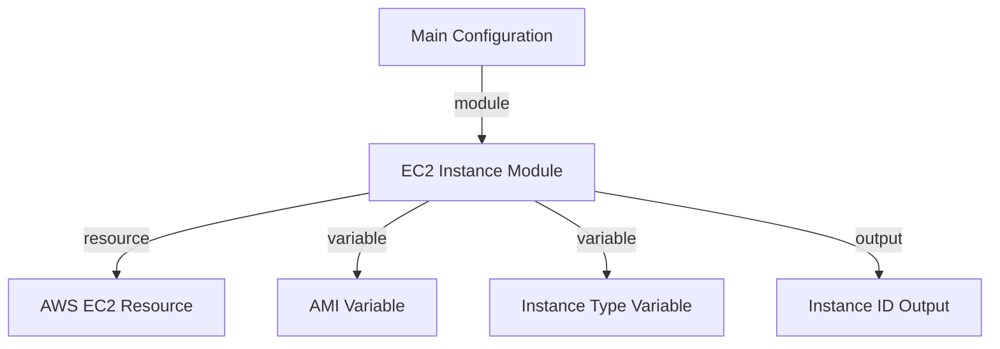

## Introduction to Terraform Modules

Terraform is an infrastructure as code (IaC) tool that allows you to define and manage your infrastructure using declarative configuration files. One of the key features of Terraform is the ability to create reusable modules. A module is a collection of Terraform configuration files that encapsulate a specific piece of infrastructure. By using modules, you can break down large and complex Terraform configurations into smaller, more manageable pieces, making your code easier to understand, maintain, and reuse.

### Why Use Modules?

Modules provide several benefits:

1. **Reusability**: You can reuse the same module across different projects or environments.
2. **Encapsulation**: Modules encapsulate the details of the infrastructure they manage, hiding the complexity from the rest of the configuration.
3. **Maintainability**: Smaller, modular configurations are easier to maintain and update.
4. **Consistency**: Using modules ensures consistency across different parts of your infrastructure.

### Example Scenario

Consider a scenario where you are managing multiple AWS EC2 instances across different environments (development, staging, production). Instead of duplicating the configuration for each environment, you can create a reusable module that defines the EC2 instance setup. This module can then be used in each environment with minimal changes.

### Setting Up a Module Branch

Before diving into creating modules, it’s important to set up a dedicated branch for your module development. This ensures that your changes do not affect the existing branches and allows you to experiment freely.

```bash
git checkout -b modules
```

This command creates a new branch named `modules` and switches to it. Now, you can make changes in this branch without affecting the other branches.

### Organizing Your Configuration Files

A best practice in Terraform is to organize your configuration files into separate files based on their purpose. This makes your configuration more readable and maintainable. The following files are commonly used:

- `main.tf`: Contains the resource definitions.
- `variables.tf`: Defines the input variables.
- `outputs.tf`: Defines the output values.
- `providers.tf`: Specifies the providers.

#### Example Directory Structure

```
my-project/
├── main.tf
├── variables.tf
├── outputs.tf
├── providers.tf
└── modules/
    └── ec2_instance/
        ├── main.tf
        ├── variables.tf
        ├── outputs.tf
        └── providers.tf
```

### Cleaning Up the Main Configuration File

Before creating modules, it’s a good idea to clean up your main configuration file (`main.tf`). This involves moving the output definitions to `outputs.tf`, the variable definitions to `variables.tf`, and the provider definitions to `providers.tf`.

#### Step-by-Step Cleanup

1. **Move Outputs to `outputs.tf`**

   ```terraform
   // main.tf
   resource "aws_instance" "example" {
     ami           = var.ami
     instance_type = var.instance_type
   }

   // outputs.tf
   output "instance_id" {
     value = aws_instance.example.id
   }
   ```

2. **Move Variables to `variables.tf`**

   ```terraform
   // main.tf
   resource "aws_instance" "example" {
     ami           = var.ami
     instance_type = var.instance_type
   }

   // variables.tf
   variable "ami" {
     description = "The AMI to use for the EC2 instance."
     type        = string
   }

   variable "instance_type" {
     description = "The instance type to use for the EC2 instance."
     type        = string
   }
   ```

3. **Move Providers to `providers.tf`**

   ```terraform
   // main.tf
   resource "aws_instance" "example" {
     ami           = var.ami
     instance_type = var.instance_type
   }

   // providers.tf
   provider "aws" {
     region = "us-west-2"
   }
   ```

### Creating a Reusable Module

Now that your main configuration file is cleaned up, you can start creating a reusable module. Let’s create a module for an EC2 instance.

#### Step-by-Step Module Creation

1. **Create the Module Directory**

   ```bash
   mkdir -p modules/ec2_instance
   ```

2. **Define the Module Resources**

   In the `main.tf` file within the module directory, define the resources that the module will manage.

   ```terraform
   // modules/ec2_instance/main.tf
   resource "aws_instance" "example" {
     ami           = var.ami
     instance_type = var.instance_type
   }
   ```

3. **Define the Module Variables**

   In the `variables.tf` file within the module directory, define the input variables that the module will accept.

   ```terraform
   // modules/ec2_instance/variables.tf
   variable "ami" {
     description = "The AMI to use for the EC2 instance."
     type        = string
   }

   variable "instance_type" {
     description = "The instance type to use for the EC2 instance."
     type        = string
   }
   ```

4. **Define the Module Outputs**

   In the `outputs.tf` file within the module directory, define the output values that the module will produce.

   ```terraform
   // modules/ec2_instance/outputs.tf
   output "instance_id" {
     value = aws_instance.example.id
   }
   ```

5. **Use the Module in Your Main Configuration**

   In your main configuration file (`main.tf`), use the module by referencing it.

   ```terraform
   // main.tf
   module "ec2_instance" {
     source = "./modules/ec2_instance"

     ami           = var.ami
     instance_type = var.instance_type
   }
   ```

### Mermaid Diagrams

To visualize the structure of your Terraform configuration, you can use Mermaid diagrams. Here’s an example of a Mermaid diagram showing the relationship between the main configuration and the module.



### Real-World Examples

#### Example 1: Reusing Modules Across Environments

Suppose you have a multi-environment setup (development, staging, production). You can use the same EC2 instance module in each environment with different input variables.

```terraform
// main.tf
module "dev_ec2_instance" {
  source = "./modules/ec2_instance"

  ami           = var.dev_ami
  instance_type = var.dev_instance_type
}

module "staging_ec2_instance" {
  source = "./modules/ec2_instance"

  ami           = var.staging_ami
  instance_type = var.staging_instance_type
}

module "prod_ec2_instance" {
  source = "./modules/ec2_instance"

  ami           = var.prod_ami
  instance_type = var.prod_instance_type
}
```

#### Example 2: Reusing Modules Across Projects

You can also reuse the same module across different projects. For example, you might have a module for setting up a database server that you can use in multiple projects.

```terraform
// main.tf
module "database_server" {
  source = "./modules/database_server"

  db_engine = var.db_engine
  db_size   = var.db_size
}
```

### Pitfalls and Best Practices

#### Common Mistakes

1. **Overcomplicating Modules**: Avoid creating overly complex modules that are difficult to understand and maintain.
2. **Inconsistent Naming**: Ensure consistent naming conventions for modules, variables, and outputs.
3. **Hardcoding Values**: Avoid hardcoding values in your modules. Use variables instead to make your modules more flexible.

#### Best Practices

1. **Document Your Modules**: Add documentation to your modules to explain their purpose, inputs, and outputs.
2. **Version Control**: Use version control to manage changes to your modules.
3. **Testing**: Test your modules thoroughly to ensure they work as expected.

### How to Prevent / Defend

#### Detection

1. **Code Reviews**: Regularly review your Terraform code to ensure that modules are being used correctly.
2. **Automated Testing**: Use automated testing tools to verify that your modules work as expected.

#### Prevention

1. **Secure Coding Practices**: Follow secure coding practices when writing your modules.
2. **Least Privilege Principle**: Ensure that your modules only have the permissions necessary to perform their tasks.

#### Secure Code Fix

Here’s an example of a vulnerable module and its secure version.

**Vulnerable Module**

```terraform
// modules/vulnerable/main.tf
resource "aws_s3_bucket" "example" {
  bucket = var.bucket_name
  acl    = "public-read"
}
```

**Secure Module**

```terraform
// modules/secure/main.tf
resource "aws_s3_bucket" "example" {
  bucket = var.bucket_name
  acl    = "private"
}
```

### Complete Example

Here’s a complete example of a Terraform configuration using modules.

#### Directory Structure

```
my-project/
├── main.tf
├── variables.tf
├── outputs.tf
├── providers.tf
└── modules/
    └── ec2_instance/
        ├── main.tf
        ├── variables.tf
        ├── outputs.tf
        └── providers.tf
```

#### Configuration Files

```terraform
// main.tf
provider "aws" {
  region = "us-west-2"
}

module "ec2_instance" {
  source = "./modules/ec2_instance"

  ami           = var.ami
  instance_type = var.instance_type
}

output "instance_id" {
  value = module.ec2_instance.instance_id
}
```

```terraform
// variables.tf
variable "ami" {
  description = "The AMI to use for the EC2 instance."
  type        = string
}

variable "instance_type" {
  escription = "The instance type to use for the EC2 instance."
  type        = string
}
```

```terraform
// outputs.tf
output "instance_id" {
  value = module.ec2_instance.instance_id
}
```

```terraform
// providers.tf
provider "aws" {
  region = "us-west-2"
}
```

```terraform
// modules/ec2_instance/main.tf
resource "aws_instance" "example" {
  ami           = var.ami
  instance_type = var.instance_type
}
```

```terraform
// modules/ec2_instance/variables.tf
variable "ami" {
  description = "The AMI to use for the EC2 instance."
  type        = string
}

variable "instance_type" {
  description = "The instance type to use for the EC2 instance."
  type        = string
}
```

```terraform
// modules/ec2_instance/outputs.tf
output "instance_id" {
  value = aws_instance.example.id
}
```

### Conclusion

Creating reusable modules in Terraform is a powerful technique that can significantly improve the maintainability and scalability of your infrastructure as code. By organizing your configuration files and using modules effectively, you can create more robust and flexible Terraform configurations. Always follow best practices and secure coding guidelines to ensure that your modules are reliable and secure.

### Practice Labs

For hands-on experience with Terraform modules, consider the following labs:

- **PortSwigger Web Security Academy**: Offers a variety of labs related to web application security, including some that involve Terraform.
- **OWASP Juice Shop**: A deliberately insecure web application for security training.
- **DVWA (Damn Vulnerable Web Application)**: Another popular web application for security training.
- **WebGoat**: An interactive web application security training tool.

These labs provide practical experience with Terraform and help reinforce the concepts covered in this chapter.

---
<!-- nav -->
[[01-Introduction to Reusable Modules in Terraform Projects|Introduction to Reusable Modules in Terraform Projects]] | [[DevOps/DevOps Bootcamp/08-Infrastructure as Code (Terraform)/07-Creating Reusable Modules in Terraform Projects/00-Overview|Overview]] | [[03-Creating Reusable Modules in Terraform Projects|Creating Reusable Modules in Terraform Projects]]
