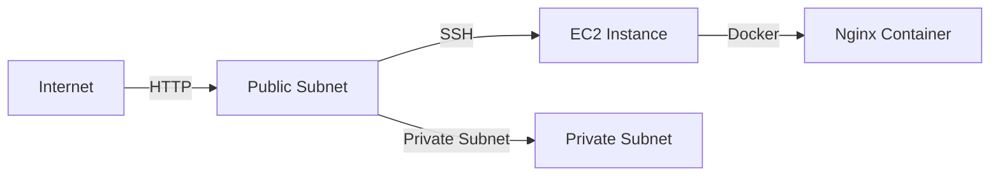

## Introduction to Deploying Docker Containers on AWS EC2 with Terraform

In this section, we will delve into the process of deploying Docker containers on Amazon Web Services (AWS) Elastic Compute Cloud (EC2) using Terraform. This approach allows us to automate the creation and management of our infrastructure, ensuring consistency and scalability. We will cover the necessary steps to set up a secure environment, including configuring security groups, opening firewall rules, and setting up SSH access.

### Background Theory

Before diving into the practical aspects, let's understand the underlying concepts:

#### What is Docker?
Docker is an open-source platform that automates the deployment, scaling, and management of applications inside lightweight containers. Containers allow developers to package up their applications with all of their dependencies into a standardized unit for software development.

#### What is AWS EC2?
Amazon EC2 is a web service that provides resizable compute capacity in the cloud. It allows users to launch virtual servers, called instances, with various configurations to run applications.

#### What is Terraform?
Terraform is an open-source infrastructure as code (IaC) tool that allows you to define and provision your infrastructure using declarative configuration files. It supports a wide range of cloud providers, including AWS.

### Setting Up the Environment

To deploy Docker containers on AWS EC2 using Terraform, we need to configure several components:

1. **Security Group**: A security group acts as a virtual firewall for your EC2 instance to control inbound and outbound traffic. It is stateful, meaning that return traffic is automatically allowed to pass through.
2. **Firewall Rules**: These rules determine which traffic is allowed to reach your EC2 instance.
3. **SSH Access**: Secure Shell (SSH) is a cryptographic network protocol for operating network services securely over an unsecured network.

### Creating a Security Group

A security group is essential for controlling access to your EC2 instance. Let's create a security group that allows both HTTP traffic and SSH access.

#### Step-by-Step Process

1. **Define the Security Group in Terraform**:
   We will use Terraform to define the security group and its associated rules.

```hcl
resource "aws_security_group" "web_server_sg" {
  name        = "web_server_sg"
  description = "Allow HTTP and SSH access"
  vpc_id      = aws_vpc.main.id

  ingress {
    from_port   = 80
    to_port     = 80
    protocol    = "tcp"
    cidr_blocks = ["0.0.0.0/0"]
  }

  ingress {
    from_port   = 22
    to_port     = 22
    protocol    = "tcp"
    cidr_blocks = ["0.0.0.0/0"]
  }

  egress {
    from_port   = 0
    to_port     = 0
    protocol    = "-1"
    cidr_blocks = ["0.0.0.0/0"]
  }
}
```

2. **Explanation of the Code**:
   - `aws_security_group`: This resource type defines a security group.
   - `name`: The name of the security group.
   - `description`: A description of the security group.
   - `vpc_id`: The ID of the VPC to which the security group belongs.
   - `ingress`: Defines the inbound rules for the security group.
     - `from_port` and `to_port`: The port range for the rule.
     - `protocol`: The protocol used (TCP in this case).
     - `cidr_blocks`: The IP address range that is allowed to access the ports.
   - `egress`: Defines the outbound rules for the security group.
     - `from_port` and `to_port`: The port range for the rule.
     - `protocol`: The protocol used (all protocols in this case).
     - `cidr_blocks`: The IP address range that is allowed to send traffic from the ports.

### Creating a VPC and Subnets

When deploying multiple servers, it is best practice to create a custom VPC and subnets rather than using the default ones provided by AWS. This allows for better control and isolation of resources.

#### Step-by-Step Process

1. **Define the VPC in Terraform**:
   We will define a VPC and its associated subnets.

```hcl
resource "aws_vpc" "main" {
  cidr_block           = "10.0.0.0/16"
  enable_dns_hostnames = true
  enable_dns_support   = true
}

resource "aws_subnet" "public" {
  vpc_id                  = aws_vpc.main.id
  cidr_block              = "10.0.1.0/24"
  availability_zone       = "us-west-2a"
  map_public_ip_on_launch = true
}

resource "aws_subnet" "private" {
  vpc_id                  = aws_vpc.main.id
  cidr_block              = "11.0.1.0/24"
  availability_zone       = "us-west-2b"
  map_public_ip_on_launch = false
}
```

2. **Explanation of the Code**:
   - `aws_vpc`: This resource type defines a VPC.
     - `cidr_block`: The CIDR block for the VPC.
     - `enable_dns_hostnames`: Enables DNS hostnames for the VPC.
     - `enable_dns_support`: Enables DNS support for the VPC.
   - `aws_subnet`: This resource type defines a subnet within the VPC.
     - `vpc_id`: The ID of the VPC to which the subnet belongs.
     - `cidr_block`: The CIDR block for the subnet.
     - `availability_zone`: The availability zone for the subnet.
     - `map_public_ip_on_launch`: Determines whether instances launched in the subnet receive a public IP address.

### Deploying the EC2 Instance

Now that we have defined the VPC, subnets, and security group, we can proceed to deploy the EC2 instance.

#### Step-by-Step Process

1. **Define the EC2 Instance in Terraform**:
   We will define an EC2 instance that uses the security group and runs a Docker container.

```hcl
resource "aws_instance" "web_server" {
  ami           = "ami-0c55b159cbfafe1f0"
  instance_type = "t2.micro"
  subnet_id     = aws_subnet.public.id
  vpc_security_group_ids = [aws_security_group.web_server_sg.id]

  user_data = <<-EOF
              #!/bin/bash
              sudo apt-get update -y
              sudo apt-get install -y docker.io
              sudo systemctl start docker
              sudo systemctl enable docker
              docker run -d -p 80:80 nginx
              EOF
}
```

2. **Explanation of the Code**:
   - `aws_instance`: This resource type defines an EC2 instance.
     - `ami`: The Amazon Machine Image (AMI) to use for the instance.
     - `instance_type`: The type of instance to launch.
     - `subnet_id`: The ID of the subnet in which the instance will be launched.
     - `vpc_security_group_ids`: The IDs of the security groups to associate with the instance.
     - `user_data`: The user data script that runs when the instance launches.
       - `sudo apt-get update -y`: Updates the package list.
       - `sudo apt-get install -y docker.io`: Installs Docker.
       - `sudo systemctl start docker`: Starts the Docker service.
       - `sudo systemctl enable docker`: Enables the Docker service to start on boot.
       - `docker run -d -p 80:80 nginx`: Runs an Nginx container in detached mode, mapping port 80 on the host to port 80 in the container.

### Testing the Deployment

Once the deployment is complete, we can test the setup by accessing the EC2 instance via SSH and verifying that the Nginx container is running.

#### Step-by-Step Process

1. **Access the EC2 Instance via SSH**:
   Use the SSH command to connect to the EC2 instance.

```sh
ssh -i <path_to_key_pair> ec2-user@<public_ip_address>
```

2. **Verify the Nginx Container**:
   Once connected, check the status of the Nginx container.

```sh
docker ps
```

### Security Considerations

While the above setup allows for basic deployment, it is crucial to consider security best practices to protect your infrastructure.

#### How to Prevent / Defend

1. **Limit CIDR Blocks**:
   Instead of allowing traffic from all IP addresses (`0.0.0.0/0`), limit the CIDR blocks to specific ranges or your own IP address.

```hcl
ingress {
  from_port   = 80
  to_port     = 80
  protocol    = "tcp"
  cidr_blocks = ["<your_ip_address>/32"]
}
```

2. **Use IAM Roles**:
   Assign IAM roles to your EC2 instances to control access to other AWS resources.

3. **Enable SSH Key Pair Authentication**:
   Ensure that SSH access is restricted to key pairs rather than passwords.

4. **Regularly Update and Patch**:
   Keep your AMIs and Docker images up-to-date to mitigate vulnerabilities.

### Real-World Examples

#### Recent Breaches and CVEs

- **CVE-2021-21277**: A vulnerability in Docker that could allow an attacker to escalate privileges and execute arbitrary code.
- **CVE-2021-44228 (Log4Shell)**: A critical vulnerability in Apache Log4j that could be exploited to take over systems running Docker containers.

### Diagrams

#### Network Topology



### Conclusion

Deploying Docker containers on AWS EC2 using Terraform provides a robust and scalable solution for managing your infrastructure. By following best practices and implementing proper security measures, you can ensure that your deployment is secure and reliable.

### Practice Labs

For hands-on experience, consider the following labs:

- **PortSwigger Web Security Academy**: Offers comprehensive training on web application security.
- **OWASP Juice Shop**: A deliberately insecure web application for practicing web security skills.
- **DVWA (Damn Vulnerable Web Application)**: A PHP/MySQL web application that is riddled with vulnerabilities.
- **WebGoat**: An interactive, gamified training application for learning about web application security.

By completing these labs, you can gain practical experience in deploying and securing Docker containers on AWS EC2 using Terraform.

---
<!-- nav -->
[[DevOps/DevOps Bootcamp/08-Infrastructure as Code (Terraform)/08-Deploying Docker Containers on AWS EC2 with Terraform/00-Overview|Overview]] | [[02-Introduction to Route Tables in AWS VPC|Introduction to Route Tables in AWS VPC]]
