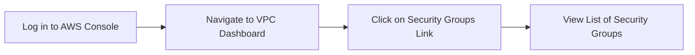
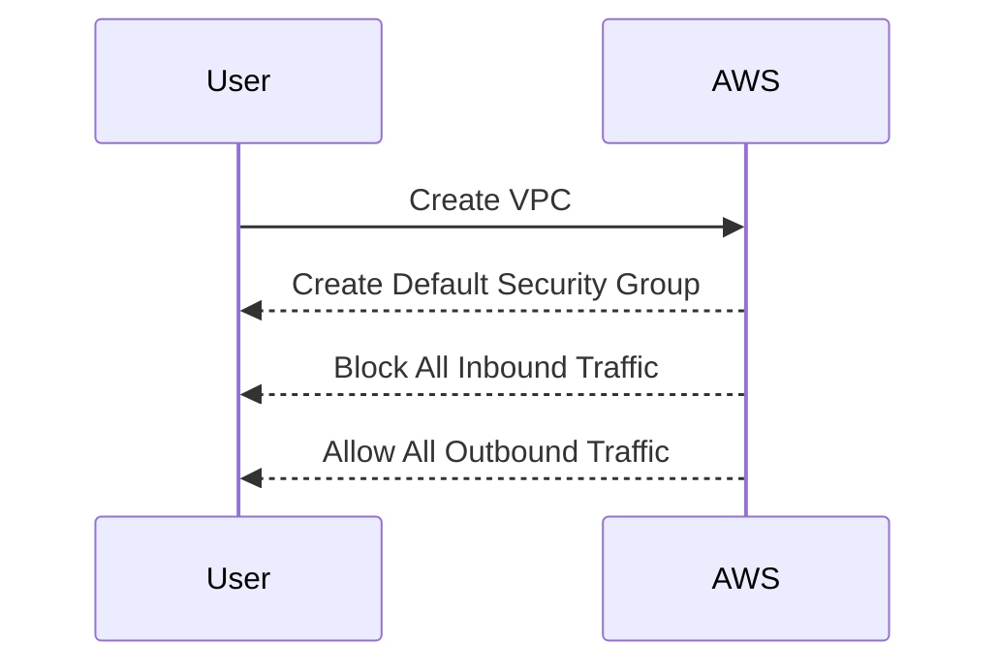

## Introduction to Terraform and AWS EC2 Deployment

### What is Terraform?

Terraform is an open-source infrastructure as code (IaC) tool developed by HashiCorp. It allows you to define and provision your infrastructure using declarative configuration files written in the HashiCorp Configuration Language (HCL). This approach enables you to manage your infrastructure in a consistent and repeatable manner, reducing human error and improving overall system reliability.

### Why Use Terraform?

Using Terraform provides several benefits:

1. **Consistency**: Terraform ensures that your infrastructure is consistently deployed across different environments (development, staging, production).
2. **Version Control**: You can store your Terraform configurations in version control systems like Git, allowing you to track changes and collaborate with other team members.
3. **Automation**: Terraform automates the deployment process, making it easier to scale and manage complex infrastructures.
4. **Resource Management**: Terraform manages dependencies between resources, ensuring that they are created and destroyed in the correct order.

### How Does Terraform Work?

Terraform operates by defining a desired state of your infrastructure through configuration files. These files describe the resources you want to create, such as EC2 instances, security groups, and VPCs. Terraform then compares the current state of your infrastructure with the desired state and applies the necessary changes to achieve the desired state.

### Terraform Plan Command

The `terraform plan` command is used to preview the changes that will be applied to your infrastructure. It generates an execution plan based on the differences between the current state and the desired state specified in your configuration files. This allows you to review the changes before applying them.

#### Example: Terraform Plan Output

```hcl
resource "aws_security_group" "example" {
  name        = "example"
  description = "Example security group"
  vpc_id      = aws_vpc.example.id

  ingress {
    from_port   = 22
    to_port     = 22
    protocol    = "tcp"
    cidr_blocks = ["0.0.0.0/0"]
  }

  egress {
    from_port   = 0
    to_port     = 0
    protocol    = "-1"
    cidr_blocks = ["0.0.0.0/0"]
  }
}
```

When you run `terraform plan`, Terraform will validate the configuration and display the planned changes:

```sh
$ terraform plan
Refreshing Terraform state in-memory prior to plan...
The refreshed state will be used to calculate this plan, but will not be persisted to local or remote state storage.

------------------------------------------------------------------------

An execution plan has been generated and is shown below.
Resource actions are indicated with the following symbols:
  + create

Terraform will perform the following actions:

  # aws_security_group.example will be created
  + resource "aws_security_group" "example" {
      + arn                  = (known after apply)
      + description          = "Example security group"
      + egress               = [
          + {
              + cidr_blocks = [
                  + "0.0.0.0/0",
                ]
              + description = ""
              + from_port   = 0
              + ipv6_cidr_blocks = []
              + prefix_list_ids = []
              + protocol     = "-1"
              + security_groups = []
              + self         = false
              + to_port      = 0
            },
        ]
      + id                   = (known after apply)
      + ingress              = [
          + {
              + cidr_blocks = [
                  + "0.0.0.0/0",
                ]
              + description = ""
              + from_port   = 22
              + ipv6_cidr_blocks = []
              + prefix_list_ids = []
              + protocol     = "tcp"
              + security_groups = []
              + self         = false
              + to_port      = 22
            },
        ]
      + name                 = "example"
      + owner_id             = (known after apply)
      + tags_all             = (known after apply)
      + vpc_id               = (known after apply)
    }

Plan: 1 to add, 0 to change, 0 to destroy.

------------------------------------------------------------------------

Note: You didn't specify the "-out" option to save this plan, so Terraform can't guarantee that exactly these actions will be performed if "terraform apply" is subsequently run.
```

### In-Built Validation in Terraform

One of the key features of Terraform is its in-built validation. When you run `terraform plan`, Terraform checks your configuration files for syntax errors, undefined attributes, and undeclared variables. If any issues are found, Terraform will display an error message indicating the exact line and nature of the error.

#### Example: Syntax Error

Consider the following incorrect Terraform configuration:

```hcl
resource "aws_security_group" "example" {
  name        = "example"
  description = "Example security group"
  vpc_id      = aws_vpc.example.id

  ingress {
    from_port   = 22
    to_port     = 22
    protocol    = "tcp"
    cidr_blocks = ["0.0.0.0/0"]
  }

  egress {
    from_port   = 0
    to_port     = 0
    protocol    = "-1"
    cidr_blocks = ["0.0.0.0/0"]
  }
}
```

If you accidentally misspell the `cidr_blocks` attribute as `cidr_block`, Terraform will display an error:

```sh
$ terraform plan
╷
│ Error: Unsupported argument
│ 
│   on main.tf line 10, in resource "aws_security_group" "example":
│   10:   cidr_block = ["0.0.0.0/0"]
│ 
│ An argument named "cidr_block" is not expected here.
```

This error message indicates that the `cidr_block` attribute is not recognized, and you should correct it to `cidr_blocks`.

### Correcting Configuration Errors

To correct the configuration error, you need to ensure that all attributes are spelled correctly and that all required variables are declared. In the previous example, you would correct the `cidr_block` attribute to `cidr_blocks`.

#### Corrected Configuration

```hcl
resource "aws_security_group" "example" {
  name        = "example"
  description = "Example security group"
  vpc_id      = aws_vpc.example.id

  ingress {
    from_port   = 22
    to_port     = 22
    protocol    = "tcp"
    cidr_blocks = ["0.0.0.0/0"]
  }

  egress {
    from_port   = 0
    to_port     = 0
    protocol    = "-1"
    cidr_blocks = ["0.0.0.0/0"]
  }
}
```

After correcting the configuration, you can run `terraform plan` again to verify that the configuration is valid.

### Applying the Configuration

Once you have verified that the configuration is valid, you can apply the changes using the `terraform apply` command. This command will create the resources specified in your configuration files.

#### Example: Applying the Configuration

```sh
$ terraform apply
aws_security_group.example: Creating...
  description: "" => "Example security group"
  egress.#: "" => "1"
  ingress.#: "" => "1"
  name: "" => "example"
  vpc_id: "" => "vpc-12345678"

Apply complete! Resources: 1 added, 0 changed, 0 destroyed.
```

### Managing Security Groups in AWS EC2

Security groups are a fundamental component of AWS EC2. They act as virtual firewalls that control inbound and outbound traffic to your EC2 instances. Each security group is associated with a specific VPC and can be attached to one or more EC2 instances.

#### Default Security Groups

When you create a new VPC, AWS automatically creates a default security group for that VPC. This default security group has a default configuration that blocks all inbound traffic and allows all outbound traffic. This means that by default, no traffic is allowed into the VPC unless explicitly configured.

#### Custom Security Groups

In addition to the default security group, you can create custom security groups to fine-tune the access rules for your EC2 instances. Custom security groups allow you to specify which ports and protocols are allowed, as well as the source IP addresses that are permitted to access your instances.

#### Example: Custom Security Group Configuration

```hcl
resource "aws_security_group" "custom_sg" {
  name        = "custom_sg"
  description = "Custom security group"
  vpc_id      = aws_vpc.example.id

  ingress {
    from_port   = 80
    to_port     = 80
    protocol    = "tcp"
    cidr_blocks = ["0.0.0.0/0"]
  }

  ingress {
    from_port   = 443
    to_port     = 443
    protocol    = "tcp"
    cidr_blocks = ["0.0.0.0/0"]
  }

  egress {
    from_port   = 0
    to_port     = 0
    protocol    = "-1"
    cidr_blocks = ["0.0.0.0/0"]
  }
}
```

### Finding Security Groups in the VPC Section

Once you have created your security groups, you can find them in the VPC section of the AWS Management Console. To do this, follow these steps:

1. Log in to the AWS Management Console.
2. Navigate to the VPC dashboard.
3. Click on the "Security Groups" link in the left-hand menu.
4. You will see a list of all security groups associated with your VPC.

#### Example: Viewing Security Groups in the AWS Console



### Default Security Group Configuration

As mentioned earlier, AWS creates a default security group for each VPC. This default security group has a default configuration that blocks all inbound traffic and allows all outbound traffic. This means that by default, no traffic is allowed into the VPC unless explicitly configured.

#### Example: Default Security Group Configuration



### How to Prevent / Defend Against Security Group Misconfigurations

Misconfigured security groups can lead to security vulnerabilities, such as unauthorized access to your EC2 instances. To prevent these issues, you should follow these best practices:

1. **Use Least Privilege**: Only allow the minimum necessary access to your EC2 instances. Avoid using broad CIDR ranges like `0.0.0.0/0` unless absolutely necessary.
2. **Regularly Review Security Groups**: Periodically review your security group configurations to ensure that they are still appropriate for your environment.
3. **Use Security Group Tags**: Tag your security groups to help identify their purpose and ownership.
4. **Automate Security Group Management**: Use tools like Terraform to automate the management of your security groups and ensure consistency across your environment.
5. **Enable VPC Flow Logs**: Enable VPC flow logs to monitor network traffic and detect any unusual activity.

#### Example: Secure Security Group Configuration

```hcl
resource "aws_security_group" "secure_sg" {
  name        = "secure_sg"
  description = "Secure security group"
  vpc_id      = aws_vpc.example.id

  ingress {
    from_port   = 80
    to_port     = 80
    protocol    = "tcp"
    cidr_blocks = ["10.0.0.0/24"]
  }

  ingress {
    from_port   = 443
    to_port     = 443
    protocol    = "tcp"
    cidr_blocks = ["10.0.0.0/24"]
  }

  egress {
    from_port   = 0
    to_port     = 0
    protocol    = "-1"
    cidr_blocks = ["0.0.0.0/0"]
  }
}
```

### Real-World Examples of Security Group Misconfigurations

Several high-profile breaches have occurred due to misconfigured security groups. For example, in 2019, Capital One suffered a data breach that exposed the personal information of over 100 million customers. The breach was caused by a misconfigured security group that allowed unauthorized access to the company's AWS S3 buckets.

#### Example: CVE-2019-11477

CVE-2019-11477 is a vulnerability that affects AWS security groups. This vulnerability occurs when a security group is configured to allow inbound traffic from a broad CIDR range, such as `0.0.0.0/0`. This can allow unauthorized access to your EC2 instances.

To prevent this vulnerability, you should avoid using broad CIDR ranges and instead use more restrictive ranges that only allow access from trusted sources.

#### Example: Secure vs Vulnerable Configuration

```hcl
// Vulnerable Configuration
resource "aws_security_group" "vulnerable_sg" {
  name        = "vulnerable_sg"
  description = "Vulnerable security group"
  vpc_id      = aws_vpc.example.id

  ingress {
    from_port   = 80
    to_port     = 80
    protocol    = "tcp"
    cidr_blocks = ["0.0.0.0/0"]
  }

  ingress {
    from_port   = 443
    to_port     = 443
    protocol    = "tcp"
    cidr_blocks = ["0.0.0.0/0"]
  }

  egress {
    from_port   = 0
    to_port     = 0
    protocol    = "-1"
    cidr_blocks = ["0.0.0.0/0"]
  }
}

// Secure Configuration
resource "aws_security_group" "secure_sg" {
  name        = "secure_sg"
  description = "Secure security group"
  vpc_id      = aws_vpc.example.id

  ingress {
    from_port   = 80
    to_port     = 80
    protocol    = "tcp"
    cidr_blocks = ["10.0.0.0/24"]
  }

  ingress {
    from_port   = 443
    to_port     = 443
    protocol    = "tcp"
    cidr_blocks = ["10.0.0.0/24"]
  }

  egress {
    from_port   = 0
    to_port     = 0
    protocol    = "-1"
    cidr_blocks = ["0.0.0.0/0"]
  }
}
```

### Hands-On Labs for Practice

To gain hands-on experience with deploying Docker containers on AWS EC2 using Terraform, you can use the following labs:

- **PortSwigger Web Security Academy**: This lab provides a comprehensive set of exercises to practice web application security.
- **OWASP Juice Shop**: This lab is a deliberately insecure web application that you can use to practice various security techniques.
- **DVWA (Damn Vulnerable Web Application)**: This lab is a PHP/MySQL web application that you can use to practice web application security.
- **WebGoat**: This lab is a deliberately insecure web application that you can use to practice various security techniques.

These labs provide a safe environment to practice and learn about deploying Docker containers on AWS EC2 using Terraform.

### Conclusion

Deploying Docker containers on AWS EC2 using Terraform is a powerful way to manage your infrastructure in a consistent and repeatable manner. By following best practices and using tools like Terraform, you can ensure that your infrastructure is secure and reliable. Regularly reviewing and securing your security group configurations is crucial to preventing security vulnerabilities.

---
<!-- nav -->
[[03-Introduction to Security Groups in AWS EC2|Introduction to Security Groups in AWS EC2]] | [[DevOps/DevOps Bootcamp/08-Infrastructure as Code (Terraform)/08-Deploying Docker Containers on AWS EC2 with Terraform/00-Overview|Overview]] | [[05-Introduction to Terraform and AWS Infrastructure Deployment|Introduction to Terraform and AWS Infrastructure Deployment]]
