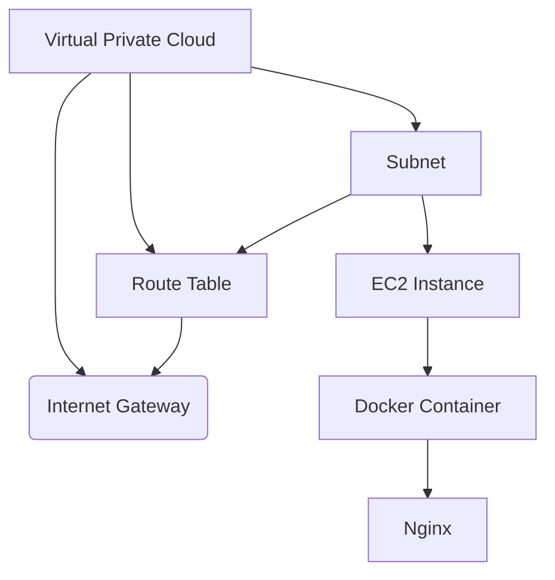

## Introduction to Terraform and AWS Infrastructure Deployment

In this section, we will delve into the process of deploying Docker containers on AWS EC2 instances using Terraform. This approach allows us to automate the creation and management of infrastructure as code, ensuring consistency and reliability across deployments. We'll start by covering the basics of Terraform and then move on to creating a realistic use case involving an EC2 instance and a Docker container.

### What is Terraform?

Terraform is an open-source infrastructure as code (IaC) tool developed by HashiCorp. It allows you to define and provision your infrastructure using declarative configuration files written in the HashiCorp Configuration Language (HCL). Terraform supports a wide range of cloud providers, including AWS, Azure, Google Cloud Platform, and more.

#### Why Use Terraform?

1. **Consistency**: Terraform ensures that your infrastructure is consistently deployed across different environments (development, staging, production).
2. **Version Control**: You can store your Terraform configurations in version control systems like Git, allowing you to track changes and collaborate with team members.
3. **Automation**: Terraform automates the provisioning and management of infrastructure, reducing manual errors and saving time.
4. **Multi-Cloud Support**: Terraform supports multiple cloud providers, making it easier to manage hybrid cloud environments.

### Basic Syntax of Terraform

Before diving into the deployment process, let's review the basic syntax of Terraform:

```hcl
provider "aws" {
  region = "us-west-2"
}

resource "aws_instance" "example" {
  ami           = "ami-0c55b159cbfafe1f0"
  instance_type = "t2.micro"

  tags = {
    Name = "example-instance"
  }
}
```

- **Provider Block**: Specifies the cloud provider and its configuration.
- **Resource Block**: Defines the resources to be created, such as EC2 instances, VPCs, subnets, etc.

### Creating an AWS VPC

To deploy our EC2 instance, we need to create a Virtual Private Cloud (VPC) on AWS. A VPC is a logically isolated section of the AWS Cloud where you can launch AWS resources in a virtual network that you define.

#### Why Create a Custom VPC?

Using a custom VPC provides better control over your network environment, allowing you to define subnets, routing tables, and security groups according to your specific requirements.

#### Steps to Create a VPC

1. **Define the VPC**: Specify the CIDR block and other properties.
2. **Create Subnets**: Define one or more subnets within the VPC.
3. **Set Up Internet Gateway**: Allow traffic to and from the VPC with the internet.

Here’s an example of how to create a VPC using Terraform:

```hcl
provider "aws" {
  region = "us-west-2"
}

resource "aws_vpc" "example" {
  cidr_block = "10.0.0.0/16"
}

resource "aws_subnet" "example" {
  vpc_id     = aws_vpc.example.id
  cidr_block = "10.0.1.0/24"
  availability_zone = "us-west-2a"
}

resource "aws_internet_gateway" "example" {
  vpc_id = aws_vpc.example.id
}
```

### Connecting the VPC to the Internet

To allow traffic to and from the VPC with the internet, we need to set up an Internet Gateway and route tables.

#### Internet Gateway

An Internet Gateway is a horizontally scaled, redundant, and highly available VPC component that allows communication between your VPC and the internet.

#### Route Tables

Route tables determine where network traffic from your subnet is directed. By associating a subnet with a route table that includes a route to the internet gateway, you enable internet access.

Here’s how to set up the route table:

```hcl
resource "aws_route_table" "example" {
  vpc_id = aws_vpc.example.id

  route {
    cidr_block = "0.0.0.0/0"
    gateway_id = aws_internet_gateway.example.id
  }
}

resource "aws_route_table_association" "example" {
  subnet_id      = aws_subnet.example.id
  route_table_id = aws_route_table.example.id
}
```

### Deploying an EC2 Instance

Now that we have our VPC and internet connectivity set up, we can proceed to deploy an EC2 instance within the subnet.

#### EC2 Instance Configuration

The EC2 instance will run a simple Docker container. We’ll use the `EngineX` Docker image for this example.

Here’s how to configure the EC2 instance:

```hcl
resource "aws_instance" "example" {
  ami           = "ami-0c55b159cbfafe1f0"
  instance_type = "t2.micro"
  subnet_id     = aws_subnet.example.id

  tags = {
    Name = "example-instance"
  }

  user_data = <<-EOF
              #!/bin/bash
              sudo apt-get update
              sudo apt-get install -y docker.io
              sudo service docker start
              sudo docker run -d -p 80:8080 ngnix
              EOF
}
```

### Full Terraform Configuration

Combining all the steps, here’s the complete Terraform configuration:

```hcl
provider "aws" {
  region = "us-west-2"
}

resource "aws_vpc" "example" {
  cidr_block = "10.0.0.0/16"
}

resource "aws_subnet" "example" {
  vpc_id     = aws_vpc.example.id
  cidr_block = "10.0.1.0/24"
  availability_zone = "us-west-2a"
}

resource "aws_internet_gateway" "example" {
  vpc_id = aws_vpc.example.id
}

resource "aws_route_table" "example" {
  vpc_id = aws_vpc.example.id

  route {
    cidr_block = "0.0.0.0/0"
    gateway_id = aws_internet_gateway.example.id
  }
}

resource "aws_route_table_association" "example" {
  subnet_id      = aws_subnet.example.id
  route_table_id = aws_route_table.example.id
}

resource "aws_instance" "example" {
  ami           = "ami-0c55b159cbfafe1f0"
  instance_type = "  t2.micro"
  subnet_id     = aws_subnet.example.id

  tags = {
    Name = "example-instance"
  }

  user_data = <<-EOF
              #!/bin/bash
              sudo apt-get update
              sudo apt-get install -y docker.io
              sudo service docker start
              sudo docker run -d -p 80:8080 ngnix
              EOF
}
```

### Network Topology Diagram

Let's visualize the network topology using a Mermaid diagram:



### Common Pitfalls and How to Prevent Them

#### 1. Incorrect CIDR Block

**Issue**: Using an incorrect CIDR block can lead to IP address conflicts and network issues.

**Prevention**: Always validate the CIDR block against your existing network infrastructure. Use tools like `ipcalc` to check the validity of the CIDR block.

#### 2. Missing Internet Gateway

**Issue**: Without an internet gateway, your VPC will not be able to communicate with the internet.

**Prevention**: Ensure that the internet gateway is correctly associated with the VPC and that the route table includes a route to the internet gateway.

#### 3. Incorrect User Data Script

**Issue**: Errors in the user data script can cause the EC2 instance to fail to start the Docker container.

**Prevention**: Test the user data script locally before deploying it. Use tools like `shellcheck` to validate the script.

### Secure Coding Practices

#### 1. Use IAM Roles

**Issue**: Hardcoding credentials in the user data script can expose sensitive information.

**Prevention**: Use IAM roles to grant permissions to the EC2 instance. This way, the instance can assume the role and access necessary resources without storing credentials.

#### 2. Enable SSH Key Authentication

**Issue**: Using password-based authentication for SSH can be less secure.

**Prevention**: Enable SSH key authentication by specifying the `key_name` attribute in the EC2 resource block.

### Detection and Mitigation

#### 1. Monitoring Network Traffic

**Issue**: Unauthorized access to the VPC can compromise your infrastructure.

**Mitigation**: Use AWS CloudTrail to monitor API calls and AWS CloudWatch to monitor network traffic. Set up alerts for suspicious activity.

#### 2. Regular Security Audits

**Issue**: Over time, configurations can become outdated and insecure.

**Mitigation**: Perform regular security audits using tools like AWS Trusted Advisor and third-party security scanners.

### Real-World Examples

#### Example: CVE-2021-20225

**Description**: A vulnerability in the AWS SDK for Java allowed unauthorized access to S3 buckets.

**Impact**: This could lead to data exposure and unauthorized access to sensitive information.

**Mitigation**: Ensure that your IAM roles have the least privilege necessary and regularly update your SDKs and dependencies.

### Hands-On Labs

For practical experience, consider the following labs:

- **PortSwigger Web Security Academy**: Offers hands-on labs for web application security.
- **OWASP Juice Shop**: A deliberately insecure web application for practicing web security skills.
- **DVWA (Damn Vulnerable Web Application)**: A PHP/MySQL web application that is riddled with vulnerabilities.

These labs provide a safe environment to practice and learn about web application security.

### Conclusion

In this chapter, we covered the process of deploying Docker containers on AWS EC2 instances using Terraform. We explored the basics of Terraform, the steps to create a VPC, and how to deploy an EC2 instance. We also discussed common pitfalls, secure coding practices, and real-world examples. By following these guidelines, you can ensure a secure and reliable infrastructure deployment.

---
<!-- nav -->
[[04-Introduction to Terraform and AWS EC2 Deployment|Introduction to Terraform and AWS EC2 Deployment]] | [[DevOps/DevOps Bootcamp/08-Infrastructure as Code (Terraform)/08-Deploying Docker Containers on AWS EC2 with Terraform/00-Overview|Overview]] | [[06-Introduction to VPC and Internet Gateway|Introduction to VPC and Internet Gateway]]
