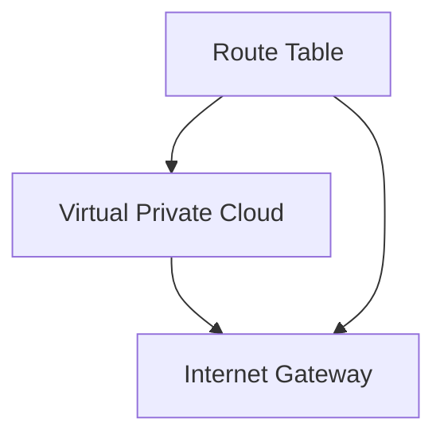

## Introduction to VPC and Internet Gateway

In the context of deploying Docker containers on AWS EC2 using Terraform, understanding the Virtual Private Cloud (VPC) and Internet Gateway is crucial. A VPC is a logically isolated section of the AWS Cloud where you can launch AWS resources in a virtual network that you define. An Internet Gateway, on the other hand, is a horizontally scaled, redundant, and highly available VPC component that allows communication between your VPC and the internet.

### What is a VPC?

A VPC is a virtual network dedicated to your AWS account. It is logically isolated from other virtual networks in the AWS Cloud. You can launch your AWS resources, such as EC2 instances, into a specific VPC. By default, the instances launched into your VPC have network connectivity only within the VPC; they cannot communicate with the internet unless you explicitly enable that capability.

#### Why Use a VPC?

Using a VPC provides several benefits:

1. **Security**: You can control access to your resources using security groups and network access control lists (ACLs).
2. **Isolation**: Resources in different VPCs are isolated from each other, reducing the risk of cross-account attacks.
3. **Customization**: You can define your own IP address ranges, subnets, and routing rules.

### What is an Internet Gateway?

An Internet Gateway is a component that enables communication between your VPC and the internet. It acts as a bridge between your VPC and the internet, allowing your resources to send and receive traffic to and from the internet.

#### Why Use an Internet Gateway?

Using an Internet Gateway is essential if you want your VPC resources to communicate with the internet. Without an Internet Gateway, your VPC resources would be isolated from the internet, which might not be desirable in many scenarios.

### Route Table

A route table contains a set of rules, called routes, that are used to determine where network traffic from your subnet should be directed. Each subnet in a VPC is associated with exactly one route table.

#### How Does a Route Table Work?

A route table directs traffic from a subnet to a destination. The destination could be another subnet within the VPC, an Internet Gateway, or a NAT Gateway. Each route in the table specifies a destination CIDR block and a target.

### Example Configuration

Let's walk through an example configuration using Terraform to create a VPC, an Internet Gateway, and a route table.

```hcl
provider "aws" {
  region = "us-west-2"
}

resource "aws_vpc" "example" {
  cidr_block = "10.0.0.0/16"

  tags = {
    Name = "example-vpc"
  }
}

resource "aws_internet_gateway" "example" {
  vpc_id = aws_vpc.example.id

  tags = {
    Name = "example-igw"
  }
}

resource "aws_route_table" "example" {
  vpc_id = aws_vpc.example.id

  route {
    cidr_block = "0.0.0.0/0"
    gateway_id = aws_internet_gateway.example.id
  }

  tags = {
    Name = "example-route-table"
  }
}
```

### Explanation of the Code

1. **Provider Block**: Specifies the AWS provider and the region.
2. **VPC Resource**: Creates a VPC with a CIDR block of `10.0.0.0/16`.
3. **Internet Gateway Resource**: Attaches an Internet Gateway to the VPC.
4. **Route Table Resource**: Creates a route table and associates it with the VPC. The route table includes a route to direct all traffic (`0.0.0.0/0`) to the Internet Gateway.

### Mermaid Diagram

Here is a mermaid diagram illustrating the architecture:



### Common Pitfalls

1. **Incorrect CIDR Block**: Ensure that the CIDR block specified for the VPC does not overlap with other networks.
2. **Missing Routes**: Ensure that the route table includes the necessary routes to direct traffic to the Internet Gateway.
3. **Security Groups**: Ensure that the security groups attached to the instances allow the necessary inbound and outbound traffic.

### Real-World Examples

Consider a scenario where a company deploys a web application in a VPC. The web application needs to communicate with the internet to fetch data from external APIs. Without an Internet Gateway and properly configured route tables, the web application would not be able to communicate with the internet, leading to failures in fetching data.

### How to Prevent / Defend

#### Detection

1. **Network Monitoring**: Use AWS CloudWatch Logs to monitor network traffic and detect any anomalies.
2. **Security Groups**: Monitor security group rules to ensure they are correctly configured to allow necessary traffic.

#### Prevention

1. **Secure Configuration**: Ensure that the VPC, Internet Gateway, and route tables are correctly configured.
2. **Least Privilege Principle**: Apply the least privilege principle to security groups and network ACLs.

#### Secure-Coding Fixes

Here is an example of a vulnerable configuration and a secure configuration:

**Vulnerable Configuration**

```hcl
resource "aws_route_table" "example" {
  vpc_id = aws_vpc.example.id

  route {
    cidr_block = "0.0.0.0/0"
    gateway_id = aws_internet_gateway.example.id
  }

  tags = {
    Name = "example-route-table"
  }
}
```

**Secure Configuration**

```hcl
resource "aws_route_table" "example" {
  vpc_id = aws_vpc.example.id

  route {
    cidr_block = "0.0.0.0/0"
    gateway_id = aws_internet_gateway.example.id
  }

  tags = {
    Name = "example-route-table"
  }

  # Add security group rules to restrict traffic
  ingress {
    from_port = 80
    to_port = 80
    protocol = "tcp"
    cidr_blocks = ["0.0.0.0/0"]
  }

  egress {
    from_port = 80
    to_port = 80
    protocol = "tcp"
    cidr_blocks = ["0.0.0.0/0"]
  }
}
```

### Conclusion

Understanding and configuring VPCs, Internet Gateways, and route tables is crucial for deploying Docker containers on AWS EC2 using Terraform. Proper configuration ensures that your resources can communicate with the internet securely and efficiently.

### Practice Labs

For hands-on practice, consider the following labs:

- **PortSwigger Web Security Academy**: Focuses on web application security but also covers infrastructure configurations.
- **OWASP Juice Shop**: A deliberately insecure web application for security training.
- **DVWA (Damn Vulnerable Web Application)**: Another web application for security training.

These labs provide practical experience in configuring and securing VPCs and Internet Gateways.

---
<!-- nav -->
[[05-Introduction to Terraform and AWS Infrastructure Deployment|Introduction to Terraform and AWS Infrastructure Deployment]] | [[DevOps/DevOps Bootcamp/08-Infrastructure as Code (Terraform)/08-Deploying Docker Containers on AWS EC2 with Terraform/00-Overview|Overview]] | [[07-Introduction to VPCs and Route Tables|Introduction to VPCs and Route Tables]]
