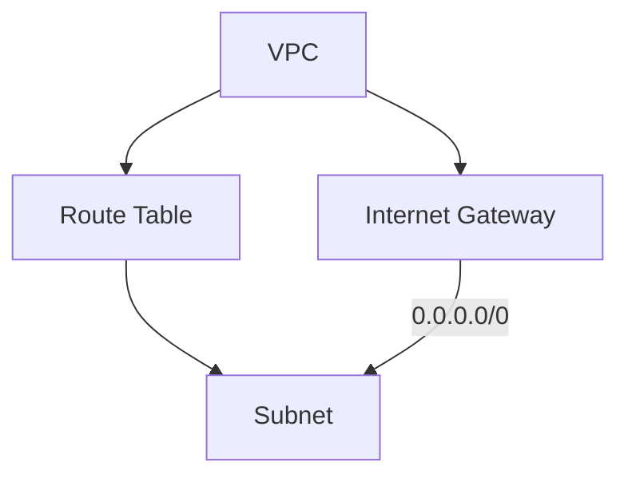

## Introduction to VPCs and Route Tables

In the context of deploying Docker containers on AWS EC2 using Terraform, understanding the basics of Virtual Private Clouds (VPCs) and route tables is crucial. A VPC is a logically isolated section of the AWS Cloud where you can launch AWS resources in a virtual network that you define. This allows you to have complete control over the IP addressing, networking, and routing within your environment.

### What is a VPC?

A VPC is a virtual network dedicated to your AWS account. It is logically isolated from other virtual networks in the AWS Cloud. You can launch your AWS resources, such as EC2 instances, into a specific VPC. By default, the instances launched into your VPC cannot communicate with the public Internet unless you explicitly configure them to do so.

### Why Use a VPC?

Using a VPC provides several benefits:

1. **Security**: You can control access to your resources using security groups and network access control lists (ACLs).
2. **Isolation**: Resources in different VPCs are isolated from each other.
3. **Customization**: You can define your own IP address range, subnet, and routing rules.

### Route Tables in VPCs

Route tables are used to determine where network traffic is directed. Each route table contains a set of rules called routes, which are used to direct traffic to specific destinations. There are two types of route tables:

1. **Main Route Table**: This is the default route table associated with your VPC. It is automatically created when you create a VPC.
2. **Custom Route Table**: You can create custom route tables and associate them with specific subnets.

### Default Routes

By default, the main route table includes a local route for traffic destined for resources within the same VPC. This route is automatically created and cannot be modified or deleted.

### Configuring Route Tables with Terraform

To configure route tables using Terraform, you need to define the necessary resources and their attributes. Let's break down the process step-by-step.

### Step-by-Step Configuration

#### Step 1: Define the VPC

First, you need to define the VPC in your Terraform configuration. Here is an example:

```hcl
resource "aws_vpc" "example" {
  cidr_block = "10.0.0.0/16"
}
```

This creates a VPC with the CIDR block `10.0.0.0/16`.

#### Step 2: Create a Custom Route Table

Next, you can create a custom route table and associate it with a subnet. Here is an example:

```hcl
resource "aws_route_table" "example" {
  vpc_id = aws_vpc.example.id

  route {
    cidr_block = "0.0.0.0/0"
    gateway_id = aws_internet_gateway.example.id
  }
}
```

This creates a route table associated with the VPC and adds a route for the internet gateway.

#### Step 3: Create an Internet Gateway

To allow traffic to the internet, you need to create an internet gateway and attach it to the VPC. Here is an example:

```hcl
resource "aws_internet_gateway" "example" {
  vpc_id = aws_vpc.example.id
}
```

This creates an internet gateway and attaches it to the VPC.

### Full Example

Here is a complete example of defining a VPC, a custom route table, and an internet gateway using Terraform:

```hcl
provider "aws" {
  region = "us-west-2"
}

resource "aws_vpc" "example" {
  cidr_block = "11.0.0.0/16"
}

resource "aws_internet_gateway" "example" {
  vpc_id = aws_vpc.example.id
}

resource "aws_route_table" "example" {
  vpc_id = aws_vpc.example.id

  route {
    cidr_block = "0.0.0.0/0"
    gateway_id = aws_internet_gateway.example.id
  }
}
```

### Diagram Representation

Let's visualize the setup using a Mermaid diagram:



### Pitfalls and Common Mistakes

1. **Incorrect CIDR Block**: Ensure that the CIDR block you choose does not overlap with other networks.
2. **Missing Internet Gateway**: Without an internet gateway, your instances will not be able to access the internet.
3. **Incorrect Route Configuration**: Ensure that the routes are correctly configured to direct traffic to the appropriate destinations.

### How to Prevent / Defend

#### Detection

1. **Network Monitoring**: Use tools like AWS VPC Flow Logs to monitor network traffic.
2. **Security Groups**: Configure security groups to restrict inbound and outbound traffic.

#### Prevention

1. **Secure Configuration**: Follow the principle of least privilege when configuring security groups and network ACLs.
2. **Regular Audits**: Regularly audit your VPC configurations to ensure compliance with security policies.

#### Secure Code Fix

Here is an example of a vulnerable configuration and the corrected version:

**Vulnerable Configuration**

```hcl
resource "aws_vpc" "example" {
  cidr_block = "10.0.0.0/16"
}

resource "aws_internet_gateway" "example" {
  vpc_id = aws_vpc.example.id
}
```

**Corrected Configuration**

```hcl
resource "aws_vpc" "example" {
  cidr_block = "10.0.0.0/16"
}

resource "aws_internet_gateway" "example" {
  vpc_id = aws_vpc.example.id
}

resource "aws_route_table" "example" {
  vpc_id = aws_vpc.example.id

  route {
    cidr_block = "0.0.0.0/0"
    gateway_id = aws_internet_gateway.example.id
  }
}
```

### Real-World Examples

#### Recent Breaches

One notable breach involving misconfigured VPCs was the Capital One data breach in 2019. The attacker exploited a misconfigured firewall rule in an AWS environment, allowing unauthorized access to sensitive data.

#### Secure Practices

To avoid such breaches, follow these practices:

1. **Use Network ACLs**: Configure network ACLs to restrict traffic to specific ports and protocols.
2. **Enable VPC Flow Logs**: Enable VPC Flow Logs to monitor and analyze network traffic.

### Conclusion

Understanding and properly configuring VPCs and route tables is essential for securing your AWS environment. By following best practices and using tools like Terraform, you can ensure that your resources are properly isolated and protected.

### Practice Labs

For hands-on practice, consider the following labs:

- **PortSwigger Web Security Academy**: Offers comprehensive labs on web application security.
- **OWASP Juice Shop**: A deliberately insecure web application for practicing security skills.
- **AWS Official Workshops**: Provides guided labs for learning AWS services, including VPC and Terraform.

These labs will help you gain practical experience in setting up and securing VPCs and route tables.

---
<!-- nav -->
[[06-Introduction to VPC and Internet Gateway|Introduction to VPC and Internet Gateway]] | [[DevOps/DevOps Bootcamp/08-Infrastructure as Code (Terraform)/08-Deploying Docker Containers on AWS EC2 with Terraform/00-Overview|Overview]] | [[08-Introduction to Variables in Terraform|Introduction to Variables in Terraform]]
