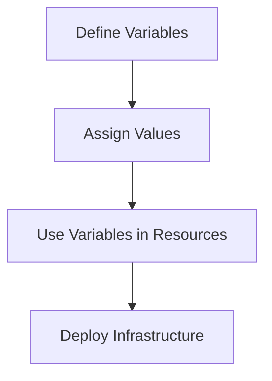

## Introduction to Variables in Terraform

In Terraform, variables are used to make your infrastructure as code more flexible and reusable. By defining variables, you can pass different values to your Terraform configurations without changing the actual code. This is particularly useful when deploying resources across different environments such as development, staging, and production.

### What Are Variables?

Variables in Terraform are placeholders that can hold values of various types, such as strings, numbers, booleans, lists, maps, and sets. These variables can be defined within the Terraform configuration files and assigned values either through the command line, environment variables, or a `terraform.tfvars` file.

### Why Use Variables?

Using variables in Terraform provides several benefits:

1. **Flexibility**: You can deploy the same Terraform configuration with different values for different environments.
2. **Reusability**: A single Terraform configuration can be used for multiple deployments by simply changing the variable values.
3. **Maintainability**: Changes to infrastructure can be made by updating variable values rather than modifying the Terraform code itself.

### How to Define Variables

Variables are defined in a `.tf` file using the `variable` keyword followed by the variable name. Here’s an example of how to define a variable:

```hcl
variable "prefix" {
  description = "The prefix to be used for all resource names."
  type        = string
}
```

### Assigning Values to Variables

Values can be assigned to variables in several ways:

1. **Command Line**: Using the `-var` flag.
    ```sh
    terraform apply -var "prefix=dev"
    ```
2. **Environment Variables**: Setting environment variables prefixed with `TF_VAR_`.
    ```sh
    export TF_VAR_prefix="dev"
    terraform apply
    ```
3. **terraform.tfvars File**: Creating a `terraform.tfvars` file in the root directory of your Terraform configuration.
    ```hcl
    prefix = "dev"
    ```

### String Interpolation

String interpolation allows you to combine variables with static strings. This is done using the `${}` syntax. For example:

```hcl
resource "aws_vpc" "example" {
  cidr_block = "10.0.0.0/16"
  tags = {
    Name = "${var.prefix}-vpc"
  }
}
```

Here, the `Name` tag of the VPC will be set to `dev-vpc` if the `prefix` variable is set to `"dev"`.

### Example: Defining and Using Variables in Terraform

Let's walk through an example of defining and using variables in a Terraform configuration for deploying Docker containers on AWS EC2 instances.

#### Step 1: Define Variables

First, define the necessary variables in a `.tf` file:

```hcl
variable "prefix" {
  description = "Prefix for resource names."
  type        = string
}

variable "availability_zone" {
  description = "Availability Zone for the subnet."
  type        = string
}

variable "subnet_cidr_block" {
  description = "CIDR block for the subnet."
  type        = string
}
```

#### Step 2: Assign Values to Variables

Assign values to these variables using a `terraform.tfvars` file:

```hcl
prefix = "dev"
availability_zone = "us-west-2a"
subnet_cidr_block = "10.0.1.0/24"
```

#### Step 3: Use Variables in Resource Definitions

Use these variables in your resource definitions:

```hcl
resource "aws_vpc" "example" {
  cidr_block = "10.0.0.0/16"
  tags = {
    Name = "${var.prefix}-vpc"
  }
}

resource "aws_subnet" "example" {
  vpc_id     = aws_vpc.example.id
  cidr_block = var.subnet_cidr_block
  availability_zone = var.availability_zone
  tags = {
    Name = "${var.prefix}-subnet"
  }
}

resource "aws_instance" "example" {
  ami           = "ami-0c55b159cbfafe1f0"
  instance_type = "t2.micro"
  subnet_id     = aws_subnet.example.id
  tags = {
    Name = "${var.prefix}-instance"
  }
}
```

### Mermaid Diagram: Terraform Variable Usage

A visual representation of how variables are used in Terraform can help understand the flow better:



### Real-World Examples and Security Considerations

#### Example: CVE-2021-39219

CVE-2021-39219 is a vulnerability in Terraform that could allow an attacker to execute arbitrary code on a remote system. This vulnerability was due to improper handling of user input in certain Terraform modules.

**How to Prevent / Defend:**

1. **Validate Input**: Ensure that all input variables are validated for correctness and security.
2. **Secure Coding Practices**: Use secure coding practices to prevent injection attacks.
3. **Regular Updates**: Keep Terraform and all modules up to date with the latest security patches.

#### Example: Terraform Configuration Hardening

To harden your Terraform configuration against potential vulnerabilities, follow these steps:

1. **Use Secure Defaults**: Set secure defaults for all variables.
2. **Limit Permissions**: Ensure that the permissions granted to the Terraform execution role are minimal and necessary.
3. **Audit Logs**: Enable audit logs to track changes and detect unauthorized access.

### Complete Example: Terraform Configuration with Variables

Here is a complete example of a Terraform configuration with variables:

```hcl
# main.tf
provider "aws" {
  region = "us-west-2"
}

variable "prefix" {
  description = "Prefix for resource names."
  type        = string
}

variable "availability_zone" {
  description = "Availability Zone for the subnet."
  type        = string
}

variable "subnet_cidr_block" {
  description = "CIDR block for the subnet."
  type        = string
}

resource "aws_vpc" "example" {
  cidr_block = "1.0.0.0/16"
  tags = {
    Name = "${var.prefix}-vpc"
  }
}

resource "aws_subnet" "example" {
  vpc_id            = aws_vpc.example.id
  cidr_block        = var.subnet_cidr_block
  availability_zone = var.availability_zone
  tags = {
    Name = "${var.prefix}-subnet"
  }
}

resource "aws_instance" "example" {
  ami           = "ami-0c55b159cbfafe1f0"
  instance_type = "t2.micro"
  subnet_id     = aws_subnet.example.id
  tags = {
    Name = "${var.prefix}-instance"
  }
}
```

```hcl
# terraform.tfvars
prefix = "dev"
availability_zone = "us-west-2a"
subnet_cidr_block = "1.0.1.0/24"
```

### Pitfalls and Common Mistakes

1. **Improper Validation**: Not validating input variables can lead to unexpected behavior.
2. **Hardcoding Values**: Hardcoding values instead of using variables can make your configuration less flexible.
3. **Security Risks**: Improper handling of sensitive data can lead to security vulnerabilities.

### How to Prevent / Defend

1. **Input Validation**: Always validate input variables to ensure they meet the required criteria.
2. **Use Variables**: Use variables for all configurable values to make your configuration more flexible.
3. **Secure Handling of Data**: Handle sensitive data securely to prevent exposure.

### Practice Labs

For hands-on practice with Terraform and AWS, consider the following labs:

- **PortSwigger Web Security Academy**: Offers a variety of labs related to web application security.
- **OWASP Juice Shop**: A deliberately insecure web application for security training.
- **CloudGoat**: A series of labs designed to teach cloud security concepts using AWS.
- **flaws.cloud**: A collection of labs for learning about cloud security.

By following these guidelines and practicing with real-world examples, you can effectively manage and secure your infrastructure as code using Terraform.

---
<!-- nav -->
[[07-Introduction to VPCs and Route Tables|Introduction to VPCs and Route Tables]] | [[DevOps/DevOps Bootcamp/08-Infrastructure as Code (Terraform)/08-Deploying Docker Containers on AWS EC2 with Terraform/00-Overview|Overview]] | [[09-Creating Your Own VPC and Subnets on AWS Using Terraform|Creating Your Own VPC and Subnets on AWS Using Terraform]]
