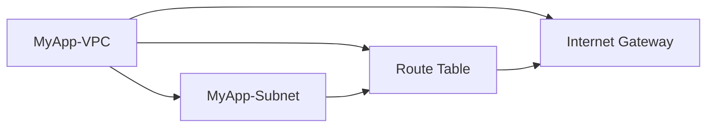

## Creating Your Own VPC and Subnets on AWS Using Terraform

### Overview of VPC and Subnets

In the context of deploying Docker containers on AWS EC2 using Terraform, managing your own Virtual Private Cloud (VPC) and subnets is crucial for maintaining control over your infrastructure. A VPC is a logically isolated section of the AWS Cloud where you can launch AWS resources in a virtual network that you define. This allows you to have complete control over the IP address range, subnets, route tables, network gateways, and security settings.

#### Why Create Your Own VPC?

Creating your own VPC is essential for several reasons:

1. **Isolation**: By creating a custom VPC, you can isolate your resources from the default VPC provided by AWS. This ensures that your resources are not affected by changes made to the default V. 
   
2. **Control**: You have full control over the network architecture, including the IP address ranges, subnets, routing rules, and security policies. This level of control is necessary for complex applications and compliance requirements.

3. **Security**: Custom VPCs allow you to implement more granular security controls, such as Network Access Control Lists (NACLs) and Security Groups, which can help protect your resources from unauthorized access.

4. **Scalability**: Managing your own VPC enables you to scale your infrastructure more effectively. You can create multiple subnets across different Availability Zones (AZs) to improve fault tolerance and performance.

### Steps to Create a VPC and Subnets

Let's walk through the process of creating a VPC and subnets using Terraform. We'll start by defining the VPC and then proceed to create subnets within it.

#### Step 1: Define the VPC

First, we need to define the VPC in our Terraform configuration. Here’s an example of how to create a VPC:

```hcl
resource "aws_vpc" "my_app_vpc" {
  cidr_block           = var.vpc_cidr_block
  enable_dns_hostnames = true
  enable_dns_support   = true

  tags = {
    Name = "MyApp-VPC"
  }
}
```

In this configuration:

- `cidr_block` specifies the CIDR block for the VPC. This defines the range of IP addresses available within the VPC.
- `enable_dns_hostnames` and `enable_dns_support` are optional parameters that enable DNS support within the VPC.
- `tags` are used to label the VPC for easier identification.

#### Step 2: Define the Subnets

Next, we need to define subnets within the VPC. Each subnet should be associated with a specific Availability Zone (AZ). Here’s an example of how to create a subnet:

```hcl
resource "aws_subnet" "my_app_subnet" {
  vpc_id                  = aws_vpc.my_app_vpc.id
  cidr_block              = var.subnet_cidr_block
  availability_zone       = var.availability_zone
  map_public_ip_on_launch = true

  tags = {
    Name = "MyApp-Subnet"
  }
}
```

In this configuration:

- `vpc_id` references the ID of the VPC we defined earlier.
- `cidr_block` specifies the CIDR block for the subnet.
- `availability_zone` specifies the AZ where the subnet will be located.
- `map_public_ip_on_launch` determines whether instances launched in this subnet receive a public IP address.
- `tags` are used to label the subnet for easier identification.

### Connecting the VPC to the Internet

To expose the VPC to the internet, we need to create an Internet Gateway and attach it to the VPC. Additionally, we need to configure a route table to direct traffic to the internet gateway.

#### Step 3: Create an Internet Gateway

Here’s how to create an Internet Gateway:

```hcl
resource "aws_internet_gateway" "my_app_igw" {
  vpc_id = aws_vpc.my_app_vpc.id

  tags = {
    Name = "MyApp-IGW"
  }
}
```

In this configuration:

- `vpc_id` references the ID of the VPC.
- `tags` are used to label the Internet Gateway for easier identification.

#### Step 4: Configure Route Table

Next, we need to configure a route table to direct traffic to the internet gateway:

```hcl
resource "aws_route_table" "my_app_rt" {
  vpc_id = aws_vpc.my_app_vpc.id

  route {
    cidr_block = "0.0.0.0/0"
    gateway_id = aws_internet_gateway.my_app_igw.id
  }

  tags = {
    Name = "MyApp-RT"
  }
}

resource "aws_route_table_association" "my_app_rta" {
  subnet_id      = aws_subnet.my_app_subnet.id
  route_table_id = aws_route_table.my_app_rt.id
}
```

In this configuration:

- `aws_route_table` defines the route table and associates it with the VPC.
- `route` specifies the default route (`0.0.0.0/0`) and points it to the Internet Gateway.
- `aws_route_table_association` associates the route table with the subnet.

### Example Terraform Configuration

Here’s a complete example of the Terraform configuration for creating a VPC, subnets, and connecting them to the internet:

```hcl
variable "vpc_cidr_block" {
  description = "CIDR block for the VPC"
  type        = string
  default     = "10.0.0.0/16"
}

variable "subnet_cidr_block" {
  description = "CIDR block for the subnet"
  type        = string
  default     = "10.0.1.0/24"
}

variable "availability_zone" {
  description = "Availability zone for the subnet"
  type        = string
  default     = "us-west-2a"
}

resource "aws_vpc" "my_app_vpc" {
  cidr_block           = var.vpc_cid
  enable_dns_hostnames = true
  enable_dns_support   = true

  tags = {
    Name = "MyApp-VPC"
  }
}

resource "aws_subnet" "my_app_subnet" {
  vpc_id                  = aws_vpc.my_app_vpc.id
  cidr_block              = var.subnet_cidr_block
  availability_zone       = var.availability_zone
  map_public_ip_on_launch = true

  tags = {
    Name = "MyApp-Subnet"
  }
}

resource "aws_internet_gateway" "my_app_igw" {
  vpc_id = aws_vpc.my_app_vpc.id

  tags = {
    Name = "MyApp-IGW"
  }
}

resource "aws_route_table" "my_app_rt" {
  vpc_id = aws_vpc.my_app_vpc.id

  route {
    cidr_block = "0.0.0.0/0"
    gateway_id = aws_internet_gateway.my_app_igw.id
  }

  tags = {
    Name = "MyApp-RT"
  }
}

resource "aws_route_table_association" "my_app_rta" {
  subnet_id      = aws_subnet.my_app_subnet.id
  route_table_id = aws_route_table.my_app_rt.id
}
```

### Diagram of the VPC Architecture

A visual representation of the VPC architecture can help understand the components and their relationships:



### Common Pitfalls and How to Avoid Them

When working with VPCs and subnets, there are several common pitfalls to watch out for:

1. **Incorrect CIDR Block**: Ensure that the CIDR block for the VPC and subnets does not overlap with other networks. Overlapping CIDR blocks can cause routing issues.

2. **Missing Route Table Configuration**: Forging to configure the route table correctly can result in instances being unable to access the internet or other resources.

3. **Security Group Misconfiguration**: Incorrectly configured security groups can expose your resources to unauthorized access. Always ensure that security groups are configured to allow only necessary traffic.

### How to Prevent / Defend

#### Detection

To detect misconfigurations in your VPC and subnets, you can use AWS CloudFormation StackSets or AWS Config to monitor and audit your infrastructure. AWS Config provides detailed information about the configuration of your resources and can alert you to changes that may affect security.

#### Prevention

1. **Use Security Groups**: Always use security groups to control inbound and outbound traffic to your instances. Ensure that security groups are configured to allow only necessary traffic.

2. **Enable Flow Logs**: Enable VPC flow logs to monitor traffic between instances and subnets. This can help you identify potential security issues.

3. **Regular Audits**: Regularly audit your VPC and subnet configurations to ensure that they are secure and compliant with your organization's policies.

4. **IAM Policies**: Use IAM policies to restrict access to your VPC and subnets. Ensure that only authorized users have the necessary permissions to modify the VPC and subnet configurations.

### Secure Coding Fixes

Here’s an example of how to secure the VPC and subnet configurations:

#### Vulnerable Code

```hcl
resource "aws_security_group" "my_app_sg" {
  name        = "MyApp-SG"
  description = "Security group for MyApp"
  vpc_id      = aws_vpc.my_app_vpc.id

  ingress {
    from_port   = 22
    to_port     = 22
    protocol    = "tcp"
    cidr_blocks = ["0.0.0.0/0"]
  }

  egress {
    from_port   = 0
    to_port     = 0
    protocol    = "-1"
    cidr_blocks = ["0.0.0.0/0"]
  }
}
```

#### Secure Code

```hcl
resource "aws_security_group" "my_app_sg" {
  name        = "MyApp-SG"
  description = "Security group for MyApp"
  vpc_id      = aws_vpc.my_app_vpc.id

  ingress {
    from_port   = 22
    to_port     = 22
    protocol    = "tcp"
    cidr_blocks = ["10.0.0.0/16"]  # Restrict SSH access to a specific IP range
  }

  egress {
    from_port   = 0
    to_port     = 0
    protocol    = "-1"
    cidr_blocks = ["0.0.0.0/0"]
  }
}
```

### Real-World Examples

#### Recent Breaches

One notable breach involving VPC misconfiguration was the Capital One data breach in 2019. The attacker exploited a misconfigured WAF rule that allowed unauthorized access to the company's AWS S3 buckets. This highlights the importance of properly configuring security groups and network access controls.

#### CVEs

CVE-2020-14774 is a vulnerability in AWS Elastic Load Balancing (ELB) that could allow an attacker to bypass security group rules. This underscores the importance of regularly auditing and securing your VPC and subnet configurations.

### Hands-On Labs

For hands-on practice with deploying Docker containers on AWS EC2 using Terraform, consider the following labs:

- **PortSwigger Web Security Academy**: Offers a comprehensive set of labs covering various aspects of web application security, including Docker and AWS.
- **OWASP Juice Shop**: A deliberately insecure web application for security training purposes. It includes Docker and AWS deployment scenarios.
- **DVWA (Damn Vulnerable Web Application)**: Another popular web application for security training, which can be deployed using Docker and managed on AWS.

These labs provide practical experience in setting up and securing VPCs and subnets on AWS using Terraform.

### Conclusion

Creating and managing your own VPC and subnets on AWS using Terraform is a critical step in deploying Docker containers securely. By following best practices and regularly auditing your configurations, you can ensure that your infrastructure remains secure and compliant with your organization's policies.

---
<!-- nav -->
[[08-Introduction to Variables in Terraform|Introduction to Variables in Terraform]] | [[DevOps/DevOps Bootcamp/08-Infrastructure as Code (Terraform)/08-Deploying Docker Containers on AWS EC2 with Terraform/00-Overview|Overview]] | [[10-Creating an Internet Gateway in the VPC|Creating an Internet Gateway in the VPC]]
