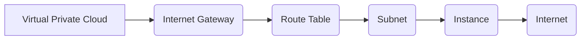

## Creating an Internet Gateway in the VPC

In this section, we will delve into the process of creating an internet gateway within a Virtual Private Cloud (VPC) and integrating it with a route table to enable communication between the VPC and the internet. This is a fundamental step in setting up a robust and secure infrastructure for deploying Docker containers on AWS EC2 using Terraform.

### What is a VPC?

A Virtual Private Cloud (VPC) is a logically isolated virtual network within the AWS cloud. It allows you to launch AWS resources in a virtual network that you define. You have complete control over the IP address range, subnets, routing tables, and gateways. This isolation helps in maintaining security and controlling access to your resources.

### What is an Internet Gateway?

An Internet Gateway is a horizontally scaled, redundant, and highly available VPC component that serves as a connection between your VPC and the internet. It enables instances in your VPC to communicate with the internet. Without an internet gateway, instances in your VPC cannot communicate with the internet.

### Why Use an Internet Gateway?

The primary reason to use an internet gateway is to allow instances in your VPC to send and receive traffic to and from the internet. This is crucial for applications that require internet connectivity, such as:

- **Web servers** that need to serve content to users over the internet.
- **Databases** that might need to fetch updates or patches from the internet.
- **Monitoring tools** that report metrics to external services.

### How Does an Internet Gateway Work?

When you create an internet gateway and attach it to your VPC, it acts as a bridge between your VPC and the internet. Traffic from instances in your VPC destined for the internet is routed through the internet gateway. Similarly, incoming traffic from the internet is routed through the internet gateway to the appropriate instance in your VPC.

### Route Table Integration

To enable communication between the VPC and the internet, you need to integrate the internet gateway with a route table. A route table contains a set of rules, called routes, that are used to determine where network traffic from your subnet is directed.

#### Steps to Integrate the Internet Gateway with a Route Table

1. **Create the Internet Gateway**: First, you need to create the internet gateway and attach it to your VPC.
2. **Define Routes in the Route Table**: Next, you need to define routes in the route table that specify how traffic should be routed to and from the internet.

### Terraform Configuration for Internet Gateway and Route Table

Let's walk through the Terraform configuration to create an internet gateway and integrate it with a route table.

```hcl
resource "aws_vpc" "example" {
  cidr_block = "10.0.0.0/16"
}

resource "aws_internet_gateway" "example" {
  vpc_id = aws_vpc.example.id
}

resource "aws_route_table" "example" {
  vpc_id = aws_vpc.example.id

  route {
    cidr_block = "0.0.0.0/0"
    gateway_id = aws_internet_gateway.example.id
  }
}
```

### Explanation of the Code

- **aws_vpc.example**: This resource defines a VPC with a CIDR block of `10.0.0.0/16`.
- **aws_internet_gateway.example**: This resource creates an internet gateway and attaches it to the VPC.
- **aws_route_table.example**: This resource defines a route table associated with the VPC. The route specifies that all traffic (`0.0.0.0/0`) should be routed through the internet gateway.

### Tagging Resources

Tagging resources is essential for managing and identifying them. Tags are key-value pairs that can be attached to resources to provide metadata. In this case, we will tag the internet gateway and the route table.

```hcl
resource "aws_vpc" "example" {
  cidr_block = "10.0.0.0/16"

  tags = {
    Name = "example-vpc"
  }
}

resource "aws_internet_gateway" "example" {
  vpc_id = aws_vpc.example.id

  tags = {
    Name = "example-internet-gateway"
  }
}

resource "aws_route_table" "example" {
  vpc_id = aws_vpc.example.id

  route {
    cidr_block = "0.0.0.0/0"
    gateway_id = aws_internet_gateway.example.id
  }

  tags = {
    Name = "example-route-table"
  }
}
```

### Dependency Management in Terraform

Terraform is designed to manage dependencies between resources automatically. This means that even if you define resources in a seemingly incorrect order, Terraform will figure out the correct sequence to create them.

For example, if you define the route table before the internet gateway, Terraform will still ensure that the internet gateway is created first.

```hcl
resource "aws_route_table" "example" {
  vpc_id = aws_vpc.example.id

  route {
    cidr_block = "0.0.0.0/0"
    gateway_id = aws_internet_gateway.example.id
  }

  tags = {
    Name = "example-route-table"
  }
}

resource "aws_internet_gateway" "example" {
  vpc_id = aws_vpc.example.id

  tags = {
    Name = "example-internet-gateway"
  }
}
```

### Mermaid Diagram for VPC Architecture

Here is a mermaid diagram illustrating the VPC architecture with the internet gateway and route table:



### Common Pitfalls and How to Prevent Them

#### Pitfall 1: Incorrect Route Configuration

If the route configuration in the route table is incorrect, traffic may not be properly routed to the internet gateway. This can result in instances being unable to access the internet.

**Prevention**:
- Ensure that the route table correctly references the internet gateway.
- Verify that the route table is associated with the correct subnet.

#### Pitfall 2: Missing Tags

Without proper tagging, it can be difficult to identify and manage resources. This can lead to confusion and potential mismanagement of resources.

**Prevention**:
- Always tag resources with descriptive names and metadata.
- Use consistent naming conventions across all resources.

### Real-World Example: CVE-2021-20225

CVE-2021-20225 is a critical vulnerability in the AWS SDK for Java, which could allow unauthorized access to resources due to improper handling of credentials. This highlights the importance of securing your VPC and ensuring that all resources are properly configured and tagged.

### Secure Coding Practices

#### Vulnerable Code

```hcl
resource "aws_route_table" "example" {
  vpc_id = aws_vpc.example.id

  route {
    cidr_block = "0.0.0.0/0"
    gateway_id = aws_internet_gateway.example.id
  }
}
```

#### Secure Code

```hcl
resource "aws_route_table" "example" {
  vpc_id = aws_vpc.example.id

  route {
    cidr_block = "0.0.0.0/0"
    gateway_id = aws_internet_gateway.example.id
  }

  tags = {
    Name = "example-route-table"
  }
}
```

### Detection and Prevention

#### Detection

- **AWS CloudTrail**: Use CloudTrail to monitor API calls made to your VPC and internet gateway.
- **AWS Config**: Use AWS Config to track changes to your VPC and internet gateway configurations.

#### Prevention

- **IAM Policies**: Implement strict IAM policies to limit access to your VPC and internet gateway.
- **Security Groups**: Use security groups to control inbound and outbound traffic to your instances.

### Hands-On Lab Suggestions

- **PortSwigger Web Security Academy**: Practice setting up VPCs and internet gateways in a controlled environment.
- **OWASP Juice Shop**: Explore real-world scenarios involving VPCs and internet gateways.
- **DVWA**: Use DVWA to practice securing VPCs and internet gateways against common vulnerabilities.

By following these steps and best practices, you can ensure that your VPC and internet gateway are properly configured and secured, enabling seamless communication between your instances and the internet.

---
<!-- nav -->
[[09-Creating Your Own VPC and Subnets on AWS Using Terraform|Creating Your Own VPC and Subnets on AWS Using Terraform]] | [[DevOps/DevOps Bootcamp/08-Infrastructure as Code (Terraform)/08-Deploying Docker Containers on AWS EC2 with Terraform/00-Overview|Overview]] | [[11-Deploying Docker Containers on AWS EC2 with Terraform|Deploying Docker Containers on AWS EC2 with Terraform]]
