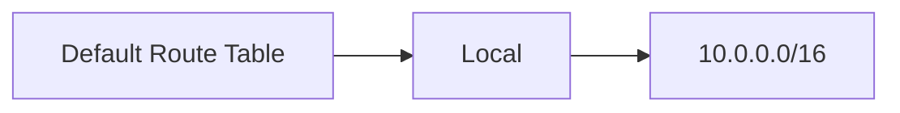
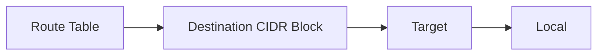
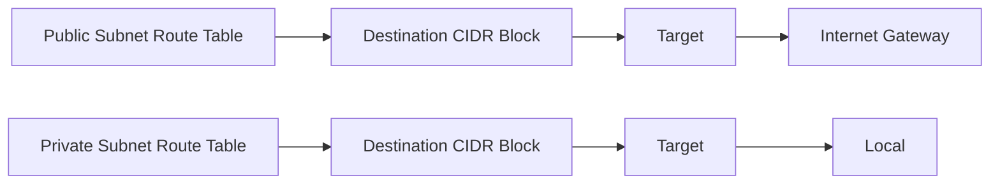

## Understanding Route Tables in AWS VPC

### What is a Route Table?

A **route table** in Amazon Virtual Private Cloud (VPC) is a component that determines where network traffic from your instances should be directed. Each subnet in a VPC is associated with a route table. A route table contains a set of rules called **routes**, which specify the next hop for traffic destined to a particular CIDR block. 

#### Why Route Tables Matter

Route tables are crucial for controlling the flow of traffic within and out of your VPC. They ensure that traffic is routed correctly to the appropriate destinations, whether within the VPC or to external networks such as the Internet. Without proper routing, instances within your VPC may not be able to communicate effectively with each other or with external resources.

#### How Route Tables Work

When an instance sends traffic, the VPC uses the route table associated with the subnet where the instance resides to determine the next hop for the traffic. The route table contains entries that map CIDR blocks to specific targets, such as gateways or other subnets.

### Default Route Tables

Every VPC comes with a **default route table**. This route table is automatically created when you create a VPC and is associated with all the subnets in the VPC unless you explicitly associate them with a custom route table. The default route table typically includes a local route that allows traffic to stay within the VPC.

#### Example of a Default Route Table

Consider the following scenario:

- You have a VPC with a CIDR block `10.0.0.0/16`.
- The VPC has two subnets: `10.0.1.0/24` and `10.0.2.0/24`.

The default route table might look like this:



Here, the route table has a single entry that directs traffic to the local VPC.

### Custom Route Tables

In addition to the default route table, you can create custom route tables to manage more complex routing scenarios. Custom route tables allow you to define additional routes and associate them with specific subnets.

#### Creating a Custom Route Table

To create a custom route table, you can use the AWS Management Console, AWS CLI, or infrastructure-as-code tools like Terraform.

##### Using Terraform

Here’s an example of creating a custom route table using Terraform:

```hcl
resource "aws_vpc" "example" {
  cidr_block = "10.0.0.0/16"
}

resource "aws_subnet" "public" {
  vpc_id            = aws_vpc.example.id
  cidr_block        = "10.0.1.0/24"
  availability_zone = "us-west-2a"
}

resource "aws_route_table" "custom" {
  vpc_id = aws_vpc.example.id

  route {
    cidr_block = "10.0.0.0/16"
    gateway_id = aws_internet_gateway.example.id
  }
}

resource "aws_internet_gateway" "example" {
  vpc_id = aws_vpc.example.id
}
```

This Terraform configuration creates a VPC, a public subnet, an internet gateway, and a custom route table that routes traffic to the internet gateway.

### Route Table Entries

Each route table entry consists of a destination CIDR block and a target. The target can be:

- **Local**: Traffic stays within the VPC.
- **Internet Gateway**: Traffic is routed to the Internet.
- **NAT Gateway**: Traffic is routed through a NAT gateway for outbound connections.
- **Virtual Private Gateway**: Traffic is routed to a virtual private gateway for a VPN connection.

#### Example of a Route Table Entry

Consider the following route table entry:



Here, the route table has an entry that directs traffic to the local VPC.

### Associating Subnets with Route Tables

Subnets in a VPC can be associated with either the default route table or a custom route table. By default, all subnets are associated with the default route table, but you can change this association to use a custom route table.

#### Associating a Subnet with a Custom Route Table

To associate a subnet with a custom route table, you can use the AWS Management Console, AWS CLI, or Terraform.

##### Using Terraform

Here’s an example of associating a subnet with a custom route table using Terraform:

```hcl
resource "aws_route_table_association" "example" {
  subnet_id      = aws_subnet.public.id
  route_table_id = aws_route_table.custom.id
}
```

This Terraform configuration associates the public subnet with the custom route table.

### Managing Traffic Flow

Route tables play a critical role in managing traffic flow within and out of your VPC. By properly configuring route tables, you can control how traffic is routed and ensure that your instances can communicate effectively with each other and with external resources.

#### Example of Managing Traffic Flow

Consider the following scenario:

- You have a VPC with a CIDR block `10.0.0.0/16`.
- The VPC has two subnets: `10.0.1.0/24` and `10.0.2.0/24`.
- You want to route traffic from the public subnet to the Internet and keep traffic within the VPC for the private subnet.

The route table might look like this:



Here, the public subnet route table routes traffic to the Internet gateway, while the private subnet route table keeps traffic within the VPC.

### Common Pitfalls and Best Practices

#### Common Pitfalls

- **Incorrect Route Table Associations**: Ensure that subnets are associated with the correct route tables.
- **Missing Routes**: Ensure that all necessary routes are defined in the route tables.
- **Misconfigured Targets**: Ensure that targets such as internet gateways and NAT gateways are properly configured.

#### Best Practices

- **Use Custom Route Tables**: Use custom route tables to manage complex routing scenarios.
- **Document Route Tables**: Document the purpose and configuration of each route table.
- **Regularly Review Route Tables**: Regularly review and update route tables to ensure they meet your networking requirements.

### Real-World Examples

#### Recent Breaches and CVEs

- **CVE-2021-26614**: A misconfiguration in route tables allowed unauthorized access to internal resources.
- **CVE-2022-3797**: Incorrect route table associations led to data exfiltration.

#### Secure Configuration

To prevent such vulnerabilities, ensure that:

- Route tables are properly configured and documented.
- Subnets are associated with the correct route tables.
- Targets such as internet gateways and NAT gateways are properly configured.

### How to Prevent / Defend

#### Detection

- **Network Monitoring**: Use network monitoring tools to detect unusual traffic patterns.
- **Logging**: Enable logging for route table changes and monitor for unauthorized modifications.

#### Prevention

- **Least Privilege Principle**: Apply the least privilege principle to route table configurations.
- **Automated Testing**: Use automated testing tools to validate route table configurations.

#### Secure Coding Fixes

##### Vulnerable Code

```hcl
resource "aws_route_table" "vulnerable" {
  vpc_id = aws_vpc.example.id

  route {
    cidr_block = "0.0.0.0/0"
    gateway_id = aws_internet_gateway.example.id
  }
}
```

##### Secure Code

```hcl
resource "aws_route_table" "secure" {
  vpc_id = aws_vpc.example.id

  route {
    cidr_block = "10.0.0.0/16"
    gateway_id = aws_internet_gateway.example.id
  }
}
```

Here, the secure code ensures that only traffic within the VPC is routed to the internet gateway.

### Practice Labs

For hands-on practice with deploying Docker containers on AWS EC2 with Terraform, consider the following labs:

- **PortSwigger Web Security Academy**: Offers labs on securing web applications and infrastructure.
- **OWASP Juice Shop**: Provides a vulnerable web application for practicing security techniques.
- **DVWA**: A deliberately insecure web application for practicing security assessments.
- **WebGoat**: An interactive training application for learning about web application security.

These labs provide practical experience in deploying and securing Docker containers on AWS EC2 using Terraform.

By thoroughly understanding and properly configuring route tables, you can ensure effective and secure traffic management within your VPC.

---
<!-- nav -->
[[12-Security Groups in AWS EC2|Security Groups in AWS EC2]] | [[DevOps/DevOps Bootcamp/08-Infrastructure as Code (Terraform)/08-Deploying Docker Containers on AWS EC2 with Terraform/00-Overview|Overview]] | [[14-Understanding Subnet Associations and Route Tables in AWS|Understanding Subnet Associations and Route Tables in AWS]]
