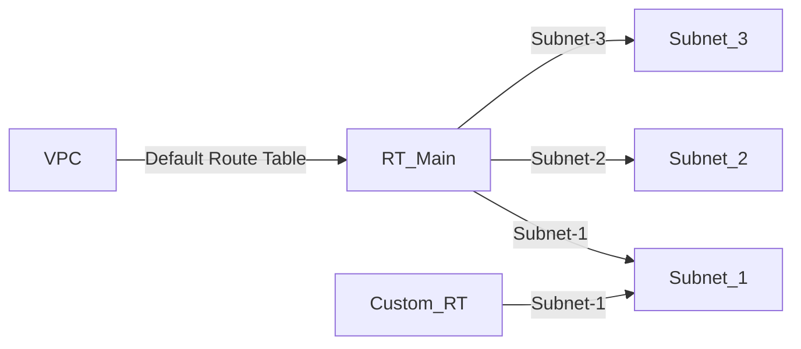
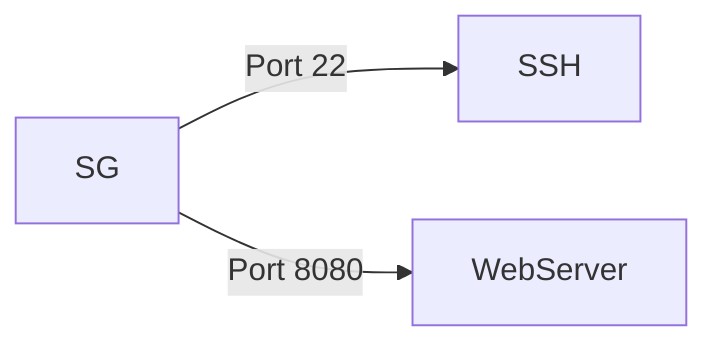

## Understanding Subnet Associations and Route Tables in AWS

### Background Theory

In Amazon Web Services (AWS), a Virtual Private Cloud (VPC) is a logically isolated section of the AWS Cloud where you can launch AWS resources in a virtual network that you define. A VPC allows you to have complete control over your network environment, including IP address ranges, subnets, routing tables, and gateways.

A **subnet** is a range of IP addresses in your VPC. You can launch AWS resources, such as EC2 instances, into subnets. Each subnet must be a valid IPv4 CIDR block within the IPv4 CIDR block range of the VPC. Subnets are used to segment the network and control access to resources.

A **route table** is a collection of routes that determine where network traffic is directed. Each route specifies a destination and a target. The target can be an internet gateway, a virtual private gateway, a NAT gateway, or another subnet within the VPC. By default, every VPC has a **main route table** that is automatically associated with all subnets unless explicitly associated with a custom route table.

### Default Route Table Behavior

When you create a VPC, AWS automatically creates a main route table and associates it with all subnets in the VPC. This main route table contains a default route to the internet gateway if one exists. If you do not explicitly associate a subnet with a custom route table, it remains associated with the main route table.

#### Example: Default Route Table Association

Consider a VPC with three subnets: `subnet-1`, `subnet-2`, and `subnet-3`. By default, these subnets are associated with the main route table. If you create a custom route table and associate it with `subnet-1`, `subnet-2` and `subnet-3` remain associated with the main route table.



### Removing Explicit Subnet Associations

In the given context, the subnet associations are not explicitly defined for the route table. Since the subnets are not explicitly associated with a custom route table, they are automatically assigned to the main route table. Therefore, there is no need to explicitly define the association again.

#### Code Example: Terraform Configuration

Here is an example of how you might configure a VPC and subnets using Terraform:

```hcl
resource "aws_vpc" "example" {
  cidr_block = "10.0.0.0/16"
}

resource "aws_subnet" "public" {
  vpc_id            = aws_vpc.example.id
  cidr_block        = "10.0.1.0/24"
  availability_zone = "us-west-2a"
}

resource "aws_subnet" "private" {
  vpc_id            = aws_vpc.example.id
  cidr_block        = "10.0.2.0/24"
  availability_zone = "us-west-2b"
}
```

### Configuring Security Groups for EC2 Instances

Security groups act as virtual firewalls that control inbound and outbound traffic to your EC2 instances. They are stateful, meaning that if you allow incoming traffic on a specific port, the corresponding outgoing traffic is also allowed.

#### Example: Opening Ports for SSH and Web Server Access

To allow SSH access and access to a web server running on port 8080, you need to create a security group and specify the necessary rules.



#### Code Example: Creating a Security Group in Terraform

Here is how you can create a security group and open the required ports using Terraform:

```hcl
resource "aws_security_group" "my_app_sg" {
  name        = "my_app_sg"
  description = "Allow SSH and Web Server access"
  vpc_id      = aws_vpc.example.id

  ingress {
    from_port   = 22
    to_port     = 22
    protocol    = "tcp"
    cidr_blocks = ["0.0.0.0/0"]
  }

  ingress {
    from_port   = 8080
    to_port     = 8080
    protocol    = "tcp"
    cidr_blocks = ["0.0.0.0/0"]
  }

  egress {
    from_port   = 0
    to_port     = 0
    protocol    = "-1"
    cidr_blocks = ["0.0.0.0/0"]
  }
}
```

### Pitfalls and Best Practices

#### Common Mistakes

1. **Overly Permissive Security Groups**: Allowing unrestricted access (e.g., `0.0.0.0/0`) to sensitive ports like SSH can expose your instances to attacks.
2. **Missing Egress Rules**: Not specifying egress rules can lead to unexpected behavior when trying to communicate with external services.
3. **Incorrect CIDR Blocks**: Using incorrect CIDR blocks can result in unintended access or denial of access.

#### How to Prevent / Defend

1. **Restrict Access**: Limit access to specific IP addresses or ranges. For example, restrict SSH access to your office IP range.
2. **Use Egress Rules**: Specify egress rules to control outbound traffic.
3. **Regular Audits**: Regularly review and audit your security group rules to ensure they align with your security policies.

#### Secure-Coding Fixes

Here is an example of a more secure configuration:

```hcl
resource "aws_security_group" "my_app_sg_secure" {
  name        = "my_app_sg_secure"
  description = "Allow SSH and Web Server access with restricted IPs"
  vpc_id      = aws_vpc.example.id

  ingress {
    from_port   = 22
    to_port     = 22
    protocol    = "tcp"
    cidr_blocks = ["192.168.1.0/24"]  # Restrict to a specific IP range
  }

  ingress {
    from_port   = 8080
    to_port     =  8080
    protocol    = "tcp"
    cidr_blocks = ["0.0.0.0/0"]
  }

  egress {
    from_port   = 0
    to_port     = 0
    protocol    = "-1"
    cidr_blocks = ["0.0.0.0/0"]
  }
}
```

### Real-World Examples

#### CVE-2021-20225: Overly Permissive Security Groups

In 2021, a misconfiguration in security groups led to unauthorized access to sensitive data. The issue was caused by overly permissive rules that allowed access from any IP address (`0.0.0.0/0`). This vulnerability was exploited to gain unauthorized access to EC2 instances.

#### Secure Configuration

To prevent such issues, ensure that security groups are configured with restrictive rules. For example, limit SSH access to specific IP ranges and monitor access logs regularly.

### Hands-On Labs

For practical experience with deploying Docker containers on AWS EC2 with Terraform, consider the following labs:

- **PortSwigger Web Security Academy**: Offers hands-on labs to understand and mitigate common security vulnerabilities.
- **OWASP Juice Shop**: A deliberately insecure web application for security training.
- **DVWA (Damn Vulnerable Web Application)**: A PHP/MySQL web application that is riddled with vulnerabilities.

These labs provide a comprehensive understanding of the concepts and help you apply them in real-world scenarios.

By thoroughly understanding the concepts of subnet associations, route tables, and security groups, you can effectively manage your AWS infrastructure and ensure the security of your resources.

---
<!-- nav -->
[[13-Understanding Route Tables in AWS VPC|Understanding Route Tables in AWS VPC]] | [[DevOps/DevOps Bootcamp/08-Infrastructure as Code (Terraform)/08-Deploying Docker Containers on AWS EC2 with Terraform/00-Overview|Overview]] | [[15-Using Variables Inside Strings in Terraform|Using Variables Inside Strings in Terraform]]
