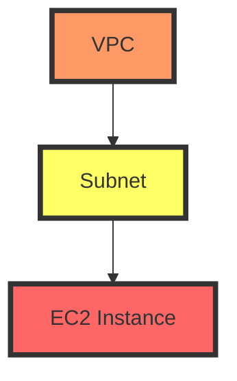

## Using Variables Inside Strings in Terraform

In Terraform, variables are used to parameterize your infrastructure configurations. This allows you to reuse the same configuration across different environments (like development, staging, and production) by simply changing the values of the variables. One common task is to use these variables inside strings, such as naming resources or constructing paths.

### Syntax for Using Variables in Strings

To use a variable inside a string in Terraform, you use the `${}` syntax. This is called string interpolation. Here’s how it works:

```hcl
variable "prefix" {
  description = "The environment prefix, e.g., 'dev', 'prod', 'staging'"
  type        = string
}

output "subnet_name" {
  value = "${var.prefix}-subnet-1"
}
```

In this example, `var.prefix` is the variable being interpolated into the string. The output will be something like `dev-subnet-1` if the value of `var.prefix` is `dev`.

### Why Use String Interpolation?

String interpolation is essential for creating dynamic resource names and paths based on variables. This makes your Terraform configurations more flexible and reusable. For instance, you might want to create different subnets for different environments, and using variables helps you achieve this without duplicating code.

### Example: Creating VPC and Subnets

Let’s walk through an example where we create a VPC and a subnet using variables.

#### Step 1: Define Variables

First, define the variables in your `variables.tf` file:

```hcl
variable "vpc_cidr_block" {
  description = "CIDR block for the VPC"
  type        = string
  default     = "10.0.0.0/16"
}

variable "subnet_cidr_block" {
  description = "CIDR block for the subnet"
  type        = string
  default     = "10.0.1.0/24"
}

variable "availability_zone" {
  description = "Availability zone for the subnet"
  type        = string
  default     = "eu-west-3b"
}

variable "environment_prefix" {
  description = "Environment prefix, e.g., 'dev', 'prod', 'staging'"
  type        = string
  default     = "dev"
}

variable "region" {
  description = "Region for the VPC and subnet"
  type        = string
  default     = "eu-west-3"
}
```

#### Step 2: Create the VPC and Subnet

Next, create the VPC and subnet using these variables:

```hcl
provider "aws" {
  region = var.region
}

resource "aws_vpc" "example" {
  cidr_block = var.vpc_cidr_block
}

resource "aws_subnet" "example" {
  vpc_id            = aws_vpc.example.id
  cidr_block        = var.subnet_cidr_block
  availability_zone = var.availability_zone
  tags = {
    Name = "${var.environment_prefix}-subnet-1"
  }
}
```

#### Step 3: Assign Values to Variables

Assign values to these variables in your `terraform.tfvars` file:

```hcl
vpc_cidr_block      = "10.0.0.0/16"
subnet_cidr_block   = "10.0.1.0/24"
availability_zone   = "eu-west-3b"
environment_prefix  = "dev"
region              = "eu-west-3"
```

### How to Prevent / Defend

#### Detection

Ensure that your Terraform configurations are properly version-controlled and reviewed. Use tools like `tfsec` or `tflint` to scan for potential issues in your Terraform code.

#### Prevention

1. **Secure Variable Handling**: Ensure that sensitive variables are stored securely. Use Terraform Cloud's built-in secrets management or store them in a secure vault like HashiCorp Vault.
   
2. **Immutable Infrastructure**: Use immutable infrastructure principles to ensure that once a resource is created, it cannot be modified. This reduces the risk of accidental changes.

3. **Least Privilege Principle**: Ensure that the AWS credentials used by Terraform have the least privilege necessary to perform the required tasks.

### Real-World Examples

#### CVE-2021-20225: AWS IAM Policy Injection

In 2021, a vulnerability was discovered where an attacker could inject malicious IAM policies into AWS resources. This could be mitigated by ensuring that all IAM policies are strictly validated and reviewed.

#### Example Code

Here’s a complete example of how to create a VPC and subnet using Terraform:

```hcl
# variables.tf
variable "vpc_cidr_block" {
  description = "CIDR block for the VPC"
  type        = string
  default     = "1.0.0.0/16"
}

variable "subnet_cidr_block" {
  description = "CIDR block for the subnet"
  type        = string
  default     = "1.0.1.0/24"
}

variable "availability_zone" {
  description = "Availability zone for the subnet"
  type        = string
  default     = "us-west-2a"
}

variable "environment_prefix" {
  description = "Environment prefix, e.g., 'dev', 'prod', 'staging'"
  type        = string
  default     = "dev"
}

variable "region" {
  description = "Region for the VPC and subnet"
  type        = string
  default     = "us-west-2"
}

# main.tf
provider "aws" {
  region = var.region
}

resource "aws_vpc" "example" {
  cidr_block = var.vpc_cidr_block
}

resource "aws_subnet" "example" {
  vpc_id            = aws_vpc.example.id
  cidr_block        = var.subnet_cidr_block
  availability_zone = var.availability_zone
  tags = {
    Name = "${var.environment_prefix}-subnet-1"
  }
}

# terraform.tfvars
vpc_cidr_block      = "1.0.0.0/16"
subnet_cidr_block   = "1.0.1.0/24"
availability_zone   = "us-west-2a"
environment_prefix  = "dev"
region              = "us-west-2"
```

### Mermaid Diagrams

#### Network Topology



### Common Pitfalls

1. **Incorrect CIDR Blocks**: Ensure that the CIDR blocks you specify are valid and do not overlap with existing networks.
2. **Missing Default Values**: Always provide default values for variables to avoid errors during execution.
3. **Security Groups**: Ensure that security groups are correctly configured to allow only necessary traffic.

### Hands-On Labs

For hands-on practice, consider using the following labs:

- **PortSwigger Web Security Academy**: Focuses on web application security but also covers infrastructure security.
- **OWASP Juice Shop**: A deliberately insecure web app for security training.
- **CloudGoat**: A series of labs designed to teach AWS security best practices.

By following these steps and best practices, you can effectively manage your infrastructure using Terraform and ensure that your configurations are secure and robust.

---
<!-- nav -->
[[14-Understanding Subnet Associations and Route Tables in AWS|Understanding Subnet Associations and Route Tables in AWS]] | [[DevOps/DevOps Bootcamp/08-Infrastructure as Code (Terraform)/08-Deploying Docker Containers on AWS EC2 with Terraform/00-Overview|Overview]] | [[16-Virtual Private Cloud (VPC)|Virtual Private Cloud (VPC)]]
