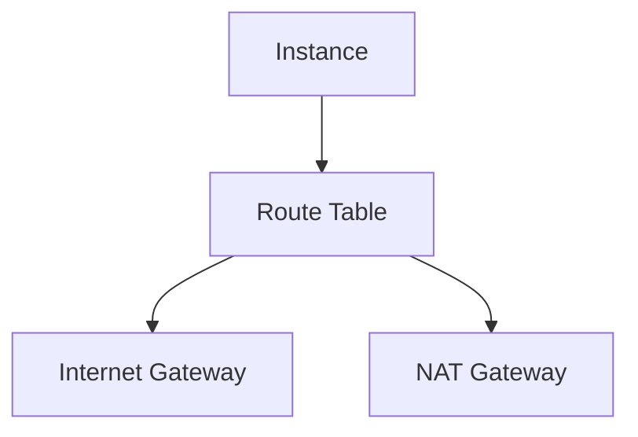
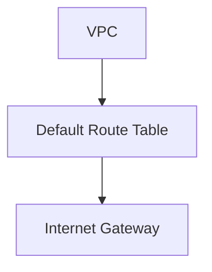
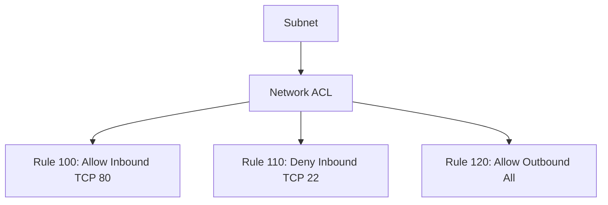
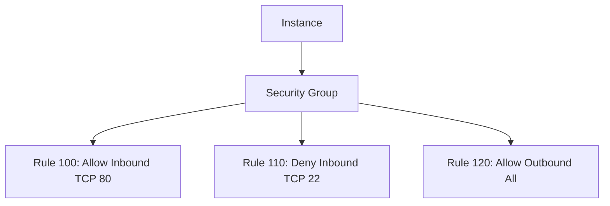

## Virtual Private Cloud (VPC)

### Introduction to VPC

A Virtual Private Cloud (VPC) is a logically isolated section of the Amazon Web Services (AWS) cloud where you can launch AWS resources in a virtual network that you define. This allows you to have complete control over the virtual networking environment for your applications. You can customize aspects such as IP address ranges, subnets, routing tables, and gateways.

#### What is a VPC?

A VPC is essentially a private network within the AWS cloud. It provides a secure and isolated environment for your resources, allowing you to control access and manage network traffic. A VPC can span across multiple Availability Zones (AZs) within an AWS region, providing high availability and fault tolerance.

#### Why Use a VPC?

Using a VPC offers several benefits:

1. **Security**: By isolating your resources within a private network, you can control access and limit exposure to the public internet.
2. **Control**: You have full control over the network configuration, including IP addressing, routing, and security policies.
3. **Scalability**: You can easily scale your resources within the VPC, adding more instances or services as needed.
4. **Isolation**: Resources within a VPC are isolated from other resources, reducing the risk of interference or conflicts.

### Route Tables

#### What is a Route Table?

A route table is a component of a VPC that determines where network traffic is directed. It contains a set of rules called routes that map destination IP addresses to target devices. Each subnet in a VPC is associated with a route table, and the route table defines how traffic leaves the subnet.

#### How Does a Route Table Work?

When a packet of data is sent from one instance to another within a VPC, the route table determines the path the packet should take. The route table contains entries that specify the destination CIDR block and the target device (such as an internet gateway or a NAT gateway).

##### Example Route Table



In this example, the route table directs traffic destined for the internet to the internet gateway and traffic destined for other subnets to the NAT gateway.

#### Default Route Table

When you create a VPC, AWS automatically creates a default route table. This default route table includes a route to the internet gateway, allowing instances in the VPC to communicate with the internet.

##### Default Route Table Configuration



The default route table is associated with all subnets in the VPC unless you explicitly associate a custom route table with a subnet.

### Network Access Control Lists (ACLs)

#### What is a Network ACL?

A Network Access Control List (ACL) is a virtual firewall that controls inbound and outbound traffic at the subnet level. Unlike security groups, which operate at the instance level, network ACLs operate at the subnet level and can be used to allow or deny traffic based on IP addresses and port numbers.

#### How Does a Network ACL Work?

Network ACLs consist of rules that are evaluated in order. Each rule specifies whether traffic is allowed or denied based on the protocol, port range, and source or destination IP address. Network ACLs are stateless, meaning that return traffic must be explicitly allowed by a corresponding rule.

##### Example Network ACL Rules



In this example, the network ACL allows inbound HTTP traffic (port 80) and denies inbound SSH traffic (port 22). All outbound traffic is allowed.

#### Default Network ACL

When you create a VPC, AWS automatically creates a default network ACL. This default network ACL allows all inbound and outbound traffic by default.

##### Default Network ACL Configuration

```mermaid
graph TD
    A[VPC] --> B[Default Network ACL]
    B --> C[Rule 100: Allow Inbound All]
    B --> D[Rule 110: Allow Outbound All]
```



The default network ACL is associated with all subnets in the VPC unless you explicitly associate a custom network ACL with a subnet.

### Security Groups

#### What is a Security Group?

A security group is a virtual firewall that controls inbound and outbound traffic at the instance level. Security groups are stateful, meaning that return traffic is automatically allowed without needing a corresponding rule.

#### How Does a Security Group Work?

Security groups consist of rules that are evaluated in order. Each rule specifies whether traffic is allowed or denied based on the protocol, port range, and source or destination IP address. Security groups are applied to individual instances or Elastic Load Balancers (ELBs).

##### Example Security Group Rules



In this example, the security group allows inbound HTTP traffic (port 80) and denies inbound SSH traffic (port 22). All outbound traffic is allowed.

### Real-World Examples and CVEs

#### Recent Breaches and CVEs

Several recent breaches and CVEs have highlighted the importance of proper network configuration and security practices. For example, the 2021 SolarWinds breach involved attackers exploiting vulnerabilities in the company's software supply chain, leading to widespread compromise of government and corporate networks.

##### CVE-2021-21972

CVE-2021-21972 is a critical vulnerability in the SolarWinds Orion platform that allowed attackers to execute arbitrary code on affected systems. This vulnerability highlights the importance of securing network infrastructure and ensuring that all components are properly configured and protected.

### Complete Example with Terraform

#### Setting Up a VPC with Terraform

To set up a VPC with Terraform, you can use the `aws_vpc` resource to define the VPC and its associated components. Here is a complete example:

```hcl
provider "aws" {
  region = "us-west-2"
}

resource "aws_vpc" "example" {
  cidr_block = "10.0.0.0/16"

  tags = {
    Name = "example-vpc"
  }
}

resource "aws_subnet" "public" {
  vpc_id     = aws_vpc.example.id
  cidr_block = "10.0.1.0/24"
  availability_zone = "us-west-2a"

  tags = {
    Name = "public-subnet"
  }
}

resource "aws_internet_gateway" "example" {
  vpc_id = aws_vpc.example.id

  tags = {
    Name = "example-igw"
  }
}

resource "aws_route_table" "public" {
  vpc_id = aws_vpc.example.id

  route {
    cidr_block = "0.0.0.0/0"
    gateway_id = aws_internet_gateway.example.id
  }

  tags = {
    Name = "public-route-table"
  }
}

resource "aws_route_table_association" "public" {
  subnet_id      = aws_subnet.public.id
  route_table_id = aws_route_table.public.id
}
```

This Terraform configuration sets up a VPC with a public subnet, an internet gateway, and a route table that directs traffic to the internet gateway.

### Pitfalls and Common Mistakes

#### Common Mistakes

1. **Incorrect CIDR Block**: Using an incorrect CIDR block can lead to IP address conflicts and network issues.
2. **Missing Route Table Entries**: Forgetting to add necessary route table entries can result in traffic not being routed correctly.
3. **Overly Permissive Network ACLs**: Allowing too much traffic through network ACLs can expose your network to unnecessary risks.
4. **Misconfigured Security Groups**: Incorrectly configured security groups can leave instances vulnerable to unauthorized access.

### How to Prevent / Defend

#### Detection

To detect misconfigurations and vulnerabilities in your VPC, you can use tools such as AWS Trusted Advisor and AWS Config. These tools provide insights into your network configuration and help identify potential issues.

#### Prevention

To prevent misconfigurations and vulnerabilities, follow these best practices:

1. **Use Least Privilege**: Configure network ACLs and security groups to allow only the minimum necessary traffic.
2. **Regular Audits**: Regularly review and audit your network configuration to ensure it remains secure.
3. **Automate with Terraform**: Use Terraform to automate the deployment and management of your VPC, ensuring consistency and reducing the risk of human error.

#### Secure Coding Fixes

Here is an example of a vulnerable network ACL configuration and its secure counterpart:

**Vulnerable Configuration**

```hcl
resource "aws_network_acl" "example" {
  vpc_id = aws_vpc.example.id

  ingress {
    rule_number = 100
    action      = "allow"
    cidr_block  = "0.0.0.0/0"
    protocol    = "tcp"
    from_port   = 80
    to_port     = 80
  }

  egress {
    rule_number = 100
    action      = "allow"
    cidr_block  = "0.0.0.0/0"
    protocol    = "-1"
  }
}
```

**Secure Configuration**

```hcl
resource "aws_network_acl" "example" {
  vpc_id = aws_vpc.example.id

  ingress {
    rule_number = 100
    action      = "allow"
    cidr_block  = "10.0.0.0/16"
    protocol    = "tcp"
    from_port   = 80
    to_port     = 80
  }

  egress {
    rule_number = 100
    action      = "allow"
    cidr_block  = "10.0.0.0/16"
    protocol    = "-1"
  }
}
```

In the secure configuration, the network ACL is restricted to allow traffic only from the VPC's own IP range, reducing the risk of unauthorized access.

### Hands-On Labs

For hands-on practice with deploying Docker containers on AWS EC2 using Terraform, consider the following labs:

- **PortSwigger Web Security Academy**: Offers interactive labs on web application security, including topics related to containerization and cloud security.
- **OWASP Juice Shop**: A deliberately insecure web application for security training purposes, which can be deployed using Docker and managed with Terraform.
- **DVWA (Damn Vulnerable Web Application)**: Another popular web application for security training, which can be deployed and managed using Docker and Terraform.

These labs provide practical experience in setting up and managing Docker containers on AWS EC2 using Terraform, helping you to apply the concepts learned in this chapter.

---
<!-- nav -->
[[15-Using Variables Inside Strings in Terraform|Using Variables Inside Strings in Terraform]] | [[DevOps/DevOps Bootcamp/08-Infrastructure as Code (Terraform)/08-Deploying Docker Containers on AWS EC2 with Terraform/00-Overview|Overview]] | [[DevOps/DevOps Bootcamp/08-Infrastructure as Code (Terraform)/08-Deploying Docker Containers on AWS EC2 with Terraform/17-Practice Questions & Answers|Practice Questions & Answers]]
