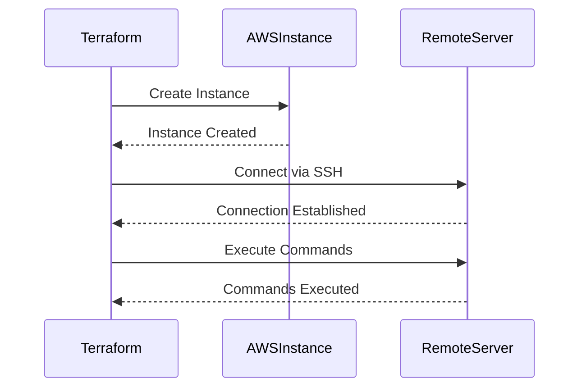

## Introduction to Remote Execution Provisioners in Terraform

In the realm of infrastructure as code (IAC), Terraform is one of the most powerful tools available. It allows developers and DevOps engineers to manage and provision infrastructure resources across multiple cloud providers and on-premises environments. One of the key features of Terraform is the ability to execute user data scripts on newly created instances through the use of remote execution provisioners. This chapter delves deep into the mechanics of executing user data scripts with Terraform, covering everything from basic concepts to advanced configurations and security considerations.

### What is a Remote Execution Provisioner?

A remote execution provisioner in Terraform is a mechanism that allows you to run arbitrary commands on a remote machine after it has been created. This is particularly useful for setting up additional configurations, installing software, or performing other initialization tasks that are necessary for the proper functioning of the instance.

#### Why Use Remote Execution Provisioners?

Remote execution provisioners are essential because they allow you to automate the setup process of your infrastructure. Instead of manually logging into each new instance and running commands, you can specify these commands within your Terraform configuration files. This ensures consistency and reduces the likelihood of human error.

### Basic Concepts and Terminology

Before diving into the specifics of how to use remote execution provisioners, let's cover some fundamental terms:

- **Provisioner**: A Terraform feature that allows you to perform actions on resources after they have been created.
- **Remote Exec Provisioner**: A specific type of provisioner that executes commands on a remote machine.
- **Connection Attribute**: Specifies how Terraform should connect to the remote machine to execute the commands.

### Setting Up a Remote Exec Provisioner

To set up a remote exec provisioner, you first need to define it within your Terraform configuration file. Here’s an example of how to do this:

```hcl
resource "aws_instance" "example" {
  ami           = "ami-0c55b159cbfafe1f0"
  instance_type = "t2.micro"

  provisioner "remote-exec" {
    inline = [
      "echo 'Environment: dev'",
      "mkdir /mydir",
      "apt-get update && apt-get install -y curl"
    ]
  }
}
```

In this example, the `remote-exec` provisioner is defined within the `aws_instance` resource. The `inline` attribute contains a list of shell commands that will be executed on the remote instance.

### Connecting to the Remote Server

When defining a remote exec provisioner, you need to specify how Terraform should connect to the remote server. By default, Terraform uses SSH to connect to the remote server. However, you can explicitly define the connection details using the `connection` attribute.

Here’s an example of how to define the connection explicitly:

```hcl
resource "aws_instance" "example" {
  ami           = "ami-0c55b159cbfafe1f0"
  instance_type = "t2.micro"

  provisioner "remote-exec" {
    connection {
      type        = "ssh"
      user        = "ubuntu"
      private_key = file("${path.module}/id_rsa")
      host        = self.public_ip
    }

    inline = [
      "echo 'Environment: dev'",
      "mkdir /mydir",
      "apt-get update && apt-get install -y curl"
    ]
  }
}
```

In this example, the `connection` block specifies the type of connection (`ssh`), the username (`ubuntu`), the path to the private key file, and the host (using `self.public_ip` to refer to the public IP address of the instance).

### Understanding the Connection Types

Terraform supports two main types of connections for remote exec provisioners:

- **SSH**: Secure Shell, the default and most commonly used method for connecting to remote servers.
- **WinRM**: Windows Remote Management, used for connecting to Windows-based servers.

#### SSH Connection

The SSH connection type is the default and is suitable for Linux-based systems. Here’s a breakdown of the SSH connection attributes:

- **type**: Specifies the type of connection (`ssh`).
- **user**: The username to use for the SSH connection.
- **private_key**: Path to the private key file used for authentication.
- **host**: The hostname or IP address of the remote server.

#### WinRM Connection

The WinRM connection type is used for Windows-based systems. Here’s a breakdown of the WinRM connection attributes:

- **type**: Specifies the type of connection (`winrm`).
- **user**: The username to use for the WinRM connection.
- **password**: The password for the specified user.
- **host**: The hostname or IP address of the remote server.

### Using `self` to Refer to the Current Resource

In Terraform, the `self` keyword is used to refer to the current resource. This is particularly useful when you need to reference attributes of the resource itself, such as the public IP address of an AWS instance.

For example, in the previous SSH connection example, `self.public_ip` is used to dynamically set the host to the public IP address of the instance.

### Example: Full Configuration with SSH Connection

Let’s look at a more complete example that includes all the necessary components:

```hcl
provider "aws" {
  region = "us-west-2"
}

resource "aws_instance" "example" {
  ami           = "ami-0c55b159cbfafe1f0"
  instance_type = "t2.micro"

  provisioner "remote-exec" {
    connection {
      type        = "ssh"
      user        = "ubuntu"
      private_key = file("${path.module}/id_rsa")
      host        = self.public_ip
    }

    inline = [
      "echo 'Environment: dev'",
      "mkdir /mydir",
      "apt-get update && apt-get install -y curl"
    ]
  }
}
```

### Common Pitfalls and Best Practices

While using remote exec provisioners can greatly enhance your automation capabilities, there are several common pitfalls to avoid:

1. **Ensure Proper Authentication**: Always ensure that the credentials provided in the connection block are correct and have the necessary permissions to execute the commands.
2. **Handle Errors Gracefully**: Use error handling mechanisms to gracefully handle failures during the execution of commands.
3. **Use Secure Communication**: Ensure that the communication between Terraform and the remote server is secure, especially when using SSH keys.
4. **Avoid Hardcoding Credentials**: Avoid hardcoding sensitive information such as passwords or private keys directly in your Terraform configuration files. Use environment variables or external secrets management tools instead.

### Real-World Examples and Recent Breaches

Recent breaches and vulnerabilities often highlight the importance of secure infrastructure management. For example, the Log4j vulnerability (CVE-2021-44228) affected many systems due to insecure configurations and lack of proper patch management. Ensuring that your infrastructure is properly configured and maintained can help mitigate such risks.

### How to Prevent / Defend

#### Detection

To detect potential issues with your remote exec provisioners, you can use various monitoring and logging tools. For example, you can enable detailed logging in Terraform and monitor the logs for any errors or unexpected behavior.

#### Prevention

To prevent security issues, follow these best practices:

1. **Use Strong Authentication**: Ensure that strong authentication methods are used, such as SSH keys with passphrase protection.
2. **Limit Permissions**: Limit the permissions of the user account used for remote execution to the minimum required.
3. **Regular Audits**: Regularly audit your Terraform configurations and infrastructure to identify and address any security gaps.

#### Secure Coding Fixes

Here’s an example of a vulnerable configuration and its secure counterpart:

**Vulnerable Configuration:**

```hcl
provisioner "remote-exec" {
  connection {
    type        = "ssh"
    user        = "root"
    private_key = file("${path.module}/id_rsa")
    host        = self.public_ip
  }

  inline = [
    "echo 'Environment: dev'",
    "mkdir /mydir",
    "apt-get update && apt-get install -y curl"
  ]
}
```

**Secure Configuration:**

```hcl
provisioner "remote-exec" {
  connection {
    type        = "ssh"
    user        = "ubuntu"
    private_key = file("${path.module}/id_rsa")
    host        = self.public_ip
  }

  inline = [
    "echo 'Environment: dev'",
    "mkdir /mydir",
    "apt-get update && apt-get install -y curl"
  ]
}
```

In the secure configuration, the user is changed from `root` to `ubuntu`, which limits the permissions of the user account.

### Conclusion

Remote execution provisioners in Terraform provide a powerful way to automate the setup and configuration of your infrastructure. By understanding the concepts, terminology, and best practices covered in this chapter, you can effectively use remote exec provisioners to streamline your infrastructure management processes while maintaining security and consistency.

### Practice Labs

For hands-on practice with Terraform and remote exec provisioners, consider the following labs:

- **PortSwigger Web Security Academy**: Offers practical exercises for web application security.
- **OWASP Juice Shop**: A deliberately insecure web application for practicing web security skills.
- **DVWA (Damn Vulnerable Web Application)**: Another intentionally vulnerable web application for security training.
- **WebGoat**: An interactive web security training application.

These labs provide real-world scenarios and challenges that can help you deepen your understanding and proficiency with Terraform and remote exec provisioners.

### Diagrams

#### Mermaid Diagram: Remote Exec Provisioner Flow



This diagram illustrates the flow of creating an instance, establishing an SSH connection, and executing commands on the remote server using a remote exec provisioner.

By following this comprehensive guide, you will gain a deep understanding of how to effectively use remote execution provisioners in Terraform, ensuring that your infrastructure is both automated and secure.

---
<!-- nav -->
[[01-Introduction to Provisioners in Terraform|Introduction to Provisioners in Terraform]] | [[DevOps/DevOps Bootcamp/08-Infrastructure as Code (Terraform)/09-Executing User Data Scripts with Terraform/00-Overview|Overview]] | [[03-Introduction to Terraform Provisioners|Introduction to Terraform Provisioners]]
