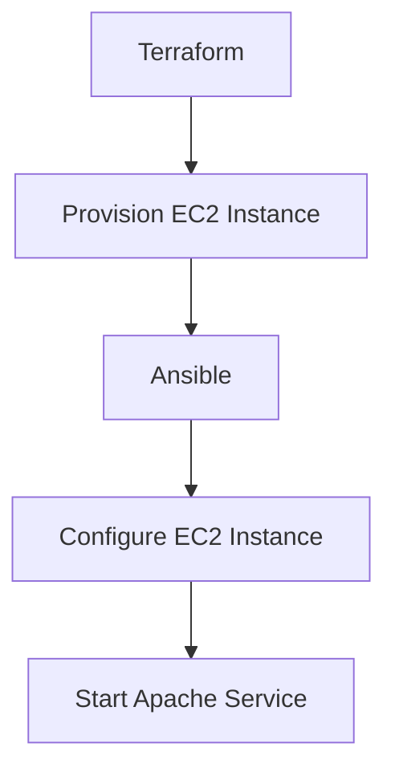

## Introduction to Terraform and Configuration Management

Terraform is an infrastructure as code (IaC) tool developed by HashiCorp. It allows you to define and provision your infrastructure using a declarative configuration language. This means you describe the desired state of your infrastructure, and Terraform handles the steps required to achieve that state. One of the key features of Terraform is its ability to interact with various cloud providers and configuration management tools to set up and manage resources.

### What is Configuration Management?

Configuration management is the process of ensuring that systems remain in their intended state. Tools like Ansible, Chef, Puppet, and SaltStack are used to automate the configuration of servers, applications, and services. These tools provide a higher level of abstraction and visibility into the state of the system compared to simple script execution.

### Why Use Configuration Management with Terraform?

When provisioning infrastructure with Terraform, you often need to perform additional setup tasks such as installing software, configuring services, and setting up environment variables. Configuration management tools are better suited for these tasks because they:

1. **Maintain State**: They keep track of the current state of the system and can ensure that the desired state is achieved.
2. **Idempotency**: They can run repeatedly without causing unintended side effects.
3. **Visibility**: They provide detailed insights into the configuration of the system.

### Example: Using Ansible with Terraform

Let's consider an example where we use Terraform to provision an EC2 instance and then use Ansible to configure it.

#### Terraform Configuration

```hcl
provider "aws" {
  region = "us-west-2"
}

resource "aws_instance" "example" {
  ami           = "ami-0c55b159cbfafe1f0"
  instance_type = "t2.micro"

  user_data = <<-EOF
              #!/bin/bash
              echo "Hello, World!" > /tmp/hello.txt
              EOF
}
```

In this example, Terraform provisions an EC2 instance and sets the `user_data` to run a simple bash script that writes "Hello, World!" to `/tmp/hello.txt`.

#### Ansible Playbook

```yaml
---
- name: Configure EC2 instance
  hosts: all
  become: yes
  tasks:
    - name: Install Apache
      yum:
        name: httpd
        state: present

    - name: Start Apache service
      service:
        name: httpd
        state: started
        enabled: yes
```

This playbook installs and starts the Apache web server on the EC2 instance.

### How to Prevent / Defend

#### Detection

To detect misconfigurations, you can use tools like AWS Config, which continuously monitors and records your AWS resource configurations and checks them against rules.

#### Prevention

1. **Use Version Control**: Store your Terraform and Ansible configurations in a version control system like Git.
2. **Automated Testing**: Implement automated testing to validate your configurations.
3. **Least Privilege**: Ensure that your configuration management tools run with the least privilege necessary.

### Real-World Example: CVE-2021-20225

CVE-2021-20225 was a vulnerability in the AWS SDK for Java that allowed unauthorized access to S3 buckets. This could have been mitigated by using proper configuration management practices to ensure that IAM roles and policies were correctly configured.

### Mermaid Diagram: Terraform and Ansible Integration



---
<!-- nav -->
[[03-Introduction to Terraform Provisioners|Introduction to Terraform Provisioners]] | [[DevOps/DevOps Bootcamp/08-Infrastructure as Code (Terraform)/09-Executing User Data Scripts with Terraform/00-Overview|Overview]] | [[05-Executing Scripts with Terraform|Executing Scripts with Terraform]]
