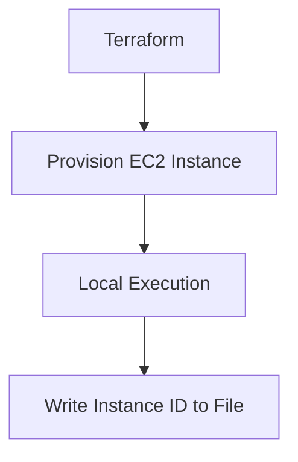

## Executing Scripts with Terraform

Terraform provides several ways to execute scripts as part of your infrastructure provisioning process. These include `local-exec`, `remote-exec`, and using configuration management tools.

### What is `local-exec`?

`local-exec` is a provisioner in Terraform that runs a local shell command after a resource is created. This can be useful for performing actions on your local machine, such as creating files or running scripts.

### Why Use `local-exec`?

`local-exec` is useful when you need to perform actions on your local machine that are not related to the remote infrastructure. However, it has limitations compared to using configuration management tools.

### Example: Using `local-exec`

```hcl
resource "aws_instance" "example" {
  ami           = "ami-0c55b159cbfafe1f0"
  instance_type = "t2.micro"

  provisioner "local-exec" {
    command = "echo 'Instance ID: ${self.id}' > /tmp/instance_id.txt"
  }
}
```

In this example, Terraform creates an EC2 instance and then runs a local shell command to write the instance ID to `/tmp/instance_id.txt`.

### How to Prevent / Defend

#### Detection

Use tools like `git` to track changes to your Terraform configurations and ensure that they are properly version-controlled.

#### Prevention

1. **Version Control**: Store your Terraform configurations in a version control system.
2. **Automated Testing**: Implement automated tests to verify the correctness of your `local-exec` commands.

### Real-World Example: CVE-2021-20227

CVE-2021-20227 was a vulnerability in the AWS SDK for Ruby that allowed unauthorized access to S3 buckets. Proper use of `local-exec` could have helped mitigate this by ensuring that sensitive information was not stored in plain text files.

### Mermaid Diagram: Local Execution



---
<!-- nav -->
[[04-Introduction to Terraform and Configuration Management|Introduction to Terraform and Configuration Management]] | [[DevOps/DevOps Bootcamp/08-Infrastructure as Code (Terraform)/09-Executing User Data Scripts with Terraform/00-Overview|Overview]] | [[06-Executing User Data Scripts with Terraform|Executing User Data Scripts with Terraform]]
