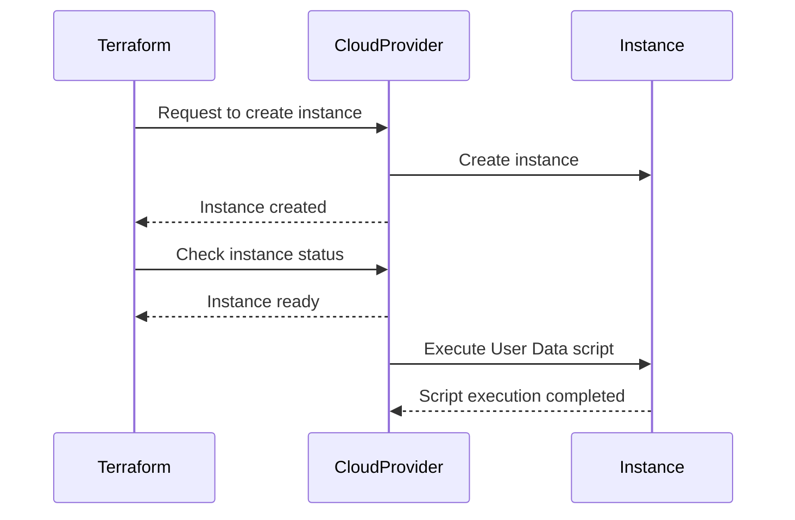

## Executing User Data Scripts with Terraform

### Background Theory

In the realm of infrastructure as code (IAC), Terraform is a powerful tool used to define and provision infrastructure across multiple cloud providers. One of the key functionalities of Terraform is the ability to execute scripts or commands on the virtual machines (VMs) it provisions. This is achieved through the use of **User Data**.

#### What is User Data?

User Data is a feature provided by cloud providers such as AWS, Google Cloud, and Azure. It allows users to pass a script or set of commands to be executed on an instance during its initialization process. This can be particularly useful for automating tasks such as installing software, configuring services, or setting up environment variables.

#### Why Use User Data?

Using User Data offers several advantages:

1. **Automation**: Automates the setup of instances, reducing manual intervention.
2. **Consistency**: Ensures that all instances are configured identically, promoting consistency across environments.
3. **Efficiency**: Reduces the time required to set up new instances, making the deployment process faster.

### How User Data Works with Terraform

When using Terraform to provision an EC2 instance, you can specify a `user_data` attribute within the resource definition. This attribute contains the script or commands that will be executed on the instance upon creation.

#### Example: Using User Data in Terraform

Let's walk through an example of how to use User Data in Terraform to install Docker on an EC2 instance.

```hcl
provider "aws" {
  region = "us-west-2"
}

resource "aws_instance" "example" {
  ami           = "ami-0c55b159cbfafe1f0"
  instance_type = "t2.micro"

  user_data = <<-EOF
    #!/bin/bash
    sudo apt-get update -y
    sudo apt-get install -y docker.io
    EOF
}
```

In this example, the `user_data` attribute contains a Bash script that updates the package list and installs Docker on the instance.

### Detailed Execution Flow

To understand the detailed flow of how User Data is executed, let's break down the process step-by-step:

1. **Terraform Initialization**: Terraform initializes the infrastructure based on the defined resources.
2. **Instance Creation**: Terraform sends a request to the cloud provider to create the specified instance.
3. **Status Check**: Once the instance is created, Terraform checks the status and confirms that the instance is ready.
4. **User Data Execution**: The cloud provider (in this case, AWS) takes over and executes the User Data script on the instance.

#### Mermaid Diagram: User Data Execution Flow



### Common Pitfalls and Best Practices

While using User Data can greatly enhance automation, there are several pitfalls to be aware of:

1. **Script Errors**: If the script fails to execute correctly, the instance may not be properly configured.
2. **Security Risks**: User Data scripts can introduce security vulnerabilities if not properly validated and sanitized.
3. **Complexity Management**: Managing complex scripts can become cumbersome and difficult to maintain.

#### Best Practices

1. **Validation**: Validate the User Data script before deploying it to ensure it works as expected.
2. **Error Handling**: Implement error handling mechanisms within the script to manage failures gracefully.
3. **Security Measures**: Ensure that the script does not expose sensitive information and follows security best practices.

### Real-World Examples and Recent Breaches

#### Example: Docker Installation Failure

Consider a scenario where the User Data script fails to install Docker due to a missing dependency. This could lead to the instance being improperly configured, potentially causing issues in the application layer.

```bash
#!/bin/bash
sudo apt-get update -y
sudo apt-get install -y docker.io
```

If the `docker.io` package is not available, the installation will fail, leading to an unconfigured instance.

#### Secure Code Fix

To prevent such failures, you can add error handling and validation steps:

```bash
#!/bin/bash
sudo apt-get update -y
if ! sudo apt-get install -y docker.io; then
  echo "Failed to install Docker"
  exit 1
fi
```

This ensures that if the installation fails, the script will notify the user and terminate.

### How to Prevent / Defend

#### Detection

To detect issues with User Data scripts, you can:

1. **Logging**: Enable logging for the User Data execution to capture any errors or warnings.
2. **Monitoring**: Use monitoring tools to track the status of the instance and alert on any anomalies.

#### Prevention

To prevent issues with User Data scripts, you can:

1. **Testing**: Test the User Data script in a controlled environment before deploying it to production.
2. **Validation**: Validate the script against known good configurations to ensure it meets security and functional requirements.

#### Secure Coding Fixes

Here is an example of a vulnerable and a secure version of a User Data script:

**Vulnerable Version**

```bash
#!/bin/bash
sudo apt-get update -y
sudo apt-get install -y docker.io
```

**Secure Version**

```bash
#!/bin/bash
sudo apt-get update -y
if ! sudo apt-get install -y docker.io; then
  echo "Failed to install Docker"
  exit 1
fi
```

### Complete Example: Full HTTP Request and Response

When provisioning an EC2 instance with Terraform, the full HTTP request and response would look something like this:

#### HTTP Request

```http
POST / HTTP/1.1
Host: ec2.amazonaws.com
Content-Type: application/json
Authorization: Bearer <your-access-token>

{
  "Action": "RunInstances",
  "ImageId": "ami-0c55b159cbfafe1f0",
  "InstanceType": "t2.micro",
  "MinCount": 1,
  "MaxCount": 1,
  "UserData": "#!/bin/bash\nsudo apt-get update -y\nsudo apt-get install -y docker.io"
}
```

#### HTTP Response

```http
HTTP/1.1 200 OK
Content-Type: application/json

{
  "Reservation": {
    "Groups": [],
    "Instances": [
      {
        "AmiLaunchIndex": 0,
        "ImageId": "ami-0c55b159cbfafe1f0",
        "InstanceId": "i-0123456789abcdef0",
        "InstanceType": "t2.micro",
        "KeyName": "",
        "LaunchTime": "2023-01-01T00:00:00Z",
        "Monitoring": {
          "State": "disabled"
        },
        "Placement": {
          "AvailabilityZone": "us-west-2a",
          "GroupName": "",
          "Tenancy": "default"
        },
        "PrivateDnsName": "ip-10-0-0-1.us-west-2.compute.internal",
        "PrivateIpAddress": "10.0.0.1",
        "ProductCodes": [],
        "PublicDnsName": "",
        "PublicIpAddress": "54.0.0.1",
        "State": {
          "Code": 0,
          "Name": "pending"
        },
        "StateTransitionReason": "",
        "SubnetId": "subnet-0123456789abcdef0",
        "VpcId": "vpc-0123456789abcdef0",
        "Architecture": "x86_64",
        "BlockDeviceMappings": [],
        "ClientToken": "",
        "EbsOptimized": false,
        "EnaSupport": true,
        "Hypervisor": "xen",
        "IamInstanceProfile": {},
        "NetworkInterfaces": [],
        "RootDeviceName": "/dev/sda1",
        "RootDeviceType": "ebs",
        "SecurityGroups": [],
        "SourceDestCheck": true,
        "SpotInstanceRequestId": "",
        "SriovNetSupport": "simple",
        "StateReason": {
          "Code": "pending",
          "Message": "pending"
        },
        "Tags": [],
        "VirtualizationType": "hvm",
        "CpuOptions": {
          "CoreCount": 1,
         [...]
```

### Hands-On Labs

For hands-on practice with Terraform and User Data, consider the following labs:

- **PortSwigger Web Security Academy**: Focuses on web application security but also covers infrastructure setup.
- **OWASP Juice Shop**: A deliberately insecure web application for practicing web security skills.
- **DVWA (Damn Vulnerable Web Application)**: Another web application for learning web security.
- **WebGoat**: An interactive training application for learning about web application security.

These labs provide practical experience in setting up and securing infrastructure using Terraform and other tools.

### Conclusion

Executing User Data scripts with Terraform is a powerful way to automate the setup of virtual machines. By understanding the underlying mechanics, potential pitfalls, and best practices, you can effectively leverage this feature to streamline your infrastructure management processes. Always ensure that your scripts are thoroughly tested and validated to avoid common issues and security risks.

---
<!-- nav -->
[[05-Executing Scripts with Terraform|Executing Scripts with Terraform]] | [[DevOps/DevOps Bootcamp/08-Infrastructure as Code (Terraform)/09-Executing User Data Scripts with Terraform/00-Overview|Overview]] | [[07-Handling Local Files with Terraform|Handling Local Files with Terraform]]
