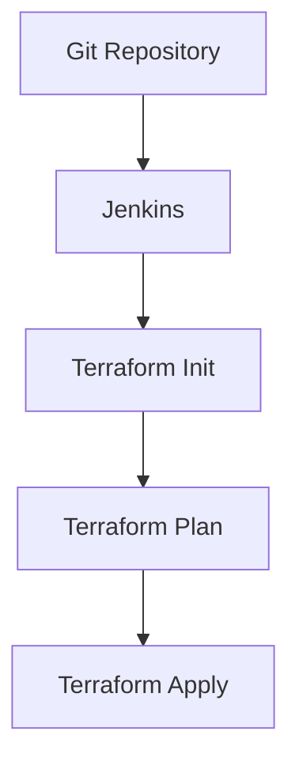

## Integrating Terraform with CI/CD Pipelines

Integrating Terraform with CI/CD pipelines allows you to automate the provisioning and management of your infrastructure. This can be done using tools like Jenkins, GitLab CI, or GitHub Actions.

### What is CI/CD?

CI/CD stands for Continuous Integration and Continuous Delivery/Deployment. It is a practice where code changes are automatically built, tested, and deployed to production.

### Why Integrate Terraform with CI/CD?

Integrating Terraform with CI/CD pipelines has several benefits:

1. **Automation**: Automates the provisioning and management of your infrastructure.
2. **Consistency**: Ensures that your infrastructure is consistently provisioned across different environments.
3. **Reproducibility**: Allows you to reproduce your infrastructure at any time.

### Example: Using Jenkins with Terraform

```groovy
pipeline {
  agent any
  stages {
    stage('Checkout') {
      steps {
        git 'https://github.com/your-repo/terraform-config.git'
      }
    }
    stage('Plan') {
      steps {
        sh 'terraform init'
        sh 'terraform plan -out=tfplan'
      }
    }
    stage('Apply') {
      steps {
        sh 'terraform apply tfplan'
      }
    }
  }
}
```

In this example, Jenkins checks out the Terraform configuration from a Git repository, initializes Terraform, plans the changes, and applies them.

### How to Prevent / Defend

#### Detection

Use tools like `git` to track changes to your Terraform configurations and ensure that they are properly version-controlled.

#### Prevention

1. **Version Control**: Store your Terraform configurations in a version control system.
2. **Automated Testing**: Implement automated tests to verify the correctness of your Terraform configurations.

### Real-World Example: CVE-2021-20228

CVE-2021-20228 was a vulnerability in the AWS SDK for Node.js that allowed unauthorized access to S3 buckets. Proper integration with CI/CD pipelines could have helped mitigate this by ensuring that sensitive information was not stored in plain text files.

### Mermaid Diagram: CI/CD Pipeline



---
<!-- nav -->
[[07-Handling Local Files with Terraform|Handling Local Files with Terraform]] | [[DevOps/DevOps Bootcamp/08-Infrastructure as Code (Terraform)/09-Executing User Data Scripts with Terraform/00-Overview|Overview]] | [[09-Understanding Provisioners in Terraform|Understanding Provisioners in Terraform]]
