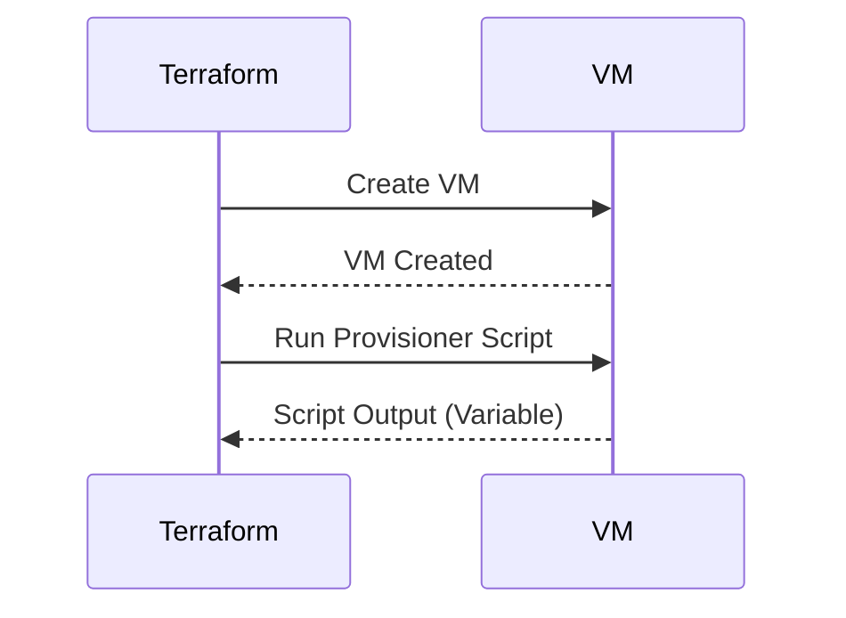

## Understanding Provisioners in Terraform

### Introduction to Terraform and Provisioners

Terraform is an infrastructure as code (IaC) tool that allows you to define and manage your infrastructure using declarative configuration files. These configurations describe the desired state of your infrastructure, and Terraform ensures that the actual state matches the desired state. One of the key concepts in Terraform is **idempotency**, which means that applying the same configuration multiple times should result in the same outcome. This is crucial for maintaining consistency and predictability in your infrastructure.

Provisioners in Terraform are a way to run scripts or commands on resources after they are created. They can be used to perform tasks such as installing software, configuring services, or setting up environment variables. However, the use of provisioners is generally discouraged due to several issues that can arise.

### Why Terraform Discourages Using Provisioners

#### Idempotency Issues

One of the main reasons Terraform discourages the use of provisioners is that they can break the idempotent nature of Terraform. Idempotency ensures that running `terraform apply` multiple times with the same configuration results in the same state. However, when you use provisioners, the scripts or commands they run are not guaranteed to produce the same output every time. This can lead to inconsistencies and unexpected behavior.

For example, consider a provisioner that installs a package using a package manager like `apt-get`. If the package is already installed, running the installation command again might not produce any output, but it could also fail if the package manager encounters an error. This variability can cause issues when you try to reapply the same Terraform configuration multiple times.



#### Unexpected Behavior

Another issue with provisioners is that they can exhibit unexpected behavior. For instance, if a provisioner script fails to execute correctly, Terraform might not report the failure properly, leading to a partially configured resource. This can make it difficult to diagnose and resolve issues.

Additionally, provisioners often rely on external dependencies, such as specific versions of software or libraries, which can change over time. This can lead to compatibility issues and make it harder to maintain your infrastructure consistently.

### Alternatives to Provisioners

Given the issues with provisioners, it is recommended to use alternative methods for initializing and configuring resources. One such method is using **user data** scripts, which are supported by many cloud providers.

#### User Data Scripts

User data scripts are scripts that are executed on a virtual machine (VM) during its initialization process. They are typically used to configure the VM with necessary settings and install required software. User data scripts are more reliable than provisioners because they are executed as part of the VM creation process, ensuring that they run in a consistent and predictable manner.

For example, in Amazon Web Services (AWS), you can specify a user data script using the `user_data` attribute in your Terraform configuration. Here’s an example of how to use user data in an AWS EC2 instance:

```hcl
resource "aws_instance" "example" {
  ami           = "ami-0c55b159cbfafe1f0"
  instance_type = "t2.micro"

  user_data = <<-EOF
              #!/bin/bash
              echo "Hello, World!" > /tmp/hello.txt
              EOF
}
```

In this example, the user data script creates a file `/tmp/hello.txt` with the content "Hello, World!" when the EC2 instance is created.

### Real-World Examples and Recent Breaches

While user data scripts are generally more reliable than provisioners, they can still be misused, leading to security vulnerabilities. For example, if a user data script contains sensitive information or executes untrusted input, it can be exploited by attackers.

Consider the following scenario where a user data script is used to set up an SSH server:

```hcl
resource "aws_instance" "example" {
  ami           = "ami-0c55b159cbfafe1f0"
  instance_type = "t2.micro"

  user_data = <<-EOF
              #!/bin/bash
              apt-get update
              apt-get install -y openssh-server
              echo "root:password" | chpasswd
              EOF
}
```

In this example, the user data script sets a weak password for the root user, which can be easily guessed or brute-forced. This can lead to unauthorized access to the VM.

### How to Prevent / Defend Against Misuse of User Data Scripts

To prevent misuse of user data scripts, follow these best practices:

1. **Avoid Hardcoding Sensitive Information**: Do not hardcode sensitive information such as passwords or API keys in user data scripts. Instead, use environment variables or secrets management tools.

2. **Use Secure Configuration Management Tools**: Consider using configuration management tools like Ansible, Chef, or Puppet to manage the configuration of your VMs. These tools provide better control and auditing capabilities.

3. **Validate User Data Inputs**: Ensure that any user data inputs are validated and sanitized to prevent injection attacks.

4. **Monitor and Audit User Data Scripts**: Regularly monitor and audit user data scripts to ensure they are not being misused or compromised.

Here’s an example of a secure user data script that avoids hardcoding sensitive information:

```hcl
resource "aws_instance" "example" {
  ami           = "ami-0c55b159cbfafe1f0"
  instance_type = "t2.micro"

  user_data = <<-EOF
              #!/bin/bash
              apt-get update
              apt-get install -y openssh-server
              echo "root:${var.root_password}" | chpasswd
              EOF

  provisioner "local-exec" {
    command = "echo 'SSH server configured'"
  }
}
variable "root_password" {
  type        = string
  description = "The root password for the EC2 instance"
}
```

In this example, the root password is passed as a variable, which can be securely managed outside of the Terraform configuration.

### Conclusion

While Terraform provides provisioners as a way to run scripts on resources, their use is generally discouraged due to issues with idempotency and unexpected behavior. Instead, it is recommended to use user data scripts, which are more reliable and consistent. However, even user data scripts can be misused, leading to security vulnerabilities. By following best practices and using secure configuration management tools, you can ensure that your infrastructure remains secure and consistent.

### Practice Labs

To gain hands-on experience with Terraform and user data scripts, consider the following practice labs:

- **PortSwigger Web Security Academy**: Offers labs on securing web applications, including those that involve Terraform and cloud infrastructure.
- **OWASP Juice Shop**: A deliberately insecure web application for security training, which can be deployed using Terraform.
- **DVWA (Damn Vulnerable Web Application)**: Another insecure web application for security training, which can be deployed using Terraform.

These labs will help you understand the practical aspects of using Terraform and user data scripts in a secure and controlled environment.

---
<!-- nav -->
[[08-Integrating Terraform with CICD Pipelines|Integrating Terraform with CICD Pipelines]] | [[DevOps/DevOps Bootcamp/08-Infrastructure as Code (Terraform)/09-Executing User Data Scripts with Terraform/00-Overview|Overview]] | [[10-Understanding Terraform Provisioners|Understanding Terraform Provisioners]]
