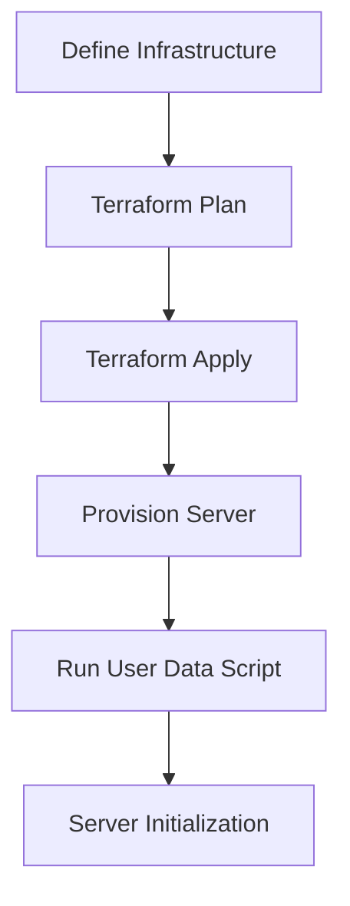
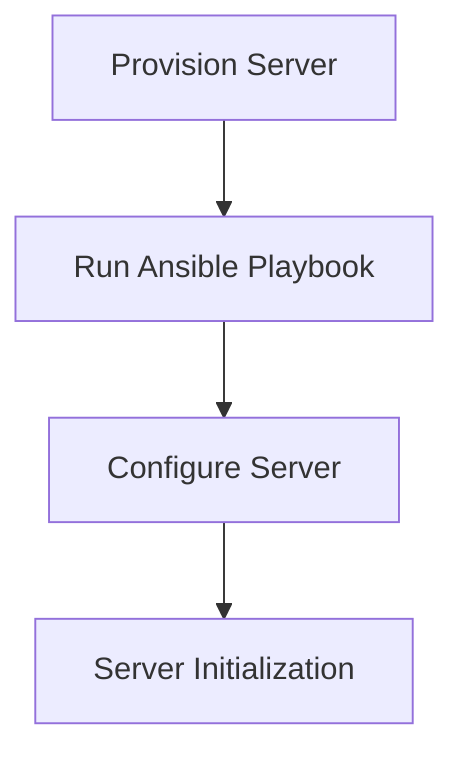

## Understanding Terraform and User Data Scripts

### Background Theory

Terraform is an infrastructure as code (IaC) tool that allows you to define and manage your infrastructure using declarative configuration files. These configurations describe the desired state of your infrastructure, and Terraform ensures that the actual state matches the desired state. However, when it comes to executing user data scripts, Terraform faces limitations because it does not have built-in mechanisms to track the execution status of these scripts.

### What Are User Data Scripts?

User data scripts are typically shell scripts that run on a newly created instance during its initialization phase. They are used to perform tasks such as installing software, configuring services, or setting up environment variables. While these scripts provide flexibility, they come with several challenges:

1. **State Management**: Terraform cannot determine the success or failure of the commands within the script.
2. **Idempotency**: Terraform cannot ensure that the script is idempotent, meaning it can be run multiple times without changing the result.
3. **State Drift**: If the script modifies the state of the instance, Terraform may not recognize these changes, leading to state drift.

### Why Does This Matter?

The inability of Terraform to manage the state of user data scripts can lead to several issues:

1. **Inconsistent States**: Without proper state management, instances may end up in inconsistent states, making it difficult to maintain a consistent infrastructure.
2. **Security Risks**: Scripts can introduce security vulnerabilities if they are not properly validated or secured.
3. **Maintenance Challenges**: Managing and updating scripts across multiple instances can become cumbersome and error-prone.

### How Does Terraform Handle User Data Scripts?

When you define a user data script in Terraform, you typically use the `user_data` attribute in resource definitions. Here’s an example of a Terraform configuration that includes a user data script:

```hcl
resource "aws_instance" "example" {
  ami           = "ami-0c55b159cbfafe1f0"
  instance_type = "t2.micro"

  user_data = <<-EOF
    #!/bin/bash
    echo "Hello, World!" > /tmp/hello.txt
  EOF
}
```

In this example, the `user_data` attribute contains a simple bash script that writes "Hello, World!" to `/tmp/hello.txt`. However, Terraform does not track the success or failure of this script.

### Real-World Example: State Drift and Inconsistency

Consider a scenario where a user data script installs a specific version of a software package. If the script fails to install the package correctly, Terraform will not detect this failure. Over time, this can lead to inconsistencies across instances, making it difficult to maintain a consistent infrastructure.

### Pitfalls of Using User Data Scripts

1. **Error Handling**: Scripts may fail silently, leading to unexpected behavior.
2. **Complexity**: Managing complex scripts can become difficult, especially when dealing with multiple instances.
3. **Security**: Scripts can introduce security vulnerabilities if they are not properly validated or secured.

### How to Prevent / Defend

To mitigate the risks associated with user data scripts, consider the following strategies:

#### Use Configuration Management Tools

Configuration management tools like Chef, Puppet, Ansible, and SaltStack provide better state management capabilities than user data scripts. These tools allow you to define the desired state of your infrastructure and ensure that the actual state matches the desired state.

Here’s an example of using Ansible to configure a remote server after provisioning with Terraform:

1. **Provision the Server with Terraform**:

```hcl
resource "aws_instance" "example" {
  ami           = "ami-0c55b159cbfafe1f0"
  instance_type = "t2.micro"
}
```

2. **Configure the Server with Ansible**:

First, create an Ansible playbook (`configure.yml`):

```yaml
---
- name: Configure the server
  hosts: all
  tasks:
    - name: Ensure hello.txt exists
      copy:
        content: "Hello, World!"
        dest: /tmp/hello.txt
```

Then, run the playbook using the `ansible-playbook` command:

```sh
ansible-playbook -i inventory configure.yml
```

Where `inventory` is a file containing the IP address of the server:

```ini
[all]
<server_ip>
```

#### Secure Coding Practices

Ensure that your user data scripts follow secure coding practices:

1. **Validate Inputs**: Validate any inputs to the script to prevent injection attacks.
2. **Use Secure Commands**: Use secure commands and avoid using commands that can be exploited, such as `eval`.
3. **Logging and Monitoring**: Implement logging and monitoring to detect failures and anomalies.

#### Example of Vulnerable vs. Secure Code

**Vulnerable Script**:

```bash
#!/bin/bash
echo "Hello, World!" > /tmp/hello.txt
```

**Secure Script**:

```bash
#!/bin/bash
set -o errexit
set -o nounset
set -o pipefail

# Ensure the directory exists
mkdir -p /tmp

# Write to the file
echo "Hello, World!" > /tmp/hello.txt
```

### Detection and Prevention

#### Detection

1. **Logging**: Implement logging to detect failures and anomalies.
2. **Monitoring**: Use monitoring tools to detect deviations from the desired state.

#### Prevention

1. **Automated Testing**: Use automated testing to validate the correctness of your scripts.
2. **Code Reviews**: Conduct regular code reviews to identify and fix security vulnerabilities.

### Complete Example: Terraform + Ansible

Here’s a complete example of using Terraform to provision a server and then using Ansible to configure it:

1. **Terraform Configuration**:

```hcl
provider "aws" {
  region = "us-west-2"
}

resource "aws_instance" "example" {
  ami           = "ami-0c55b159cbfafe1f0"
  instance_type = "t2.micro"
}
```

2. **Ansible Playbook**:

```yaml
---
- name: Configure the server
  hosts: all
  tasks:
    - name: Ensure hello.txt exists
      copy:
        content: "Hello, World!"
        dest: /tmp/hello.txt
```

3. **Run the Playbook**:

```sh
ansible-playbook -i inventory configure.yml
```

Where `inventory` is a file containing the IP address of the server:

```ini
[all]
<server_ip>
```

### Mermaid Diagrams

#### Terraform Workflow



#### Ansible Workflow



### Conclusion

Using user data scripts with Terraform can lead to several challenges, including state management, idempotency, and security risks. To mitigate these risks, consider using configuration management tools like Ansible, Chef, or Puppet. These tools provide better state management capabilities and help ensure that your infrastructure remains consistent and secure.

### Practice Labs

For hands-on practice with Terraform and Ansible, consider the following labs:

- **PortSwigger Web Security Academy**: Focuses on web application security but includes modules on infrastructure as code.
- **OWASP Juice Shop**: A deliberately insecure web application for security training.
- **DVWA (Damn Vulnerable Web Application)**: Another popular web application for security training.

These labs provide practical experience in managing infrastructure and securing applications using modern tools and techniques.

---
<!-- nav -->
[[10-Understanding Terraform Provisioners|Understanding Terraform Provisioners]] | [[DevOps/DevOps Bootcamp/08-Infrastructure as Code (Terraform)/09-Executing User Data Scripts with Terraform/00-Overview|Overview]] | [[DevOps/DevOps Bootcamp/08-Infrastructure as Code (Terraform)/09-Executing User Data Scripts with Terraform/12-Conclusion|Conclusion]]
